# From Neural SDFs to Kress-Ready Smooth Closed Boundaries

## Executive summary

For a neural signed-distance function or neural level-set field
\[
F_\theta:\mathbb R^2\to \mathbb R,\qquad
\Gamma=\{x:F_\theta(x)=0\},
\]
the representation most naturally compatible with classical Kress product quadrature is **not** the polygon produced directly by marching squares, marching cubes, or another isocontouring routine. What Kress quadrature really wants is a **regular, smooth, \(2\pi\)-periodic map**
\[
\gamma(t)=(x(t),y(t)),\qquad t\in[0,2\pi),\qquad
\gamma(t+2\pi)=\gamma(t),\qquad |\gamma'(t)|>0,
\]
with enough periodic smoothness that the nonsingular remainder of the logarithmic kernel is spectrally resolvable. For analytic periodic data, the Kress scheme combined with the periodic trapezoidal rule has exponential/spectral convergence; Kress's logarithmic product weights are specifically constructed on an equispaced periodic parameter grid. citeturn7view0turn6view1turn4view0

**The strongest practical recommendation from this review is therefore a two-stage implicit-to-explicit procedure:**

> **Use contour extraction only to discover topology and initialize the curve; use a globally periodic Fourier/bandlimited curve, or secondarily a periodic high-degree spline, as the actual boundary supplied to Kress quadrature.**

In particular, a robust production pipeline is
\[
F_\theta
\longrightarrow
\text{adaptive contour / level-set tracking}
\longrightarrow
\text{ordered closed samples}
\longrightarrow
\text{zero-set projection}
\longrightarrow
\text{periodic Fourier fit}
\longrightarrow
\text{SDF-constrained refinement}
\longrightarrow
\text{reparameterization}
\longrightarrow
\text{uniform-}t\text{ Kress nodes}.
\]
This closely aligns the representation of the geometry with the spectral structure of the quadrature. Beylkin and Rokhlin's algorithm for fitting a **bandlimited analytic closed curve** to planar point samples is particularly relevant: it explicitly controls frequency content, uses the tangent angle as a function of arc length, returns an analytic bandlimited curve, and has \(O(n\log n)\) asymptotic complexity. It is unusually well matched to the Kress setting. citeturn21search1

```mermaid
flowchart LR
    A["Neural SDF / implicit field Fθ(x)"]
    --> B["Topology reconnaissance<br/>adaptive contouring / certified subdivision"]
    B --> C["Choose and orient component(s)<br/>check one-cycle topology"]
    C --> D["Project samples to Fθ=0<br/>Newton / closest-point correction"]
    D --> E["Periodic explicit fit<br/>Fourier preferred; B-spline alternative"]
    E --> F["Constrained refinement<br/>SDF residual + normals + regularity + spacing"]
    F --> G["Arc-length or curvature-aware<br/>reparameterization"]
    G --> H["Validate topology, speed,<br/>Fourier tail, SDF residual"]
    H --> I["t_j = 2πj/N, N even"]
    I --> J["FFT/spline derivatives<br/>normals, Jacobians, curvature"]
    J --> K["Kress logarithmic weights<br/>and Nyström boundary integral"]
```

Several conclusions are especially important.

**First, a marching polygon is an initialization, not a Kress boundary.** Classical sampled isosurface methods introduce a grid-dependent, piecewise-linear approximation. Analytic Marching and the newer Marching Neurons can remove much of the spatial sampling error for piecewise-linear neural fields, but the exact zero set of a ReLU MLP is itself piecewise linear; it therefore still lacks the global smoothness that makes Kress quadrature attractive. citeturn18academia39turn18academia37 Differentiable methods such as MeshSDF, DMTet, and FlexiCubes make extraction differentiable with respect to an implicit field and are useful templates for end-to-end optimization, but their basic explicit outputs are meshes rather than globally smooth periodic parameterizations. citeturn18search23turn18search35turn18search14

**Second, Fourier/bandlimited geometry is the closest conceptual match to Kress.** A truncated Fourier representation
\[
\gamma(t)=c_0+
\sum_{k=1}^K\big[a_k\cos kt+b_k\sin kt\big]
\]
is automatically \(2\pi\)-periodic and analytic, allows exact spectral differentiation of the represented curve, admits inexpensive filtering and regularization, and makes the coefficient tail itself a useful resolution diagnostic. Beylkin–Rokhlin directly address bandlimited closed-curve fitting, while Koga develops a spectral reparameterization procedure for periodic planar curves using curvature information. citeturn21search1turn20search0turn20search3 Periodic B-splines and NURBS are excellent alternatives when local geometric control is important, but a degree-\(p\) spline with ordinary simple knots is generally only \(C^{p-1}\) globally, so it does not automatically supply the same analytic-periodic regularity as a trigonometric polynomial. Neural parametric fitting work such as ParSeNet also demonstrates that learned systems can output B-spline parameterizations directly. citeturn17academia41

**Third, do not rely on high neural-SDF derivatives more than necessary.** For a smooth regular implicit field,
\[
n_F=\frac{\nabla F}{\|\nabla F\|},
\]
and curvature can be obtained from its Hessian, but second and higher neural derivatives are substantially more delicate and expensive than first derivatives. Recent neural-SDF work explicitly treats Hessian-based curvature as a computational challenge, while work on differential operators for neural fields documents accuracy problems in higher derivatives. citeturn10search6turn10search26 For Kress calculations, the better division of labor is generally: **use the neural field and its gradient to locate and constrain the boundary; compute \(\gamma',\gamma'',\ldots\) from the final Fourier or spline representation.** For ReLU fields this distinction is essential, since a ReLU MLP partitions space into affine regions and has no meaningful smooth curvature field in the classical sense away from activation boundaries. citeturn18academia39

**Fourth, smoothing should be constrained by the original implicit geometry.** Unconstrained curvature flow, Laplacian smoothing, or aggressive low-pass filtering can denoise a contour but also move it. Taubin's classical work addresses shrinkage in mesh smoothing, while diffusion/curvature-flow fairing likewise demonstrates the usefulness—and geometric effect—of PDE smoothing. citeturn9search16turn9search24 For an SDF-derived boundary, a better formulation is a smooth finite-dimensional fit penalized for leaving \(F_\theta=0\). A Fourier or periodic-spline curve can be optimized against an energy such as
\[
E(\gamma)=
\frac1M\sum_j F_\theta(\gamma(t_j))^2
+\lambda_n E_n
+\lambda_s E_{\rm smooth}
+\lambda_v E_{\rm speed}
+\lambda_{\rm si}E_{\rm self},
\]
so regularization removes unresolved neural/geometric noise while fidelity to the original zero set is explicitly retained.

**Fifth, topology must be settled before the spectral fit.** The desired object is a simple periodic map \(S^1\to\Gamma\), not necessarily a radial graph \(r(\theta)\). A star-shaped radial Fourier parameterization is extremely robust when applicable, and has already been used as the learned representation in neural inverse-obstacle scattering, but it excludes non-star-shaped geometries. The neural-network warm-start work of Zhou, Han, Rachh, and Borges represents obstacles by Fourier coefficients of a positive periodic radius function; it is a particularly relevant precedent for learning boundaries already in a boundary-integral-friendly spectral representation. citeturn16search2turn16search15 General \(x(t),y(t)\) Fourier curves remove the star-shaped restriction but require explicit tests against self-intersection. Certified implicit-curve extraction methods such as Plantinga–Vegter-type subdivision can provide isotopy guarantees when topology is critical, while more recent neural topology losses such as STITCH use persistent-homology constraints to control connected components during implicit learning. citeturn12search1turn12search3

**Sixth, I found closely related neural-implicit/BIE literature, but not an established paper whose central pipeline is exactly “neural SDF \(\rightarrow\) smooth periodic explicit curve \(\rightarrow\) classical Kress weights.”** The closest neural-implicit precedent is Vlašić et al.'s mesh-free inverse obstacle scattering method, which represents the obstacle as a neural SDF and couples it to an **implicit boundary integral method (IBIM)**, deliberately avoiding explicit meshing. citeturn13academia31 Recent work also combines implicit neural shape optimization with BIE solvers, while a 2026 OpenReview manuscript on neural boundary-integral operators explicitly uses Kress quadrature in its numerical protocol. citeturn13search2turn16search5 Separately, neural inverse-scattering methods already learn Fourier boundary coefficients directly. citeturn16search2 Together, these make a **Kress-native neural implicit-to-Fourier boundary decoder** a credible and apparently underexplored research direction.

My ranking for this application is therefore:

**Best default:** adaptive zero-set extraction → projection → **bandlimited Fourier fitting** → SDF-constrained optimization → arc-length/curvature-aware reparameterization → Kress.

**Best when local control matters:** adaptive extraction → **periodic high-degree B-spline/NURBS fitting** → SDF-constrained fairing → smooth reparameterization, accepting finite global regularity.

**Best differentiable research pipeline:** parameterized Fourier curve initialized from a contour, or initialized as a circle and directly optimized through \(F_\theta(\gamma(t))\), optionally with differentiable isocontouring only for topology/initiation.

**Best topology-restricted but very robust representation:** a positive Fourier radius \(r(t)>0\) for known star-shaped obstacles.

## Mathematical target imposed by Kress quadrature

Consider, for concreteness, a two-dimensional logarithmically singular layer kernel. A typical single-layer contribution after parameterizing the boundary is of the form
\[
I(t)=\int_0^{2\pi}
\log |\gamma(t)-\gamma(s)|\,a(t,s)\,ds,
\]
where \(a(t,s)\) contains the density, kernel-dependent smooth factors, and usually the Jacobian \(|\gamma'(s)|\). The decisive Kress identity is the periodic singularity extraction
\[
\log |\gamma(t)-\gamma(s)|
=
\frac12\log\!\left(4\sin^2\frac{t-s}{2}\right)
+
\log
\frac{|\gamma(t)-\gamma(s)|}
     {2|\sin((t-s)/2)|}.
\]
If \(\gamma\) is smooth and regular, then
\[
\lim_{s\to t}
\frac{|\gamma(t)-\gamma(s)|}
     {2|\sin((t-s)/2)|}
=
|\gamma'(t)|,
\]
so the second logarithm has a removable singularity and becomes a smooth periodic function. This is precisely why the explicit parameterization must satisfy \(|\gamma'|>0\): a geometrically correct curve with a degenerate parameterization is still a poor Kress geometry. The Kress construction then treats the universal periodic logarithm by Fourier product integration and applies the trapezoidal rule to the smooth remainder. citeturn7view0turn6view1

For \(N\) even and equispaced
\[
t_j=\frac{2\pi j}{N},\qquad j=0,\ldots,N-1,
\]
the logarithmic product-integration weights can be written in the form reported by Hao et al.,
\[
R_j^{(N/2)}(t)=
-\frac{4\pi}{N}
\left[
\sum_{m=1}^{N/2-1}\frac{\cos(m(t_j-t))}{m}
+
\frac1N\cos\!\left(\frac N2(t_j-t)\right)
\right].
\]
Thus the quadrature's special structure is tied to a **uniform computational parameter**, not to equally spaced points in Cartesian space. Hao et al.'s comparison of Kress, Kapur–Rokhlin, Alpert, and modified Gaussian schemes notes exponential convergence of the Kress/trapezoidal construction for analytic periodic factors. citeturn7view0turn4view0

This distinction leads to an important practical point: **arc length is advantageous but not required.** Kress quadrature remains applicable for any smooth regular \(2\pi\)-periodic parameterization. What matters numerically is that the parameterization not crowd many nodes into geometrically uninteresting portions while undersampling high-curvature or high-frequency portions. Arc length,
\[
s(t)=\int_0^t |\gamma'(\tau)|\,d\tau,\qquad
\alpha(t)=2\pi\frac{s(t)}{L},
\]
makes the speed constant after inversion and is therefore an excellent default. But a curvature-sensitive equidistribution can be better when physical resolution rather than uniform arc spacing is the bottleneck; Koga's periodic-curve reparameterization was developed specifically around curvature-based monitoring with spectral treatment of the curve. citeturn20search0turn20search3

A useful hierarchy of geometric requirements is therefore
\[
\boxed{
\text{closed}
\;\Rightarrow\;
\text{single component / known components}
\;\Rightarrow\;
\text{simple}
\;\Rightarrow\;
|\gamma'|>0
\;\Rightarrow\;
C^q\text{ periodic}
\;\Rightarrow\;
\text{analytic/bandlimited if spectral convergence is desired}.
}
\]

The neural zero set itself is smooth only under corresponding regularity assumptions. If \(F_\theta\in C^r\) and
\[
\nabla F_\theta(x)\ne0,\qquad x\in\Gamma,
\]
then zero is a regular value and each local zero set is a \(C^{r-1}\) one-dimensional manifold. An approximately trained “SDF” does **not** automatically satisfy this condition. IGR explicitly introduces Eikonal regularization to encourage \(\|\nabla F\|\approx1\), illustrating why gradient regularity is an independent issue in neural implicit representations rather than a consequence of merely fitting zero-level data. citeturn11search0turn22search1 DeepSDF likewise defines shape through a continuous learned SDF whose surface is the zero level set, while SAL/SALD-style methods show that high-quality implicit zero sets can be learned even under weaker supervision. citeturn11academia32turn11academia29

There is also a useful first-order error relation. If the neural field is perturbed from the exact implicit function by \(\delta F\), then near a regular zero set the normal displacement obeys approximately
\[
\delta x_n \simeq
-\frac{\delta F}{\|\nabla F\|}.
\]
Consequently, Eikonal behavior \(\|\nabla F\|\approx1\) gives the SDF residual a direct geometric interpretation: a maximum zero-set residual of size \(\varepsilon\) corresponds locally to a normal geometric discrepancy of roughly the same scale. This makes
\[
\max_j |F_\theta(\gamma(t_j))|
\]
a particularly meaningful fitting diagnostic when \(F_\theta\) is genuinely SDF-like.

One should distinguish **geometry convergence** from **quadrature convergence**. Once the Kress discretization becomes very accurate, error in the fitted boundary, normals, Jacobians, or density will form an error floor. There is little value in increasing \(N\) until Kress reaches \(10^{-12}\), for example, if the explicit curve is only faithful to the neural zero set at \(10^{-6}\). The extraction/fitting tolerance should therefore be refined together with the BIE discretization rather than treating them as unrelated preprocessing and solver stages.

## Extraction and explicit parameterization methods

The available approaches fall naturally into two classes: methods whose primary purpose is to **find the zero set**, and methods whose purpose is to **represent that zero set in a smooth periodic finite-dimensional space**. For Kress quadrature, the second step is at least as important as the first.

**Grid contouring and marching methods.** A sampled neural SDF can be evaluated on a Cartesian grid and contoured by the two-dimensional analogue of Marching Cubes. This is usually the simplest way to find all connected zero-set components. Its strengths are topology reconnaissance, simplicity, and embarrassingly parallel field evaluation. Its weaknesses for the present application are equally clear: the result is a polygon; errors depend on spatial sampling; ambiguous or unresolved cells can change connectivity; and repeated polygon differentiation is unsuitable for high-order quadrature. Contemporary work on implicit extraction illustrates several ways of improving this basic picture. Neural Marching Cubes learns local mesh topology and locations from sampled implicit data; MeshSDF differentiates through isosurface extraction; DMTet makes a marching-tetrahedra explicit representation differentiable; and FlexiCubes introduces additional degrees of freedom specifically for gradient-based mesh optimization. citeturn18search1turn18search23turn18search35turn18search14 The official MeshSDF and FlexiCubes codebases are available publicly. citeturn22search0turn18search18

Those developments are primarily three-dimensional, but their architectural lesson transfers directly to 2D: **the contouring step can participate in optimization instead of being a nondifferentiable terminal operation.** For a Kress workflow, one can similarly differentiate from a final Fourier curve back through a contour initializer or simply dispense with differentiable marching once a curve topology has been established.

**Analytic extraction of piecewise-linear neural fields.** Analytic Marching exploits the affine-region decomposition of ReLU MLPs, identifying zero-level faces directly from network regions rather than first sampling a fixed spatial grid. Under stated conditions it recovers a connected closed piecewise-planar surface encoded by the MLP. citeturn18academia39 Marching Neurons develops the same broad philosophy further, traversing neuron-induced partitions to obtain the surface without an externally chosen voxel resolution. citeturn18academia37 These are important if the objective is to recover the neural network's zero set as faithfully as possible, but they do **not** solve the Kress smoothness problem: for ReLU fields the exact learned zero set is piecewise affine. A subsequent smooth approximation is still needed if high-order logarithmic quadrature is the goal.

**Certified/adaptive contouring.** When topology matters more than raw simplicity, subdivision algorithms using interval information can construct a piecewise-linear approximation that is isotopic to the true implicit curve under appropriate regularity conditions. Plantinga–Vegter-type methods are representative of this approach. citeturn12search1 For a BIE solver in which accidentally connecting two nearby components or losing a small hole would be catastrophic, a certified/adaptive contour stage is much more valuable than simply increasing a uniform marching grid blindly. The certified polygon is still only the topological/geometric scaffold; it can then be projected and spectrally fitted.

**Zero-level-set tracking is especially attractive in two dimensions.** If one seed \(x_0\in\Gamma\) is known and \(\nabla F\neq0\), define the tangent direction
\[
T_F(x)=
R_{\pi/2}\frac{\nabla F(x)}{\|\nabla F(x)\|}.
\]
Integrating
\[
\frac{dx}{ds}=T_F(x)
\]
traces the level set in approximate arc length. Numerical drift can be removed after every predictor step by a Newton correction
\[
x^{+}
=
x-
\frac{F(x)}{\|\nabla F(x)\|^2}\nabla F(x).
\]
For an exact signed-distance function in a tubular neighborhood, the closest-point formula simplifies to
\[
P(x)=x-d(x)\nabla d(x).
\]
This predictor–corrector approach has three advantages for the present problem: it produces **ordered points immediately**, naturally supports adaptive steps based on curvature, and avoids evaluating the network throughout a full two-dimensional grid. Its main failure modes are equally important: a single seed discovers only one component; near-critical points \(\|\nabla F\|\approx0\) destabilize tracking; and poor steps can jump between nearby branches. It is therefore best combined with coarse contouring or a component-detection stage.

**Optimization-based fitting can bypass an explicit contouring endpoint.** The recent “Shrinking” work starts from an already parameterized surface and iteratively contracts it toward an SDF while retaining an explicit parameterization and differentiability. citeturn1academia41 Although formulated for surfaces, the two-dimensional analogue is direct: initialize
\[
\gamma_0(t)=c+r(\cos t,\sin t)
\]
or another simple closed curve and optimize its parameters to make \(F_\theta(\gamma(t))=0\). A circle initialization is particularly interesting because it supplies an ordered \(S^1\) parameter from the start. The danger is topology: a circle cannot continuously become two disconnected curves without a singular event, and without explicit anti-self-intersection constraints it can fold or self-intersect.

A natural variational formulation is
\[
\begin{split}
E(\gamma)=&
\underbrace{\frac1M\sum_{j=1}^{M}
\rho\!\left(F_\theta(\gamma(t_j))\right)^2}_{\text{zero-set fidelity}}\\
&+\lambda_n
\underbrace{\frac1M\sum_j
\big(1-n_\gamma(t_j)\cdot n_F(\gamma(t_j))\big)^2}_{\text{normal agreement}}\\
&+\lambda_q\underbrace{\int_0^{2\pi}
|\partial_t^q\gamma(t)|^2dt}_{\text{high-frequency/smoothness penalty}}\\
&+\lambda_v\underbrace{\int_0^{2\pi}
\big(|\gamma'(t)|-\bar v\big)^2dt}_{\text{parameter regularity}}
+\lambda_{\rm si}E_{\rm self}.
\end{split}
\]
A robust loss \(\rho\) can reduce sensitivity to pathological neural-field samples. A self-repulsion or minimum-distance barrier \(E_{\rm self}\) can discourage distinct parameter values from colliding. Variational neural-SDF work such as NeuVAS similarly uses curvature-based functionals to control the geometry of neural implicit zero sets, supporting the general strategy of combining SDF fidelity with differential-geometric energies. citeturn15academia41

**Fourier/spectral fitting is, in my assessment, the highest-value existing approach for your exact objective.** Represent the coordinate functions as
\[
x(t)=a_0+\sum_{k=1}^{K}
\big(a_k^c\cos kt+a_k^s\sin kt\big),
\]
\[
y(t)=b_0+\sum_{k=1}^{K}
\big(b_k^c\cos kt+b_k^s\sin kt\big).
\]
Every finite representation is exactly periodic and analytic. All needed derivatives are explicit:
\[
x^{(m)}(t),y^{(m)}(t)
\quad\text{multiply mode }k\text{ by }(ik)^m
\]
in complex Fourier form. High-frequency noise can be controlled directly through coefficients, and
\[
E_{\rm tail}
=\sum_{|k|\ge K_{\rm tail}}
\left(|\hat x_k|^2+|\hat y_k|^2\right)
\]
is an immediate indicator that the geometry is underresolved.

Beylkin and Rokhlin go beyond naive Fourier least squares. Their closed-curve fitting algorithm works via the tangent angle as a function of arc length, filters its frequency content, and constructs an analytic bandlimited curve while maintaining interpolation of the data; they report \(O(n\log n)\) asymptotic complexity. citeturn21search1 A 2024 continuation method extends the bandlimited curve-fitting line of work. citeturn21search2 This literature is arguably more directly relevant to “neural SDF to Kress boundary” than most neural meshing literature because it solves exactly the missing numerical-analysis problem between a sampled contour and a spectrally useful closed parameterization.

**Periodic B-splines and NURBS are the strongest local alternatives.** For
\[
\gamma(t)=\sum_i P_i B_{i,p}(t),
\]
a periodic knot/control-point construction gives a closed curve with local support, stable least-squares fitting, local refinement, and explicit derivatives. With simple knots a degree-\(p\) spline has \(C^{p-1}\) continuity; knot multiplicity lowers that continuity. NURBS add rational weights and can represent conics exactly. Learned parametric-surface work such as ParSeNet shows that networks can directly predict B-spline surface representations and obtain repeatable parameterizations from point-cloud inputs. citeturn17academia41 A very recent arc-length spline paper also demonstrates active development of algorithms that simultaneously enforce interpolation and arc-length parameterization rather than merely reassigning point parameters. citeturn19search2

For Kress, however, there is a subtle disadvantage: a conventional piecewise polynomial/rational curve is not globally analytic across its knots. Even a high-degree periodic spline may therefore provide only finite-order convergence once the quadrature begins to resolve knot-level regularity. This may still be completely adequate, but if the purpose of choosing Kress is to exploit periodic spectral convergence, a global Fourier curve has a cleaner match.

**Piecewise Bézier curves** have the same basic issue. They are useful for local construction and CAD interchange, but a closed chain requires explicit matching of endpoint position and derivatives to achieve \(C^1,C^2,\ldots\) continuity. They are most attractive when a low number of semantically meaningful segments is needed, less so as the native geometry for a global periodic Kress rule.

**Neural explicit decoders demonstrate that direct learned parameterizations are feasible.** ParSeNet learns parametric B-spline and primitive patches; Minimal Neural Atlas learns explicit neural parameterizations with topology-aware chart domains; NESI deliberately combines implicit-query and parametric-access properties; and Neural Edge Fields ultimately extract parametric curves from a learned implicit field using iterative optimization. citeturn17academia41turn17academia42turn17academia40turn17academia43 These are mostly three-dimensional or feature-curve systems rather than direct 2D Kress pipelines, but they establish useful building blocks.

I did **not** identify a canonical published method specifically described as an “NTK-based neural-SDF-to-closed-boundary parameterization.” Accordingly, NTK-based fitting should presently be regarded as a proposed optimization regime rather than a mature method for this task. One can parameterize \(\gamma_\phi(t)\) by a smooth MLP and train it against \(F_\theta(\gamma_\phi(t))\); in a lazy-training/NTK-like regime this becomes a kernel-controlled smooth interpolant. For Kress, however, this has no obvious advantage over directly optimizing Fourier coefficients unless the neural parameterization provides useful learned priors. Its smoothness is also activation-dependent: a sine/tanh/Softplus curve network can be smooth, whereas a ReLU curve decoder is only piecewise affine and is a poor final representation for high-order Kress geometry.

## Smoothness, differential geometry, and topology

The smoothing problem should be treated as **constrained approximation**, not as cosmetic post-processing. The primary geometric constraint is
\[
F_\theta(\gamma(t))\approx0.
\]
Any operation that improves visual smoothness while increasing this residual is potentially replacing the neural shape with another shape.

The simplest principled method is **projection onto a smooth finite-dimensional function space**. Starting from \(M\) ordered projected samples \(p_j\), fit a Fourier curve of bandwidth \(K\ll M/2\), or a periodic spline with substantially fewer control points. This simultaneously removes features above the representable bandwidth and supplies an explicit smooth parameterization. Beylkin–Rokhlin make this filtering philosophy explicit and produce a bandlimited analytic closed curve rather than treating smoothing and parameterization as separate problems. citeturn21search1

A Fourier regularizer can be imposed directly as
\[
E_q=
\sum_k |k|^{2q}
\left(
|\hat x_k|^2+|\hat y_k|^2
\right),
\]
which is equivalent to penalizing an \(L^2\) derivative norm. Choosing \(q=2\), for example, strongly discourages high-frequency oscillation in the coordinates. A curvature-based penalty,
\[
E_\kappa=\int_\Gamma \kappa^2\,ds,
\]
is more geometrically invariant but nonlinear. Either can be combined with the SDF residual so that filtering does not simply shrink or displace the curve.

Classical **diffusion and curvature-flow smoothing** is useful for preprocessing extracted polygons. Desbrun et al. formulate implicit fairing using diffusion and curvature flow, while Taubin's low-pass approach was designed to smooth geometric discretizations without the shrinkage of naive Laplacian filtering. citeturn9search24turn9search16 For an SDF-to-Kress pipeline I would generally apply such smoothing only to the initializer or in an alternating sequence
\[
\text{smoothing step}
\rightarrow
\text{projection to }F_\theta=0
\rightarrow
\text{reparameterization},
\]
because ordinary mean-curvature/curve-shortening evolution moves the interface as part of its definition.

**Spectral filtering** is particularly transparent in a Fourier representation. Rather than selecting a hard cut-off alone, one may damp the top part of the spectrum smoothly:
\[
\widehat\gamma_k\leftarrow\sigma(k/K)\widehat\gamma_k,
\]
where \(\sigma\approx1\) at resolved low modes and decreases near the truncation. The filtered curve should then be reprojected or jointly refitted against the neural zero set. This is also safer than smoothing the neural SDF itself: filtering the geometry directly provides clear control over what is being altered.

For **normals and curvature**, once the explicit curve exists there are two independent computations.

From the neural field,
\[
n_F=
\frac{\nabla F}{\|\nabla F\|},
\]
and in two dimensions
\[
\kappa_F
=
\nabla\cdot
\frac{\nabla F}{\|\nabla F\|}
=
\frac{
F_{xx}F_y^2
-2F_{xy}F_xF_y
+F_{yy}F_x^2
}{
(F_x^2+F_y^2)^{3/2}},
\]
up to the chosen normal/sign convention. For an exact signed-distance function with \(\|\nabla d\|=1\), this reduces on the interface to
\[
\kappa=\Delta d
\]
with the same convention. Neural-SDF curvature regularization methods rely precisely on the Hessian/second-order structure of the learned distance field, while recent work has focused on reducing the substantial cost of evaluating or regularizing full Hessians. citeturn10search6turn10search10turn10academia40

From the parameterized curve,
\[
T=\frac{\gamma'}{|\gamma'|},
\]
and
\[
\kappa_\gamma(t)
=
\frac{x'(t)y''(t)-y'(t)x''(t)}
{\big(x'(t)^2+y'(t)^2\big)^{3/2}}.
\]
The normal is the oriented quarter-turn of \(T\). In a Fourier representation, \(\gamma'\), \(\gamma''\), and even much higher derivatives are obtained by spectral multiplication. In a B-spline/NURBS representation they follow analytically from differentiated basis functions.

For your application I would treat these two differential calculations asymmetrically:

\[
\boxed{
\text{Use }\nabla F_\theta
\text{ to project and validate};
\qquad
\text{use derivatives of }\gamma
\text{ in the BIE}.
}
\]

That recommendation is reinforced by work showing that higher-order differential operators of neural fields can require special treatment to obtain accurate derivatives. citeturn10search26 It also completely avoids a pathological case for ReLU networks, whose affine-region structure is explicitly exploited by Analytic Marching; their Hessian vanishes inside regions and is singular at activation boundaries, so a smooth physical curvature should not be inferred naively from second-order automatic differentiation. citeturn18academia39

A useful consistency diagnostic is nevertheless
\[
e_n(t)=1-\left|n_F(\gamma(t))\cdot n_\gamma(t)\right|,
\]
plus, where trustworthy,
\[
e_\kappa(t)=
|\kappa_F(\gamma(t))-\kappa_\gamma(t)|.
\]
Large normal mismatch usually indicates either geometric fitting error, an imperfect SDF gradient, incorrect orientation, or underresolved curve modes.

For a **single-valued closed parameterization**, “single-valued” should mean a map
\[
\gamma:S^1\to\mathbb R^2
\]
that is one-to-one modulo the identification \(0\sim2\pi\); it need not be expressible as \(y=f(x)\), nor as a radial graph. This distinction matters because many perfectly valid scattering boundaries fail both graph representations.

For discrete contour data, the minimum topology checks are:

1. every contour vertex has two incident contour edges after connectivity assembly;
2. the selected component forms exactly one cycle;
3. no nonadjacent segments intersect;
4. the fitted continuous curve preserves orientation and has
   \[
   \min_t|\gamma'(t)|>0;
   \]
5. the signed area
   \[
   A=\frac12\int_0^{2\pi}
   \big(xy'-yx'\big)\,dt
   \]
   has the intended sign and is stable under refinement.

A winding-number check around one or several test points provides a complementary inside/outside test. Rational-curve geometry literature also supports exact/generalized winding calculations for explicit rational parameterizations. citeturn12search2

**Branch cuts matter primarily for restricted coordinates.** A polar representation
\[
\gamma(\theta)
=
c+r(\theta)(\cos\theta,\sin\theta)
\]
has a conventional cut between \(0\) and \(2\pi\), which is harmless if \(r\) and all relevant derivatives match periodically. More seriously, it is only valid for a star-shaped component about \(c\). The neural warm-start inverse-scattering method deliberately chooses this restricted family because positive periodic radius functions make the space of admissible nonintersecting curves much easier to manage, with Fourier coefficients supplying a controllable geometric complexity. citeturn16search2

A general Fourier pair \(x(t),y(t)\) has no polar branch cut and can represent non-star-shaped curves, but periodicity alone does not prevent self-intersection. This is one reason topology should be inherited from an ordered contour and then protected during fitting rather than learned solely from unconstrained coefficients.

For **multiple boundary components**
\[
\Gamma=\Gamma_1\cup\cdots\cup\Gamma_m,
\]
the cleanest representation is one independent periodic curve
\[
\gamma_\ell:S^1\rightarrow\Gamma_\ell
\]
per component. There is no advantage in forcing disconnected components into one discontinuous parameter interval. In the resulting boundary-integral system the logarithmic self-singularity occurs on each component's diagonal/self block; interactions between distinct components are smooth when the components are well separated. If two different components nearly touch, however, the cross interaction becomes **nearly singular**, and ordinary on-surface Kress correction of each component's self term does not solve that difficulty. Specialized close-evaluation methods, adaptive special quadrature, QBX-type methods, or singularity-swapping approaches are then appropriate; recent singularity-swapping work explicitly connects its on-contour limit with the Kress rule. citeturn14search12

If topology is uncertain already at the neural-field level, recent INR work provides relevant ideas. STITCH uses differentiable persistent-homology losses to constrain connectedness/topology, while certified implicit contouring can establish isotopy of an extracted approximation to a smooth implicit surface under suitable assumptions. citeturn12search3turn12search1 For a solver where a topology error fundamentally changes the PDE domain, such checks are not optional diagnostics; they are part of geometry validation.

## Neural implicit representations and boundary-integral prior work

The literature divides into three related but still mostly separate threads: neural implicit geometry, high-order boundary-integral quadrature, and learned/inverse-scattering boundary representations.

The clearest direct connection between a **neural SDF and a boundary integral solver** is Vlašić et al.'s *Implicit Neural Representation for Mesh-Free Inverse Obstacle Scattering*. The obstacle is represented by a neural signed-distance function, while an Implicit Boundary Integral Method evaluates the scattering problem from the level-set representation without first extracting a conventional boundary mesh. The forward solve is incorporated into differentiable inverse optimization of the neural implicit geometry. citeturn13academia31 This is extremely relevant conceptually, but it takes the opposite route from your proposed method: it removes the explicit-parameterization requirement instead of producing a Kress-ready curve.

That contrast is useful:

\[
\begin{array}{ccc}
\text{neural SDF}
&\xrightarrow{\text{IBIM}}&
\text{BIE without explicit boundary},
\\[3pt]
\text{neural SDF}
&\xrightarrow{\text{this proposed direction}}&
\text{smooth periodic }\gamma
\xrightarrow{\text{Kress}}
\text{BIE}.
\end{array}
\]

The first is attractive when differentiability and mesh-free treatment dominate. The second is attractive when one wants to exploit mature, spectrally accurate periodic Nyström machinery and explicit high-order geometry.

Recent implicit neural shape-optimization work likewise couples learned implicit geometry with boundary-integral calculations, providing further evidence that an INR can be differentiated through a BIE-based physical model. citeturn13search2 A related strand reformulates surface/boundary contributions through thin neighborhoods of SDF zero sets for differentiable computation rather than constructing a classical parameterized surface. citeturn13search16

Conversely, **learned inverse scattering already has precedents for outputting spectrally parameterized boundaries**. Zhou et al.'s neural warm-start method trains a neural model in an inverse acoustic obstacle-scattering pipeline and represents star-shaped obstacles using Fourier coefficients of their periodic radius. The learned output supplies a favorable initialization for a classical iterative inverse solver. citeturn16search2turn16search15 This does not begin from a neural SDF, but it is important evidence that “learn the smooth spectral boundary representation itself” is practical in the exact application domain where Kress-type integral-equation solvers are commonly used.

There is also an emerging literature in which neural models learn **boundary integral operators rather than the boundary geometry**. A 2026 OpenReview manuscript titled *Neural Boundary Integral Operators: Solver-Consistent Learning...* explicitly describes a solver protocol involving logarithmic Kress quadrature. citeturn16search5 It should be understood as an emerging neural-operator result, not as evidence that a neural SDF-to-Kress extraction pipeline is already standard.

The classical numerical literature remains essential here. Hao, Barnett, Martinsson, and Young benchmark several high-order Nyström schemes for logarithmically singular kernels on smooth plane curves, including Kress's method, and show the role of periodic analyticity in its rapid convergence. citeturn4view0turn4view1 They also emphasize a computational tradeoff: Kress's correction is global, modifies the dense Nyström matrix rather than only a small local stencil, and is not directly compatible with ordinary black-box FMM acceleration in the same fashion as local corrections. citeturn6view1 Later special-quadrature work has sought hybrids between spectral Kress ideas and localized corrections, including zeta-correction and singularity-swapping approaches. citeturn14search5turn14search12

Based on the primary literature located in this search, the following specific combination appears to remain a gap:

> **neural SDF / neural level set → topology-safe smooth periodic explicit curve → Kress product-integration weights → high-order BIE, with errors differentiated or analyzed through the implicit-to-explicit conversion.**

I found work occupying each neighboring edge of this chain—neural SDF + BIE, learned Fourier boundaries + inverse scattering, differentiable implicit-to-explicit extraction, and Kress quadrature on smooth curves—but not a well-established paper treating this entire chain as one method. citeturn13academia31turn16search2turn18search23turn4view0 This makes the problem scientifically interesting rather than merely an implementation exercise.

## Numerical stability, discretization, and recommended implementation

A stable implementation should explicitly separate **topological resolution**, **geometric approximation**, **parameterization quality**, and **quadrature resolution**. Increasing one of these does not automatically fix another.

The recommended pipeline is as follows.

**Topology and initialization.** Evaluate \(F_\theta\) first on a moderately resolved adaptive grid or quadtree, not because that contour will be used for Kress, but because this cheaply reveals the number of zero-set components and supplies one ordered loop per component. When missing a small component or joining close components is unacceptable, use adaptive/certified subdivision or repeat the extraction after halving the spatial scale until the component structure stabilizes. Certified implicit approximation methods are designed precisely around topology-preserving subdivision. citeturn12search1

A pure tracking alternative is appropriate when the problem specification guarantees one smooth component and a seed is available. Predictor–corrector tracking along \(R_{\pi/2}\nabla F/\|\nabla F\|\) avoids the cost of filling a two-dimensional grid, but I would still perform occasional independent contour checks during development because a tracker cannot discover a component for which it has no seed.

**Project every initializer onto the learned zero set.** Given a marching point \(p\), iterate
\[
p\leftarrow
p-\frac{F_\theta(p)}
{\|\nabla F_\theta(p)\|^2+\varepsilon_g}
\nabla F_\theta(p)
\]
until the residual is below tolerance. Here \(\varepsilon_g\) is an implementation safeguard, not a substitute for detecting near-critical gradients. IGR's Eikonal formulation illustrates why a well-trained SDF should normally have gradients near unit magnitude; a field failing that test should be treated as a generic implicit function rather than blindly as an SDF. citeturn11search0turn22search1

**Initialize parameters from cumulative chord length.** For the ordered projected points \(p_j\), define
\[
s_0=0,\qquad
s_j=\sum_{\ell<j}\|p_{\ell+1}-p_\ell\|,
\qquad
t_j=2\pi s_j/s_M.
\]
This is only the initial parameter map. It already avoids the most severe crowding that arises from assigning parameters by contour-array index.

**Fit a deliberately overresolved, then compressed, Fourier curve.** The safest workflow is not to interpolate all marching noise. Use enough raw contour samples \(M\) to resolve the zero set, but select a Fourier bandwidth \(K\) according to coefficient decay and the SDF residual. Beylkin–Rokhlin's bandlimited fitting framework is directly relevant and offers a principled alternative to naive coordinate least squares. citeturn21search1

For a direct optimization approach, solve
\[
\min_{\{\hat\gamma_k\}}
\sum_j
F_\theta(\gamma(t_j))^2
+
\lambda_q
\sum_k k^{2q}|\hat\gamma_k|^2
+
\lambda_v E_{\rm speed},
\]
starting from the least-squares Fourier projection of the ordered samples. Adding normal agreement is valuable when \(\nabla F_\theta\) is reliable:
\[
E_n=
\sum_j
\left(
1-
n_\gamma(t_j)\cdot
\frac{\nabla F_\theta(\gamma(t_j))}
     {\|\nabla F_\theta(\gamma(t_j))\|}
\right)^2.
\]
Because coefficient differentiation is exact for the represented trigonometric polynomial, there is no need to estimate tangents or curvatures from neighboring marching vertices after this stage.

**Reparameterize after the geometry has converged.** Pure arc length is the safest default:
\[
u(t)=\frac{2\pi}{L}
\int_0^t|\gamma'(\tau)|\,d\tau.
\]
Numerically invert \(u(t)\), resample the curve at uniform \(u\), and then refit Fourier coefficients. For highly localized curvature, a curvature-adjusted monitor can be preferable; Koga's method specifically addresses spectral reparameterization and redistribution of points on periodic planar curves. citeturn20search0turn20search3

The critical requirement is that the **final Kress nodes be equispaced in whatever periodic computational parameter you finally choose**:
\[
t_j=\frac{2\pi j}{N}.
\]
They need not be equally spaced in physical arc length. citeturn7view0

**Choose \(N\) by convergence, not by a universal sampling-density rule.** No wavelength, minimum radius of curvature, neural network architecture, target BIE tolerance, or kernel frequency was specified in the question, so a universal node count would be unjustified. A robust criterion is to double
\[
N,\;2N,\;4N,\ldots
\]
until the actual BIE observable or boundary density stabilizes, while simultaneously checking that geometry Fourier coefficients and density Fourier coefficients are already negligible well before the Nyquist mode. This is much stronger than an arbitrary “points per curve” prescription.

For Helmholtz scattering there are *two* resolution constraints: geometric bandwidth and oscillation of the layer density due to the physical wavenumber. The larger requirement wins. Thus a geometrically simple circle at a very high wavenumber can need many quadrature points despite trivial geometry, while a complicated low-frequency obstacle can require many points solely to represent its shape.

A practical geometry acceptance suite is
\[
\boxed{
\begin{aligned}
r_F&=\max_j|F_\theta(\gamma(t_j))|,\\
v_{\min}&=\min_j|\gamma'(t_j)|,\\
R_v&=\frac{\max_j|\gamma'(t_j)|}{\min_j|\gamma'(t_j)|},\\
e_n&=\max_j
\left(1-|n_F\cdot n_\gamma|\right),\\
E_{\rm tail}&=
\frac{\sum_{|k|>K_0}|\hat\gamma_k|^2}
     {\sum_k|\hat\gamma_k|^2},\\
d_{\rm self}&=
\min_{\substack{i,j\\\text{nonlocal}}}
|\gamma(t_i)-\gamma(t_j)|.
\end{aligned}}
\]
The numerical thresholds are application- and tolerance-dependent and are therefore **unspecified**. What matters is convergence of all of these quantities under increased contour resolution and increased spectral bandwidth.

The principal error sources can be organized as
\[
E_{\rm total}
\approx
E_{\rm neural}
+E_{\rm topology}
+E_{\rm extract}
+E_{\rm fit}
+E_{\rm param}
+E_{\rm deriv}
+E_{\rm quad}
+E_{\rm solve}.
\]
This is an error-budget decomposition rather than a universal additive theorem, but it is diagnostically useful.

\(E_{\rm neural}\) is irreducible error in the learned implicit geometry. \(E_{\rm topology}\) is catastrophic rather than perturbative: a missed hole or fused component solves a different boundary-value problem. \(E_{\rm extract}\) is discretization error in finding the level set. \(E_{\rm fit}\) is the error introduced by replacing the extracted level set with a finite Fourier/spline representation. \(E_{\rm param}\) is crowding or degeneracy in the map \(t\mapsto\gamma(t)\). \(E_{\rm deriv}\) comes from inaccurate normals/Jacobians/high-order quantities. \(E_{\rm quad}\) is the Kress/Nyström discretization error on the final geometry, and \(E_{\rm solve}\) is linear-system/iterative-solver error.

A particularly important failure mode is **oversmoothing below the true geometric scale**. Suppose a neural SDF has real boundary oscillations at mode \(k\), but the Fourier fit chooses bandwidth \(K<k\). Increasing the Kress node count afterward cannot recover them: the solver will converge spectrally to the integral equation on the *wrong smoothed boundary*. Conversely, choosing \(K\) much larger than the reliable bandwidth of the neural field can convert small neural fitting noise into large errors in curvature because differentiation amplifies Fourier mode \(k\) by powers of \(k\). The geometry bandwidth should therefore be selected before derivative calculation.

Near-contact is another separate issue. Kress resolves the logarithmic singularity generated when source and target parameters coincide on the **same** smooth curve. A target very close to a different part of the same curve, or a source on another nearby component, creates a sharply peaked but nonsingular interaction in parameter space. That can require additional close-evaluation machinery; singularity-swapping methods explicitly target this class of nearly singular integrals and connect naturally to Kress in the on-boundary case. citeturn14search12

Computationally, a full \(M_x\times M_y\) neural-field raster costs \(O(M_xM_y)\) forward evaluations before contouring; adaptive subdivision or level-set tracking can dramatically reduce evaluations when the boundary occupies a small fraction of the domain. A Fourier curve needs only \(O(K)\) storage and can be evaluated/differentiated at \(N\) equispaced points by FFT-based methods. Beylkin–Rokhlin report \(O(n\log n)\) for their bandlimited curve-fitting scheme. citeturn21search1 Periodic B-spline fitting instead produces sparse/local algebra and is attractive for local refinement.

The neural derivative cost can dominate optimization if full Hessians are repeatedly evaluated. The recent neural-SDF curvature literature has developed finite-difference and Hessian-vector alternatives precisely because explicit full second-order differentiation is expensive. citeturn10search6turn10search10turn10academia40 This provides another reason to stop using the neural network for derivatives after the final curve is fitted.

The Kress-discretized BIE itself remains globally dense. Hao et al. note that the global Kress correction changes all Nyström entries and does not directly have the same black-box FMM compatibility as locally corrected schemes. citeturn6view1 A naive matrix assembly/matvec therefore costs \(O(N^2)\), and a generic dense direct factorization \(O(N^3)\); iterative or structured solvers change this tradeoff. For very large \(N\), this solver-side consideration may eventually favor a local high-order singular quadrature over global Kress, despite Fourier geometry remaining useful.

## Comparative assessment and promising research directions

| Method name | Input type | Output parameterization | Smoothness order | Complexity | Pros | Cons | References / links |
|---|---|---|---|---|---|---|---|
| Grid marching / contouring | Samples of \(F(x,y)\) on grid | Ordered/unordered polygonal loops | \(C^0\) piecewise linear | \(O(G)\) field samples for \(G\) grid points/cells | Extremely simple; finds multiple components; good initializer | Grid error; topology can be unresolved; no useful high-order derivatives; not directly Kress-ready | Classical family; neural variants discussed in Neural Marching Cubes. citeturn18search1 |
| Adaptive / certified implicit contouring | Evaluatable implicit function, usually with derivative/interval information | Piecewise-linear contour with topology guarantees | \(C^0\) output | Adaptive; geometry-dependent | Best choice when topology mistakes are unacceptable | More implementation complexity; output still needs a smooth fit | Plantinga–Vegter-type isotopic approximation. citeturn12search1 |
| Analytic Marching | ReLU neural implicit | Exact-to-network piecewise planar/linear zero set | \(C^0\) globally | Depends on number of activated linear regions | Removes external voxel discretization; exact to piecewise-affine network under method assumptions | Exact ReLU geometry is itself nonsmooth; poor final Kress representation | Lei & Jia. citeturn18academia39 |
| Marching Neurons | Neural implicit architecture | Explicit surface by traversal of neuron-induced partitions | Piecewise explicit | Network/partition dependent | Avoids fixed spatial grid; high extraction accuracy | Still an extraction representation, not a globally smooth Kress parameterization | Stippel et al., 2025. citeturn18academia37 |
| MeshSDF / differentiable isocontouring | Neural SDF plus downstream loss | Differentiable explicit mesh; 2D analogue would be polygonal contour | Geometrically piecewise linear; differentiable wrt field parameters in method sense | Grid extraction plus backprop | Allows end-to-end implicit-to-explicit optimization | Differentiability does not imply geometric \(C^\infty\) smoothness; needs smooth refit for Kress | Paper/repository. citeturn18search23turn22search0 |
| DMTet / FlexiCubes family | Sampled or learned scalar field | Explicit optimized mesh | Piecewise | Grid/tetrahedral/cube dependent | Strong differentiable extraction; useful model for inverse-design pipelines | Primarily 3D; mesh remains unsuitable as direct Kress curve | DMTet. citeturn18search35 FlexiCubes paper/code. citeturn18search14turn18search18 |
| Gradient level-set tracking + Newton projection | \(F,\nabla F\), one seed per component | Ordered samples approximately parameterized by arc length | Underlying level-set regularity; discrete samples themselves have no interpolation order | \(O(MI)\) field/gradient evaluations for \(M\) samples, \(I\) correction work | Very attractive in 2D; no full grid; ordering comes for free; accurate zero-set samples | Misses unseeded components; unstable near critical points; can jump between close branches | Uses standard regular-level-set geometry; neural gradient quality motivated by Eikonal training. citeturn11search0 |
| Parameterized “shrinking” / curve-to-SDF optimization | SDF and initial circle/curve | Explicit parameterized boundary | Basis-dependent | Iterative optimization × field evaluations | Topology/parameter variable available from outset; differentiable | Can become trapped; topology inherited from initializer; requires anti-folding constraints | SDF-to-parameterized-surface precedent. citeturn1academia41 |
| **Bandlimited Fourier fitting** | Ordered contour samples or SDF residual evaluations | \(\gamma(t)=\sum_{|k|\le K}c_ke^{ikt}\) | **Analytic / \(C^\infty\)** | Beylkin–Rokhlin scheme \(O(n\log n)\) | **Best match to Kress; periodic by construction; FFT derivatives; easy filtering; compact; explicit bandwidth control** | Global basis; self-intersection not automatically excluded; excessive bandwidth amplifies noise | Beylkin & Rokhlin. citeturn21search1 Continuation extension. citeturn21search2 |
| Periodic B-spline | Ordered points / projected zero-set samples | Periodic spline control polygon | Usually \(C^{p-1}\) for degree \(p\), simple knots | Sparse/local least squares; implementation-dependent | Excellent local control; robust fitting; local refinement; analytic derivatives | Finite smoothness at knots; periodic closure must be constructed correctly; less naturally matched to spectral Kress | Learned B-spline parameterization precedent in ParSeNet. citeturn17academia41 |
| NURBS / rational periodic spline | Point samples / CAD priors | Rational periodic spline | Knot/degree dependent, often \(C^{p-1}\) at simple knots | Sparse/local fitting plus rational evaluation | Exact conics; CAD interoperability; local control | Same finite-knot regularity issue; weight optimization can be nonlinear | General spline-fitting/parametric-decoder context. citeturn17academia41 |
| Bézier chain | Ordered points / segmented contour | Piecewise polynomial curve | \(C^q\) only if join constraints enforce it | Small local systems / nonlinear fit | Simple local geometry; intuitive constraints | Closure and derivative matching cumbersome; many joins can limit global Kress convergence | Best viewed as a CAD alternative rather than Kress-native representation |
| Arc-length reparameterization | Any smooth regular periodic curve | Same geometry, nearly constant-speed parameter | Preserves curve smoothness subject to interpolation accuracy | Numerical integration + monotone inversion + resampling | Uniform physical spacing; stabilizes Jacobian; simple interpretation | Does not allocate extra nodes to high curvature; inversion/refitting adds error | Recent exact-interpolating arc-length spline algorithm. citeturn19search2 |
| Curvature-aware spectral reparameterization | Periodic planar curve | Same/refined periodic geometry with redistributed nodes | Spectral for sufficiently smooth data in proposed method | Spectral/NFFT-type computation; implementation dependent | Concentrates resolution according to geometric complexity while retaining periodic framework | More complicated than arc length; monitor function must be chosen | Koga. citeturn20search0turn20search3 |
| Fourier projection / spectral filtering | Noisy periodic curve | Bandlimited smooth curve | Analytic after finite truncation | FFT-scale | Very inexpensive denoising; direct frequency control; natural Kress preprocessing | Can erase real fine features and displace boundary unless coupled to SDF residual | Bandlimited curve fitting provides a principled formulation. citeturn21search1 |
| Curvature-flow / diffusion / geometric fairing | Polygon or smooth curve | Smoothed geometry | Depends on discretization/evolution | Iterative PDE solve | Strong noise suppression; mature geometric machinery | Generally changes geometry; ordinary curvature flow shrinks; requires reprojection for SDF fidelity | Desbrun et al.; Taubin. citeturn9search24turn9search16 |
| Learned parametric decoder | Point cloud, latent code, implicit shape, or other observations | Neural chart / B-spline / explicit parametric patches | Architecture/basis dependent | Expensive training, cheap amortized inference | Can learn a strong family-specific prior and output explicit geometry directly | Training distribution dependence; topology and Kress regularity need explicit constraints | ParSeNet, Minimal Neural Atlas, NESI. citeturn17academia41turn17academia42turn17academia40 |
| Neural Edge Field iterative curve extraction | Learned implicit edge field | Explicit parametric curves | Optimization/representation dependent | Iterative neural evaluation | Direct precedent for implicit-neural-field → parametric-curve conversion | 3D feature curves rather than closed 2D SDF boundary; not Kress-specific | NEF. citeturn17academia43 |
| Learned Fourier obstacle decoder / neural warm start | Scattering measurements | Fourier coefficients of positive radial boundary | Analytic for finite Fourier expansion | Neural inference + inverse solver | Strong precedent for learning BIE-friendly spectral geometry directly; simple topology for star shapes | Restricted to star-shaped obstacles; input is scattering data, not an SDF | Zhou et al. paper. citeturn16search2turn16search15 |
| Neural SDF + IBIM | Neural SDF directly | No explicit parameterized boundary | N/A | Tubular-grid/implicit BIE implementation dependent | Avoids meshing completely; differentiable inverse geometry | Not directly compatible with classical periodic Kress weights; does not produce desired \(\gamma(t)\) | Vlašić et al. citeturn13academia31 |
| NTK/lazy neural parametric fit | \(F_\theta\) samples plus parameter \(t\) | \(\gamma_\phi(t)\) from smooth MLP | Activation-dependent | Iterative neural optimization | Potential implicit smoothness prior; differentiable | No canonical SDF→Kress implementation identified; ReLU inappropriate; spectral derivatives less transparent than Fourier | **Specific established method for this use: not identified in this review.** |

Several hybrid ideas look especially promising.

**A Kress-native Fourier projection layer.** Rather than returning marching vertices, define the output of implicit-to-explicit conversion to be the Fourier coefficients themselves:
\[
\mathcal D(F_\theta)
=
\{\hat x_k,\hat y_k\}_{|k|\le K}.
\]
The decoder can be obtained by optimization per shape, or learned amortized over a family of SDFs. Its loss should combine zero-set residual, normal agreement, parameter regularity, topology barriers, and a spectral prior. The neural warm-start inverse-scattering work demonstrates that learned Fourier shape coefficients are practical outputs in scattering problems; differentiable extraction work demonstrates how explicit geometry can participate in gradient optimization. citeturn16search2turn18search23 The missing step is to train this mapping from neural implicit fields rather than from scattering measurements.

**A particularly attractive regularity-preserving representation is speed plus tangent angle.** Instead of optimizing \(x(t),y(t)\) independently, write
\[
\gamma'(t)
=
v(t)
\begin{pmatrix}
\cos\theta(t)\\
\sin\theta(t)
\end{pmatrix},
\qquad
v(t)=e^{a(t)}>0.
\]
Represent \(a(t)\) and the periodic part of \(\theta(t)\) spectrally. Then \(|\gamma'(t)|>0\) is guaranteed by construction. For turning number one one may write
\[
\theta(t)=t+\phi(t),
\qquad \phi(t+2\pi)=\phi(t),
\]
and enforce the two closure constraints
\[
\int_0^{2\pi}v(t)\cos\theta(t)\,dt=0,\qquad
\int_0^{2\pi}v(t)\sin\theta(t)\,dt=0.
\]
This still does not mathematically prohibit global self-intersection, but it eliminates one of the principal Kress pathologies—vanishing parameter speed—and directly links to Beylkin–Rokhlin's tangent-angle approach to bandlimited closed curves. citeturn21search1

**A topology-safe star-shaped decoder is an even simpler special case.** When star-shapedness is a valid prior,
\[
r(t)=e^{q(t)},\qquad
\gamma(t)=c+r(t)(\cos t,\sin t),
\]
with periodic Fourier \(q\). Positive \(r\) gives one radius per polar angle and therefore strongly constrains the boundary to the desired simple-star-shaped class. This is essentially the geometric reason radial Fourier representations are attractive in inverse-obstacle algorithms such as the neural warm-start method. citeturn16search2 It is much more robust than unconstrained \(x(t),y(t)\), but only when the prior is physically legitimate.

**A differentiable contour-to-Fourier layer** could combine the best parts of MeshSDF/FlexiCubes-style differentiation and Kress-native geometry. A differentiable contour extractor supplies rough samples; a differentiable periodic least-squares or optimization layer maps those samples to Fourier coefficients; the BIE loss differentiates through Kress assembly to the coefficients and ultimately back to the SDF. MeshSDF and FlexiCubes establish differentiable implicit-to-explicit extraction, while neural-SDF/BIE work establishes differentiability through implicit geometry and scattering objectives. citeturn18search23turn18search14turn13academia31

**An even simpler inverse problem may be preferable:** skip differentiable marching entirely and optimize the spectral boundary against the neural SDF:
\[
\min_{\gamma_K}
\int_0^{2\pi}
F_\theta(\gamma_K(t))^2\,dt
+\lambda E_{\rm reg}.
\]
Initialize \(\gamma_K\) from an ordinary contour once. Because \(F_\theta\) is differentiable, derivatives with respect to every Fourier coefficient follow through
\[
\frac{\partial}{\partial c_k}
F_\theta(\gamma_K(t))
=
\nabla F_\theta(\gamma_K(t))
\cdot
\frac{\partial\gamma_K(t)}{\partial c_k}.
\]
This is substantially simpler than differentiating a combinatorial contour algorithm and places the optimization directly in the finite-dimensional function space ultimately needed by Kress.

**A two-resolution representation is also attractive.** Maintain a high-resolution implicit SDF as the authoritative geometry while the BIE sees only its best Kress-resolvable spectral projection. The projection bandwidth becomes an explicit regularization parameter. During inverse optimization, one can gradually increase \(K\), analogous to continuation in geometric frequency. This idea is consistent with bandlimited curve fitting and with inverse-scattering methods that control shape complexity through Fourier bandwidth. citeturn21search1turn16search2 It provides a principled way to avoid trying to reconstruct geometric frequencies that neither the data nor the current PDE frequency can support.

Finally, for the production system I would use the following decision rule:

\[
\boxed{
\begin{array}{ll}
\textbf{General smooth single component:}
&\text{adaptive contour + Fourier fit + constrained refinement};\\[2pt]
\textbf{Known star-shaped component:}
&\text{positive radial Fourier representation};\\[2pt]
\textbf{Strong local CAD requirements:}
&\text{periodic high-degree B-spline/NURBS};\\[2pt]
\textbf{Topology uncertain:}
&\text{certified/adaptive contouring before fitting};\\[2pt]
\textbf{End-to-end differentiability required:}
&\text{direct Fourier optimization or differentiable contour + spectral fit};\\[2pt]
\textbf{ReLU neural implicit:}
&\text{extract exact/accurate zero set, then smooth-fit it; do not use neural Hessian};\\[2pt]
\textbf{Multiple components:}
&\text{one independent periodic curve per component};\\[2pt]
\textbf{Near-touching components:}
&\text{Kress self correction + separate close-evaluation scheme}.
\end{array}}
\]

The most relevant primary sources and code starting points are **Hao et al., high-order Nyström/Kress comparison** citeturn4view0turn4view1; **Beylkin & Rokhlin, *Fitting a Bandlimited Curve to Points in a Plane*** citeturn21search1; **Koga, *Numerical Reparametrization of Periodic Planar Curves via Curvature Interpolation*** citeturn20search0turn20search3; **Analytic Marching** citeturn18academia39; **Marching Neurons** citeturn18academia37; **MeshSDF**, with [official code](https://github.com/cvlab-epfl/MeshSDF) citeturn22search0; **FlexiCubes**, with [official code](https://github.com/nv-tlabs/FlexiCubes) citeturn18search14turn18search18; **IGR**, with [official code](https://github.com/amosgropp/IGR) citeturn22search1; **ParSeNet** for learned spline parameterizations citeturn17academia41; **Vlašić et al.** for neural SDFs coupled directly to boundary-integral scattering citeturn13academia31; and **Zhou et al.** for neural inverse scattering with Fourier-parameterized explicit boundaries. citeturn16search2turn16search15

Taken together, the literature supports a fairly sharp design choice: **the extraction method should solve topology and localization, while the representation method should solve Kress regularity.** Treating those as separate numerical tasks—rather than expecting marching contouring itself to return a quadrature-ready boundary—leads naturally to a globally periodic, SDF-constrained bandlimited curve and is, on present evidence, the most robust route from a neural SDF to high-order logarithmic boundary quadrature.
