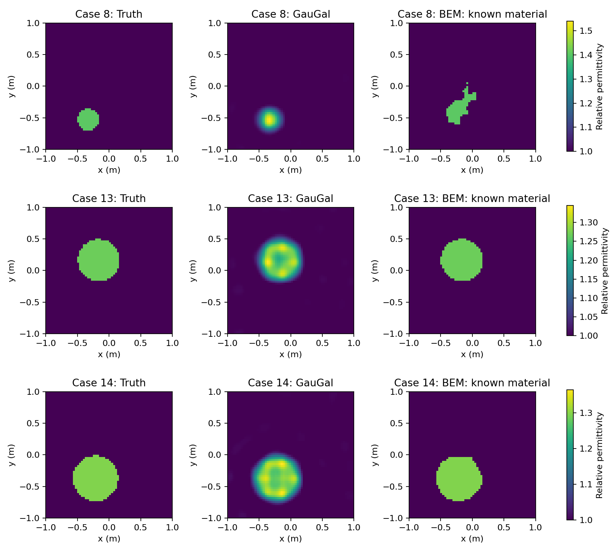

# GauGal is fast because its repeated work has a different structure

Prepared 2026-10-05 from the completed GGB-001 pilot and the pinned released
implementation. GauGal reconstructs the three selected cylinders near the
measurement-noise level in 0.81–1.26 seconds of optimization on an RTX 5090.
Its speed combines reusable fixed-domain operators, separable Gaussian
projections, FFT propagation, batched warm-started iterative solves, and a
small repeated update loop. Avoiding a dense factorization is one part of
this combination.

Our current cleaned modal BEM uses a much smaller field system, but its slow
cases spend most of their wall time outside recorded physics evaluations.
The existing trial histories show repeated invalid geometry proposals and
backtracking. The 348-second unsuccessful case is therefore not a measure
of the cost of solving a 258-unknown boundary system.

This record explains the two existing implementations and their measurements.
Physical formulation, representation, optimizer, continuation, admissibility,
accuracy, and stopping are treated as fixed design choices. Their differences
are documented to interpret timing; no change to those choices is proposed.

## 1. What was actually compared

GGB-001 was explicitly approved and ran once on cylinder indices **8, 13, 14**.
These are the first three structurally eligible cases among indices 0–99:
one connected object, one object permittivity, background permittivity one.
There are 31 eligible cases in that first-100 subset. Selection preceded
reconstruction and did not use outcomes. The README's cylinder sample 2 has
multiple object materials and was not substituted into a homogeneous BEM arm.

Both arms use the official SingleTX-EISP archive, 0.4 GHz, a 64 × 64 pixel
domain covering −1 to +1 m, 16 transmitters, and 32 receivers on a nominal
3 m ring. All 512 source/receiver pairs are retained. The same deterministic
5% complex noise, seed 1000 separately for each sample, is supplied to both
arms; equality with the released GauGal loader was checked after its
complex64 conversion. This per-sample convention is distinct from the
released first-100 benchmark's sequential noise stream.

The BEM arm imports the maintained `solvers/bem_inverse` implementation:
`modal_muller`, `certified_spectral`, and the maintained LM stage optimizer.
A research acquisition adapter exposes the full transmitter/receiver matrix
through the native modal assembly and Hadamard derivative. The geometry
update is selected through `make_update`; CUDA selection uses batched
preparation and the integrated GPU certificate implementation. It is not
an old compatibility implementation or a separate legacy solver.

This pilot is a **known-material shape-recovery control**. BEM receives the
true homogeneous object permittivity; GauGal estimates material coefficients.
The BEM run uses one real frequency and geometry update modes 3 → 7 → 11,
with no additional damped observations or frequency continuation. It is not
a run of the complete neural BEM or TG-002 policy. Its fixed start is a
centred circle of radius 0.35 m; no localization or restart was performed.

The authors' README reports an under-ten-second reconstruction against an
over-thirty-minute physics-driven baseline. That is their reported comparison;
GGB-001 independently measures the selected three cases and does not reproduce
that entire baseline study or the first-100 benchmark.

| Property | GauGal cylinder implementation | Cleaned modal BEM control |
|---|---|---|
| Forward formulation | Frequency-domain scalar volume integral equation, Gaussian–Galerkin projection | Frequency-domain scalar transmission problem, modal Müller boundary integral equation |
| Field coefficients per source | 56 × 56 = 3,136 | Two traces with \|m\| ≤ 64: 2(129) = 258 |
| Refinement | Released settings; iterative tolerance 1e−4 | K=96: 386 field unknowns; production/refined field gate 1e−4 |
| Inverse coordinates | 3,136 real material coefficients | 7, then 15, then 23 real normal-displacement coordinates |
| Geometry storage | Fixed Gaussian centres and widths | Fourier boundary band 32, 65 complex stored coefficients |
| Linear algebra | Batched complex BiCGSTAB, Jacobi preconditioning | Dense LU; factors reused for source and reciprocal right-hand sides |
| Precision | complex64 fields, float32 coefficients | complex128 fields and float64 geometry |
| Repeated update | Fixed-step damped FISTA and bounded coefficient-grid TV proximal operation | LM proposals, geometry validity, backtracking, and refined acceptance |
| Material information | Unknown coefficients | True homogeneous object value supplied |

The opaque BEM resolution token 512 means `8*K_trace`; it is neither the
system dimension nor a boundary-node count. The inverse coordinate count
also differs from the stored boundary coefficient count. A field dimension,
an inverse dimension, and a resolution token must not be interchanged.

## 2. GauGal's repeated operator application

In the released lumped material coupling, the field equation is applied as

```text
A(a) u = M u − K(a ⊙ u).
```

Here `a` is the real contrast coefficient vector, `u` is a complex field
coefficient vector, `M` is the projected mass operator, and `K` is the
projected Green propagation operator. Material coupling is pointwise in
coefficient space. Changing `a` does not require rebuilding centres, widths,
sensor projections, the incident-field projection, or the background Green
kernel. The iterative solver receives an operator application rather than
a newly assembled dense `A(a)`.

The **specific synthetic cylinder path** deserves a more precise description
than simply “Gaussian-lattice FFT.” `build_synthetic_galerkin_model` uses
the archived pixel-domain Green kernel with separable Gaussian projection
weights. If `B` maps the 56 × 56 coefficient grid to the 64 × 64 pixel grid,
the repeated propagation has the structure

```text
coefficient source → B → pixel source
                  → zero-padded pixel-domain FFT convolution
                  → Bᵀ projection → coefficient response.
```

The cell-area factors are retained. The projected mass application similarly
maps to pixels and back. This is the `_domain_projected_k` /
`_domain_projected_mass` branch, not the alternative direct convolution on
the Gaussian lattice. The latter exists elsewhere in the released code and
also exploits translation-invariant kernel structure, but the cylinder
timings belong to the projected pixel-domain branch.

The Gaussian weights factor by coordinate. Coefficient-to-pixel mapping is
implemented with two matrix multiplications using `B_y` and `B_x`, and its
transpose projection uses the corresponding two multiplications. There is
no need to store or repeatedly multiply a full 4,096 × 3,136 basis matrix.
This separability is important in addition to the FFT itself: the synthetic
matvec includes projection work, so its total complexity should not be
described as just an FFT's O(N log N).

The Green convolution uses zero padding to twice the pixel-grid side,
followed by cropping. It applies the nonperiodic linear-convolution operator,
not a periodic wraparound approximation. Its kernel transform is prepared
once. The adjoint applies the conjugated transform and matching projection
operations. Kernel storage avoids the dense 3,136 × 3,136 projected Green
matrix: one such complex64 matrix would contain about **75 MiB** of entries,
before factors and auxiliary storage. Dense receiver maps still exist, and
the input archive contains precomputed pixel operators; “matrix-free” does
not mean there are no dense arrays anywhere.

For these cases, Gaussian compression reduces a 4,096-pixel field description
to 3,136 coefficients. That reduction alone is modest. The stronger execution
advantage is structured, reusable operator application instead of rebuilding
and factoring a large coefficient system at each material update.

## 3. Why BiCGSTAB is useful in their implementation

BiCGSTAB is a Krylov iterative method for complex nonsymmetric systems. It
updates an approximate solution using residuals and repeated operator
products. It does not form a dense inverse or perform LU factorization.
The [SciPy reference](https://docs.scipy.org/doc/scipy/reference/generated/scipy.sparse.linalg.bicgstab.html)
documents the same basic operator, initial-guess, and preconditioner contract;
GauGal implements its own batched Torch version.

Dense LU factorization scales cubically with field dimension. An iterative
method pays for its operator applications and vector operations, with total
cost depending on the iterations needed for convergence. GauGal makes those
applications inexpensive through the structure above. Merely choosing an
iterative method with a dense, expensive operator would not establish the
same benefit. An iterative solver also does not guarantee a fixed iteration
count across contrasts, frequencies, or resonant cases.

The measured cylinder runs use **Jacobi preconditioning**. Its diagonal is
`mass_diag − k_diag*a`, with the conjugated diagonal for the adjoint. The
diagonals are prepared without constructing the full projected matrices;
applying the preconditioner is elementwise arithmetic. Although `auto` can
select spectral preconditioning for a different operator branch, the actual
pilot log identifies `jacobi`. Spectral or variable-spectral preconditioning
must not be credited for these cylinder results.

The solver batches the 16 transmitter fields. Each transmitter has its own
Krylov scalar recurrences; FFTs, projections, and vector operations process
the source batch together. This is batched independent BiCGSTAB, not a block
Krylov method that shares one search subspace among all right-hand sides.

Forward and adjoint fields from the previous outer iteration are retained
as the next initial guesses. Nearby material updates can therefore start
with a small residual. This mechanism is explicit in the source, but its
standalone speedup was not measured by a cold-start ablation. It should be
identified as a plausible contributor, not assigned an invented multiplier.

The configured field tolerance is 1e−4 and the cap is 100 inner iterations.
There is no dense fallback used by the measured path. BiCGSTAB's recurrence
statistics and the final observed-data residual are different quantities;
the data residual measures fit to noisy measurements, not the linear-solver
residual. The pilot retained final images and predictions, rather than a
complete per-iteration qualification record for every field solve.
The stored final `linear_solves` and `linear_iterations` describe only the last
outer iteration, since the counters reset on each update. They are not totals
for the 300-iteration reconstruction or counts of individual transmitter
right-hand sides.

## 4. A compact GPU reconstruction loop

`reconstruct_case` performs 300 fixed outer iterations. Each evaluates the
data-misfit gradient through one batched forward solve and one batched
adjoint solve, then applies bounded coefficient-grid TV and damped FISTA
extrapolation. The fields, coefficients, projected sensor algebra, FFTs,
and TV operations are Torch tensors on the GPU.

The coefficient gradient is computed explicitly from the field/adjoint
equations. The loop runs under `torch.no_grad()`, so it does not retain an
autograd graph through the history of iterative field solves. It also does
not construct a full measurement-by-3,136 sensitivity matrix. One adjoint
batch combines measurement residual information for each transmitter into
the material gradient. The released run is an explicit physical inverse,
not inference through a pretrained neural network.

TV is applied directly on the 56 × 56 coefficient grid with warm-started
dual variables. The pilot uses the fixed TV schedule, tolerance 1e−4 and
cap 100. It does not render a full image and solve a pixel-to-coefficient
least-squares problem in every proximal update. Image rendering and the final
prediction evaluation are accounted for after optimization.

There is one scheduled material update per outer iteration; the code does
not run the BEM's geometry-admissibility search or refined candidate
acceptance loop. It clips extrapolated material coefficients to their bounds
and applies the proximal update. This explains the number and kind of
operations executed. It is an optimizer/design difference, not a proposed
implementation switch for BEM.

The fixed lattice avoids an additional category of repeated work: no boundary
is displaced, reparameterized, projected back to a stored Fourier band, or
tested for self-intersection when material coefficients change. Geometry
validity cannot account for any of the 300 GauGal iterations because that
operation is absent from this representation.

### Two implementation details that must not be overcredited

1. **FFT scratch reuse:** `reuse_fft_workspace=True` is configured. The
   direct Gaussian-lattice branch has `_linear_conv2d_fft_cached`, but the
   actual cylinder `_domain_projected_k` calls `_linear_conv2d_fft`, which
   allocates its padded buffer. The projected-mass branch also performs its
   projection operations afresh. The cylinder's measured speed cannot be
   attributed to universal FFT scratch-buffer reuse.
2. **Reduced host synchronization:** the pilot uses `bicgstab_mode="sync"`.
   Scalar convergence tests move residual information to the CPU during
   inner iterations. Chunked and fixed-iteration modes exist but were not
   used. The measured speed cannot be attributed to eliminating those
   convergence synchronizations or to an eight-iteration fixed budget.

Similarly, single precision is a recorded execution difference. Its separate
benefit was not measured against a double-precision GauGal control. The pilot
does not support a claim that all observed speed is due to precision.

## 5. What the cleaned BEM executes

For each candidate boundary, modal Müller builds boundary-dependent geometry
and kernel expansions, assembles the production system, factors it, solves
16 incident-source columns, and evaluates the 32 receiver readouts. The
full-matrix research adapter reuses the factors for 32 reciprocal columns
needed by the full shape Jacobian. It does not solve 512 duplicated source
columns. The field system remains 258 unknowns regardless of the number of
Tx/Rx pairs; refinement uses 386.

The LU factors are already reused within a candidate. They are not generally
reusable as the exact factors of a different boundary-dependent matrix.
Prepared modal geometry has an exact-curve/window/device cache. The fit also
uses exact geometry-validation reuse and the spatial intersection backend.
GauGal is not being compared against a deliberately uncached BEM baseline.

On CUDA, current modal geometry preparation and matrix assembly run on the
GPU. Scalar Bessel/Hankel kernels, Graf source/receiver waves, LU, field
readout, and Jacobian contractions remain on the CPU. The geometry update
has batched GPU preparation and GPU certificate evaluation, while finite
trial projection/quadrature remains CPU work. Thus `device="cuda"` does not
make the entire BEM fit a GPU-resident loop. These are the native execution
semantics, not an accidental whole-backend CPU fallback.

Every attempted shape step can incur displacement, coarse/fine arclength
projection, validity checks, and coefficient construction before any physics
evaluation is dispatched. The certificate path first tries cheap area and
increment decisions, then full certificates, then sampled fallback when the
certificate is inconclusive. Difficult proposals can therefore cost time
without contributing a forward solve to the work ledger. Accepted improving
candidates also require refined field evaluations and acceptance checks.

The BEM computes a full measurement Jacobian in a small geometry-coordinate
space for LM; GauGal needs the summed material gradient for its update.
These are different repeated numerical tasks. Neither “more inverse
parameters” nor “smaller field matrix” alone predicts total inverse runtime.

## 6. The measured three-case comparison

Image metrics follow the released SingleTX convention. SSIM normalizes each
image by its own maximum, and the absolute-permittivity images contain many
background pixels. Contrast SNR and observed-field residual are consequently
reported alongside SSIM and RRMSE.

| Case | SSIM G / B | RRMSE G / B | Contrast SNR G / B, dB | Observed-field residual G / B |
|---|---:|---:|---:|---:|
| 8 | 0.97245 / 0.90914 | 0.01891 / 0.06452 | 8.31 / −1.39 | 5.26% / 87.66% |
| 13 | 0.95657 / 0.99358 | 0.01818 / 0.00960 | 11.35 / 17.57 | 4.97% / 5.02% |
| 14 | 0.95504 / 0.98572 | 0.02024 / 0.01503 | 11.97 / 14.90 | 5.00% / 5.44% |

GauGal fits all three cases near the noise level. BEM meets its discrepancy
target on cases 13 and 14 and produces sharper homogeneous shapes. Case 8
does not recover: all three stages stop with `no_decreasing_step`, despite
their normal optimizer-return status. A normal return is not convergence.



| Case | GauGal load s | GauGal build s | GauGal optimization s | GauGal total excluding load s | BEM fit s | BEM endpoint audits s |
|---|---:|---:|---:|---:|---:|---:|
| 8 | 0.601 | 0.176 | 0.814 | 1.184 | 347.935 | 1.095 |
| 13 | 0.558 | 0.006 | 1.265 | 1.386 | 1.928 | 0.080 |
| 14 | 0.539 | 0.006 | 0.865 | 0.990 | 36.191 | 0.044 |

GauGal's optimization timer brackets its outer loop with CUDA synchronization.
Its total excluding load also covers model construction, final evaluation,
visualization, and output work. The load is separate. BEM's fit wall time
includes its geometry and acceptance machinery; endpoint audits are separate.
Shared data acquisition/preparation, dataset generation, and archive download
are outside these timing panels. Dividing unlike timer columns does not give
a controlled end-to-end speedup.

The device was an RTX 5090 using PyTorch 2.8.0+cu128. There was one execution
per case, including first-use effects. The first build is slower than later
builds, but no isolated startup measurement identifies its components.
These are observed wall times, not repeated timing distributions.

## 7. Why the BEM runtimes differ so much

| Case | Accepted shape steps | Trial proposals | Self-intersection refusals | Physics-failed refusals | Other refusals |
|---|---:|---:|---:|---:|---:|
| 8 | 99 | 845 | 669 | 73 | 4 unresolved projections |
| 13 | 14 | 24 | 0 | 0 | 0 |
| 14 | 42 | 133 | 66 | 0 | 0 |

Case 13 has ten additional trials rejected by the refined acceptance margin.
Case 14 has 25 such trials. These are included in proposal counts, distinct
from geometry refusals. A proposal is not an accepted iteration or a physics
solve: many are rejected before dispatch.

Case 8 starts with a relative field residual of 263.58%, against 65.66% for
case 13 and 87.37% for case 14. Its attempted updates repeatedly produce
self-intersecting displaced curves; even 99 accepted steps leave a residual
of 87.66%. Case 14 eventually reaches the noise target but performs more
accepted steps and geometry refusals than case 13. The recorded counts
establish very different paths through the same configured algorithm.

The initial-shape mismatch is a plausible contributor to case 8's difficult
path, not a demonstrated unique cause. Single-frequency inverse ambiguity,
parameterization, and the local optimization path have not been separated
by controlled experiments. No alternative start or optimizer was tried.

The physics receipt permits an additional useful decomposition:

| Case | Fit + endpoint audits s | Recorded physics calls s | LU factorization subset s | Remaining wall time s |
|---|---:|---:|---:|---:|
| 8 | 349.031 | 28.887 | 0.371 | 320.144 |
| 13 | 2.008 | 1.484 | 0.105 | 0.524 |
| 14 | 36.235 | 4.051 | 0.215 | 32.184 |

“Recorded physics calls” sums successful/failed evaluations and derivative
batches, including endpoint audits. Its internal geometry, assembly, waves,
factorization, fields, and Jacobian timers are nested subsets; they must not
be added again. LU factorization excludes the source and reciprocal triangular
solves. Those solves are inside the field/derivative work, so the LU column
is not the time of every linear-algebra operation.

The remainder includes geometry-update preparation, trial construction,
certificate/intersection work, optimizer bookkeeping, and endpoint
rasterization. GGB-001 did not retain the updater's separate timing counters,
so assigning all 320.144 seconds to intersection checks or all of it to GPU
certificates would be unjustified. The rejection history and native call
boundaries support geometry-trial work as a major explanation, while the
fine-grained split remains unmeasured.

Even hypothetically removing factorization entirely saves only 0.371 seconds
from case 8's 347.935-second fit. GauGal's avoidance of a large repeated dense
factorization matters for its own 3,136-coefficient system; it cannot explain
our 348-second case through the cost of our much smaller LU alone.

## 8. Numerical checks and limits on the interpretation

The final BEM K=64/96 relative field differences are 5.95e−6, 3.09e−14, and
3.34e−11. All pass the 1e−4 endpoint gate, including the unsuccessful case.
Thus that endpoint is resolved under the retained refinement comparison;
passing this check does not establish convergence of the inverse or identify
its local failure mechanism.

The synthetic observations were generated with pixel-volume operators.
After fitting, a smooth circle estimated from truth pixel edges differs from
the clean archived fields by 0.745%, 0.969%, and 1.125%. This confirms a small
generating-model/interface discrepancy in that audit. It is not a proven
minimum achievable error and cannot by itself explain case 8's 87.66%
residual. Truth was not used to localize the starting circle or calibrate
against scattered observations.

GauGal's synthetic path uses the archived pixel-domain operators and is
therefore aligned with the generating discretization more directly than the
smooth-interface BEM. Projection and lumped coefficient coupling still differ
from the original pixel unknowns, so that alignment does not make the two
forward models identical. The archive's precomputation cost is outside the
reconstruction timers; the BEM fields are built from the physical sensor
coordinates and boundary. This is another comparability limit, not an isolated
explanation of a measured speed multiplier.

The pilot's object permittivities are approximately 1.4043, 1.2684, and 1.2959.
Their relatively low contrasts plausibly help iterative field convergence;
the pilot does not measure its dependence on contrast. The first-100
population includes multi-material and multi-component cases omitted by
the homogeneous BEM eligibility rule. Three cases establish neither a
first-100 recovery rate nor a general superiority claim.

The qualification suite passed 26 tests, including the full-matrix adapter's
independent analytic disk check and rebuilt-geometry derivative differences.
Saved predictions reproduce the reported image metrics and field residuals.
The post-run receipt verified 85 unchanged numerical sources, including 65
BEM package/sibling source files. Full failure histories remain archived;
no stopped case was replaced or rerun with new settings.

## 9. What is established about GauGal's speed

| Explanation | Evidence status |
|---|---|
| No dense factorization in the measured field path | Established from the selected solver, operator storage, and source |
| Reusable pixel-domain kernel plus separable Gaussian projections | Established from the actual synthetic builder and matvec branches |
| Batched GPU fields, sensors, explicit adjoints, and coefficient TV | Established from source and requested device |
| Warm-started forward/adjoint fields and TV dual variables | Established mechanism; isolated speed contribution not measured |
| No moving-boundary trial/certification work | Established representation/update difference |
| Single precision contributes to performance | Recorded difference; isolated contribution not measured |
| Globally reused FFT scratch in these cylinder matvecs | Not supported; the actual domain-projection branch allocates scratch |
| Chunked/fixed BiCGSTAB eliminates synchronization overhead | Not used in this pilot |
| Smaller field dimension explains our total inverse speed | Not supported by the timing decomposition |
| Exact percentage of GauGal time spent in each operator | Not measured; detailed GauGal phase profiling was disabled |
| Faster recovery for the same inverse problem and information | Not established; material knowledge and design differ |

The measurements establish a fast released reconstruction loop on the three
selected cylinders. The source explains why its repeated work is structured
and reusable. The BEM comparison establishes that difficult geometry trials
can overwhelm the cost of its small field system. These findings do not
require changing either method's physical or optimization design to be
documented accurately.

## Source and evidence map

GauGal source and original evidence are pinned to commit
`3ec2627d3ff7329453ec7b76469a0761d6f6e3de`. Numerical code matches the run
manifest; the local preparation included a Python-3.9-compatible runtime
type alias without changing physical operators or optimization steps.

- [Canonical approved plan and original report](https://github.com/HaibingWu657/Gau-Gal/tree/3ec2627d3ff7329453ec7b76469a0761d6f6e3de/docs/iterations/GGB-001).
- [Authors' overview and reported benchmark claims](https://github.com/HaibingWu657/Gau-Gal/blob/3ec2627d3ff7329453ec7b76469a0761d6f6e3de/README.md).
- [Original manifest, complete trial histories and source hashes](https://github.com/HaibingWu657/Gau-Gal/blob/3ec2627d3ff7329453ec7b76469a0761d6f6e3de/docs/iterations/GGB-001/evidence/manifest.json).
- [Synthetic builder: separable projections, pixel kernel, and diagonals](https://github.com/HaibingWu657/Gau-Gal/blob/3ec2627d3ff7329453ec7b76469a0761d6f6e3de/src/gaugal/paper2d/synthetic.py).
- [Field applications, explicit gradient, sensor maps, TV and BiCGSTAB](https://github.com/HaibingWu657/Gau-Gal/blob/3ec2627d3ff7329453ec7b76469a0761d6f6e3de/src/gaugal/paper2d/collocation.py).
- [Released outer loop and timing boundaries](https://github.com/HaibingWu657/Gau-Gal/blob/3ec2627d3ff7329453ec7b76469a0761d6f6e3de/src/gaugal/paper2d/reconstruct.py).
- [BEM full-matrix adapter and pilot driver](https://github.com/HaibingWu657/Gau-Gal/tree/3ec2627d3ff7329453ec7b76469a0761d6f6e3de/comparisons).
- [Maintained modal backend and its execution receipt](../../../solvers/bem_inverse/modal_muller.py).
- [Geometry update selection](../../../solvers/bem_inverse/geometry_selection.py), [trial/certificate logic](../../../solvers/bem_inverse/certified.py), and [GPU certificate implementation](../../../solvers/bem_inverse/device_certified.py).
- [Maintained LM loop and trial records](../../../solvers/bem_inverse/continuation/lm_backend.py).
- [Local compact evidence and original-source digests](../../../results/validation/cleaned_interfaces/CI-SPD/README.md).
- [GC-001 geometry-only attribution](../cleaned_interfaces/iteration_30/01_results.md): independent context for CPU trial work and GPU preparation. Its TG-002 replay times are not substituted for the unprofiled GGB-001 remainder.
