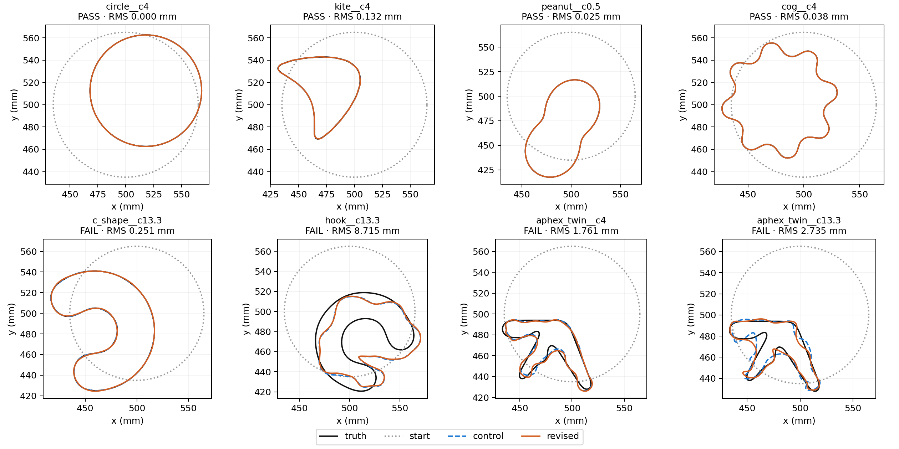

# CS-001 — Faster retained successes, one recovery regression

2026-10-05. **Completed: eight paired TG-002 cases, 16 fresh-interpreter fits.**
The revised four-phase strategy recovered **4/8**, versus **5/8** for the
current-policy control. All four shared successes were faster, with median
paired audited-output speedup **1.499x**. There were **no new recoveries**;
`c_shape__c13.3` regressed. This configuration is not supported for promotion.

The user authorized execution and removed the separate experiment-ID
confirmation requirement: "okay now scratch that rule in agents.md. my
approval is approval you need. and go". AGENTS.md now treats approval of the
requested experiment work as sufficient. The numerical preregistration,
case selection, and source snapshot remained unchanged. The pending-approval
text in the frozen [plan](CS-001_plan.md) and historical
[preparation](CS-001_preparation.md) describes the earlier state; recorded
authorization supersedes it. The original unauthorized record is preserved
as `authorization_preapproval.json` alongside the authorized record.

## Results

Recovery requires all original gates: numerical endpoint audit passed,
RMS <=1 mm, Hausdorff upper bound <=2 mm, and every real-frequency residual
<=.003. Times include fitting, localization and all numerical audits, including
CUDA initialization, but exclude interpreter imports and truth scoring.
Process wall times are separately recorded. Faster failed outputs are not
counted as recovery speedups.

| Case | Control recovery | Revised recovery | RMS control / revised (mm) | Output control / revised (s) | Revised Hausdorff upper (mm) | Revised worst residual |
|---|---|---|---|---|---|---|
| circle, c4 | PASS | PASS | 0.000016 / 0.000011 | 4.09 / 2.53 | 0.0192 | 0.00000626 |
| kite, c4 | PASS | PASS | 0.1322 / 0.1317 | 11.96 / 8.10 | 0.3708 | 0.002039 |
| peanut, c0.5 | PASS | PASS | 0.0260 / 0.0250 | 6.91 / 4.54 | 0.0942 | 0.000236 |
| cog, c4 | PASS | PASS | 0.0397 / 0.0381 | 14.05 / 9.86 | 0.1125 | 0.000917 |
| C-shape, c13.3 | PASS | FAIL | 0.000359 / 0.2510 | 21.19 / 10.36 | 0.6546 | 0.258642 |
| hook, c13.3 | FAIL | FAIL | 8.6531 / 8.7150 | 22.91 / 20.78 | 25.6148 | 1.564845 |
| Aphex Twin, c4 | FAIL | FAIL | 1.6855 / 1.7611 | 24.26 / 33.81 | 6.2986 | 0.657621 |
| Aphex Twin, c13.3 | FAIL | FAIL | 2.5703 / 2.7348 | 51.36 / 40.86 | 13.9033 | 1.583748 |

The four retained successes cost 37.006 s in total with the control and
25.029 s with the revised strategy, a 32.4% reduction. Their RMS differences
are small; no accuracy advantage is claimed. These are single measured pairs,
not repeated timing distributions or a 30-case recovery claim.



## What executed and where it stopped

All eight revised initializations used exact translation and uniform scaling
at damped 0.25 GHz. Every saved accepted initial state remained exactly
circular. All five frequency-ladder operations (four damped prefixes and
the explicit real return) matched the control's executable plans exactly.
Shape/storage levels were (11,24), (15,32), (19,40), (25,52), followed by
configured full release at (95,192). Shape stages use all 19 real frequencies.

- Circle met the audited accuracy target in shape stage 1 (M11).
- Peanut met it in stage 2 (M15), kite in stage 3 (M19), and cog in stage 4
  (M25). Thus all four additional stages were exercised across the screen.
- **C-shape regressed at shape stage 2 (M15/K32), before accepting a step
  there.** At 2.5 GHz, the trial's production/refined prediction difference
  was 1.127783e-7 against the 1e-7 gate (ratio 1.128). It stopped with
  `candidate leaves the frozen numerical-resolution regime`. The accepted
  endpoint's numerical audit passed, and its geometry gates passed, but its
  worst field residual was 25.864%, far above the 0.3% recovery threshold.
  The control continued to M31 and recovered it.
- Hook stopped at shape stage 1 (M11), on a production/refined candidate
  discrepancy. Its revised endpoint audit also failed. Both arms failed the
  geometric and field recovery gates.
- Aphex Twin c4 reached shape stage 2 (M15) but refused candidate physics:
  `|W|^2 lower bound not certified (coefficient residual 1.23)`. All five
  recorded failed evaluations are preserved. Its endpoint numerical audit
  passed, but geometry and field recovery gates failed. The control also
  failed, at M11; the revised output was slower.
- Aphex Twin c13.3 stopped during the explicit undamped frequency return,
  before the new shape ladder, on a candidate-resolution discrepancy. Its
  endpoint audit failed. The control also failed.

**No case entered full release M95/K192.** Early success or numerical failure
ended every case first. The screen validates traversal of the four extra
shape stages, not inverse performance of the final full-release stage.

## Interpretation and checks

This was the preregistered combined change to initialization and the
shape/storage schedule, not an isolated test of translation fitting. The
unchanged backend profile maps the compact K24–52 shape stages to modal
trace cutoffs 64/96; the control's fixed K192 releases use 128/160. Consequently
the new schedule also changes numerical resolution during shape release.
The C-shape's recorded stop points to this coupling as a follow-up target,
but does not establish that a higher trace cutoff alone restores recovery.
No resolution retuning or additional inverse run was performed.

Numerical sources are identical to the prepared, qualified snapshot.
**475 bounded tests passed** before launch; CPU/CUDA checks of all three
similarity columns at TG-002 units and all contrasts had maximum relative
error **1.56246e-9**. Sealed inputs and source hashes verified before and
after the batch. Read-only report validation confirmed all 16 worker returns,
policy settings, numerical audit receipts, recovery classifications, exact
initial circularity, and paired prefix preservation. The boundary figure
was visually inspected. Default CumulativePolicy remains unchanged.

Complete receipts, accepted boundaries, trial refusals, stdout, source
archives, original failed-test evidence, approval and verification are in
`results/validation/cleaned_interfaces/CS-001/`. Rebuild the read-only report:

```bash
PYTHONPATH=solvers:. OMP_NUM_THREADS=1 OPENBLAS_NUM_THREADS=1 MKL_NUM_THREADS=1 \
  /home/drdeng/miniconda3/envs/EMNerf/bin/python -m experiments.benchmark.cs001_report
```
