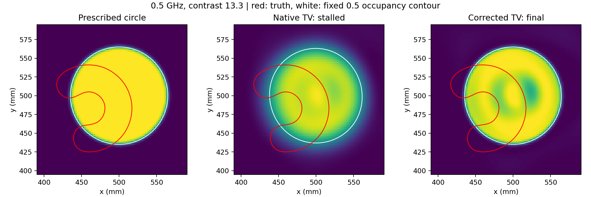
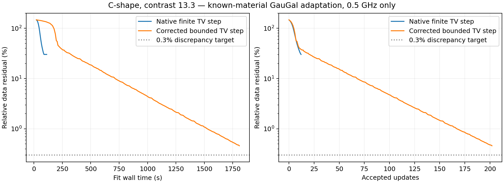

# GS-001 — one frequency fits the data but does not recover the C-shape

The corrected known-material GauGal adaptation reduced the TG-002
`c_shape__c13.3` **0.5 GHz data residual from 147.019% to 0.461%**, but
the fixed 0.5 occupancy contour stayed close to the prescribed centred
circle. It did not recover the displaced C-shape or its deep notch.
The fit stopped at the registered wall cap, while still improving: **202
accepted updates, 1807.91 s fitting, 1936.23 s including build/qualification**.
The cap is checked between updates, accounting for its small overrun.
The 0.3% single-frequency discrepancy target was not reached.



Red is the truth boundary; white is the fixed 0.5 occupancy contour.
All thresholded components are included in the common plotting limits.
The corrected output changes the interior contrast pattern substantially
without moving the thresholded boundary toward the target.

| Diagnostic | Initial circle | Native finite TV | Corrected bounded TV |
|---|---:|---:|---:|
| Active data residual | 147.019% | 30.177% | 0.461% |
| Occupancy IoU | 0.3299 | 0.3331 | 0.3314 |
| Sampled symmetric contour RMS | 28.265 mm | 26.712 mm | 28.088 mm |
| Sampled Hausdorff distance | 51.316 mm | 47.539 mm | 50.738 mm |
| Centroid error | 30.064 mm | 29.713 mm | 29.763 mm |
| Thresholded area error | +104.05% | +88.34% | +102.70% |
| Image relative L2 error | 1.2049 | 1.0152 | 1.1581 |
| Accepted updates | — | 12 | 202 |
| Fit seconds | — | 112.27 | 1807.91 |
| Stop | — | Line search stalled | Wall cap |

The single frequency provides 24 complex paired measurements. The inverse
estimates continuous occupancy coefficients in [0,1] on a 224×224 Gaussian
lattice, with contrast represented as `(13.3-1)*occupancy`. It can change
material within the starting object rather than translate and reshape a
homogeneous object. This observed output demonstrates that a small native
data residual need not imply correct geometry under this representation,
initialization, optimizer and budget. It does **not** prove that every
single-frequency method or a longer/different GauGal optimization must fail.



No damped or other-frequency data entered either optimizer; no grid search
or truth-based setting selection was used. Truth was read only after saving
each inverse output for readout. The sampled contour distances are diagnostic,
not the benchmark's certified all-frequency audit. Neither output is a
TG-002 recovery. No BEM/GauGal timing-parity claim is made.

## Solver and updater checks

Exact separable Gaussian mass preconditioning resolved the field-solver
stall seen in ON-002 for this probe, without changing the physical equations
or the pinned external source. Both grids pass full system/sensor adjoints,
have exactly zero off-pair readout, and pass a complete directional derivative
check. Start-disk Mie error fell from **3.107% at 128/112** to **0.811% at
256/224**, selecting the preregistered refinement. This is below this probe's
1% screen target, but above ON-002's stricter 0.1% physics-parity target.
All accepted forward/adjoint true residuals pass 1e-6; the final corrected
forward true residual is **5.98e-8**.

The first run used the released finite coefficient-TV routine and stalled
at 30.177%. Every last backtrack had a qualified field solve, but shrinking
the step did not approach the current objective. An independent fixed
16×16 bounded-image check confirmed the defect: at alpha=1e-8 the native
routine changed the image by **0.4631**, whereas a bounded isotropic-TV prox
can change bounded input by at most **4e-8**. The corrected dual projection
changed it by **1.414e-8** and passed identity-at-zero, bounds, proximal-energy,
dense direct-solve and complete-gradient checks. The correction is confined
to this experiment package; it is an explicit adaptation, not a performance
claim for unchanged released GauGal. Both runs and their source snapshots
remain preserved.

**Validation:** 35 focused adapter/benchmark tests pass. The read-only report
verifies both source archives against launch hashes, recomputes endpoint data
residuals from saved predictions, checks occupancy bounds and accepted solve
gates, checks descent within each fixed-TV interval, and verifies the frozen
TG-002 input seal. Both runs recorded unchanged launch sources.

- [Original registration](GS-001_plan.md)
- [TV repair registration](GS-001_tv_repair_plan.md)
- [Original native-TV evidence](../../../results/validation/cleaned_interfaces/GS-001/result.json)
- [Corrected-TV evidence](../../../results/validation/cleaned_interfaces/GS-001/qualified_tv/result.json)
- [Machine-readable report validation](../../../results/validation/cleaned_interfaces/GS-001/comparison_validation.json)

Regenerate the report without fitting or physics calls:

```bash
PYTHONPATH=solvers:. /home/drdeng/miniconda3/envs/EMNerf/bin/python -m experiments.benchmark.gs001_report
```
