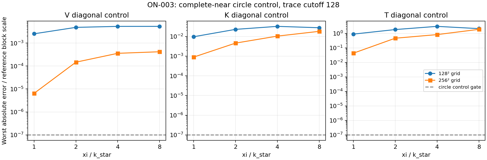

# ON-003 — matched outgoing Fourier grid fails the circle operator control

Execution: **CLOSED — ACCURACY_OR_RESOURCE_LIMITED (Fourier accuracy ceiling)**.
Scientific status: **negative circle control; full-panel coverage incomplete**.
Decision: 2026-10-05 02:36:34 UTC, 47 minutes 22 seconds after launch.
Reporting and publishing completed inside the eight-hour ceiling. The four
prescribed split choices and independent Stage A reference checks are complete.
No forward variant is qualified.

The bounded common-grid construction fails the predeclared circle control
at both 128 and 256 Cartesian Fourier grids. At the best split,
`xi/k_star=1`, the 256 grid has a worst T diagonal error of **0.0431741 times
the reference block scale** at trace cutoff 128. The control gate is 1e-7.
The complete near remainder is retained. Radial quadrature is resolved, so
increasing its order or using another local near approximation does not fix
this far-grid error. This result is specific to the registered matched
compact far kernel, cutoff and grid ceilings; it is not a general rejection
of Ewald methods.

## Authorization and immutable inputs

User instruction: `Go ON-003 using docs/iterations/OVERNIGHT_AGENT_TRACKS.md.`
Start: 2026-10-05 01:49:12 UTC. Deadline: 09:49:12 UTC. Existing branch:
`feature/shape-frequency-continuation`, as instructed by the launch guide.
No branch or worktree was created. Numerical batches held `compute.lock`
then shared `source.lock`; source writes used exclusive `source.lock` and
publishing used `git.lock`. ON-001 numerical work and its regression checks
caused waiting between bounded batches; the recorded control timings begin
after acquiring locks. The total ceiling includes those waits.

The [fixed manifest](../../../../results/validation/cleaned_interfaces/ON-003/manifest.json)
was committed before measurement (`f626a694`, convention/derivation update
`4f6d8818`). All **131 frozen TG-002 input files** passed seal hashes.
The operator reference is an ordinary immutable source archive from
`6f2c1408`, imported from a separate `/tmp` source directory. Receipts record
import paths and SHA256 values, rather than accepting unfinished ON-001 code.
Observed data were read, never generated. No fit, truth selection, repaired
state, legacy scene run or initializer was used.

| Fixed state | Stored band | Exact selected source | History row / iteration | Forward coverage |
|---|---:|---|---|---|
|TG-002 start circle|1|TG-002 `inputs/start.json`|not applicable|12 prescribed configurations, circle diagonal controls only|
|PC-001 M1 kite c4|192|`fixed_M37.json`|2 / 2|unrun after circle accuracy gate|
|PC-001 M1 hook c13.3|20|`stage_4_undamped.json`|22 / 22|unrun after circle accuracy gate|
|PC-001 M1 aphex c13.3|16|`stage_3_damped.json`|13 / 13|unrun after circle accuracy gate|

The manifest is authoritative for row selection keys, complete coefficients,
units and hashes. No coefficients were cropped or resampled. The planned
48-configuration field panel remains **unrun**. The twelve circle
configurations were evaluated as diagonal operator controls at all four
split scales, both grids and both trace cutoffs. These controls do not
constitute twelve qualified full forward evaluations.

## Construction and resolved mathematics

The [derivation](../../../../results/validation/cleaned_interfaces/ON-003/derivation.md)
fixes outgoing limiting absorption, finite `tau=1/(4 xi^2)`, the removable
flat grazing value, physical normalization and all four flux-coordinate
Müller blocks. `k_star=482.46419548929737 /m` includes both media, contrast
13.3, damping and the actual TG-002 background material.

The candidate far multiplier is the radial transform of
`w_R(r)*(G_outgoing(r)-G_near,tau(r))`; it never samples a real Helmholtz pole.
The cutoff is exactly one through `R0=0.16740235047567623 m` (the maximum
coefficient-based boundary-separation bound plus 1 mm). Its fixed smooth
transition has width `8 sqrt(tau)`. `L=2.1 R1` excludes periodic image supports.
The 256-grid axis caps range from about 2180 to 2274 /m; the exact physical
settings and zero-weight Nyquist-plane convention are in the manifest.

Geometry maps use the fixed parameter trace moment A, normal-flux moment C
and vector normal moments, rather than an arclength-weighted scalar map.
The basis is `(u,J*partial_n u)`. V, K, Kprime and the matched linear split
of Maue T retain their signs and exterior/interior differences. Individual
finite-time near and compact far kernels are not separately homogeneous
Helmholtz kernels; their forcing cancels in the full Maue sum. Jump identities
are retained. Circle moments are analytic; the complete circle near part
uses logarithmic quadrature at 2048/4096 samples. Actual circle trace sizes
are 129/257 scalar modes and 258/514 two-trace unknowns.

The flat single-layer model has a first nonzero constant-curvature correction
of order curvature squared, derived before measurement. It improves the
xi=1 circle single-layer error from <=2.26e-5 to <=4.06e-9 of the near block
scale over the retained density band. This is an asymptotic single-layer
component result, not an all-block theorem or a curved-state qualification.
The double/adjoint layer linear-curvature terms and the Maue mapping are
also derived. Close nonlocal near interactions were not removed by a reach
floor. The failure below persists with the complete near control.

## Accuracy evidence and terminal decision

[All error rows](../../../../results/validation/cleaned_interfaces/ON-003/operator_summary.csv),
[full tables](../../../../results/validation/cleaned_interfaces/ON-003/table.md)
and failed multipliers/spectra are retained under each `stage_A_xi*` folder.
Errors are absolute diagonal action errors divided by the maximum exact
circle action of the corresponding exterior-minus-interior block. The full
complex128 arrays preserve individual-medium cancellation. A failed diagonal
is a lower bound on a failed full block action; passing diagonals alone would
not qualify the untested Cartesian-grid off-diagonal entries.

| xi/k_star | 256 grid, cutoff 128: V / scale | K and Kprime / scale | T / scale |
|---:|---:|---:|---:|
|1|6.42180e-6|8.93752e-4|4.31741e-2|
|2|1.46804e-4|4.58845e-3|4.65522e-1|
|4|3.57373e-4|1.04070e-2|8.26183e-1|
|8|4.18202e-4|1.81694e-2|1.91053|

At xi=1, the worst refined T control is real 0.25 GHz, contrast 0.5, mode
-128: absolute error 0.00980139, reference block scale 0.2270204. Even at
cutoff 64 the refined T error is 0.0153685 of that scale. The initial 128
grid is substantially worse: T error 0.893551 at cutoff 128. Thus the one
allowed spatial refinement improves accuracy but does not qualify it.
The `-m*n*V` part of Maue amplifies far single-layer truncation errors at
retained high modes; a small V error alone does not qualify transmission.

The independent flat heat-integral comparison passes to <=4.53e-17 in the
xi=1 panel; grazing uses the finite near value and not a fictitious finite
full-line value. Propagating/evanescent near/far values and cancellation
amplification are tabulated in
[flat_cancellation.csv](../../../../results/validation/cleaned_interfaces/ON-003/flat_cancellation.csv).
The radial-transform order doubling 256/512 is resolved at roughly 1e-15 in
multiplier units. The frozen modal assembly agrees with the independent
analytic circle reference to **4.44817e-9** of block scale over all 96
full-basis-column comparisons, including four seeded complex probes per
block. All pass the 1e-7 reference gate. The 108 checks at 50-digit mpmath
precision pass to <=3.99323e-11 of block scale. The independent heat-time
256/512 near integrals agree to <=5.48e-13 absolute; angular 4096 quadrature
agrees with them to <=1.66e-12 (V), 4.87e-11 (K), and 1.26e-8 (T).
These near errors are far too small to explain the refined T error of
0.00980139. The independent reference receipt and matrices are retained in
[stage_A_reference](../../../../results/validation/cleaned_interfaces/ON-003/stage_A_reference/receipt.json).

No extra grid, shell shift, damping, cutoff, parameter search or new local
variant is permitted by this plan. Under the declared instruction to stop
when grid/order ceilings cannot qualify a configuration, the circle control
failure closes the track early. Full curved maps, all-basis/complex block
actions on curved states, complete paired fields, independent nodal fields,
shape derivatives, cold/three-warm timing panels and the optional 19-frequency
catalog were not run. They are explicitly unrun in the
[48-configuration inventory](../../../../results/validation/cleaned_interfaces/ON-003/coverage.json).
There is no full-field, derivative, forward-speed, inverse-speed or recovery
claim. An inverse integration experiment is not released by these results.

## Actual cost, memory and validation

The four complete circle-control processes take about 19.6–19.9 seconds
each on single-thread CPU; these are control-process costs, not complete
forward-service times. The measured process RSS for xi=2/4 is about
169–172 MiB. Persistent circle diagonal-product arrays and radial workspace
are itemized in
[control_costs.csv](../../../../results/validation/cleaned_interfaces/ON-003/control_costs.csv).
These are specialized circle arrays, not the cost of general curved complex
moment maps. The 2 GiB persistent and 4 GiB peak ceilings were not approached.
No GPU, transfer, source/receiver evaluation, factorization, reciprocal solve
or derivative cost was measured for a candidate service. No amortized
speedup or all-frequency crossover is inferred from component costs.

Failed evidence is preserved: the missing double-layer trace diagonal,
archive root-directory preflight and NumPy 2 inverse-index layout. The correct
near circle diagonal is `-1/(4pi)`, the archive guard admits its exact root
while rejecting traversal, and grid inverse indices are explicitly flattened.
No accuracy tolerance changed. The successful focused plus dependency-boundary
suite has **11 passing tests**. All 768 reported errors were rebuilt from
the retained arrays; receipt counts, source hashes, metadata provenance,
48-case inventory and independent reference gates pass
[closeout validation](../../../../results/validation/cleaned_interfaces/ON-003/closeout_validation.json).
The [field/derivative table](../../../../results/validation/cleaned_interfaces/ON-003/field_derivative_errors.csv)
records all 48 configurations as UNRUN; blank errors are not zeros or passes.

Representation: **incomplete general operator**. The delivered prototype has
analytic circle Fourier moments and a quadrature-based, boundary-collocation-free
near control. It is not a coefficient-only general-curve Müller construction
or a registered solver. Maintained reference solvers and defaults are unchanged;
new implementation modules are uniquely named `on003_*` and opt-in.

Published phase commits: `f626a694` (selection), `4f6d8818` (derivation),
`039bf2c7`/`ff3928da`/`9729ef6e` (implementation and preserved failures),
`d9e7b52a`/`fcd18743` (xi=1), `8dc7662b` (xi=2), `e062c8b1` (xi=4),
`41d1780d` (xi=8). Each completed batch was validated and pushed with owned
paths only. Independent reference implementation/tests: `72290fd0`; validated reference
evidence, retained matrices, plots, tables and inventory: `ae5035b2`.
The closeout report/plan commit follows these evidence commits.
Other agents' shared-workspace changes are preserved and excluded.

## Follow-up scope and estimate

A follow-up must first resolve the circle far-grid error with a newly
registered matched cutoff/grid construction or a derived tail treatment.
Estimate **one separately approved 4–8 hour forward study** for that next
accuracy decision, using the approximately 20-second current control batches
as the measured starting cost. This is a planning estimate, not an execution
launch or a delivery promise. General curved maps, complete service cost and
derivatives still need qualification; these results do not support a
production-operator or inverse-integration schedule.

Evidence tables and the plot regenerate with
`PYTHONPATH=solvers:. python -m experiments.benchmark.on003_report`, under the
shared resource-lock protocol. Numerical control batches refuse to overwrite
existing evidence. Implementation is confined to
[on003_ewald.py](../../../../solvers/bem_inverse/on003_ewald.py),
[on003_circle_reference.py](../../../../solvers/bem_inverse/on003_circle_reference.py)
and the uniquely named ON-003 experiment/reference/report drivers.
