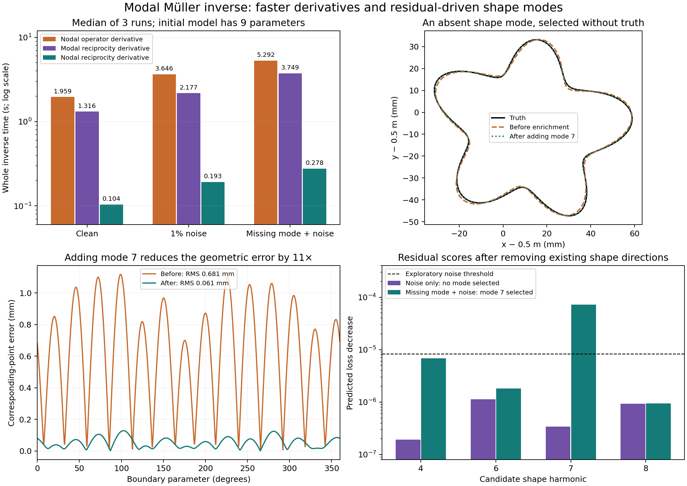

# Native modal Müller inverse — exploratory notebook

2026-09-16. This records working experiments and open questions. The user asked
for a complete inverse pipeline, creative exploration, and rough documentation
afterward. Earlier iteration contracts do not constrain this exploration.

Follow-up: [coupled objects, direct Jacobian actions, and selecting an extra
measurement frequency](02_coupled_modes_and_measurements.md) extends this work
and records the latest results.

## What now works

The [experimental implementation](../../../../experiments/modal_muller_research)
has a forward solve, shape Jacobian, bounded inverse, frequency continuation,
noise regularization, independent validation, and residual-driven addition of
shape harmonics. Production solver defaults were not changed.

The native path represents geometry and the two Müller traces as Laurent/Fourier
coefficients. The second trace is canonical flux, `q = |z′| ∂n u`. It builds
mode-to-mode self-interactions from the universal logarithmic kernel and smooth
coefficient products; source/receiver maps use cylindrical-wave expansions.
There are **no boundary nodes or boundary point-pair kernel calls** in this path.
FFT operations perform linear coefficient convolutions. Center-to-source and
center-to-receiver Hankel evaluations are still needed.

The full inverse starts from a displaced circle and estimates center, radius,
and the cosine/sine radial harmonics 2, 3, and 5: nine parameters. This radial
chart removes a tangential gauge; the underlying native forward accepts broader
Laurent geometry. Forward interactions between disconnected components exist;
the inverse demonstrated here is single-component with known topology/materials.

## The useful discovery: differentiate through trace products

For equal permeability, reciprocity gives the continuous shape derivative

```text
δY_rs = (ki² − ko²) ∫Γ u_s u_r (δx · n) ds.
```

Here `u_s` is the total boundary trace from the actual source and `u_r` is the
total trace from a unit source at the receiver. There is no complex conjugation
in this reciprocal bilinear formula. A related adjoint shape-gradient formula
appears in [Guo & de Hoop, 2013, equation 15](https://cpb-us-e1.wpmucdn.com/blogs.rice.edu/dist/8/4754/files/2020/12/SEG-2013-1057.pdf).
The present implementation specializes it to the 2D acquisition and modal traces;
the underlying shape-calculus identity is established theory.

Multiplication of the two traces is a convolution of their Fourier coefficients.
The remaining integration is a coefficient contraction with
`Re(δz conjugate(−i z′))`. We reuse the forward LU for receiver illuminations;
new shape directions then cost contractions rather than differentiated operator
assemblies. Two frequencies and all nine parameter columns took about **1.6 ms**
after the native forward, versus geometry/operator rebuilds that dominate the
remaining work. Seventeen columns for mode selection took about 2.9 ms.

This identity also works with nodal traces. Implementing that control was
essential: the large derivative speedup transfers to the nodal solver.

The formula differentiates the continuous problem. At finite trace cutoff it
is not exactly the derivative of the truncated Galerkin matrix. Both paths
remain available: `jacobian_kind='operator'` and `'hadamard'`.

## Complete inverse results

24 paired source/receiver measurements at 0.5 and 1.25 GHz, external relative
permittivity 6, internal 3, equal permeability, lossless media. The main truth
has a 36 mm mean radius, mixed radial harmonics, and a displaced center. Data
were generated independently with 256 nodal points and checked at 512; the
relative discrepancy was at most `2.5e-14`. The noisy observations contain 1%
complex noise per frequency. A rotated acquisition at 0.875 GHz is held out.

These are CPU timings with BLAS/OpenMP thread counts set to one, median of three
runs, alternating execution order. Timings include acquisition setup, all trial
forwards, geometry rebuilds, Jacobians, and optimization. They exclude independent
data generation and final validation. Native reciprocal runs use 49 trace modes
per trace (`M=24`) and coefficient half-bandwidth 40; nodal runs use 64 nodes.

| Case | Nodal operator derivative | Native modal reciprocity | Nodal reciprocity |
|---|---:|---:|---:|
| Clean | 1.959 s | 1.316 s | 0.104 s |
| 1% noise | 3.646 s | 2.177 s | 0.193 s |
| Missing shape mode + 1% noise, before enrichment | 5.292 s | 3.749 s | 0.278 s |

All optimizers reported success. Clean observations were fitted to roughly
`2e-9`–`5e-9` relative error. With 1% noise, the native recovered boundary RMS
error was **0.038 mm**, approximate sampled Hausdorff error **0.068 mm**, and
held-out field error **0.182%**. The nodal reciprocal recovery agrees.

Compared with the operator-derivative nodal control, the modal inverse is
**1.4–1.7× faster** in these tests. The nodal reciprocal inverse is **18.8–19.0×
faster** than that control and substantially faster than the modal inverse.
There is no evidence here for an intrinsic modal speed advantage over a nodal
solver given the same derivative improvement.

The earlier native operator-Jacobian inverse was slower: 7.21 s clean and
12.52 s noisy. Coarse-to-fine traces reduced those to 3.25 s and 2.73 s, including
resolution checks. Those are single-run exploratory measurements in
[`inverse_suite`](../../../../results/experiments/modal_muller_20260916/inverse_suite),
not the repeated timing comparison above.

## Let the residual ask for another shape mode

The harder truth also includes mode 7, absent from the initial inverse chart.
After fitting modes 2, 3, and 5, the code scores candidate pairs 4, 6, 7, and 8.
It projects out the existing shape tangent space and estimates each pair's
possible reduction in residual loss. Neither truth geometry nor held-out data
enters selection or optimization. A heuristic threshold uses the known noise
level; it is not a calibrated statistical test.

| Case | Selected harmonic | Boundary RMS before → after | Held-out field error before → after |
|---|---|---|---|
| Noise only | None | 0.038 → 0.038 mm | 0.182 → 0.182% |
| Missing mode + noise | 7 | **0.681 → 0.061 mm** | **1.695 → 0.271%** |

Testing the extra modes took 0.18–0.20 s. Selection plus the additional mode-7
optimization took **1.62 s**, on top of the base inverse. The new optimization
uses `M=32`, coefficient half-bandwidth 48, and eleven parameters. This is one
positive example and one noise-only control, not broad model-selection coverage.
RMS compares corresponding boundary parameters; Hausdorff estimates use 2048
boundary samples for validation only.



## Checks and limits

- **13 targeted tests passed**: forward identities, component coupling,
  singular contractions without wraparound, independent nodal/Jacobian agreement,
  centered differences, complete recovery, complex source strengths, and the
  tangential null direction, and rejection of unsupported material properties.
- Against the refined nodal operator derivative, native reciprocal Jacobian
  relative error decreased from `1.4e-5` (`M=16, B=24`) to `1.6e-9`
  (`M=24, B=40`) to `3.6e-13` (`M=32, B=64`). The worst column at the finest
  setting differed by `1.4e-12`.
- The derivative identity requires equal permeability; this inverse prototype
  currently requires unit relative permeability and lossless materials. The tested inverse
  has fixed materials and a single radial-chart component. Topology changes,
  material estimation, broad initializations, and multiple noise seeds remain
  untested here.
- The native logarithm uses a right-half-plane certificate for the divided
  geometry difference. Some distorted saved shapes fail this certificate or
  converge slowly. The log stopping estimate controls the projected coefficient
  recurrence in L2; it does not certify coefficient-window truncation error.
- High-frequency Bessel power series suffer cancellation: prior forward probes
  were good at 2.5 GHz, needed more terms at 5 GHz, and were inaccurate at 8 GHz.
  The present inversions only use 0.5 and 1.25 GHz.
- Compiling geometry moments helps repeated frequencies on a fixed shape, but
  compilation must be repeated when the inverse changes that shape. It is not
  free amortization across inverse steps.

## Where to go from here

The strongest immediate direction is the reciprocal derivative in larger
acquisitions and multiple components, with independent derivative checks. For
the modal research, residual-directed shape and trace bandwidths are more
promising than simply replacing a dense nodal matrix by a dense modal matrix.
Another concrete idea is a matrix-free Jacobian: convolve source/receiver traces
once, then expose both parameter products and transpose products without
assembling one differentiated operator per shape mode. The current coefficient
contractions are a starting point, not yet a scalable implementation of that idea.

## Reproduce and inspect

From the repository root, using an environment with NumPy, SciPy, Matplotlib,
and pytest (`/home/drdeng/miniconda3/envs/EMNerf/bin/python` here):

```bash
export OMP_NUM_THREADS=1 OPENBLAS_NUM_THREADS=1 MKL_NUM_THREADS=1 PYTHONPATH=solvers:.
python -m pytest -q experiments/modal_muller_research/test_coefficients.py experiments/modal_muller_research/test_inverse.py
python -m experiments.modal_muller_research.run_inverse --arms native_hadamard nodal_hadamard nodal64 --repeats 3 --output results/experiments/modal_muller_20260916/hadamard_inverse
python -m experiments.modal_muller_research.run_enrichment
python -m experiments.modal_muller_research.plot_inverse_findings
```

Raw evidence: [repeated inverses](../../../../results/experiments/modal_muller_20260916/hadamard_inverse/summary.json),
[derivative convergence](../../../../results/experiments/modal_muller_20260916/inverse/hadamard_qualification.json),
[adaptive shape modes](../../../../results/experiments/modal_muller_20260916/adaptive_shape_modes/summary.json),
and [figure PDF](../../../../results/experiments/modal_muller_20260916/inverse_findings.pdf).
Per-run JSON retains parameters, optimizer status, work counts, and history;
the repeated-run manifest records environment and source hashes.
