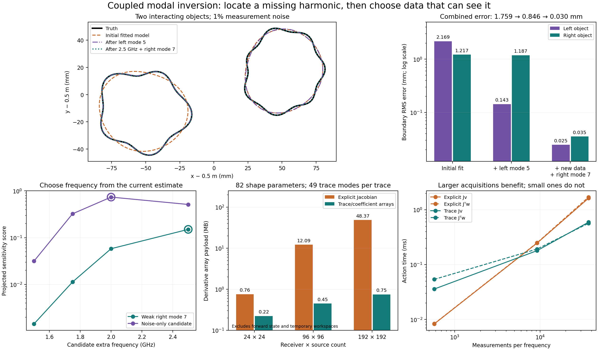

# Coupled modes, Jacobian actions, and choosing another measurement

Follow-up to [the first inverse](01_exploration.md), 2026-09-16. Still an
exploratory notebook, with no production-default changes or new execution gates.

The new implementation is
[`coupled_inverse.py`](../../../../experiments/modal_muller_research/coupled_inverse.py).
It handles multiple interacting components, reciprocal shape derivatives, dense
or matrix-free least squares, and component-specific harmonic selection. The
native path retains geometry, traces, interactions, and derivatives in
coefficient space. The nodal path is an independent reference and a timing control.

## A missing mode can be a measurement problem

The test has two objects, common known lossless materials, and 24 paired
measurements at 0.5 and 1.25 GHz. Their mean radii are about 31 and 29 mm, and
their centers are about 105 mm apart. Neglecting their interaction changes the
predicted data by **25.8%** on the base fixture. Both reciprocal illuminations
therefore use the full coupled solve.

The initial inverse chart has center, radius, and radial modes 2 and 3 for each
object: 14 parameters. The harder truth also has mode 5 on the left object and
mode 7 on the right, neither supplied to the initial fit. Data contain 1% complex
noise; observations come from a separate 256-node solver checked at 384 nodes.
The initial guesses are displaced circles, with component identities/anchors
already supplied. This is fixed-topology recovery, not object detection.

| Stage | Left RMS error | Right RMS error | Combined RMS | Held-out field error |
|---|---:|---:|---:|---:|
| Fit the initial 14 parameters | 2.169 mm | 1.217 mm | 1.759 mm | 1.969% |
| Select and add left mode 5 | 0.143 mm | 1.187 mm | 0.846 mm | 0.477% |
| Add a selected frequency, then right mode 7 | 0.025 mm | 0.035 mm | **0.030 mm** | **0.182%** |

Candidate shape additions were modes 4, 5, 6, and 7 on either object. The first
selection correctly chose **left mode 5**. After refitting, right mode 7 had the
largest remaining score, but it was below the noise threshold. The code stopped
without adding it. That rejection is retained in the result record.

The next experiment asked for one extra measurement set. Using only the current
estimate and the leading rejected candidate, it evaluated frequencies 1.5,
1.75, 2.0, and 2.5 GHz. For each, it projected the candidate's two derivative
columns off the existing shape tangent space and scored the smaller squared
singular value, normalized by predicted field norm. **2.5 GHz** had the strongest
remaining sensitivity to the right object's seventh harmonic.

Only after choosing that frequency did the synthetic instrument generate its
data, again with independent 1% noise. Refitting and applying the same
mode-selection rule accepted **right mode 7**, then accepted nothing further.
The final model has 18 parameters. The held-out 0.875 GHz acquisition, with
rotated source/receiver positions, was never used for selection or optimization.

The same extra-measurement procedure was also applied to the noise-only control.
There the design chose 2.0 GHz, and **no additional shape mode was accepted**.
Its combined boundary RMS changed from 0.035 to 0.027 mm.

This is one successful acquisition-design example plus one noise-only control.
The noise rule remains heuristic: `8 * noise_fraction**2 / real_data_count`.
Its numerical threshold changes when measurements are added; its formula was
not relaxed to force the hidden mode through. The decision to try one extra
frequency was part of this experiment, not a calibrated autonomous acquisition
stopping policy. Frequency selection uses no truth geometry. Truth enters the
synthetic instrument and final validation only.

The recorded native path took 2.47 s for the initial fit, 1.90 s for the first
mode-selection/refit phase, and 7.82 s for frequency design plus the final
refits/selections: about **12.2 s** of computation. Independent data generation
and final validation are excluded; no hardware acquisition time is modeled.



## Direct actions between modes

The reciprocal derivative is a sum over components:

```text
δY_rs = (ki² − ko²) Σc ∫Γc u_s u_r (δx_c · n_c) ds.
```

All multiple scattering is already present in the source and receiver traces.
There is no need to differentiate cross-interaction matrices separately.

An explicit Jacobian first convolves every source/receiver trace pair and then
contracts with each shape direction. For larger acquisitions, that intermediate
product tensor becomes expensive. The new `TraceJacobian` avoids it:

- For `Jv`, combine the geometry coefficients for direction `v`, form a small
  Hankel coefficient matrix, and contract it with source and receiver traces.
- For the transpose action used by a real least-squares objective, contract the
  measurement weights with the traces first, sum coefficient anti-diagonals,
  and then apply the transpose geometry map.

Neither action forms a measurement-by-shape Jacobian or a
mode-by-receiver-by-source tensor. The real transpose includes the complex
conjugations required by the loss; the underlying reciprocal field identity
remains bilinear without conjugation.

At one frequency, with two components, 82 shape parameters (radial modes 2–20),
49 modes per trace, and **192 receivers × 192 sources**:

| Quantity | Explicit Jacobian | Trace/coefficient actions |
|---|---:|---:|
| Derivative array payload | 48.37 MB | **0.75 MB** |
| `Jv` | 1.62 ms | **0.59 ms** |
| Real transpose action | 1.70 ms | **0.57 ms** |

This is **64.6× smaller derivative payload**, with **2.7–3.0× faster actions**.
Action values agree to about `6e-16` for `Jv` and `4e-15` for the transpose.
Timings are medians of seven actions, one CPU thread. The explicit transpose
benchmark conjugates the vector rather than copying/conjugating the whole
matrix on every call. Payload counts the derivative's arrays; it is not peak
process memory and excludes the forward state and temporary workspaces.

At 24 × 24 measurements, explicit matrix actions are faster. At 96 × 96, the
trace actions begin to win. The large-acquisition result is an action/storage
benchmark at a fixed geometry, not a measured whole-inverse speedup.

The `LinearOperator` path was also used in complete paired-data inverses. It
recovered the same solutions, but did not consistently reduce total time on
these small problems. Native forward assembly still dominates. For comparison,
the median of three runs with explicit reciprocal Jacobians was:

| Initial fit | Native modal | Nodal reciprocal |
|---|---:|---:|
| Clean | 0.880 s | 0.192 s |
| 1% noise | 1.435 s | 0.343 s |
| Two missing modes, before enrichment | 2.482 s | 0.550 s |

Thus the earlier conclusion stands: the modal approach has useful structure,
but is not yet the fastest forward/inverse backend for these small scenes.

## Verification and scope

**16 experimental tests pass.** New checks cover the complete coupled derivative
against the existing differentiated operator, complex source strengths, unequal
source/receiver counts, paired and full acquisition, Jacobian actions, real
adjoint identities including regularization/scaling, and a boundary-sampling
prohibition on the native path.

At the initial two-frequency fixture, the native reciprocal Jacobian agrees
with the 256-node differentiated operator to about `9e-15`. At the final
2.5 GHz recovered shape, its relative error is `2.8e-12`, with worst column
`1.1e-11`. A centered directional difference differs by `6.0e-9` at step `1e-4`.
The extra-frequency data oracle agrees between 256 and 384 nodes within `9e-14`.

The native derivative is still a continuous shape identity evaluated with
truncated traces, not the exact derivative of every finite Galerkin matrix.
The refinement/oracle checks matter. The prototype still requires disjoint
component bounding circles for cross translations, certified logarithmic
geometry expansions, common lossless nonmagnetic materials, and known component
topology. Close contacts, material inversion, unknown objects, and broad
initialization/noise-seed coverage are not established by these experiments.

The promising connection is now concrete: the same coefficient derivatives can
identify a missing shape direction, test whether the current measurements can
see it, and choose another frequency to improve that visibility. This is more
useful than increasing all geometry and trace bandwidths indiscriminately.

## Reproduce

```bash
export OMP_NUM_THREADS=1 OPENBLAS_NUM_THREADS=1 MKL_NUM_THREADS=1 PYTHONPATH=solvers:.
python -m pytest -q experiments/modal_muller_research
python -m experiments.modal_muller_research.run_coupled_inverse
python -m experiments.modal_muller_research.run_frequency_design
python -m experiments.modal_muller_research.plot_coupled_findings
```

The environment used here is `/home/drdeng/miniconda3/envs/EMNerf/bin/python`.
Evidence: [coupled recoveries](../../../../results/experiments/modal_muller_20260916/coupled_inverse/summary.json),
[initial derivative check](../../../../results/experiments/modal_muller_20260916/coupled_inverse/qualification.json),
[action benchmark](../../../../results/experiments/modal_muller_20260916/coupled_inverse/action_benchmark.json),
[extra-frequency results](../../../../results/experiments/modal_muller_20260916/coupled_inverse/frequency_design/summary.json),
[final derivative check](../../../../results/experiments/modal_muller_20260916/coupled_inverse/frequency_design/final_derivatives.json),
and [figure PDF](../../../../results/experiments/modal_muller_20260916/coupled_inverse/coupled_findings.pdf).
Per-case records retain parameters, observations, selections, optimizer histories,
and timings; manifests/final summaries include source hashes.
