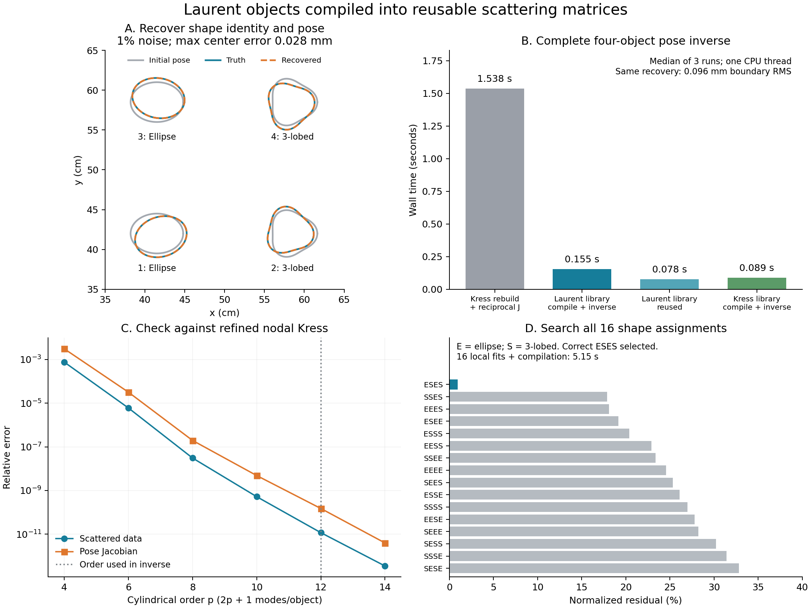
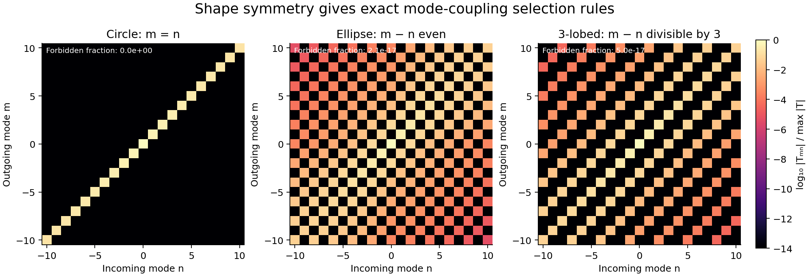

# Compile Laurent shapes, then eliminate the traces

2026-09-16. Exploratory follow-up to [the coupled modal inverse](02_coupled_modes_and_measurements.md).

Next: [differentiate the scattering matrix with respect to Laurent shape
coefficients and recover deformation together with pose](04_deformable_scattering.md).

The working extension compiles each local Laurent shape into a small matrix
mapping incoming cylindrical modes to outgoing cylindrical modes. Subsequent
position/orientation inverses solve for outgoing coefficients only. They use
**no boundary nodes, no boundary-trace unknowns, and no new Müller assemblies**.
Center-to-center/source/receiver Hankel evaluations remain.

This is a fixed-template inverse: shapes and materials are compiled for each
frequency, while object identities, positions, and orientations can change.
Changing the actual shape coefficients continuously still requires a new local
compile in this implementation. It complements the earlier free-shape inverse.



## The mode-to-mode construction

For a local shape `z(w) = scale Σ z_j w^j`, the native compiler uses the existing
Laurent coefficient Müller operator `A`, regular-wave incident trace map `B`, and
outgoing-wave projection `P`:

```text
T = P A⁻¹ B
outgoing coefficients = T × incoming coefficients.
```

The compiler solves all incoming modes together. Its boundary unknowns are
Fourier coefficients of `u` and canonical flux `q = |z′| ∂n u`; those unknowns
are eliminated once into `T`. The local native compiler requires no sampled
boundary. An independent nodal Kress compiler produces the same map and is
included as a control.

For multiple objects, `U` translates outgoing waves from other objects into
regular incoming waves, `a` contains source illuminations, and `C` maps outgoing
waves to receivers. With block-diagonal `T`, the entire online problem is

```text
(I − T U) β = T a
Y = C β.
```

A rigid rotation needs only phases:

```text
T(α)_mn = exp(i(n − m)α) T(0)_mn
∂α T(α)_mn = i(n − m) T(α)_mn.
```

Translations use cylindrical-wave addition formulas and analytic Cartesian
ladder derivatives. Differentiating this small system gives the exact derivative
of its finite-dimensional forward map. This differs from the earlier continuous
reciprocal derivative evaluated using truncated traces. The global LU is reused
for all pose derivatives; there is no finite-difference derivative in optimization.

To control factorial growth, the regular basis is `J_n / s_n` and the outgoing
basis is `s_n H_n`, with `s_n = (ko R / 2)^|n| / |n|!` and the coefficient bound
`R = scale Σ |z_j|`. Translation blocks evaluate distinct cylindrical orders
once and gather the repeated matrix diagonals.

Scattering-matrix reuse for arbitrary shapes, rotations, and repeated particles
is established methodology; see [Lai, Kobayashi, and Greengard (2014)](https://arxiv.org/abs/1407.3868).
The contribution here is connecting our node-free Laurent Müller compiler to
that representation, differentiating the pose solve, and testing the inverse.

## Matched inverse results

The scenes contain ellipses with semiaxes 33/25 mm and three-lobed shapes of
28 mm mean radius and 12% radial modulation. There are 24 paired measurements
at 0.5 and 1.25 GHz, exterior/interior relative permittivities 6/3, equal
permeability, and no loss. Observations come from independent 256-node Kress,
checked at 384 nodes to relative error below `4.5e-15`. Noisy cases have 1%
complex noise per frequency. A rotated acquisition at 0.875 GHz is held out.

Each object has three inverse parameters: x, y, and angle. Initial centers are
within several millimeters of truth, with zero initial angles versus truth
angles of approximately 10–17 degrees. Bounds are ±15 mm about supplied anchors
and ±0.8 radians. These are local recovery experiments with known component count.

Median wall times of three repeats, one CPU thread, alternating arm order:

| Complete pose inverse | Two objects, clean | Two objects, 1% noise | Four objects, 1% noise |
|---|---:|---:|---:|
| Rebuild native modal + reciprocal derivative | 0.671 s | 0.672 s | 1.738 s |
| Rebuild nodal Kress + reciprocal derivative | 0.236 s | 0.238 s | 1.538 s |
| Laurent library, **including compilation** | 0.096 s | 0.098 s | 0.155 s |
| Laurent library, previously compiled | 0.022 s | 0.022 s | 0.078 s |
| Kress library, **including compilation** | 0.039 s | 0.039 s | 0.089 s |
| Kress library, previously compiled | 0.022 s | 0.022 s | 0.070 s |

All **54 inverses reported success**. The four-object native library is about
**10× faster including compilation**, or **20× faster with reuse**, than the
matched nodal reciprocal rebuild. For the noisy pair, those factors are 2.4×
and 10.7×. Independent data generation and final validation are outside these
timings; all trial forwards, derivatives, and optimizer work are included.
The earlier slow operator-Jacobian baseline is not used for these speedups.

Kress compiles the same scattering map faster than the current Laurent compiler.
The demonstrated runtime benefit is elimination/reuse of the boundary solve,
not an exclusive speed property of Laurent algebra. Small differences between
the two warm libraries in the four-object case come with different optimizer
trial counts: native takes 10 forwards, nodal-compiled 9, rebuilt Kress 12.
All use identical tight optimizer tolerances and agree on the recovery.

| Recovery | Two objects, 1% noise | Four objects, 1% noise |
|---|---:|---:|
| Corresponding-boundary-point RMS | 0.0624 mm | 0.0957 mm |
| Maximum center error | 0.0443 mm | 0.0278 mm |
| Maximum angle error | 0.1386° | 0.3107° |
| Held-out relative field error | 0.2273% | 0.1528% |

The RMS compares corresponding parameter points and includes tangential motion
from rotation; it is not a closest-boundary distance. In the four-object case,
the worst approximate sampled Hausdorff error is 0.0765 mm. All methods agree
on the reported errors. The clean library recovery has about `2.2e-10` mm
boundary RMS, a numerical truncation result rather than a physical accuracy claim.

The inverse uses cylindrical order `p=12` (25 outgoing coefficients/object),
trace cutoff `M=24` (49 coefficients per trace), coefficient half-bandwidth 48,
and 28 Bessel terms. The nodal control uses 64 nodes/object. Scattering order,
trace bandwidth, and geometry bandwidth remain distinct choices.

## Unknown object types using a shared library

For the four-object noisy data, each location may contain either catalog shape.
The code tries all 16 assignments, optimizes each assignment's 12 pose parameters
from the same initial guess, and selects the smallest normalized training
residual. It does not assume two objects of each type. Truth enters only the
final assessment.

The correct assignment **ellipse / three-lobed / ellipse / three-lobed** wins.
Its residual is 0.00945; the runner-up is 0.1790, a factor of **18.95** larger.
All 16 local fits, four shared template compilations (two shapes × two
frequencies), and per-hypothesis result writes take **5.15 s**. Validation is
excluded. Six wrong assignments hit the 50-evaluation limit; this result is
not a certificate that all alternative assignments reached their global minima.
There is only one noise seed and one pose start in this identification test.

## Symmetry becomes visible in the matrix



Rotation invariance and the phase formula give exact selection rules:

| Shape | Permitted coupling |
|---|---|
| Circle | `m = n` only |
| Ellipse | `m − n` even |
| Three-lobed shape | `m − n` divisible by 3 |

The native compiler produces these patterns without masking forbidden entries.
Their relative Frobenius norm is respectively 0, `2.1e-17`, and `5.0e-17`.
This exposes useful inverse structure: circle orientation is unobservable,
ellipse angle is equivalent modulo π, and three-lobed angle modulo `2π/3`.
Translation between objects generally mixes these local symmetry sectors, so
this does not establish equally sparse global multiple scattering.

## Qualification and scope

Against 256-node Kress, the pair's relative data/Jacobian errors fall from
`7.6e-4 / 3.1e-3` at order 4 to `1.2e-11 / 1.5e-10` at order 12, and
`3.5e-13 / 4.0e-12` at order 14. The global scaled system condition number is
about 1.61 in that qualification scene.

For nine objects drawn from the same two shapes, order 14 gives **261 outgoing
unknowns**, versus **1152 trace unknowns** for the 64-node Kress control. At
1.25 GHz the Laurent-library forward takes **0.0510 s including compilation**
or **0.0124 s on a changed pose with reuse**, versus **0.327 s** for rebuilt
Kress. Relative data error is `4.0e-11` against 128-node Kress; the 128/192-node
reference discrepancy is `4.6e-14`. This nine-object experiment is a forward
test, not a nine-object inverse.

**23 experimental tests pass**, including analytic circular Mie scattering,
rotation versus full recompilation, coupled pose derivatives versus nodal
reciprocity and finite differences, complex sources, paired/full data with
unequal receiver/source counts, shared template caches, and explicit failures
if boundary sampling or online coefficient assembly is attempted.

The current implementation requires disjoint bounding circles, external
sources/receivers, and the existing native compiler's valid Laurent/logarithm
expansions. This evidence covers scalar lossless equal-permeability media,
fixed local template shapes/materials, and known component count/rough locations.
Close objects, broad pose searches, arbitrary shape/material inversion, and
large dictionaries need further work. Promising extensions are derivatives of
`T` with respect to selected Laurent coefficients, symmetry-aware shape
discrimination, and adaptive angular order from outgoing-mode tails. These
extensions have not been demonstrated here.

## Files and reproduction

Implementation: [scattering compiler and scene](../../../../experiments/modal_muller_research/scattering_library.py),
[pose inverse](../../../../experiments/modal_muller_research/pose_inverse.py),
[matched benchmark](../../../../experiments/modal_muller_research/run_scattering_library.py),
[template identification](../../../../experiments/modal_muller_research/run_template_identification.py).

```bash
export OMP_NUM_THREADS=1 OPENBLAS_NUM_THREADS=1 MKL_NUM_THREADS=1
export PYTHONPATH=solvers:. MPLCONFIGDIR=/tmp/modal-matplotlib
/home/drdeng/miniconda3/envs/EMNerf/bin/python -m pytest -q experiments/modal_muller_research
/home/drdeng/miniconda3/envs/EMNerf/bin/python -m experiments.modal_muller_research.run_scattering_library
/home/drdeng/miniconda3/envs/EMNerf/bin/python -m experiments.modal_muller_research.run_template_identification
/home/drdeng/miniconda3/envs/EMNerf/bin/python -m experiments.modal_muller_research.plot_scattering_findings
```

Evidence: [54-run summary](../../../../results/experiments/modal_muller_20260916/scattering_library/summary.json),
[aggregated findings and final source hashes](../../../../results/experiments/modal_muller_20260916/scattering_library/findings.json),
[order convergence](../../../../results/experiments/modal_muller_20260916/scattering_library/order_convergence.json),
[nine-object forward](../../../../results/experiments/modal_muller_20260916/scattering_library/nine_objects.json),
[identification ranking](../../../../results/experiments/modal_muller_20260916/scattering_library/identification/summary.json),
[symmetry matrices](../../../../results/experiments/modal_muller_20260916/scattering_library/identification/symmetry.json),
[benchmark manifest](../../../../results/experiments/modal_muller_20260916/scattering_library/manifest.json).
Per-run JSON retains observations/parameters, optimizer history, errors, and
work accounting. After the timed benchmark, the optional cross-assignment cache
and its regression test were added; both original and final source hashes are
preserved. Imported Kress numerical sources match the benchmark manifest.
