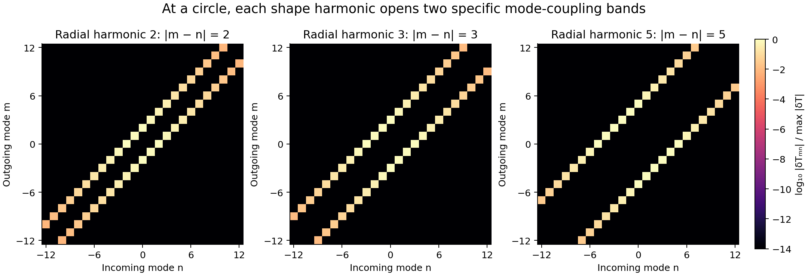
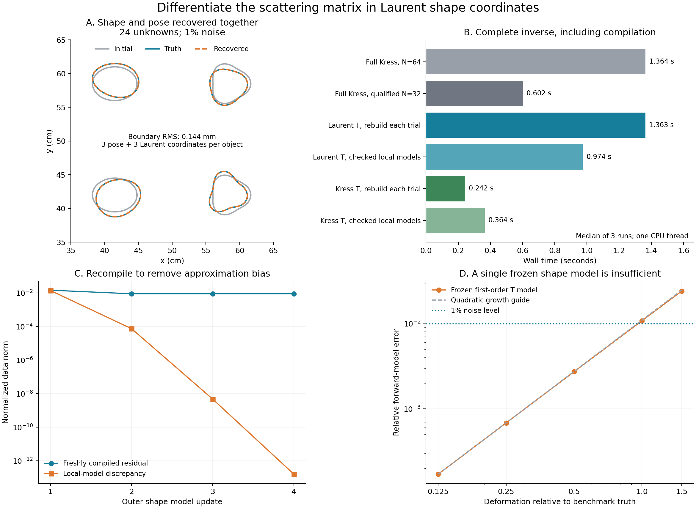

# Differentiate scattering matrices in Laurent shape coordinates

2026-09-16. Follow-up to [the reusable shape library](03_scattering_library.md).

The library now supports **continuous deformation as well as position and
orientation**. Each local object has a small scattering matrix `T` and a family
of derivative matrices `dT/dx_j`, where `x_j` changes a Laurent coefficient or
a specified coefficient combination. These derivatives are independent of
the acquisition and the other objects. They propagate through the complete
multiple-scattering solve.

The new inverse jointly estimates three pose and three shape coordinates per
object. Four interacting objects give 24 unknowns. Shape coordinates include
size, elongation/lobe amplitude, and an asymmetric complex Laurent coefficient;
this goes beyond selecting a fixed template from the previous library.

## Derivative without differentiating every boundary operator

For normalized incident regular wave `J_n/s_n`, let `u_n` denote its total local
boundary trace. Its Fourier coefficients are already available from compilation.
The shape derivative is

```text
δT_mn = (i/4) (−1)^m (ki² − ko²) ∫ u_−m u_n (δx · n) ds.
```

For Laurent geometry, the geometric weight is the finite polynomial
`Re(δz conjugate(−i z′))`; the integral selects the zero Fourier coefficient
of its product with the two traces. There is no conjugation of the physical
traces in this reciprocal bilinear identity. All shape directions reuse the
same local trace products. The native path samples no boundary points.

The cylindrical normalization is held **fixed across the shape family**.
Otherwise changing the radius used to normalize `T` would introduce artificial
shape derivatives into the translation and acquisition maps. The fixed radius
bound here comes from the entire allowed coefficient box; the actual geometric
bounding radius remains a separate convergence check.

With `G = I − T U`, outgoing state `β`, and local incident state `a + Uβ`,
the shape-only data derivative at fixed pose becomes

```text
δY = C G⁻¹ δT (a + Uβ).
```

The global LU and receiver transfer are reused. Rotation of both `T` and `δT`
still uses the phase `exp(i(n−m)α)`; Cartesian translation derivatives come
from cylindrical-wave ladder formulas.

The local formula is a **continuous shape identity evaluated with truncated
traces**, not an assertion that it exactly differentiates every truncated
compiler. The implementation retains an independent operator derivative

```text
δT = δP A⁻¹B + P A⁻¹(δB − δA A⁻¹B)
```

for qualification. On the ellipse with real and complex Laurent directions,
the two derivatives agree to `7.0e-15` relative error; centered full
recompilation agrees to approximately `7e-11`–`2e-10`. The nodal compiler's
derivative agrees to `1.8e-14` in that check.

## Shape harmonics have mode-coupling fingerprints



At a circle, a radial perturbation `δr = ε cos(kθ)` changes only entries with
`|m−n| = k` to first order. In Laurent coordinates that perturbation is the
pair `δz_(1+k) = δz_(1−k) = ε/2`. The implemented checks for harmonics 2, 3,
and 5 produce precisely those two matrix bands, to roundoff. The example
directions correspond to 1 mm radial amplitude per unit parameter.

This follows from Fourier selection of the reciprocal trace product; it is
not a new general theorem. It provides a concrete interpretation of deformation
as opening particular incoming-to-outgoing mode couplings. Away from the circle,
existing shape-induced mode mixing makes the derivative pattern richer.

## Full recompilation and checked local shape models

The exact-recompilation path updates each affected local shape/frequency matrix
at every trial, then solves the small coupled outgoing-wave system. Pose-only
changes reuse the local matrices. Changing just one object's shape recompiles
only that object's matrices, not the other components' local operators.

The alternative uses `T(x) ≈ T(x₀) + Σ (x_j−x₀_j) T_j` inside a local solve.
Pose and multiple scattering remain nonlinear within that model. Each proposed
outer update is checked with freshly compiled matrices; it is accepted only
when the actual loss decreases and agrees sufficiently with the predicted
reduction. Accepted shapes become the next expansion points. Convergence
requires a freshly compiled projected gradient below `1e-10`, not merely a
small surrogate residual. Inner fits use the same `1e-11` least-squares
tolerances as the full-recompilation controls.

A single frozen matrix derivative is insufficient. With truth pose held fixed,
scaling the deformation by 0.25, 0.5, and 1 gives relative forward errors of
0.0685%, 0.2728%, and 1.0809%, respectively. At 1.5 times the deformation,
error is 2.4068%. The quadratic growth is expected, but it is large enough to
bias an inverse. Clean four-object observations fitted with one frozen model
leave **0.268 mm boundary RMS error** and **0.970% held-out field error**.

## Complete inverse results



All **54 full/relinearized inverses reported convergence**. Median complete
inverse timings, including initial compilation and all subsequent rebuilds:

| Method | Two objects, clean | Four objects, clean | Four objects, 1% noise |
|---|---:|---:|---:|
| Full Kress, 64 nodes, reciprocal derivative | 0.234 s | 0.994 s | 1.364 s |
| Full Kress, qualified 32 nodes, reciprocal derivative | 0.104 s | 0.351 s | 0.602 s |
| Native Laurent T, recompile every trial | 0.527 s | 1.194 s | 1.363 s |
| Native Laurent T, checked local models | 0.353 s | 0.915 s | 0.974 s |
| Nodal-compiled T, recompile every trial | **0.089 s** | **0.215 s** | **0.242 s** |
| Nodal-compiled T, checked local models | 0.118 s | 0.376 s | 0.364 s |

Checked matrix reuse reduces the native shape-inverse cost by about 1.3–1.5×.
It is still slower than the accuracy-qualified nodal solver. With the much
cheaper nodal compiler, the extra inner optimization costs more than the saved
compilations in these fixtures; full local recompilation wins. That last path
is 2.5× faster than full 32-node Kress, or 5.6× faster than 64-node Kress, in
the noisy four-object case. The derivative and elimination mechanism transfers
between compilers; this does not establish an intrinsic Laurent speed advantage.

Optimizer trial counts also matter. In the noisy case, full Kress uses 11
forwards at 64 nodes and 14 at 32 nodes; both exact T paths use 9. The checked
local-model paths use 5 fresh scene evaluations, with additional cheap inner
trials. Native local compilations fall from 72 to 40 (four objects × two
frequencies per scene). All runs reach matching recovered coordinates; the
maximum coordinate difference from full 64-node Kress is below `2.5e-8` across
the reported arms and cases. These are dimensionless chart coordinates.

For four objects with 1% noise, the checked native recovery has:

| Metric | Result |
|---|---:|
| Corresponding-boundary-point RMS error | 0.1438 mm |
| Worst approximate sampled Hausdorff error | 0.1346 mm |
| Maximum center-coordinate error | 0.0536 mm |
| Maximum angle error | 0.4714° |
| Held-out relative field error | 0.3196% |

Boundary RMS includes tangential movement of corresponding points under
rotation, so it is not a closest-point distance. The single frozen-model
control has 0.3704 mm RMS and 1.1198% held-out field error on the same noisy
observations. Its fast runtime is not an equivalent recovery result.

In the checked native inverse, discrepancy between the local model and the
fresh forward falls over four accepted updates:
`1.40e-2 → 7.46e-5 → 4.73e-9 → 1.60e-13`. The final exact-check gradient
infinity norm is `5.57e-11`. Clean four-object native recoveries reach
approximately `5.9e-11` mm boundary RMS, a numerical-consistency result.

## Qualification and reproducibility

The independent oracle uses full coupled 256-node Kress, refined to 384 nodes
for data generation. Acquisition, lossless materials, frequencies, and pose
bounds follow the previous library experiment: 24 paired measurements at
0.5/1.25 GHz, relative permittivities 6/3, known component count and approximate
locations. Shape directions move the boundary by roughly 1–2 mm per unit
coordinate, with coordinate bounds ±1.5. A rotated acquisition at 0.875 GHz
is held out. Each noisy dataset has 1% complex noise per frequency.

Resolution was checked at the initial and deformed four-object scenes for
both implementations. Criteria were relative field error `<1e-9`, whole
Jacobian error `<1e-8`, and worst-column error `<1e-7`. The smallest passing
native setting was trace cutoff 16, coefficient half-bandwidth 32, and
cylindrical order 12. Its worst observed field/Jacobian errors were
`3.9e-12 / 3.2e-11`. Both full and locally compiled Kress passed with 32 nodes;
the usual 64-node full Kress control is also retained. The compiler still uses
28 Bessel terms.

All timings include compilation, shape derivatives, optimizer trials, and
fresh checks of local-model candidates. Resolution qualification, independent
observation generation, and final validation are excluded. Runs use one CPU
thread and three repeats with alternating arm order. The shape-model bounds
and tolerances are recorded in the code; there is no general global-convergence
or noise robustness claim from these small local recovery fixtures.

**30 experimental tests pass.** New checks cover the local T derivative versus
the differentiated compiler, centered recompilation, and independent nodal
traces; coupled shape/pose derivatives with complex sources and paired/full
acquisition; quadratic local-model error; prohibition of boundary sampling and
local-model reassembly; per-object cache reuse; circle deformation selection
rules; and a recovered shape validated by fresh compilation. Numerical sources
match the benchmark manifest. The scoped implementation remains experimental;
no production solver default was changed.

This retains the disjoint bounding-circle requirement and the native Laurent
log-series certificate. Evidence covers small, smooth deformations, known
component count, fixed lossless equal-permeability materials, and local initial
guesses. It does not establish arbitrary-topology recovery, close-contact
accuracy, or a general replacement for nodal Kress.

Implementation: [shape-matrix derivatives](../../../../experiments/modal_muller_research/deformable_scattering.py),
[inverse and nodal control](../../../../experiments/modal_muller_research/deformation_inverse.py),
[benchmark driver](../../../../experiments/modal_muller_research/run_deformation_inverse.py).

```bash
export OMP_NUM_THREADS=1 OPENBLAS_NUM_THREADS=1 MKL_NUM_THREADS=1
export PYTHONPATH=solvers:. MPLCONFIGDIR=/tmp/modal-matplotlib
/home/drdeng/miniconda3/envs/EMNerf/bin/python -m pytest -q experiments/modal_muller_research
/home/drdeng/miniconda3/envs/EMNerf/bin/python -m experiments.modal_muller_research.run_deformation_inverse
/home/drdeng/miniconda3/envs/EMNerf/bin/python -m experiments.modal_muller_research.plot_deformation_findings
```

Evidence: [resolution qualification](../../../../results/experiments/modal_muller_20260916/deformable_scattering/qualification.json),
[all inverse runs](../../../../results/experiments/modal_muller_20260916/deformable_scattering/summary.json),
[frozen-model range](../../../../results/experiments/modal_muller_20260916/deformable_scattering/frozen_range.json),
[shape-mode matrices](../../../../results/experiments/modal_muller_20260916/deformable_scattering/mode_fingerprints.json).
Aggregates and parameter agreement are in
[findings.json](../../../../results/experiments/modal_muller_20260916/deformable_scattering/findings.json).
Per-run files retain parameters, optimizer histories, true errors, and work
counts; the manifest records numerical source hashes and runtime settings.
