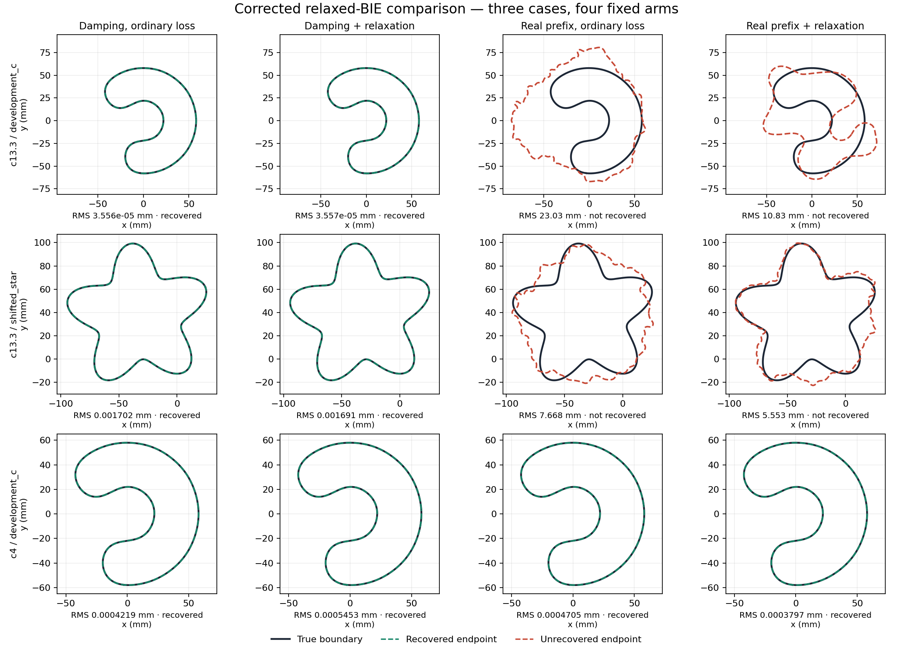

# FM-002: corrected relaxed gradient and controlled comparison

2026-10-03. Implemented and completed all **12/12** pre-registered runs after
the user requested the missing checks from the outsider review.

The corrected relaxed-BIE gradient passes qualification. Relaxation adds no
recoveries in this comparison: both damped arms recover **3/3**, and both
real-prefix arms recover **1/3**. Keep the ordinary damped pipeline as the
default. It is reasonable to close this particular relaxed-prefix variant
under the tested settings; this is not a general rejection of relaxed BIE.

## What was missing, and what changed

FM-001 computed the relaxed loss but froze its geometry-dependent receiver
weights when forming the optimization gradient. At its saved high-contrast
C warmup, that direction was almost opposite the complete gradient
(cosine **−0.9987266**). FM-001 also removed early damping when it introduced
relaxation, so its comparison could not isolate the two effects.

The maintained implementation now eliminates the auxiliary field, then
differentiates the complete discrete reduced loss. This includes the BIE
system, incident field, receiver rows, normals, quadrature and the
shape-dependent penalty. It composes the reverse derivative with the
existing complete projected-geometry tangent. The LM curvature matrix is
still the positive frozen-weight approximation; it is no longer used as
though it supplied the full loss gradient. Ordinary fitting is unchanged.
See the [derivation and assumptions](04_derivative.md).

This implementation is in `solvers/bem_inverse/`, with the experiment and
truth-based scoring in `experiments/cleaned_interface/fm002.py`. Relaxation
remains opt-in on `nodal_kress`; this is not a node-free or all-36 campaign.

## Fixed comparison

The [advance plan](03_plan.md), numerical sources and input hashes were
sealed before trajectories. No schedule was tuned after seeing outcomes.
All four arms ran on all three selected cases, including after failures.

| Arm | Early fitting frequencies | Early objective |
|---|---|---|
| D0 | Damped | Ordinary |
| D1 | Damped | Relaxed, corrected gradient |
| R0 | Real | Ordinary |
| R1 | Real | Relaxed, corrected gradient |

All arms share the qualified FM-001 24-source × 24-receiver catalogs,
prescribed starts, damped paired localization, frequency/band schedules,
iteration limits, numerical gates, N512/1024 resolution, 13,412 fit-unit cap,
and 1,800-second fit cap. The five relaxed penalties are 3, 3, 10, 30, 100.
Subsequent stages and final audits use the ordinary real-data objective.
Thus a real prefix does not mean damping-free localization. The case names
beginning `modal__` identify benchmark inputs, not the backend used here.

The opposite C start was omitted in advance because FM-001 localized it
to the same circle as the selected C start. It would not add an independent
shape trajectory.

## Recovery and endpoint shape

Recovery decisions agree under full observations and the unchanged paired
contract. RMS boundary errors below are in millimetres; the four failed
endpoints are marked **failed**.

| Case | D0 | D1 | R0 | R1 |
|---|---:|---:|---:|---:|
| C, contrast 13.3 | 0.00003556 | 0.00003557 | **23.032 failed** | **10.834 failed** |
| Shifted star, contrast 13.3 | 0.001702 | 0.001691 | **7.668 failed** | **5.553 failed** |
| C, contrast 4 | 0.0004219 | 0.0005453 | 0.0004705 | 0.0003797 |
| Recovered | **3/3** | **3/3** | **1/3** | **1/3** |

The corrected gradient makes a substantive difference to the failed
real-prefix trajectories. The high-contrast C warmup now accepts 13 steps,
reducing its relaxed loss from 0.0098271 to 0.0066046; the original FM-001
warmup accepted none. Compared with R0, R1 reduces the final C shape error
from 23.0 to 10.8 mm and the star error from 7.7 to 5.6 mm. Neither is a
recovery. Their maximum ordinary full-data relative residuals remain
approximately 1.05 and 0.95, respectively.

The three D0 controls exactly reproduce FM-001 F: final Fourier coefficients
are bit-identical, and stage stops, accepted-step counts, work units and
recovery outcomes match. This is also recorded in
[`comparison.json`](../../../../results/validation/cleaned_interfaces/FM-002/comparison.json).

## What stopped the failed runs

All four failures stopped when a trial candidate left the frozen
numerical-resolution regime. These are **numerical obstructions, not
convergence to wrong stationary points**.

| Case | Arm | First hard numerical stop |
|---|---|---|
| C, contrast 13.3 | R0 | `fixed_M49` |
| C, contrast 13.3 | R1 | `release_M11` |
| Shifted star, contrast 13.3 | R0 | `fixed_M49` |
| Shifted star, contrast 13.3 | R1 | `fixed_M49` |

All twelve final saved endpoints pass their numerical-resolution audit.
That certifies evaluation of the retained endpoint, not its recovery or
every rejected candidate. The four failed endpoints fail the recovery
contract. No trajectory ends at the global work or wall-time cap, although
both hard R1 cases use the 22-iteration limit in early stages 1–4.

## Cost

Recorded elapsed seconds include localization, fit, audits and scoring.

| Case | D0 | D1 | R0 | R1 |
|---|---:|---:|---:|---:|
| C, contrast 13.3 | 119.8 | 275.5 | 342.2 | 652.9 |
| Shifted star, contrast 13.3 | 320.8 | 442.2 | 364.4 | 839.0 |
| C, contrast 4 | 79.1 | 199.3 | 75.1 | 202.7 |
| Total seconds | 519.8 | 917.0 | 781.6 | 1694.6 |
| Total fit/localization units | 7,570 | 8,288 | 13,904 | 11,204 |

These are single diagnostic runs. Another NU-007a campaign overlapped on
the shared host, so they do not establish matched runtime ratios. The
corrected gradient adds one LU correction batch per frequency and a CPU
reverse-assembly pass, with extra solves charged to the ledger. Backend
receipts record 181 gradient calls / 393.9 seconds in D1 and 538 calls /
1,142.4 seconds in R1. Backend timings can overlap other work and are not
an additive wall-time decomposition. R1's lower summed unit count than R0
is partly explained by the earlier C numerical stop, not faster recovery.

## Qualification and evidence

- **477 tests passed**, with 15 recorded warnings. Coverage includes the
  maintained package, compatibility/dependency boundaries, cleaned
  interfaces, continuation, Kress and ordered-boundary components.
- The new derivative tests cover paired/full observations, real/damped
  frequencies, three penalties, noncircular geometry, frequency weighting,
  CPU/CUDA factor paths and the archived C descent regression.
- Four saved-state probes (C/star warmup and stage 4) pass complete-loss
  finite differences at steps 10⁻⁶ and 10⁻⁷ m. Worst absolute discrepancies
  are 5.02·10⁻⁷ and 5.91·10⁻⁹, within the declared mixed tolerances.
- Production/refined gradient agreement has worst relative discrepancy
  2.08·10⁻¹⁰. Primal reverse assemblies and auxiliary-field stationarity
  are checked by the implementation, including roundoff near exact fits.
- Source and input seals verify after all twelve runs. The final receipt
  hashes every saved run JSON, the qualification, summary and generated
  report. Original FM-001 results and failed evidence are preserved.

The complete bundle is
[`FM-002`](../../../../results/validation/cleaned_interfaces/FM-002/README.md),
including the [qualification](../../../../results/validation/cleaned_interfaces/FM-002/qualification.json),
[test log](../../../../results/validation/cleaned_interfaces/FM-002/qualification_tests.log),
[final verification](../../../../results/validation/cleaned_interfaces/FM-002/final_verification.json),
source archive, per-stage receipts, old-gradient review evidence and
development-fix record. Reporting scripts read saved runs only; their
input/output hashes are separate from the pre-run numerical seal.

## Conclusion

The two main fairness gaps are addressed: the optimizer now follows a
qualified complete gradient, and relaxation is varied independently of
early damping. Under this fixed comparison, damping determines whether
the two hard cases recover. Relaxation improves their real-prefix shapes
but supplies no additional recoveries and adds computation.

Close this tested variant without adopting it or expanding it to all 36
cases. Retain the corrected implementation and evidence for research.
The conclusion is limited to these three cases, one penalty schedule,
the retained curvature approximation and the fixed numerical/iteration
budgets. It does not settle other relaxation formulations or prove that
the failed real-prefix trajectories could never recover at finer resolution.
