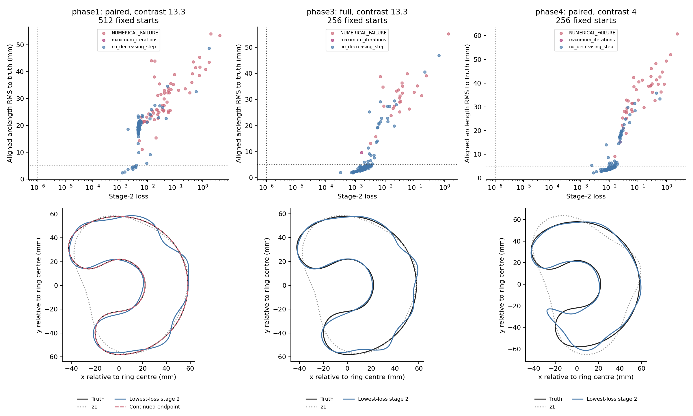

# FM-003: paired C recovered by the stage-2 census

Search failure supported: the lowest-loss paired stage-2 basin is near truth and its unchanged continuation recovers the C.

**G1 passed; G2 passed.** The loss-selected winner is start 289: stage-2 loss 0.00118292425, aligned arclength RMS 2.415 mm. Its unchanged CI-001 suffix completed and passed the final numerical audit.

| Frozen paired recovery measure | Original CI-001 | FM-003 continuation | Limit |
|---|---:|---:|---:|
| RMS (mm) | 6.39619 | 6.549439e-05 | 1 |
| Hausdorff upper bound (mm) | 19.28089 | 0.02990586 | 2 |
| Maximum relative residual | 1.145274 | 1.588915e-06 | 0.003 |
| Recovered | False | True | all gates |

**The census did not find a zero-loss stage-2 endpoint.** Paired high contrast has 0/512 endpoints below `1e-6` (one-sided exact 95% upper bound 0.5834% on that event). The result establishes that a nonzero-loss stage-2 endpoint selected without truth can lead to recovery. It does not establish the proposal's stronger zero-loss-basin premise.

## Registered census comparisons

Shares below use all completed starts as denominators. Brackets are Wilson 95% intervals in percent.

| Census | Lowest-loss cluster | Within 5 mm of truth | z1 cluster | Loss < 1e-6 |
|---|---|---|---|---|
| Paired, contrast 13.3 | 1/512 = 0.20% [0.03, 1.10] | 9/512 = 1.76% [0.93, 3.31] | 266/512 = 51.95% [47.63, 56.25] | 0/512 |
| Full matrix, contrast 13.3 | 1/256 = 0.39% [0.07, 2.18] | 200/256 = 78.12% [72.67, 82.75] | 56/256 = 21.88% [17.25, 27.33] | 0/256 |
| Paired, contrast 4 | 1/256 = 0.39% [0.07, 2.18] | 173/256 = 67.58% [61.62, 73.02] | 24/256 = 9.38% [6.38, 13.57] | 0/256 |

G3 point-estimate predictions: p(full) > p(paired): **True**; p(c4) > p(c13.3): **True**. All three minimum-loss clusters are singletons, so the factor-of-two point estimates reflect 512 versus 256 starts. They do not demonstrate the predicted difference in minimum-basin probability. The registered within-5-mm shares provide the clearer control separation.

The contrast-4 minimum-loss endpoint is 5.324 mm from truth, outside the 5 mm threshold despite most of that control's endpoints falling within it. Only the paired high-contrast winner was continued; a loss-based selection rule is not established for the other controls.

## Cost and numerical stops

| Census | Wall minutes | Charged stage work | Numerical refusals | Iteration-capped starts |
|---|---:|---:|---:|---|
| phase1 | 63.16 | 56100 | 63 | [259, 499] |
| phase3 | 35.95 | 33550 | 25 | [79] |
| phase4 | 45.06 | 43998 | 41 | [7] |

Phase 1 wall time excludes its reused Phase 0 start-0 fit (4.848 s); charged census work includes that fit once. The continuation and final audit took 154.568 s and 2469 work units. Including the registered historical prefix (162 units, 15.5 s), the paired census, and reused start 0 gives 58731 units and 66.07 minutes. Lifting, replay qualification, controls and report generation are separate experiment overhead.

For the paired high-contrast census, cost per observed minimum-cluster hit is 56100 units and 63.24 minutes (one hit). Cost per within-5-mm endpoint is 6233 units and 7.03 minutes (nine hits). These are empirical event-cost ratios, not validated recovery-cost guarantees. With no zero-loss hits, there is no finite empirical cost estimate for that proposed basin.

The `200` iteration limit was retained even where reached. Those endpoints are reported as capped; numerically refused endpoints are also retained and separately labelled. No censuses were extended or start seeds changed in response to results.

The nine near-truth paired endpoints do not provide nine demonstrated recoveries. Only the lowest-loss winner was continued. The fixed 512-start census is the demonstrated selection cost; a cheaper stopping/selection rule has not been tested.

## Validation, provenance and scope

Phase L passed the disk, unitarity, symmetry and node-doubling gates. Only 0.25 GHz at order 2 passed the registered usable-lift rule. The ambiguous higher-order lift errors differ from the sandbox reference; the gate outcomes and usable-lift classification agree. Phase 0 reproduced CI-001 bit for bit, including four accepted steps and its exact endpoint/loss. One- and four-frequency-thread executions matched exactly. The campaign/package checks passed 21 tests, and the suffix-entry adapter passed its separate test. All three census receipt audits passed.

The suffix-entry correction is documented in [iteration 20](../iteration_20/05_suffix_entry.md): stage 3 is entered directly, with historical original-start qualification carried as provenance and an actual final audit. The original implementation archive remains intact; the suffix has a separate seal/archive.

This is a noiseless synthetic damped-data result for the contrast-13.3 development C. It does not establish uniqueness, exhaustive global optimization, performance on noisy/real data, or recovery of other shapes. Production defaults and all prior campaign sources/results are unchanged. Other research work was active on the shared branch/host; wall times are observed costs, not a controlled runtime comparison. Independent reviewer remains unassigned.

Reproduce using the sealed sources and the commands in [the execution notes](../iteration_20/04_execution.md), substituting `python -m experiments.cleaned_interface.fm003_suffix` for Phase 2. The final figures and synthesis are generated by `python -m experiments.cleaned_interface.fm003_review plots` and `finalize`.

Machine-readable evidence: [synthesis](../../../../results/validation/cleaned_interfaces/FM-003/synthesis.json), [paired census](../../../../results/validation/cleaned_interfaces/FM-003/phase1/summary.json), [continuation](../../../../results/validation/cleaned_interfaces/FM-003/phase2/result.json), [full control](../../../../results/validation/cleaned_interfaces/FM-003/phase3/summary.json), [contrast-4 control](../../../../results/validation/cleaned_interfaces/FM-003/phase4/summary.json).

## Detailed frozen-run tables

Frozen plan: [iteration 20](../iteration_20/03_plan.md). Existing `feature/shape-frequency-continuation` branch; production policy unchanged.

Baseline `b43fa04c2e27b6b1f7fd05eba153436f4f2e7cc0`. One worker, four frequency threads, auto device; single-threaded BLAS.

Phase L gates: **PASS**. Usable lifts: `[{'frequency_hz': 250000000.0, 'N': 2}]`.

| GHz | N | Full truncation floor | Paired residual | Full lift error | Ambiguity | Linear error |
|---|---|---|---|---|---|---|
| 0.25 | 2 | 0.00344 | 0.001371 | 0.006125 | 1.332e-08 | 0.9543 |
| 0.25 | 3 | 0.0001735 | 3.239e-06 | 0.8892 | 2.719 | 0.9804 |
| 0.25 | 4 | 1.797e-05 | 8.65e-09 | 1.757 | 3.093 | 0.998 |
| 0.5 | 2 | 0.2162 | 0.06975 | 1.317 | 1.952e-07 | 0.9823 |
| 0.5 | 3 | 0.02537 | 0.01371 | 1.114 | 1.934 | 0.9604 |
| 0.5 | 4 | 0.0008897 | 7.148e-05 | 1.777 | 2.861 | 0.9729 |
| 0.75 | 2 | 0.3711 | 0.3026 | 0.7244 | 1.608e-07 | 0.9763 |
| 0.75 | 3 | 0.07111 | 0.0522 | 0.9372 | 1.278 | 0.9581 |
| 0.75 | 4 | 0.05531 | 0.0126 | 1.051 | 2.029 | 0.9743 |

Phase 0 strict replay: **PASS**. Checks: `{'accepted_steps': True, 'stop': True, 'loss': True, 'identical_coefficients': True}`. Loss relative difference 0; maximum coefficient difference 0.

## phase1: modal__c13.3__development_c, paired

512/512 starts; 3789.6 s; 56100 units; capped: False. Stop reasons: `{'no_decreasing_step': 447, 'NUMERICAL_FAILURE': 63, 'maximum_iterations': 2}`.

| Event | Hits / n | Share | Wilson 95% interval |
|---|---|---|---|
| lowest_cluster | 1/512 | 0.001953 | [0.0003449, 0.01098] |
| within_5mm | 9/512 | 0.01758 | [0.009275, 0.03307] |
| zero_loss | 0/512 | 0 | [0, 0.007447] |
| z1_cluster | 266/512 | 0.5195 | [0.4763, 0.5625] |

| Cluster | Size | Loss | Representative | Truth distance (mm) | Stops |
|---|---|---|---|---|---|
| 0 | 1 | 0.00118292425 | 289 | 2.4153 | `{'no_decreasing_step': 1}` |
| 1 | 1 | 0.0014791569 | 82 | 2.6979 | `{'no_decreasing_step': 1}` |
| 2 | 1 | 0.00190725923 | 399 | 18.588 | `{'no_decreasing_step': 1}` |
| 3 | 1 | 0.00193725415 | 142 | 3.6659 | `{'no_decreasing_step': 1}` |
| 4 | 1 | 0.00270789226 | 139 | 4.2341 | `{'no_decreasing_step': 1}` |
| 5 | 1 | 0.00275457792 | 431 | 4.5327 | `{'no_decreasing_step': 1}` |
| 6 | 1 | 0.00288773942 | 30 | 3.6743 | `{'no_decreasing_step': 1}` |
| 7 | 1 | 0.00318074195 | 383 | 4.6225 | `{'no_decreasing_step': 1}` |
| 8 | 1 | 0.00348034017 | 443 | 4.695 | `{'no_decreasing_step': 1}` |
| 9 | 1 | 0.00369271678 | 262 | 4.3188 | `{'no_decreasing_step': 1}` |
| 10 | 1 | 0.00383471876 | 479 | 5.2197 | `{'no_decreasing_step': 1}` |
| 11 | 1 | 0.00437762589 | 155 | 19.335 | `{'no_decreasing_step': 1}` |
| 12 | 1 | 0.00440893726 | 323 | 18.347 | `{'no_decreasing_step': 1}` |
| 13 | 1 | 0.00443176509 | 225 | 17.6 | `{'no_decreasing_step': 1}` |
| 14 | 1 | 0.00443589079 | 485 | 18.83 | `{'no_decreasing_step': 1}` |
| 15 | 1 | 0.00444786333 | 186 | 17.705 | `{'no_decreasing_step': 1}` |
| 16 | 1 | 0.00445164567 | 477 | 18.461 | `{'no_decreasing_step': 1}` |
| 17 | 1 | 0.00445227605 | 278 | 18.27 | `{'no_decreasing_step': 1}` |
| 18 | 1 | 0.00445631138 | 451 | 17.287 | `{'no_decreasing_step': 1}` |
| 19 | 1 | 0.00447056203 | 213 | 18.802 | `{'no_decreasing_step': 1}` |
| 20 | 1 | 0.00447409329 | 444 | 18.668 | `{'no_decreasing_step': 1}` |
| 21 | 1 | 0.00447972317 | 366 | 23.582 | `{'no_decreasing_step': 1}` |
| 22 | 1 | 0.00448906236 | 333 | 17.777 | `{'no_decreasing_step': 1}` |
| 23 | 1 | 0.00449039812 | 317 | 19.123 | `{'no_decreasing_step': 1}` |
| 24 | 1 | 0.00449087619 | 458 | 16.992 | `{'no_decreasing_step': 1}` |
| 25 | 1 | 0.00449122057 | 358 | 17.271 | `{'no_decreasing_step': 1}` |
| 26 | 1 | 0.0044960853 | 70 | 18.571 | `{'no_decreasing_step': 1}` |
| 27 | 1 | 0.00449901509 | 110 | 19.259 | `{'no_decreasing_step': 1}` |
| 28 | 1 | 0.0044996681 | 90 | 17.201 | `{'no_decreasing_step': 1}` |
| 29 | 1 | 0.0045011777 | 207 | 18.733 | `{'no_decreasing_step': 1}` |
| 30 | 1 | 0.00450261711 | 166 | 13.195 | `{'no_decreasing_step': 1}` |
| 31 | 1 | 0.00450359145 | 195 | 19.414 | `{'no_decreasing_step': 1}` |
| 32 | 1 | 0.00450855341 | 438 | 17.267 | `{'no_decreasing_step': 1}` |
| 33 | 2 | 0.00451197602 | 265 | 17.954 | `{'no_decreasing_step': 2}` |
| 34 | 1 | 0.00451401316 | 390 | 19.085 | `{'no_decreasing_step': 1}` |
| 35 | 1 | 0.004518165 | 460 | 18.945 | `{'no_decreasing_step': 1}` |
| 36 | 1 | 0.00452040133 | 258 | 18.017 | `{'no_decreasing_step': 1}` |
| 37 | 1 | 0.00452061763 | 125 | 19.064 | `{'no_decreasing_step': 1}` |
| 38 | 1 | 0.00452076641 | 382 | 18.894 | `{'no_decreasing_step': 1}` |
| 39 | 266 | 0.00452090165 | 194 | 18.913 | `{'no_decreasing_step': 266}` |
| 40 | 1 | 0.00452374543 | 391 | 18.821 | `{'no_decreasing_step': 1}` |
| 41 | 1 | 0.00452520052 | 405 | 20.946 | `{'no_decreasing_step': 1}` |
| 42 | 1 | 0.00452850198 | 198 | 19.099 | `{'no_decreasing_step': 1}` |
| 43 | 1 | 0.00452891476 | 10 | 17.368 | `{'no_decreasing_step': 1}` |
| 44 | 1 | 0.00452920541 | 251 | 19.412 | `{'no_decreasing_step': 1}` |
| 45 | 1 | 0.00452977875 | 406 | 19.477 | `{'no_decreasing_step': 1}` |
| 46 | 1 | 0.00453136727 | 445 | 18.981 | `{'no_decreasing_step': 1}` |
| 47 | 1 | 0.00453183946 | 355 | 18.051 | `{'no_decreasing_step': 1}` |
| 48 | 1 | 0.00453248967 | 66 | 18.015 | `{'no_decreasing_step': 1}` |
| 49 | 1 | 0.00453552289 | 459 | 18.217 | `{'no_decreasing_step': 1}` |
| 50 | 1 | 0.00453646772 | 425 | 15.782 | `{'no_decreasing_step': 1}` |
| 51 | 1 | 0.00453892603 | 190 | 19.267 | `{'no_decreasing_step': 1}` |
| 52 | 1 | 0.00454016957 | 156 | 19.153 | `{'no_decreasing_step': 1}` |
| 53 | 1 | 0.00454070622 | 347 | 18.859 | `{'no_decreasing_step': 1}` |
| 54 | 1 | 0.00454684895 | 483 | 18.316 | `{'no_decreasing_step': 1}` |
| 55 | 1 | 0.00454848419 | 121 | 18.277 | `{'no_decreasing_step': 1}` |
| 56 | 1 | 0.00455048462 | 221 | 19.173 | `{'no_decreasing_step': 1}` |
| 57 | 1 | 0.00455230803 | 122 | 17.676 | `{'no_decreasing_step': 1}` |
| 58 | 1 | 0.00455872422 | 158 | 17.176 | `{'no_decreasing_step': 1}` |
| 59 | 1 | 0.00456296035 | 50 | 18.66 | `{'no_decreasing_step': 1}` |
| 60 | 1 | 0.00456451379 | 46 | 18.006 | `{'no_decreasing_step': 1}` |
| 61 | 1 | 0.00456608521 | 334 | 18.651 | `{'no_decreasing_step': 1}` |
| 62 | 1 | 0.00457013023 | 157 | 18.136 | `{'no_decreasing_step': 1}` |
| 63 | 1 | 0.00457557789 | 501 | 19.592 | `{'no_decreasing_step': 1}` |
| 64 | 1 | 0.00457645226 | 62 | 19.035 | `{'no_decreasing_step': 1}` |
| 65 | 1 | 0.00458003248 | 509 | 19.309 | `{'no_decreasing_step': 1}` |
| 66 | 1 | 0.00458185377 | 219 | 17.35 | `{'no_decreasing_step': 1}` |
| 67 | 1 | 0.00458287677 | 75 | 17.179 | `{'no_decreasing_step': 1}` |
| 68 | 1 | 0.00458485803 | 282 | 19.374 | `{'no_decreasing_step': 1}` |
| 69 | 1 | 0.00458793358 | 117 | 19.449 | `{'no_decreasing_step': 1}` |
| 70 | 1 | 0.00459265084 | 55 | 18.981 | `{'no_decreasing_step': 1}` |
| 71 | 1 | 0.00459378878 | 118 | 17.17 | `{'no_decreasing_step': 1}` |
| 72 | 1 | 0.00459448256 | 313 | 16.645 | `{'no_decreasing_step': 1}` |
| 73 | 1 | 0.00459535397 | 379 | 19.861 | `{'no_decreasing_step': 1}` |
| 74 | 1 | 0.00459645942 | 339 | 19.488 | `{'no_decreasing_step': 1}` |
| 75 | 1 | 0.0045985767 | 434 | 18.89 | `{'no_decreasing_step': 1}` |
| 76 | 1 | 0.0046000947 | 273 | 17.909 | `{'no_decreasing_step': 1}` |
| 77 | 1 | 0.00460075258 | 179 | 19.69 | `{'no_decreasing_step': 1}` |
| 78 | 1 | 0.00460198301 | 205 | 22.964 | `{'no_decreasing_step': 1}` |
| 79 | 1 | 0.00460298651 | 222 | 20.489 | `{'no_decreasing_step': 1}` |
| 80 | 1 | 0.00460324725 | 453 | 19.51 | `{'no_decreasing_step': 1}` |
| 81 | 1 | 0.00461081029 | 134 | 19.324 | `{'no_decreasing_step': 1}` |
| 82 | 1 | 0.00461109494 | 7 | 20.293 | `{'no_decreasing_step': 1}` |
| 83 | 1 | 0.00461239203 | 310 | 18.76 | `{'no_decreasing_step': 1}` |
| 84 | 1 | 0.00461520669 | 231 | 19.889 | `{'no_decreasing_step': 1}` |
| 85 | 1 | 0.00461574021 | 69 | 19.984 | `{'no_decreasing_step': 1}` |
| 86 | 1 | 0.00461850824 | 146 | 16.887 | `{'no_decreasing_step': 1}` |
| 87 | 1 | 0.00462451887 | 381 | 19.79 | `{'no_decreasing_step': 1}` |
| 88 | 1 | 0.00462986376 | 135 | 19.446 | `{'no_decreasing_step': 1}` |
| 89 | 1 | 0.00463031686 | 6 | 19.732 | `{'no_decreasing_step': 1}` |
| 90 | 1 | 0.00463388498 | 83 | 19.544 | `{'no_decreasing_step': 1}` |
| 91 | 1 | 0.00463963498 | 93 | 19.673 | `{'no_decreasing_step': 1}` |
| 92 | 1 | 0.004641826 | 474 | 19.126 | `{'no_decreasing_step': 1}` |
| 93 | 1 | 0.00464420175 | 54 | 19.694 | `{'no_decreasing_step': 1}` |
| 94 | 1 | 0.004644344 | 446 | 9.8566 | `{'no_decreasing_step': 1}` |
| 95 | 1 | 0.00464492465 | 162 | 18.347 | `{'no_decreasing_step': 1}` |
| 96 | 1 | 0.00464709322 | 286 | 19.894 | `{'no_decreasing_step': 1}` |
| 97 | 1 | 0.00465145425 | 266 | 19.566 | `{'no_decreasing_step': 1}` |
| 98 | 1 | 0.00465341214 | 422 | 20.005 | `{'no_decreasing_step': 1}` |
| 99 | 1 | 0.0046539297 | 187 | 19.314 | `{'no_decreasing_step': 1}` |
| 100 | 1 | 0.0046574521 | 302 | 19.833 | `{'no_decreasing_step': 1}` |
| 101 | 1 | 0.00465900257 | 103 | 20.561 | `{'no_decreasing_step': 1}` |
| 102 | 1 | 0.00465968179 | 17 | 18.964 | `{'no_decreasing_step': 1}` |
| 103 | 2 | 0.00466255821 | 316 | 20.032 | `{'no_decreasing_step': 2}` |
| 104 | 1 | 0.00466770095 | 407 | 20.298 | `{'no_decreasing_step': 1}` |
| 105 | 1 | 0.00466794034 | 419 | 20.446 | `{'no_decreasing_step': 1}` |
| 106 | 1 | 0.00466902132 | 373 | 18.99 | `{'no_decreasing_step': 1}` |
| 107 | 1 | 0.00468254477 | 182 | 19.794 | `{'no_decreasing_step': 1}` |
| 108 | 1 | 0.00468360212 | 370 | 19.836 | `{'no_decreasing_step': 1}` |
| 109 | 1 | 0.00468745165 | 261 | 19.967 | `{'no_decreasing_step': 1}` |
| 110 | 1 | 0.00469017926 | 242 | 19.986 | `{'no_decreasing_step': 1}` |
| 111 | 1 | 0.00469110369 | 450 | 19.831 | `{'no_decreasing_step': 1}` |
| 112 | 1 | 0.00470051958 | 290 | 19.89 | `{'no_decreasing_step': 1}` |
| 113 | 2 | 0.00470086703 | 437 | 20.321 | `{'no_decreasing_step': 2}` |
| 114 | 1 | 0.00470698111 | 130 | 19.975 | `{'no_decreasing_step': 1}` |
| 115 | 1 | 0.00471117067 | 178 | 20.378 | `{'no_decreasing_step': 1}` |
| 116 | 1 | 0.00471538448 | 301 | 19.101 | `{'no_decreasing_step': 1}` |
| 117 | 1 | 0.00472483962 | 461 | 20.156 | `{'no_decreasing_step': 1}` |
| 118 | 1 | 0.00473389086 | 78 | 19.753 | `{'no_decreasing_step': 1}` |
| 119 | 1 | 0.00474451355 | 167 | 20.503 | `{'no_decreasing_step': 1}` |
| 120 | 1 | 0.00474553668 | 123 | 18.376 | `{'no_decreasing_step': 1}` |
| 121 | 1 | 0.00474634564 | 402 | 19.332 | `{'no_decreasing_step': 1}` |
| 122 | 1 | 0.00474738389 | 230 | 20.097 | `{'no_decreasing_step': 1}` |
| 123 | 1 | 0.0047483973 | 455 | 20.863 | `{'no_decreasing_step': 1}` |
| 124 | 1 | 0.00475597733 | 486 | 19.796 | `{'no_decreasing_step': 1}` |
| 125 | 1 | 0.00475604105 | 430 | 19.459 | `{'no_decreasing_step': 1}` |
| 126 | 1 | 0.00476015132 | 270 | 20.73 | `{'no_decreasing_step': 1}` |
| 127 | 1 | 0.00476698101 | 98 | 20.405 | `{'no_decreasing_step': 1}` |
| 128 | 1 | 0.00478126217 | 447 | 20.715 | `{'no_decreasing_step': 1}` |
| 129 | 1 | 0.00478485268 | 206 | 19.096 | `{'no_decreasing_step': 1}` |
| 130 | 1 | 0.0047878412 | 375 | 20.394 | `{'no_decreasing_step': 1}` |
| 131 | 1 | 0.00479705623 | 114 | 20.461 | `{'no_decreasing_step': 1}` |
| 132 | 1 | 0.00480938362 | 111 | 20.337 | `{'no_decreasing_step': 1}` |
| 133 | 1 | 0.00481419874 | 189 | 20.101 | `{'no_decreasing_step': 1}` |
| 134 | 1 | 0.00481805256 | 218 | 20.527 | `{'no_decreasing_step': 1}` |
| 135 | 1 | 0.00482474936 | 259 | 20.275 | `{'maximum_iterations': 1}` |
| 136 | 1 | 0.00482779548 | 271 | 21.518 | `{'no_decreasing_step': 1}` |
| 137 | 1 | 0.00484373586 | 349 | 19.85 | `{'no_decreasing_step': 1}` |
| 138 | 1 | 0.00484762191 | 411 | 20.127 | `{'no_decreasing_step': 1}` |
| 139 | 1 | 0.00485818892 | 246 | 21.195 | `{'no_decreasing_step': 1}` |
| 140 | 1 | 0.00487535603 | 15 | 20.48 | `{'no_decreasing_step': 1}` |
| 141 | 1 | 0.00489580035 | 363 | 21.277 | `{'no_decreasing_step': 1}` |
| 142 | 1 | 0.00490959317 | 318 | 20.439 | `{'no_decreasing_step': 1}` |
| 143 | 1 | 0.00492002264 | 503 | 21.016 | `{'no_decreasing_step': 1}` |
| 144 | 1 | 0.00492240936 | 395 | 20.068 | `{'no_decreasing_step': 1}` |
| 145 | 1 | 0.00492572513 | 151 | 20.892 | `{'no_decreasing_step': 1}` |
| 146 | 1 | 0.00493336641 | 214 | 18.773 | `{'no_decreasing_step': 1}` |
| 147 | 1 | 0.00493674407 | 350 | 14.361 | `{'NUMERICAL_FAILURE': 1}` |
| 148 | 1 | 0.00493768812 | 11 | 20.769 | `{'no_decreasing_step': 1}` |
| 149 | 1 | 0.00493910812 | 499 | 21.488 | `{'maximum_iterations': 1}` |
| 150 | 1 | 0.00494025403 | 463 | 19.804 | `{'NUMERICAL_FAILURE': 1}` |
| 151 | 1 | 0.00495849903 | 107 | 20.878 | `{'no_decreasing_step': 1}` |
| 152 | 1 | 0.00495987426 | 250 | 21.372 | `{'no_decreasing_step': 1}` |
| 153 | 1 | 0.00498377795 | 279 | 21.071 | `{'no_decreasing_step': 1}` |
| 154 | 1 | 0.00500594623 | 467 | 19.211 | `{'no_decreasing_step': 1}` |
| 155 | 1 | 0.00501167162 | 287 | 20.175 | `{'no_decreasing_step': 1}` |
| 156 | 1 | 0.00501827124 | 418 | 20.757 | `{'no_decreasing_step': 1}` |
| 157 | 1 | 0.00503116086 | 174 | 20.583 | `{'NUMERICAL_FAILURE': 1}` |
| 158 | 1 | 0.00507996541 | 171 | 20.296 | `{'no_decreasing_step': 1}` |
| 159 | 1 | 0.00512292711 | 478 | 18.541 | `{'no_decreasing_step': 1}` |
| 160 | 1 | 0.00521461521 | 126 | 20.381 | `{'no_decreasing_step': 1}` |
| 161 | 1 | 0.00526184202 | 211 | 21.859 | `{'no_decreasing_step': 1}` |
| 162 | 1 | 0.00527283992 | 199 | 20.162 | `{'no_decreasing_step': 1}` |
| 163 | 1 | 0.00528293176 | 330 | 20.145 | `{'no_decreasing_step': 1}` |
| 164 | 1 | 0.00534913253 | 371 | 21.096 | `{'no_decreasing_step': 1}` |
| 165 | 1 | 0.00546531454 | 462 | 20.988 | `{'no_decreasing_step': 1}` |
| 166 | 1 | 0.0055238421 | 163 | 21.641 | `{'no_decreasing_step': 1}` |
| 167 | 1 | 0.00580184557 | 79 | 23.137 | `{'NUMERICAL_FAILURE': 1}` |
| 168 | 1 | 0.006034439 | 495 | 21.119 | `{'no_decreasing_step': 1}` |
| 169 | 1 | 0.00631274485 | 326 | 23.756 | `{'no_decreasing_step': 1}` |
| 170 | 1 | 0.00632341082 | 299 | 11.138 | `{'NUMERICAL_FAILURE': 1}` |
| 171 | 1 | 0.00639959827 | 435 | 21.004 | `{'NUMERICAL_FAILURE': 1}` |
| 172 | 1 | 0.00648733283 | 14 | 21.628 | `{'NUMERICAL_FAILURE': 1}` |
| 173 | 1 | 0.00656352633 | 91 | 23.226 | `{'no_decreasing_step': 1}` |
| 174 | 1 | 0.00743528846 | 374 | 21.431 | `{'NUMERICAL_FAILURE': 1}` |
| 175 | 1 | 0.00789982449 | 502 | 21.559 | `{'NUMERICAL_FAILURE': 1}` |
| 176 | 1 | 0.00917845719 | 143 | 23.119 | `{'NUMERICAL_FAILURE': 1}` |
| 177 | 1 | 0.00931199613 | 291 | 5.9125 | `{'no_decreasing_step': 1}` |
| 178 | 1 | 0.00950448592 | 359 | 21.132 | `{'no_decreasing_step': 1}` |
| 179 | 1 | 0.00965863161 | 303 | 21.452 | `{'NUMERICAL_FAILURE': 1}` |
| 180 | 1 | 0.0109531438 | 415 | 24.294 | `{'NUMERICAL_FAILURE': 1}` |
| 181 | 1 | 0.0121259422 | 507 | 22.46 | `{'no_decreasing_step': 1}` |
| 182 | 1 | 0.0123797963 | 331 | 9.1497 | `{'no_decreasing_step': 1}` |
| 183 | 1 | 0.0124508776 | 38 | 24.103 | `{'no_decreasing_step': 1}` |
| 184 | 1 | 0.0128973204 | 175 | 23.622 | `{'NUMERICAL_FAILURE': 1}` |
| 185 | 1 | 0.0134346398 | 346 | 25.953 | `{'no_decreasing_step': 1}` |
| 186 | 1 | 0.0136769308 | 403 | 44.083 | `{'NUMERICAL_FAILURE': 1}` |
| 187 | 1 | 0.0137855605 | 267 | 23.569 | `{'NUMERICAL_FAILURE': 1}` |
| 188 | 1 | 0.0148141757 | 294 | 25.425 | `{'NUMERICAL_FAILURE': 1}` |
| 189 | 1 | 0.0165730532 | 191 | 24.612 | `{'NUMERICAL_FAILURE': 1}` |
| 190 | 1 | 0.017248365 | 127 | 38.021 | `{'NUMERICAL_FAILURE': 1}` |
| 191 | 1 | 0.0174552734 | 327 | 22.119 | `{'NUMERICAL_FAILURE': 1}` |
| 192 | 1 | 0.0180407453 | 23 | 27.498 | `{'no_decreasing_step': 1}` |
| 193 | 1 | 0.0181714861 | 351 | 43.94 | `{'NUMERICAL_FAILURE': 1}` |
| 194 | 1 | 0.0201516302 | 295 | 15.368 | `{'NUMERICAL_FAILURE': 1}` |
| 195 | 1 | 0.0210211233 | 367 | 25.953 | `{'NUMERICAL_FAILURE': 1}` |
| 196 | 1 | 0.022986029 | 243 | 31.203 | `{'NUMERICAL_FAILURE': 1}` |
| 197 | 1 | 0.0232268098 | 487 | 24.042 | `{'NUMERICAL_FAILURE': 1}` |
| 198 | 1 | 0.0232605918 | 235 | 25.604 | `{'NUMERICAL_FAILURE': 1}` |
| 199 | 1 | 0.0235222315 | 3 | 22.725 | `{'NUMERICAL_FAILURE': 1}` |
| 200 | 1 | 0.0251297377 | 307 | 22.904 | `{'no_decreasing_step': 1}` |
| 201 | 1 | 0.0256137772 | 283 | 24.98 | `{'NUMERICAL_FAILURE': 1}` |
| 202 | 1 | 0.0269339239 | 159 | 35.488 | `{'NUMERICAL_FAILURE': 1}` |
| 203 | 1 | 0.0276058895 | 275 | 27.291 | `{'no_decreasing_step': 1}` |
| 204 | 1 | 0.0302522355 | 471 | 31.56 | `{'NUMERICAL_FAILURE': 1}` |
| 205 | 1 | 0.0331013723 | 115 | 25.92 | `{'NUMERICAL_FAILURE': 1}` |
| 206 | 1 | 0.0346233394 | 47 | 27.55 | `{'NUMERICAL_FAILURE': 1}` |
| 207 | 1 | 0.0348535064 | 427 | 26.773 | `{'no_decreasing_step': 1}` |
| 208 | 1 | 0.0375446691 | 387 | 25.382 | `{'NUMERICAL_FAILURE': 1}` |
| 209 | 1 | 0.0388468196 | 51 | 25.644 | `{'NUMERICAL_FAILURE': 1}` |
| 210 | 1 | 0.0391532728 | 311 | 27.425 | `{'NUMERICAL_FAILURE': 1}` |
| 211 | 1 | 0.0391923186 | 255 | 29.859 | `{'NUMERICAL_FAILURE': 1}` |
| 212 | 1 | 0.040237768 | 43 | 32.03 | `{'NUMERICAL_FAILURE': 1}` |
| 213 | 1 | 0.0408594664 | 239 | 33.032 | `{'NUMERICAL_FAILURE': 1}` |
| 214 | 1 | 0.0465909387 | 315 | 22.576 | `{'no_decreasing_step': 1}` |
| 215 | 1 | 0.0504217518 | 87 | 28.727 | `{'NUMERICAL_FAILURE': 1}` |
| 216 | 1 | 0.0529836131 | 414 | 34.583 | `{'no_decreasing_step': 1}` |
| 217 | 1 | 0.0544548688 | 63 | 32.139 | `{'NUMERICAL_FAILURE': 1}` |
| 218 | 1 | 0.0548779727 | 247 | 33.947 | `{'NUMERICAL_FAILURE': 1}` |
| 219 | 1 | 0.0559701862 | 439 | 25.368 | `{'NUMERICAL_FAILURE': 1}` |
| 220 | 1 | 0.0570310947 | 27 | 24.826 | `{'NUMERICAL_FAILURE': 1}` |
| 221 | 1 | 0.0586554209 | 35 | 33.014 | `{'NUMERICAL_FAILURE': 1}` |
| 222 | 1 | 0.0603613204 | 202 | 32.125 | `{'NUMERICAL_FAILURE': 1}` |
| 223 | 1 | 0.0659117624 | 343 | 25.628 | `{'NUMERICAL_FAILURE': 1}` |
| 224 | 1 | 0.0679784986 | 223 | 35.606 | `{'NUMERICAL_FAILURE': 1}` |
| 225 | 1 | 0.0702463719 | 319 | 33.298 | `{'NUMERICAL_FAILURE': 1}` |
| 226 | 1 | 0.0857211013 | 131 | 35.256 | `{'NUMERICAL_FAILURE': 1}` |
| 227 | 1 | 0.0937833772 | 263 | 38.865 | `{'NUMERICAL_FAILURE': 1}` |
| 228 | 1 | 0.132682774 | 59 | 33.117 | `{'NUMERICAL_FAILURE': 1}` |
| 229 | 1 | 0.231361384 | 31 | 33.6 | `{'NUMERICAL_FAILURE': 1}` |
| 230 | 1 | 0.339082227 | 227 | 32.159 | `{'NUMERICAL_FAILURE': 1}` |
| 231 | 1 | 0.402642005 | 183 | 36.045 | `{'NUMERICAL_FAILURE': 1}` |
| 232 | 1 | 0.423506927 | 335 | 39.257 | `{'NUMERICAL_FAILURE': 1}` |
| 233 | 1 | 0.452926872 | 39 | 43.628 | `{'NUMERICAL_FAILURE': 1}` |
| 234 | 1 | 0.548052118 | 19 | 41.459 | `{'NUMERICAL_FAILURE': 1}` |
| 235 | 1 | 0.579759635 | 99 | 32.58 | `{'no_decreasing_step': 1}` |
| 236 | 1 | 0.760063007 | 423 | 38.612 | `{'NUMERICAL_FAILURE': 1}` |
| 237 | 1 | 0.778370683 | 71 | 45.39 | `{'NUMERICAL_FAILURE': 1}` |
| 238 | 1 | 0.793916699 | 511 | 41.664 | `{'NUMERICAL_FAILURE': 1}` |
| 239 | 1 | 1.2812914 | 95 | 40.844 | `{'NUMERICAL_FAILURE': 1}` |
| 240 | 1 | 1.70722638 | 475 | 43.541 | `{'NUMERICAL_FAILURE': 1}` |
| 241 | 1 | 1.73466742 | 119 | 48.684 | `{'no_decreasing_step': 1}` |
| 242 | 1 | 1.96937412 | 215 | 54.04 | `{'NUMERICAL_FAILURE': 1}` |
| 243 | 1 | 4.14886046 | 147 | 53.399 | `{'NUMERICAL_FAILURE': 1}` |

## phase3: modal__c13.3__development_c, full

256/256 starts; 2157.2 s; 33550 units; capped: False. Stop reasons: `{'no_decreasing_step': 230, 'NUMERICAL_FAILURE': 25, 'maximum_iterations': 1}`.

| Event | Hits / n | Share | Wilson 95% interval |
|---|---|---|---|
| lowest_cluster | 1/256 | 0.003906 | [0.0006899, 0.02179] |
| within_5mm | 200/256 | 0.7812 | [0.7267, 0.8275] |
| zero_loss | 0/256 | 0 | [0, 0.01478] |
| z1_cluster | 56/256 | 0.2188 | [0.1725, 0.2733] |

| Cluster | Size | Loss | Representative | Truth distance (mm) | Stops |
|---|---|---|---|---|---|
| 0 | 1 | 0.000307878626 | 225 | 1.9548 | `{'no_decreasing_step': 1}` |
| 1 | 1 | 0.000719752876 | 75 | 2.0296 | `{'no_decreasing_step': 1}` |
| 2 | 1 | 0.000770283835 | 10 | 2.1903 | `{'no_decreasing_step': 1}` |
| 3 | 1 | 0.000815788102 | 121 | 1.9157 | `{'no_decreasing_step': 1}` |
| 4 | 1 | 0.000843238406 | 158 | 2.3044 | `{'no_decreasing_step': 1}` |
| 5 | 1 | 0.000858348304 | 25 | 2.0923 | `{'no_decreasing_step': 1}` |
| 6 | 1 | 0.00086117135 | 203 | 2.2792 | `{'no_decreasing_step': 1}` |
| 7 | 1 | 0.000864366211 | 177 | 2.1176 | `{'no_decreasing_step': 1}` |
| 8 | 1 | 0.00103349139 | 122 | 2.3766 | `{'no_decreasing_step': 1}` |
| 9 | 1 | 0.00105322438 | 118 | 2.399 | `{'no_decreasing_step': 1}` |
| 10 | 1 | 0.00106558446 | 16 | 2.4539 | `{'no_decreasing_step': 1}` |
| 11 | 1 | 0.00106668493 | 185 | 2.2823 | `{'no_decreasing_step': 1}` |
| 12 | 1 | 0.00107993175 | 66 | 2.3112 | `{'no_decreasing_step': 1}` |
| 13 | 1 | 0.00113009779 | 90 | 2.5787 | `{'no_decreasing_step': 1}` |
| 14 | 1 | 0.00117622586 | 82 | 3.465 | `{'no_decreasing_step': 1}` |
| 15 | 3 | 0.00118666793 | 29 | 2.7823 | `{'no_decreasing_step': 3}` |
| 16 | 1 | 0.00120410121 | 210 | 2.7231 | `{'no_decreasing_step': 1}` |
| 17 | 2 | 0.00124844121 | 233 | 2.7768 | `{'no_decreasing_step': 2}` |
| 18 | 1 | 0.00126116905 | 135 | 2.7238 | `{'no_decreasing_step': 1}` |
| 19 | 1 | 0.00128630411 | 65 | 2.838 | `{'no_decreasing_step': 1}` |
| 20 | 1 | 0.00131006197 | 12 | 2.8673 | `{'no_decreasing_step': 1}` |
| 21 | 2 | 0.0013400516 | 232 | 2.905 | `{'no_decreasing_step': 2}` |
| 22 | 1 | 0.00134109035 | 30 | 4.1505 | `{'no_decreasing_step': 1}` |
| 23 | 4 | 0.00137521813 | 180 | 3.0185 | `{'no_decreasing_step': 4}` |
| 24 | 1 | 0.00139098079 | 70 | 2.8543 | `{'no_decreasing_step': 1}` |
| 25 | 1 | 0.00140228057 | 97 | 3.0657 | `{'no_decreasing_step': 1}` |
| 26 | 1 | 0.00141000535 | 22 | 2.6041 | `{'no_decreasing_step': 1}` |
| 27 | 1 | 0.00141319124 | 142 | 4.5239 | `{'no_decreasing_step': 1}` |
| 28 | 1 | 0.00141842239 | 46 | 2.9038 | `{'no_decreasing_step': 1}` |
| 29 | 1 | 0.00142318517 | 85 | 2.884 | `{'no_decreasing_step': 1}` |
| 30 | 1 | 0.00142751535 | 18 | 2.8864 | `{'no_decreasing_step': 1}` |
| 31 | 1 | 0.00143931684 | 102 | 2.9409 | `{'no_decreasing_step': 1}` |
| 32 | 2 | 0.0014464882 | 72 | 3.1307 | `{'no_decreasing_step': 2}` |
| 33 | 1 | 0.00146390813 | 38 | 4.1944 | `{'no_decreasing_step': 1}` |
| 34 | 1 | 0.00147966699 | 36 | 2.8603 | `{'no_decreasing_step': 1}` |
| 35 | 1 | 0.00149112512 | 50 | 3.4058 | `{'no_decreasing_step': 1}` |
| 36 | 1 | 0.00149404872 | 140 | 2.8479 | `{'no_decreasing_step': 1}` |
| 37 | 11 | 0.00149924433 | 56 | 3.1359 | `{'no_decreasing_step': 11}` |
| 38 | 1 | 0.00155280357 | 32 | 3.0961 | `{'no_decreasing_step': 1}` |
| 39 | 1 | 0.00155913061 | 207 | 2.8698 | `{'no_decreasing_step': 1}` |
| 40 | 1 | 0.00156076419 | 213 | 2.7531 | `{'no_decreasing_step': 1}` |
| 41 | 1 | 0.00157701338 | 79 | 9.6123 | `{'maximum_iterations': 1}` |
| 42 | 1 | 0.00158375299 | 61 | 3.0765 | `{'no_decreasing_step': 1}` |
| 43 | 1 | 0.00159053512 | 139 | 3.7938 | `{'no_decreasing_step': 1}` |
| 44 | 1 | 0.00159322449 | 198 | 2.9127 | `{'no_decreasing_step': 1}` |
| 45 | 1 | 0.00159808077 | 186 | 3.8088 | `{'no_decreasing_step': 1}` |
| 46 | 1 | 0.0016147751 | 194 | 2.8197 | `{'no_decreasing_step': 1}` |
| 47 | 56 | 0.00162586249 | 28 | 3.0722 | `{'no_decreasing_step': 56}` |
| 48 | 1 | 0.00165820389 | 17 | 3.922 | `{'no_decreasing_step': 1}` |
| 49 | 1 | 0.00167596046 | 117 | 3.1255 | `{'no_decreasing_step': 1}` |
| 50 | 1 | 0.00169156872 | 21 | 2.889 | `{'no_decreasing_step': 1}` |
| 51 | 1 | 0.0017087763 | 26 | 3.3411 | `{'no_decreasing_step': 1}` |
| 52 | 1 | 0.00173154804 | 226 | 3.031 | `{'no_decreasing_step': 1}` |
| 53 | 1 | 0.00177157631 | 62 | 3.4433 | `{'no_decreasing_step': 1}` |
| 54 | 2 | 0.0017808604 | 116 | 3.154 | `{'no_decreasing_step': 2}` |
| 55 | 1 | 0.00178492831 | 165 | 3.1283 | `{'no_decreasing_step': 1}` |
| 56 | 1 | 0.00179075908 | 251 | 3.9032 | `{'no_decreasing_step': 1}` |
| 57 | 1 | 0.00180093768 | 214 | 3.4136 | `{'no_decreasing_step': 1}` |
| 58 | 1 | 0.00182763064 | 106 | 3.3913 | `{'no_decreasing_step': 1}` |
| 59 | 1 | 0.00183959444 | 100 | 3.2593 | `{'no_decreasing_step': 1}` |
| 60 | 1 | 0.00184648628 | 195 | 4.1696 | `{'no_decreasing_step': 1}` |
| 61 | 1 | 0.00184822338 | 196 | 3.1072 | `{'no_decreasing_step': 1}` |
| 62 | 1 | 0.00184956237 | 134 | 3.7755 | `{'no_decreasing_step': 1}` |
| 63 | 1 | 0.00187207687 | 110 | 3.7571 | `{'no_decreasing_step': 1}` |
| 64 | 1 | 0.00187217206 | 133 | 3.3451 | `{'no_decreasing_step': 1}` |
| 65 | 1 | 0.00188520437 | 245 | 3.3075 | `{'no_decreasing_step': 1}` |
| 66 | 1 | 0.00189116856 | 9 | 3.4363 | `{'no_decreasing_step': 1}` |
| 67 | 1 | 0.00189560434 | 187 | 3.2695 | `{'no_decreasing_step': 1}` |
| 68 | 1 | 0.00192842045 | 8 | 3.4935 | `{'no_decreasing_step': 1}` |
| 69 | 1 | 0.00193078967 | 20 | 3.2415 | `{'no_decreasing_step': 1}` |
| 70 | 1 | 0.00194470711 | 202 | 6.0267 | `{'no_decreasing_step': 1}` |
| 71 | 1 | 0.00194700227 | 6 | 3.7337 | `{'no_decreasing_step': 1}` |
| 72 | 3 | 0.00195522077 | 76 | 3.424 | `{'no_decreasing_step': 3}` |
| 73 | 1 | 0.0019566514 | 55 | 3.5186 | `{'no_decreasing_step': 1}` |
| 74 | 1 | 0.00195889731 | 125 | 3.8715 | `{'no_decreasing_step': 1}` |
| 75 | 1 | 0.00196595417 | 231 | 3.4404 | `{'no_decreasing_step': 1}` |
| 76 | 1 | 0.00197721999 | 149 | 3.3835 | `{'no_decreasing_step': 1}` |
| 77 | 1 | 0.00203221835 | 162 | 4.578 | `{'no_decreasing_step': 1}` |
| 78 | 1 | 0.0020397887 | 83 | 3.5507 | `{'no_decreasing_step': 1}` |
| 79 | 1 | 0.00204309462 | 209 | 3.5505 | `{'no_decreasing_step': 1}` |
| 80 | 1 | 0.00205277803 | 53 | 3.2209 | `{'no_decreasing_step': 1}` |
| 81 | 1 | 0.00206481679 | 156 | 3.3084 | `{'no_decreasing_step': 1}` |
| 82 | 1 | 0.00206604577 | 173 | 4.0512 | `{'no_decreasing_step': 1}` |
| 83 | 1 | 0.00207809434 | 220 | 3.5206 | `{'no_decreasing_step': 1}` |
| 84 | 1 | 0.00208325492 | 230 | 4.5368 | `{'no_decreasing_step': 1}` |
| 85 | 1 | 0.0020934935 | 179 | 3.4846 | `{'no_decreasing_step': 1}` |
| 86 | 1 | 0.00209456109 | 54 | 3.4464 | `{'no_decreasing_step': 1}` |
| 87 | 1 | 0.00213952484 | 178 | 3.9695 | `{'no_decreasing_step': 1}` |
| 88 | 1 | 0.00215396751 | 157 | 4.4451 | `{'no_decreasing_step': 1}` |
| 89 | 1 | 0.00218200349 | 172 | 3.714 | `{'no_decreasing_step': 1}` |
| 90 | 1 | 0.00219383124 | 190 | 4.0958 | `{'no_decreasing_step': 1}` |
| 91 | 1 | 0.00219650029 | 138 | 3.7846 | `{'no_decreasing_step': 1}` |
| 92 | 1 | 0.0021989505 | 78 | 3.3347 | `{'no_decreasing_step': 1}` |
| 93 | 2 | 0.00219970276 | 109 | 3.6707 | `{'no_decreasing_step': 2}` |
| 94 | 1 | 0.00220253416 | 206 | 3.5174 | `{'no_decreasing_step': 1}` |
| 95 | 1 | 0.00220913268 | 252 | 4.0347 | `{'no_decreasing_step': 1}` |
| 96 | 1 | 0.00221706947 | 94 | 4.1618 | `{'no_decreasing_step': 1}` |
| 97 | 1 | 0.00222537136 | 253 | 3.9503 | `{'no_decreasing_step': 1}` |
| 98 | 1 | 0.00226179568 | 221 | 4.5713 | `{'no_decreasing_step': 1}` |
| 99 | 1 | 0.00227573816 | 242 | 4.1964 | `{'no_decreasing_step': 1}` |
| 100 | 1 | 0.00227670016 | 182 | 4.1809 | `{'no_decreasing_step': 1}` |
| 101 | 1 | 0.00230401707 | 68 | 4.4102 | `{'no_decreasing_step': 1}` |
| 102 | 1 | 0.00231068057 | 200 | 3.7429 | `{'no_decreasing_step': 1}` |
| 103 | 2 | 0.00233316033 | 2 | 3.812 | `{'no_decreasing_step': 2}` |
| 104 | 1 | 0.00234535897 | 67 | 3.9276 | `{'no_decreasing_step': 1}` |
| 105 | 1 | 0.00237791162 | 219 | 5.0905 | `{'no_decreasing_step': 1}` |
| 106 | 1 | 0.002418992 | 42 | 3.7767 | `{'no_decreasing_step': 1}` |
| 107 | 1 | 0.00246200234 | 34 | 4.2206 | `{'no_decreasing_step': 1}` |
| 108 | 1 | 0.00249872056 | 155 | 4.7441 | `{'no_decreasing_step': 1}` |
| 109 | 1 | 0.00255748892 | 74 | 4.3365 | `{'no_decreasing_step': 1}` |
| 110 | 1 | 0.00257570518 | 98 | 4.1957 | `{'no_decreasing_step': 1}` |
| 111 | 1 | 0.00258546772 | 161 | 4.0676 | `{'no_decreasing_step': 1}` |
| 112 | 1 | 0.0026011498 | 146 | 6.2959 | `{'no_decreasing_step': 1}` |
| 113 | 1 | 0.00260642744 | 7 | 3.9694 | `{'no_decreasing_step': 1}` |
| 114 | 1 | 0.00261936145 | 212 | 4.4337 | `{'no_decreasing_step': 1}` |
| 115 | 1 | 0.00265882148 | 93 | 4.3475 | `{'no_decreasing_step': 1}` |
| 116 | 1 | 0.00267282721 | 250 | 11.436 | `{'no_decreasing_step': 1}` |
| 117 | 1 | 0.00276655281 | 111 | 3.6535 | `{'no_decreasing_step': 1}` |
| 118 | 1 | 0.00277939133 | 151 | 5.1375 | `{'no_decreasing_step': 1}` |
| 119 | 1 | 0.00280370063 | 189 | 4.3049 | `{'no_decreasing_step': 1}` |
| 120 | 1 | 0.00288041603 | 77 | 4.3114 | `{'no_decreasing_step': 1}` |
| 121 | 1 | 0.00291334636 | 205 | 25.27 | `{'no_decreasing_step': 1}` |
| 122 | 1 | 0.00292582624 | 199 | 9.1946 | `{'no_decreasing_step': 1}` |
| 123 | 1 | 0.00308305122 | 15 | 4.8326 | `{'no_decreasing_step': 1}` |
| 124 | 1 | 0.00312404856 | 126 | 4.4663 | `{'no_decreasing_step': 1}` |
| 125 | 1 | 0.00313429033 | 217 | 4.7574 | `{'no_decreasing_step': 1}` |
| 126 | 1 | 0.00314139932 | 218 | 4.5806 | `{'no_decreasing_step': 1}` |
| 127 | 1 | 0.00314757136 | 246 | 6.5413 | `{'no_decreasing_step': 1}` |
| 128 | 1 | 0.0031674491 | 107 | 13.186 | `{'NUMERICAL_FAILURE': 1}` |
| 129 | 1 | 0.0032622628 | 69 | 4.2253 | `{'no_decreasing_step': 1}` |
| 130 | 1 | 0.00328036834 | 222 | 8.6758 | `{'no_decreasing_step': 1}` |
| 131 | 1 | 0.00337396678 | 103 | 4.9153 | `{'no_decreasing_step': 1}` |
| 132 | 1 | 0.00345521067 | 114 | 4.7932 | `{'no_decreasing_step': 1}` |
| 133 | 1 | 0.00361952647 | 123 | 5.3305 | `{'no_decreasing_step': 1}` |
| 134 | 1 | 0.00415136671 | 91 | 8.602 | `{'no_decreasing_step': 1}` |
| 135 | 1 | 0.00422883243 | 130 | 7.7055 | `{'no_decreasing_step': 1}` |
| 136 | 1 | 0.00480510513 | 166 | 15.77 | `{'NUMERICAL_FAILURE': 1}` |
| 137 | 1 | 0.00496959329 | 167 | 13.602 | `{'no_decreasing_step': 1}` |
| 138 | 1 | 0.00533502656 | 3 | 14.047 | `{'no_decreasing_step': 1}` |
| 139 | 1 | 0.00535879661 | 174 | 19.147 | `{'no_decreasing_step': 1}` |
| 140 | 1 | 0.00562360417 | 171 | 19.331 | `{'no_decreasing_step': 1}` |
| 141 | 1 | 0.00602327807 | 14 | 20.618 | `{'no_decreasing_step': 1}` |
| 142 | 1 | 0.0060969237 | 163 | 20.97 | `{'no_decreasing_step': 1}` |
| 143 | 1 | 0.00678341122 | 159 | 29.163 | `{'no_decreasing_step': 1}` |
| 144 | 1 | 0.00681512211 | 127 | 38.812 | `{'NUMERICAL_FAILURE': 1}` |
| 145 | 1 | 0.00690417529 | 175 | 21.559 | `{'no_decreasing_step': 1}` |
| 146 | 1 | 0.00739557697 | 143 | 22.813 | `{'no_decreasing_step': 1}` |
| 147 | 1 | 0.00830308743 | 243 | 34.803 | `{'NUMERICAL_FAILURE': 1}` |
| 148 | 1 | 0.00900580446 | 235 | 27.447 | `{'NUMERICAL_FAILURE': 1}` |
| 149 | 1 | 0.0118389009 | 23 | 27.428 | `{'no_decreasing_step': 1}` |
| 150 | 1 | 0.0119052359 | 191 | 22.858 | `{'no_decreasing_step': 1}` |
| 151 | 1 | 0.012199766 | 211 | 21.527 | `{'no_decreasing_step': 1}` |
| 152 | 1 | 0.0140802125 | 255 | 27.422 | `{'no_decreasing_step': 1}` |
| 153 | 1 | 0.0154765838 | 115 | 23.795 | `{'NUMERICAL_FAILURE': 1}` |
| 154 | 1 | 0.018121475 | 27 | 26.658 | `{'NUMERICAL_FAILURE': 1}` |
| 155 | 1 | 0.0198377597 | 87 | 27.465 | `{'NUMERICAL_FAILURE': 1}` |
| 156 | 1 | 0.020080777 | 11 | 19.827 | `{'no_decreasing_step': 1}` |
| 157 | 1 | 0.0205825917 | 35 | 29.449 | `{'no_decreasing_step': 1}` |
| 158 | 1 | 0.0235322112 | 95 | 28.064 | `{'no_decreasing_step': 1}` |
| 159 | 1 | 0.0238682142 | 239 | 33.239 | `{'NUMERICAL_FAILURE': 1}` |
| 160 | 1 | 0.0276329897 | 247 | 33.747 | `{'NUMERICAL_FAILURE': 1}` |
| 161 | 1 | 0.0302427263 | 47 | 29.025 | `{'NUMERICAL_FAILURE': 1}` |
| 162 | 1 | 0.0303708554 | 63 | 30.613 | `{'NUMERICAL_FAILURE': 1}` |
| 163 | 1 | 0.0307349985 | 51 | 25.232 | `{'NUMERICAL_FAILURE': 1}` |
| 164 | 1 | 0.0312264334 | 31 | 31.369 | `{'NUMERICAL_FAILURE': 1}` |
| 165 | 1 | 0.0325781785 | 59 | 29.315 | `{'NUMERICAL_FAILURE': 1}` |
| 166 | 1 | 0.0364957486 | 223 | 36.337 | `{'NUMERICAL_FAILURE': 1}` |
| 167 | 1 | 0.0373966449 | 43 | 32.502 | `{'NUMERICAL_FAILURE': 1}` |
| 168 | 1 | 0.0384237765 | 131 | 35.184 | `{'NUMERICAL_FAILURE': 1}` |
| 169 | 1 | 0.0547302376 | 71 | 39.902 | `{'NUMERICAL_FAILURE': 1}` |
| 170 | 1 | 0.0642297655 | 99 | 26.356 | `{'NUMERICAL_FAILURE': 1}` |
| 171 | 1 | 0.0940909587 | 147 | 32.821 | `{'NUMERICAL_FAILURE': 1}` |
| 172 | 1 | 0.11851835 | 183 | 35.251 | `{'NUMERICAL_FAILURE': 1}` |
| 173 | 1 | 0.165601325 | 227 | 31.436 | `{'NUMERICAL_FAILURE': 1}` |
| 174 | 1 | 0.214149684 | 39 | 40.623 | `{'no_decreasing_step': 1}` |
| 175 | 1 | 0.237829958 | 19 | 39.128 | `{'NUMERICAL_FAILURE': 1}` |
| 176 | 1 | 0.644664828 | 119 | 46.911 | `{'no_decreasing_step': 1}` |
| 177 | 1 | 1.32295294 | 215 | 55.199 | `{'NUMERICAL_FAILURE': 1}` |

## phase4: modal__c4__development_c, paired

256/256 starts; 2703.8 s; 43998 units; capped: False. Stop reasons: `{'no_decreasing_step': 214, 'maximum_iterations': 1, 'NUMERICAL_FAILURE': 41}`.

| Event | Hits / n | Share | Wilson 95% interval |
|---|---|---|---|
| lowest_cluster | 1/256 | 0.003906 | [0.0006899, 0.02179] |
| within_5mm | 173/256 | 0.6758 | [0.6162, 0.7302] |
| zero_loss | 0/256 | 0 | [0, 0.01478] |
| z1_cluster | 24/256 | 0.09375 | [0.06381, 0.1357] |

| Cluster | Size | Loss | Representative | Truth distance (mm) | Stops |
|---|---|---|---|---|---|
| 0 | 1 | 0.00242816995 | 166 | 5.3235 | `{'no_decreasing_step': 1}` |
| 1 | 1 | 0.00275311648 | 10 | 2.2299 | `{'no_decreasing_step': 1}` |
| 2 | 1 | 0.00346921717 | 75 | 2.7075 | `{'no_decreasing_step': 1}` |
| 3 | 1 | 0.00488442916 | 225 | 3.7084 | `{'no_decreasing_step': 1}` |
| 4 | 1 | 0.00499875684 | 203 | 2.801 | `{'no_decreasing_step': 1}` |
| 5 | 1 | 0.00533638742 | 122 | 2.8731 | `{'no_decreasing_step': 1}` |
| 6 | 1 | 0.00539772373 | 158 | 2.9372 | `{'no_decreasing_step': 1}` |
| 7 | 1 | 0.00585462932 | 30 | 3.6359 | `{'no_decreasing_step': 1}` |
| 8 | 1 | 0.00635384632 | 50 | 3.3578 | `{'no_decreasing_step': 1}` |
| 9 | 1 | 0.00686944922 | 46 | 3.5619 | `{'no_decreasing_step': 1}` |
| 10 | 1 | 0.00688083602 | 207 | 3.1454 | `{'no_decreasing_step': 1}` |
| 11 | 1 | 0.00704483527 | 170 | 3.2791 | `{'no_decreasing_step': 1}` |
| 12 | 1 | 0.0072293378 | 58 | 3.2394 | `{'no_decreasing_step': 1}` |
| 13 | 1 | 0.00735018561 | 25 | 3.6578 | `{'no_decreasing_step': 1}` |
| 14 | 1 | 0.00751117536 | 210 | 3.3866 | `{'no_decreasing_step': 1}` |
| 15 | 1 | 0.00752594206 | 194 | 3.3983 | `{'no_decreasing_step': 1}` |
| 16 | 1 | 0.00753254365 | 70 | 3.2057 | `{'no_decreasing_step': 1}` |
| 17 | 1 | 0.00764618197 | 242 | 13.989 | `{'no_decreasing_step': 1}` |
| 18 | 1 | 0.00777591596 | 65 | 3.3403 | `{'no_decreasing_step': 1}` |
| 19 | 1 | 0.00780048484 | 117 | 3.5671 | `{'no_decreasing_step': 1}` |
| 20 | 1 | 0.00807482949 | 185 | 3.4215 | `{'no_decreasing_step': 1}` |
| 21 | 1 | 0.00824952815 | 18 | 3.4224 | `{'no_decreasing_step': 1}` |
| 22 | 1 | 0.00827063906 | 118 | 3.5714 | `{'no_decreasing_step': 1}` |
| 23 | 1 | 0.00828827116 | 54 | 3.4387 | `{'no_decreasing_step': 1}` |
| 24 | 1 | 0.00874413282 | 177 | 3.6681 | `{'no_decreasing_step': 1}` |
| 25 | 1 | 0.00880854581 | 16 | 3.5928 | `{'no_decreasing_step': 1}` |
| 26 | 1 | 0.00893227065 | 61 | 3.5072 | `{'no_decreasing_step': 1}` |
| 27 | 1 | 0.00898425569 | 250 | 8.6271 | `{'no_decreasing_step': 1}` |
| 28 | 1 | 0.00899906606 | 221 | 4.4454 | `{'no_decreasing_step': 1}` |
| 29 | 1 | 0.00901760714 | 145 | 3.6804 | `{'no_decreasing_step': 1}` |
| 30 | 1 | 0.00903789899 | 29 | 3.6607 | `{'no_decreasing_step': 1}` |
| 31 | 1 | 0.00911053248 | 173 | 3.5313 | `{'no_decreasing_step': 1}` |
| 32 | 1 | 0.00930223337 | 66 | 3.7381 | `{'no_decreasing_step': 1}` |
| 33 | 1 | 0.00930949759 | 94 | 3.6647 | `{'no_decreasing_step': 1}` |
| 34 | 1 | 0.00935054847 | 77 | 4.2899 | `{'no_decreasing_step': 1}` |
| 35 | 1 | 0.00938452873 | 254 | 3.7222 | `{'no_decreasing_step': 1}` |
| 36 | 1 | 0.00940585168 | 121 | 3.9983 | `{'no_decreasing_step': 1}` |
| 37 | 9 | 0.00943535268 | 224 | 3.6862 | `{'no_decreasing_step': 9}` |
| 38 | 1 | 0.00946365877 | 141 | 3.6267 | `{'no_decreasing_step': 1}` |
| 39 | 1 | 0.00963793842 | 235 | 5.5953 | `{'no_decreasing_step': 1}` |
| 40 | 1 | 0.0096641476 | 226 | 3.6186 | `{'no_decreasing_step': 1}` |
| 41 | 1 | 0.00977396734 | 124 | 3.7087 | `{'no_decreasing_step': 1}` |
| 42 | 4 | 0.00978873095 | 32 | 3.6715 | `{'no_decreasing_step': 4}` |
| 43 | 1 | 0.00987418106 | 69 | 3.7121 | `{'no_decreasing_step': 1}` |
| 44 | 1 | 0.00989816272 | 204 | 3.6797 | `{'no_decreasing_step': 1}` |
| 45 | 1 | 0.0099087348 | 212 | 3.6817 | `{'no_decreasing_step': 1}` |
| 46 | 1 | 0.00992005967 | 134 | 3.726 | `{'no_decreasing_step': 1}` |
| 47 | 1 | 0.0101240914 | 202 | 3.7239 | `{'no_decreasing_step': 1}` |
| 48 | 2 | 0.0101430097 | 236 | 3.7563 | `{'no_decreasing_step': 2}` |
| 49 | 2 | 0.0101517765 | 140 | 3.8268 | `{'no_decreasing_step': 2}` |
| 50 | 1 | 0.0102239332 | 205 | 6.2958 | `{'no_decreasing_step': 1}` |
| 51 | 1 | 0.0102424258 | 90 | 4.1833 | `{'no_decreasing_step': 1}` |
| 52 | 1 | 0.010275945 | 244 | 3.7993 | `{'no_decreasing_step': 1}` |
| 53 | 1 | 0.010345907 | 37 | 4.0898 | `{'no_decreasing_step': 1}` |
| 54 | 1 | 0.0103501697 | 198 | 4.0372 | `{'no_decreasing_step': 1}` |
| 55 | 7 | 0.0103594839 | 132 | 3.8713 | `{'no_decreasing_step': 7}` |
| 56 | 1 | 0.0103888909 | 82 | 3.8978 | `{'no_decreasing_step': 1}` |
| 57 | 1 | 0.01040068 | 17 | 4.1525 | `{'no_decreasing_step': 1}` |
| 58 | 1 | 0.0104593446 | 164 | 3.7689 | `{'no_decreasing_step': 1}` |
| 59 | 1 | 0.010495326 | 165 | 3.8573 | `{'no_decreasing_step': 1}` |
| 60 | 1 | 0.0105910172 | 62 | 4.4239 | `{'no_decreasing_step': 1}` |
| 61 | 1 | 0.0106661254 | 133 | 3.8544 | `{'no_decreasing_step': 1}` |
| 62 | 1 | 0.0107139136 | 4 | 3.7946 | `{'no_decreasing_step': 1}` |
| 63 | 1 | 0.0107159944 | 85 | 4.1029 | `{'no_decreasing_step': 1}` |
| 64 | 1 | 0.0107209753 | 178 | 4.9558 | `{'no_decreasing_step': 1}` |
| 65 | 1 | 0.0107212118 | 101 | 3.9862 | `{'no_decreasing_step': 1}` |
| 66 | 1 | 0.0107369611 | 125 | 3.809 | `{'no_decreasing_step': 1}` |
| 67 | 24 | 0.0108512695 | 80 | 3.8856 | `{'no_decreasing_step': 24}` |
| 68 | 1 | 0.0108985576 | 231 | 4.0116 | `{'no_decreasing_step': 1}` |
| 69 | 1 | 0.0109652655 | 41 | 3.9054 | `{'no_decreasing_step': 1}` |
| 70 | 1 | 0.0109937686 | 36 | 3.9671 | `{'no_decreasing_step': 1}` |
| 71 | 1 | 0.0111048092 | 148 | 3.9075 | `{'no_decreasing_step': 1}` |
| 72 | 1 | 0.0111203852 | 22 | 4.0915 | `{'no_decreasing_step': 1}` |
| 73 | 1 | 0.0111789358 | 108 | 3.863 | `{'no_decreasing_step': 1}` |
| 74 | 1 | 0.0111808763 | 86 | 3.9753 | `{'no_decreasing_step': 1}` |
| 75 | 1 | 0.0112174718 | 196 | 4.0007 | `{'no_decreasing_step': 1}` |
| 76 | 1 | 0.0112260937 | 2 | 3.8755 | `{'no_decreasing_step': 1}` |
| 77 | 1 | 0.0112370356 | 97 | 4.1616 | `{'no_decreasing_step': 1}` |
| 78 | 1 | 0.0112478671 | 110 | 3.9786 | `{'no_decreasing_step': 1}` |
| 79 | 1 | 0.0113189756 | 228 | 4.0408 | `{'no_decreasing_step': 1}` |
| 80 | 1 | 0.0113369238 | 68 | 4 | `{'no_decreasing_step': 1}` |
| 81 | 1 | 0.0114905716 | 52 | 4.2799 | `{'no_decreasing_step': 1}` |
| 82 | 1 | 0.0115517773 | 45 | 3.9287 | `{'no_decreasing_step': 1}` |
| 83 | 15 | 0.0115747435 | 241 | 3.9984 | `{'no_decreasing_step': 15}` |
| 84 | 1 | 0.0116249191 | 217 | 3.9896 | `{'no_decreasing_step': 1}` |
| 85 | 1 | 0.0116694328 | 100 | 4.0345 | `{'no_decreasing_step': 1}` |
| 86 | 1 | 0.0117349347 | 6 | 4.146 | `{'no_decreasing_step': 1}` |
| 87 | 1 | 0.0117778805 | 139 | 6.3373 | `{'no_decreasing_step': 1}` |
| 88 | 1 | 0.0117985255 | 187 | 4.2888 | `{'no_decreasing_step': 1}` |
| 89 | 1 | 0.0119743233 | 116 | 4.3494 | `{'no_decreasing_step': 1}` |
| 90 | 1 | 0.0120396637 | 213 | 4.3769 | `{'no_decreasing_step': 1}` |
| 91 | 1 | 0.0121778086 | 102 | 4.4988 | `{'no_decreasing_step': 1}` |
| 92 | 1 | 0.0121984632 | 26 | 4.4472 | `{'no_decreasing_step': 1}` |
| 93 | 1 | 0.0122490649 | 21 | 4.4539 | `{'no_decreasing_step': 1}` |
| 94 | 1 | 0.0123469991 | 252 | 4.528 | `{'no_decreasing_step': 1}` |
| 95 | 1 | 0.0124834984 | 138 | 4.2534 | `{'no_decreasing_step': 1}` |
| 96 | 1 | 0.0125137926 | 109 | 4.147 | `{'no_decreasing_step': 1}` |
| 97 | 1 | 0.0126540378 | 218 | 4.2875 | `{'no_decreasing_step': 1}` |
| 98 | 1 | 0.0126935801 | 34 | 4.3827 | `{'no_decreasing_step': 1}` |
| 99 | 1 | 0.0127781218 | 222 | 5.6369 | `{'no_decreasing_step': 1}` |
| 100 | 1 | 0.0128063781 | 245 | 4.5832 | `{'no_decreasing_step': 1}` |
| 101 | 2 | 0.0129736607 | 113 | 4.2457 | `{'no_decreasing_step': 2}` |
| 102 | 1 | 0.0129861387 | 20 | 4.3821 | `{'no_decreasing_step': 1}` |
| 103 | 1 | 0.0130187777 | 154 | 4.339 | `{'no_decreasing_step': 1}` |
| 104 | 1 | 0.0133412593 | 153 | 4.3469 | `{'no_decreasing_step': 1}` |
| 105 | 1 | 0.0133983244 | 44 | 4.532 | `{'no_decreasing_step': 1}` |
| 106 | 1 | 0.0136778495 | 5 | 4.5413 | `{'no_decreasing_step': 1}` |
| 107 | 1 | 0.0136783996 | 253 | 4.7121 | `{'no_decreasing_step': 1}` |
| 108 | 2 | 0.0139349369 | 186 | 4.4144 | `{'no_decreasing_step': 2}` |
| 109 | 1 | 0.0140500752 | 150 | 4.7268 | `{'no_decreasing_step': 1}` |
| 110 | 1 | 0.0140630679 | 181 | 4.5689 | `{'no_decreasing_step': 1}` |
| 111 | 1 | 0.0141828977 | 67 | 4.5202 | `{'no_decreasing_step': 1}` |
| 112 | 1 | 0.014318383 | 246 | 4.9753 | `{'no_decreasing_step': 1}` |
| 113 | 1 | 0.0143195525 | 162 | 4.4287 | `{'no_decreasing_step': 1}` |
| 114 | 1 | 0.0143694063 | 206 | 5.1145 | `{'no_decreasing_step': 1}` |
| 115 | 1 | 0.0144321884 | 179 | 4.5754 | `{'no_decreasing_step': 1}` |
| 116 | 1 | 0.0145016961 | 114 | 4.4834 | `{'no_decreasing_step': 1}` |
| 117 | 1 | 0.014528867 | 220 | 4.7055 | `{'no_decreasing_step': 1}` |
| 118 | 1 | 0.0146316945 | 76 | 4.7267 | `{'no_decreasing_step': 1}` |
| 119 | 1 | 0.0146431486 | 188 | 5.1023 | `{'no_decreasing_step': 1}` |
| 120 | 1 | 0.015019846 | 60 | 4.8637 | `{'no_decreasing_step': 1}` |
| 121 | 1 | 0.0152598899 | 130 | 7.1988 | `{'no_decreasing_step': 1}` |
| 122 | 1 | 0.015272594 | 91 | 5.3485 | `{'no_decreasing_step': 1}` |
| 123 | 1 | 0.0153301688 | 157 | 9.0945 | `{'NUMERICAL_FAILURE': 1}` |
| 124 | 1 | 0.0154200612 | 156 | 4.9263 | `{'no_decreasing_step': 1}` |
| 125 | 1 | 0.0155539011 | 219 | 5.0314 | `{'no_decreasing_step': 1}` |
| 126 | 1 | 0.0156451997 | 251 | 5.734 | `{'no_decreasing_step': 1}` |
| 127 | 1 | 0.0158664031 | 98 | 4.6863 | `{'no_decreasing_step': 1}` |
| 128 | 1 | 0.0159858521 | 93 | 4.9751 | `{'no_decreasing_step': 1}` |
| 129 | 1 | 0.0166224632 | 83 | 6.5478 | `{'no_decreasing_step': 1}` |
| 130 | 1 | 0.0180375261 | 11 | 6.6496 | `{'no_decreasing_step': 1}` |
| 131 | 1 | 0.0189652326 | 111 | 5.7946 | `{'no_decreasing_step': 1}` |
| 132 | 1 | 0.0210204517 | 197 | 14.502 | `{'no_decreasing_step': 1}` |
| 133 | 1 | 0.0226242446 | 149 | 17.17 | `{'no_decreasing_step': 1}` |
| 134 | 1 | 0.0226438335 | 167 | 17.406 | `{'no_decreasing_step': 1}` |
| 135 | 1 | 0.0234058439 | 53 | 16.417 | `{'no_decreasing_step': 1}` |
| 136 | 1 | 0.0235108111 | 15 | 16.915 | `{'no_decreasing_step': 1}` |
| 137 | 1 | 0.0236605922 | 7 | 15.289 | `{'maximum_iterations': 1}` |
| 138 | 1 | 0.0237419433 | 55 | 15.263 | `{'no_decreasing_step': 1}` |
| 139 | 1 | 0.0239438015 | 13 | 17.947 | `{'no_decreasing_step': 1}` |
| 140 | 1 | 0.0246968116 | 78 | 18.421 | `{'no_decreasing_step': 1}` |
| 141 | 1 | 0.0248255836 | 182 | 17.858 | `{'no_decreasing_step': 1}` |
| 142 | 1 | 0.0249370343 | 237 | 19.265 | `{'no_decreasing_step': 1}` |
| 143 | 1 | 0.025937018 | 103 | 19.824 | `{'no_decreasing_step': 1}` |
| 144 | 1 | 0.0261050149 | 74 | 18.138 | `{'no_decreasing_step': 1}` |
| 145 | 1 | 0.0261100939 | 189 | 19.249 | `{'no_decreasing_step': 1}` |
| 146 | 1 | 0.0266474606 | 199 | 19.795 | `{'no_decreasing_step': 1}` |
| 147 | 1 | 0.0285832981 | 39 | 22.331 | `{'NUMERICAL_FAILURE': 1}` |
| 148 | 1 | 0.0288878454 | 107 | 25.305 | `{'NUMERICAL_FAILURE': 1}` |
| 149 | 1 | 0.0295918297 | 3 | 19.992 | `{'no_decreasing_step': 1}` |
| 150 | 1 | 0.0300800459 | 14 | 20.953 | `{'NUMERICAL_FAILURE': 1}` |
| 151 | 1 | 0.0301244945 | 171 | 21.033 | `{'no_decreasing_step': 1}` |
| 152 | 1 | 0.0323656971 | 163 | 22.592 | `{'no_decreasing_step': 1}` |
| 153 | 1 | 0.0331336593 | 211 | 28.161 | `{'NUMERICAL_FAILURE': 1}` |
| 154 | 1 | 0.036533886 | 174 | 24.826 | `{'no_decreasing_step': 1}` |
| 155 | 1 | 0.0384844551 | 146 | 18.831 | `{'NUMERICAL_FAILURE': 1}` |
| 156 | 1 | 0.0386511877 | 115 | 28.296 | `{'NUMERICAL_FAILURE': 1}` |
| 157 | 1 | 0.0391094867 | 143 | 27.579 | `{'NUMERICAL_FAILURE': 1}` |
| 158 | 1 | 0.0392884563 | 127 | 32.854 | `{'NUMERICAL_FAILURE': 1}` |
| 159 | 1 | 0.0393422361 | 151 | 25.169 | `{'NUMERICAL_FAILURE': 1}` |
| 160 | 1 | 0.0411763934 | 191 | 29.498 | `{'NUMERICAL_FAILURE': 1}` |
| 161 | 1 | 0.0439977411 | 230 | 29.893 | `{'no_decreasing_step': 1}` |
| 162 | 1 | 0.0455262704 | 38 | 32.569 | `{'NUMERICAL_FAILURE': 1}` |
| 163 | 1 | 0.0505512858 | 123 | 23.38 | `{'no_decreasing_step': 1}` |
| 164 | 1 | 0.0513306402 | 142 | 26.653 | `{'no_decreasing_step': 1}` |
| 165 | 1 | 0.0600075346 | 195 | 28.905 | `{'NUMERICAL_FAILURE': 1}` |
| 166 | 1 | 0.0605444228 | 214 | 31.522 | `{'NUMERICAL_FAILURE': 1}` |
| 167 | 1 | 0.062707054 | 190 | 28.004 | `{'NUMERICAL_FAILURE': 1}` |
| 168 | 1 | 0.0650326852 | 227 | 31.604 | `{'NUMERICAL_FAILURE': 1}` |
| 169 | 1 | 0.0704721452 | 247 | 42.448 | `{'NUMERICAL_FAILURE': 1}` |
| 170 | 1 | 0.0720581121 | 255 | 38.442 | `{'NUMERICAL_FAILURE': 1}` |
| 171 | 1 | 0.0768227906 | 79 | 31.424 | `{'no_decreasing_step': 1}` |
| 172 | 1 | 0.0794735407 | 135 | 28.439 | `{'no_decreasing_step': 1}` |
| 173 | 1 | 0.0865614569 | 239 | 37.257 | `{'NUMERICAL_FAILURE': 1}` |
| 174 | 1 | 0.101848934 | 47 | 32.938 | `{'NUMERICAL_FAILURE': 1}` |
| 175 | 1 | 0.106496433 | 71 | 40.618 | `{'NUMERICAL_FAILURE': 1}` |
| 176 | 1 | 0.140897109 | 223 | 41.293 | `{'NUMERICAL_FAILURE': 1}` |
| 177 | 1 | 0.162674604 | 51 | 29.732 | `{'NUMERICAL_FAILURE': 1}` |
| 178 | 1 | 0.237804654 | 95 | 38.696 | `{'NUMERICAL_FAILURE': 1}` |
| 179 | 1 | 0.277113954 | 175 | 38.892 | `{'NUMERICAL_FAILURE': 1}` |
| 180 | 1 | 0.284961652 | 59 | 39.153 | `{'NUMERICAL_FAILURE': 1}` |
| 181 | 1 | 0.285872357 | 131 | 42.867 | `{'NUMERICAL_FAILURE': 1}` |
| 182 | 1 | 0.287345734 | 31 | 46.18 | `{'NUMERICAL_FAILURE': 1}` |
| 183 | 1 | 0.307658605 | 63 | 39.762 | `{'NUMERICAL_FAILURE': 1}` |
| 184 | 1 | 0.317802725 | 126 | 36.122 | `{'NUMERICAL_FAILURE': 1}` |
| 185 | 1 | 0.391968912 | 23 | 32.623 | `{'NUMERICAL_FAILURE': 1}` |
| 186 | 1 | 0.417383301 | 159 | 48.265 | `{'NUMERICAL_FAILURE': 1}` |
| 187 | 1 | 0.439058362 | 87 | 35.76 | `{'no_decreasing_step': 1}` |
| 188 | 1 | 0.441011965 | 155 | 41.452 | `{'NUMERICAL_FAILURE': 1}` |
| 189 | 1 | 0.503287565 | 35 | 39.581 | `{'NUMERICAL_FAILURE': 1}` |
| 190 | 1 | 0.580806334 | 99 | 33.379 | `{'no_decreasing_step': 1}` |
| 191 | 1 | 0.586887689 | 43 | 42.59 | `{'NUMERICAL_FAILURE': 1}` |
| 192 | 1 | 0.636156975 | 27 | 36.319 | `{'NUMERICAL_FAILURE': 1}` |
| 193 | 1 | 0.70542332 | 183 | 44.762 | `{'NUMERICAL_FAILURE': 1}` |
| 194 | 1 | 0.823590107 | 147 | 39.622 | `{'NUMERICAL_FAILURE': 1}` |
| 195 | 1 | 0.970721189 | 19 | 49.326 | `{'NUMERICAL_FAILURE': 1}` |
| 196 | 1 | 1.38282451 | 119 | 52.062 | `{'NUMERICAL_FAILURE': 1}` |
| 197 | 1 | 2.32762704 | 215 | 60.772 | `{'NUMERICAL_FAILURE': 1}` |

## Continued paired winner

Start 289; outcome `COMPLETED_SCHEDULE`; G2 recovered: **True**. Metrics: `{'rms_mm': 6.54943859485408e-05, 'hausdorff_mm': 0.00031109092272620044, 'hausdorff_upper_mm': 0.02990585856869686}`. Maximum residual: 1.5889154167499496e-06.

Census + historical prefix + continuation/audits: 58731 units, 3959.6 s.

G1: **True**. Winner chosen by stage-2 loss before truth scoring.

All start draws, refusals, optimizer trials, timeouts and source/input seals are in `results/validation/cleaned_interfaces/FM-003/`. Damped synthetic catalogs support no realism claim.
