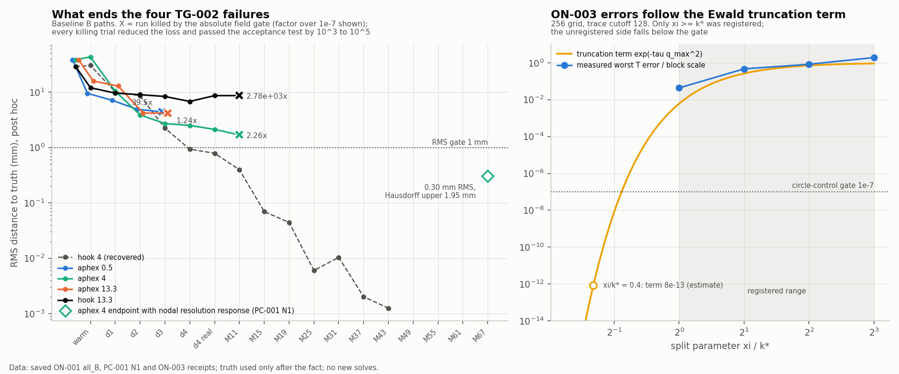

# ON-001/002/003 — outside review

2026-10-05, Claude, an outside reviewer who did not take part in the overnight runs.
User request: "check the three ON tracks, what are your thoughts? then check the
experiments, is their conclusion a result of scientific and fair experiments? as
an outsider, give your verdict on whether the original ideas was tested correctly
and what should we do next". Follow-up: "yes commit this review. should be fix on
001 and 003, start on 002 later?"

This is a read-only review. No physics solves, fits or source changes were made.
Every number below is recomputed from saved receipts by
`experiments/benchmark/on_review.py`. Its outputs are in the
[evidence folder](../../../../results/validation/cleaned_interfaces/ON-review-20261005/README.md).
Truth geometry was used only after the fact, to locate where saved paths diverged.
Running any proposal below needs its own pre-registered plan and an approved ID.

## Verdict

- **E (required-accuracy exit) was tested properly.** It works: 26/26 recovered,
  median 1.55x faster. It is a stopping rule, not a faster algorithm.
- **The three bold ideas were not actually tested.**
  - The Gaussian map (F) was stopped by a bound too loose to use.
  - The Ewald operator (ON-003) was registered only in a parameter range that could not pass.
  - The GauGal comparison (ON-002) was interrupted after nine minutes, with a broken adapter.
- **No arm targeted what ends the four hard cases.** A fatal, absolute field
  tolerance aborts runs whose trial step the pipeline's own acceptance test
  approves, by three to five orders of magnitude.

## Findings

### R1 — Critical: a fatal absolute gate ends the four TG-002 failures

All four failures stop at `solvers/bem_inverse/continuation/lm_backend.py:571`:
"candidate leaves the frozen numerical-resolution regime". This is raised
whenever `resolution_response is None`, and the default `modal_fixed` pipeline
has none (`solvers/bem_inverse/pipelines.py:55`).

The gate compares production and refined fields per frequency, against absolute
tolerances of 1e-5 and 1e-7. The rule `acceptance()` at `lm_backend.py:325`
already compares the two loss gains with a cross-resolution allowance:
`min(dp, dr) > margin + 5|dp - dr|`.

| Case | Killing stage | Trial | Loss | Gain, production / refined | Acceptance margin | Gate overshoot | RMS at abort |
|---|---|---|---|---|---|---|---|
| aphex 4 | release_M11 | 0.27 mm | 0.08752 → 0.08582 | 1.7024884e-3 / 1.7024902e-3 | passes 1.7e5x | 2.26x at 2.5 GHz | 1.69 mm, falling |
| aphex 13.3 | stage_3_damped | 0.29 mm | 0.01320 → 0.01307 | 1.2400010e-4 / 1.2400051e-4 | passes 5.6e4x | 1.24x at 1 GHz | 4.15 mm |
| aphex 0.5 | stage_3_damped | 1.50 mm | 0.00982 → 0.00591 | 3.914414e-3 / 3.914474e-3 | passes 1.3e4x | 39.5x at 1 GHz | 4.40 mm, falling |
| hook 13.3 | release_M11 | 1.00 mm | 0.6514 → 0.6036 | 4.78558e-2 / 4.78491e-2 | passes 1.4e3x | 2784x | 8.66 mm, wrong basin |

- Every killing trial reduced the loss. The production and refined gains agree
  to 1e-6–1e-4 relative.
- None of the 26 successful B runs ever recorded a numerical obstruction (0 checks).
- After the warm-up, the aphex 4 path fell at every stage (43 → 10 → 3.9 → 2.7 → 2.5
  → 2.1 → 1.7 mm). It was killed with ten stages left.
- PC-001 N1 is nodal with a resolution response (reject, then promote). It took
  the same case to **0.30 mm RMS and a 1.95 mm Hausdorff upper bound**, so both
  shape gates passed, and its endpoint audit passed. It failed only on residual
  (0.055) and on the 1800 s wall limit.
- The brief's "promotion moved these four further but recovered none" is true
  by the formal gates, but it hides this.

**Proposed experiment (one change).** During fitting, decide trial accuracy by
the existing `acceptance()` test instead of the fatal absolute gate. Keep the
absolute gate in the final endpoint audit. Run the four failures plus the
standard controls. Predictions:

1. The 26 successes follow identical accepted paths, because they never trip the gate.
2. aphex 4 recovers, or at least passes the shape gates.
3. aphex 0.5 improves.
4. Both contrast-13.3 cases still fail (R2).
5. Endpoint audits still pass.

Falsifiers: an audit failure means the gate was protecting accuracy. A hook 13.3
recovery means R2's basin diagnosis is wrong.

Theory: inexact trust-region methods need the error in the evaluated reduction
to be small relative to the predicted or actual reduction, not small in an
absolute sense [Kouri et al. 2014; Ziems and Ulbrich 2011]. Step 0 is a cheap
check: evaluate the aphex truths at the frozen production/refined trace pair. If
a truth itself exceeds 1e-7, aphex cannot be recovered by construction under the
current gate.

### R2 — High: hook 13.3 is a genuine basin failure in the damped prefix

The truth distance at the end of the damped prefix separates the cases cleanly.

- All 26 successes end it at **≤ 1.13 mm** RMS.
- hook 13.3 ends it at **6.8 mm**, with a 24 mm Hausdorff distance.
  - Its damped stages run 12.0 → 9.6 → 9.0 → 8.4 → 6.8 mm, and each ends with
    `no_decreasing_step`, so it converged there.
  - The real-frequency stage then moves it to 8.7 mm.
  - Under PC-001 N1 it plateaus at 7.6 mm.
- aphex 13.3 stalls at about 4.2 mm in stage 3 in B, and ends at 3.8 mm under N1.

The switch to real data is not itself the signal:

- Successes show loss jumps of 1.2x–30,696x at that switch.
- Four contrast-13.3 successes also lose accuracy during the real stage: peanut,
  asymmetric, c_shape and cog.

Hook 13.3's problem is therefore the basin reached by the high-contrast damped
prefix. Neither the gate change in R1 nor a geometry map can fix that. A
handoff homotopy (H) acting only at the switch is unlikely to suffice either.

After R1, diagnose which damped stage loses the hook's curl. Then pre-register a
prefix change for contrast 13.3, such as stronger damping or a longer
low-frequency phase. Per-case evidence is in `damped_prefix.json`.

### R3 — High: ON-001 routing tested the wrong mechanism and left 6.3 hours unused

- F took the single conditional slot because geometry refusals consumed 50.3% of
  Aphex 13.3's fit time. That is a cost criterion. The terminating cause in all
  four receipts was the numerical gate, which is R's mechanism.
- R's trigger ("repeated numerical refusals … block an otherwise qualified
  path") could never fire under B, because the first numerical refusal is fatal.
- F then failed qualification with zero fits. That still consumed the slot, so R
  and H never ran.
- ON-001 closed after 102 of its 480 minutes.

For future plans: route by what *terminates* failed cases, not by what consumes
their time. A branch that fails qualification before any fit should not consume
the only conditional slot.

### R4 — Medium-high: F's Lipschitz bound is too loose to use, so F was not tested

F scales the field by `alpha = min(1, 0.8/C)`, where
`C = exp(-1/2) * sum_j ||w_j|| / width` and the `w_j` come from exact Gaussian
interpolation at width = 2 control spacings. This is a triangle-inequality bound.
It becomes loose when the weights are large and cancel, which happens when the
interpolant is ill-conditioned (up to 5.9e8 here). It also happens when one
Gaussian straddles a thin stroke whose two sides move in opposite normal
directions. At the aphex endpoints the width was 14–20 mm.

- At the initial circle, clipping began only at a 9.4 mm normal displacement.
- At the curved endpoints it began much earlier:
  - kite: 30 nm
  - star: 49 nm
  - aphex/hook: 0.26–5.3 µm
  - circle 4: 19 µm

  For scale, accepted B steps have a median norm of 33 µm and a 90th percentile
  of 3.1 mm.
- At the unchanged 1e-7 m probe step, alpha was already 0.070 at the kite
  endpoint and 0.177 at the star endpoint. This explains the observed
  finite-difference mismatch exactly: 1/alpha - 1 = 13.30 and 4.64.

F ran zero fits, so its effect on mid-path steps was never measured. The
finite-difference failure is a symptom of the bound, not evidence about
injectivity.

- The declared half-width repair targets exactly this. It never fired because
  its trigger was condition > 1e12.
- The closing statement "raw injectivity does not qualify the projected
  pipeline" goes beyond the evidence. The evidence shows that this bound, with
  this width, clips steps at curved states.

If F is revisited:

- Use the reproducing-kernel bound
  `Lip(v) <= sqrt(2) * (sum_i w_i^T K w_i)^(1/2) / width`, which follows from
  `||d k(x,.)||_H = 1/width`.
- Tie the width to the local reach rather than to the control spacing.
- Check alpha at representative accepted steps on the saved states before any
  qualification.

This is low priority, because geometry is not the terminator.

### R5 — Medium: ON-003's registered range could not pass, and its payoff is capped

ON-003's measured circle errors follow the spectral-Ewald k-space term
exp(-tau q_max^2) [Lindbo and Tornberg 2011]. Here tau = 1/(4 xi^2), and
q_max = pi N / (2.1 R1) is the grid Nyquist frequency.

| xi/k* | 256 grid: tau q_max^2 | exp(-tau q_max^2) | Measured T error / scale, cutoff 128 |
|---:|---:|---:|---:|
| 1 | 5.10 | 6.1e-3 | 4.3e-2 |
| 2 | 1.34 | 0.26 | 0.47 |
| 4 | 0.34 | 0.71 | 0.83 |
| 8 | 0.09 | 0.92 | 1.91 |
| 0.5 (estimate) | 18.6 | 8.2e-9 | unregistered |
| 0.4 (estimate) | 27.8 | 8.3e-13 | unregistered |

The 128 grid follows the same ordering.

- Only xi ≥ k* was registered, which is the side that needs ever finer grids.
- At xi/k* ≈ 0.4 the existing 256 grid gives an estimated tail near 1e-12. The
  near/far cancellation factor there is exp(tau k*^2) ≈ 4.8.
- The report correctly says this is "not a general rejection". But the
  experiment could not answer its question.

Separately, operator assembly is about 18% of baseline fit time (thread-summed
over four threads). A free assembly would therefore cap the inverse speedup at
about 1.22x.

Recommendation: do not fund the proposed 4–8 hour follow-up for 2D speed. At
most, run the roughly 20 s circle control at xi/k* = 0.4 to correct the record.

### R6 — Medium: E is valid; it is discrepancy-principle stopping

- B and E retain the same 26 recoveries, with no regressions.
- E changes nothing before its exit: the four failures are identical in both
  arms, with the same outcomes and 43 geometry refusals each.
- The 1.546x median speedup (p10 1.225x) confirms the brief's read-only
  estimate that about 40% of fit time follows the threshold.
- The price is accuracy. Median RMS goes from 0.0019 to 0.015 mm (7.7x), and the
  maximum from 0.050 to 0.188 mm. The maximum Hausdorff upper bound goes from
  0.169 to 0.665 mm. All remain well inside the gates.

Report E as Morozov-type stopping [Engl, Hanke and Neubauer 1996], not as an
algorithmic speedup. With noisy data its threshold should come from the noise level.

### R7 — Medium: the speed arms missed the dominant cost

- **W:** the Jacobian is 2.2% of baseline physics thread time. EW used more
  evaluations than E on kite, star and c_shape, so its premise was refuted by
  the B profile before the run.
- **G:** used exactly the same evaluations and derivatives as B on all four
  screen successes. Clipping never engaged, so its slowdown is reach-proxy
  overhead only.
- **The dominant cost:** the refined cross-resolution re-solve is 46.9% of all
  frequency solves in B and 49.5% in E, each at the higher trace resolution.
  Given R1's 1e-6–1e-4 gain agreement, the next speed lever is adaptive fidelity
  under the same inexact trust-region theory. Under that rule, a trial is
  refined only when its gain-to-threshold ratio is small, with periodic
  verification. Measure it on saved states first.

### R8 — Low: ON-002 has no evidence and its files are untracked

- ON-002 was launched at 01:39:26 UTC. The Codex session records `turn_aborted`,
  reason `interrupted`, at 01:48:40 UTC; this was checked against the local log.
- Its single adapter batch converged in **0/12** configurations, with BiCGSTAB
  true residual 0.91–1.00 after 200 iterations. That includes contrast 0.5 at
  0.25 GHz, which is a weak scatterer.
- That points to an adapter defect, not physics.
- Its plan, contract, drivers, test and results are all untracked.
- Four tracked documents link to the untracked plan, so those links are broken
  on the remote:
  - `CI-SPD/README.md`
  - `cleaned_interfaces/README.md`
  - the brief
  - the integration review
- The plan still says "ADAPTER QUALIFICATION IN PROGRESS".

Before any relaunch, commit the files unchanged as an interrupted record and
correct the status in a separate commit. Then fix the disk non-convergence.

## Checked and passed

| Check | Result |
|---|---|
| ON-001 matched pairs: one source fingerprint; contiguous B/E pairs | Passed (`all_pair_source_checks_passed`) |
| Repeated timings | circle 1.238–1.242x, kite 3.83–3.89x, star 1.57–1.60x |
| Recovery sets B = E = historical 26 | Passed, no regressions or additions |
| E exits audited with all real frequencies; no truth used | Passed, as recorded in receipts |
| Fit/audit caps | No overshoots |
| Numerical obstructions in successful B runs | 0, so R1's change cannot alter them |
| ON-003 split geometry `R1 = R0 + 8 sqrt(tau)` | Recomputed, matches manifest |
| ON-003 near-part control far below grid error; analytic circle reference | As reported; not recomputed here |
| ON-003 claim scope ("not a general rejection") | Appropriate |
| Truth separation inside fits | Not re-audited; relies on `test_benchmark.py` and receipts |

## Recommended order

Answering "fix 001 and 003, start 002 later?":

1. **ON-001 line first, under a new ID.**
   1. The truth-resolution check (R1, step 0).
   2. The one-change decision-relative gate (R1).
   3. Then the contrast-13.3 damped prefix (R2).
   4. Then adaptive fidelity for speed (R7).
2. **ON-003: no repair campaign.** At most, run the 20 s circle control at
   xi/k* = 0.4 to correct the record. The 2D speed payoff is capped near 1.2x.
3. **ON-002 later.** First preserve its interrupted files and fix the adapter's
   non-convergence. It is needed for the GauGal parity claim, not for recovery.

## References

- D. P. Kouri, M. Heinkenschloss, D. Ridzal, B. G. van Bloemen Waanders,
  *Inexact objective function evaluations in a trust-region algorithm for
  PDE-constrained optimization under uncertainty*, SIAM J. Sci. Comput. 36(6),
  A3011–A3029, 2014.
- J. C. Ziems, S. Ulbrich, *Adaptive multilevel inexact SQP methods for
  PDE-constrained optimization*, SIAM J. Optim. 21(1), 1–40, 2011.
- D. Lindbo, A.-K. Tornberg, *Spectral accuracy in fast Ewald-based methods for
  particle simulations*, J. Comput. Phys. 230(24), 8744, 2011.
  [ScienceDirect](https://www.sciencedirect.com/science/article/abs/pii/S0021999111005092).
- H. W. Engl, M. Hanke, A. Neubauer, *Regularization of Inverse Problems*,
  Kluwer, 1996 (discrepancy principle).
