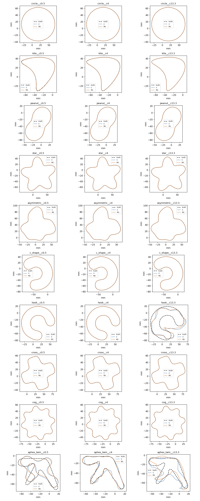

# RG-001 — decision-relative resolution gate

Classification: **Mechanism confirmed, no recovery**. Completed 30/30 benchmark pairs.

Recovery: C 26/30; RG 26/30. New recoveries: none.

Stage 0: all 30 truth endpoints pass the unchanged audit and residual gate. All aphex truths pass every declared stage pair. The exact cog 13.3 truth overshoots the early undamped pair by 25.006x; its final pair passes. No aphex prediction was revised.

Stage 1: 35 focused gate tests pass; package/cleaned regression suite 247 passed and affected shared-continuation/physics/geometry suite 348 passed. The initial archive-dictionary assertion failure and the first Stage 0 cleanup error are retained. Four killing trials replay with exactly identical gains and are accepted by decision mode.

## Four-failure mechanism

| Case | B abort RMS mm | RG RMS mm | Reduction | Audit | Recovery | Accepted overshoots |
|---|---|---|---|---|---|---|
| aphex_twin__c0.5 | 4.398304 | 3.868452 | 12.0% | False | False | 1 |
| aphex_twin__c4 | 1.685383 | 0.664049 | 60.6% | False | False | 25 |
| aphex_twin__c13.3 | 4.152414 | 3.948254 | 4.9% | False | False | 45 |
| hook__c13.3 | 8.657454 | 7.968789 | 8.0% | False | False | 19 |

## Registered predictions

P1: holds; P2: falsified; P3: falsified; P4: holds.

P5 endpoint audits: 26/30 pass. Failed cases: aphex_twin__c0.5, aphex_twin__c13.3, aphex_twin__c4, hook__c13.3.

P3 requires leaving stage_3_damped as well as improving RMS. Its original trial is accepted, but the run still stops inside that stage on a later production failure, so the registered prediction is falsified.

The 26 converged common successes pass their audits. All four RG failure endpoints fail the field gate; these endpoints are hard stops rather than newly converged outputs. P5 has no newly converged failure endpoint to test, while its stated warning about unresolved RG endpoints is observed.

## Independent checks and repeats

No new benchmark recovery, so new-recovery-only nodal checks and repeats are inapplicable.

## Timing

Common successes: 26. Median C/RG: 1.005559337165188. Suite audited totals including failures: {'C': 554.1146458722651, 'RG': 841.0895522381179} seconds.

Times include CUDA startup, initial audit and final/early audit; they exclude imports and truth scoring. Two additional timing repeats per declared timing case are reported separately in the evidence bundle.

## Extended-budget diagnostics

These are outside the 120 s / 13,412-unit benchmark and never counted as benchmark recoveries.

| Case | Recovery | RMS mm | Audit | Outcome |
|---|---|---|---|---|
| aphex_twin__c0.5 | unrun | — | — | — |
| aphex_twin__c4 | unrun | — | — | — |
| aphex_twin__c13.3 | unrun | — | — | — |
| hook__c13.3 | unrun | — | — | — |

The default gate remains absolute. The evidence supports pre-registering RP-001 (a bounded modal resolution response): the relaxed gate accepts steps but leaves the four failure endpoints unresolved. PX-001 may still be needed for the contrast-13.3 basin. No successor experiment is authorized or opened.

[Plan](03_plan.md), [execution record](04_rg001_execution.md), [machine-readable closeout](../../../../results/validation/cleaned_interfaces/RG-001/closeout.json), [case table](../../../../results/validation/cleaned_interfaces/RG-001/table.md).

