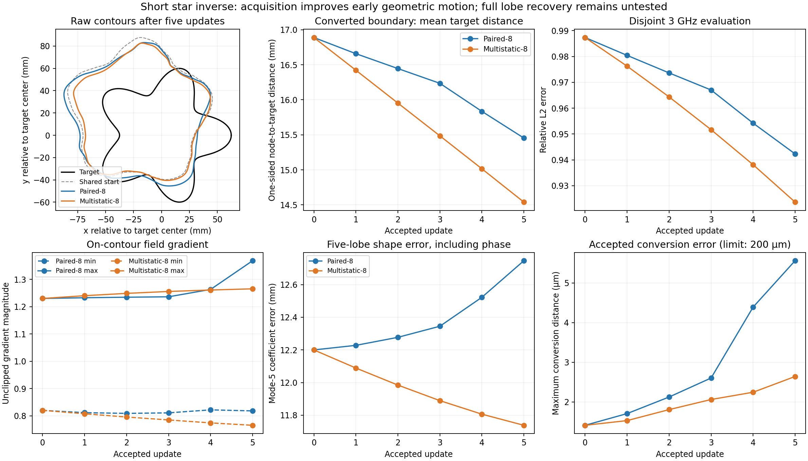

# Decision after the short acquisition inverses

Historical decision, now executed. Both longer inverse arms and their reporting
are complete; see [iteration-3 results](../iteration_03/01_results.md). The
command below is retained as provenance, not as a request to rerun it.

Recorded 2026-09-08. Reviewed run:
`results/validation/implicit_mlp_adjoint/iteration-02-final/inverse-20260908T170732213677Z`.

**Proceed to a longer controlled star comparison with acquisition as the sole
changed factor. Keep Adam, uniform-box Eikonal sampling, and 0.5/1.5 GHz.** The
short results support that experiment; they do not establish full recovery.
The next run is prepared for the user to execute. It was not run during this review.

## Evidence for this choice

| After five accepted updates | Paired-8 | Multistatic-8 |
|---|---:|---:|
| Attempted candidates | 33 | 35 |
| Raw symmetric RMS boundary error | 18.926 mm | 17.642 mm |
| Converted symmetric RMS boundary error | 18.929 mm | 17.646 mm |
| Five-lobe coefficient error, including phase | 12.746 mm | 11.738 mm |
| Unwanted modes 2–10, excluding 5, RMS | 2.571 mm | 0.955 mm |
| Disjoint 3 GHz relative error | 0.942309 | 0.923667 |
| On-contour gradient spread | 1.673 | 1.654 |
| Accepted conversion error | 5.561 µm | 2.641 µm |

At exactly **21 attempted candidates**, both arms have three accepted updates.
Raw symmetric RMS error is 19.458 mm for paired and 18.559 mm for multistatic.
At a common cap of 33 candidates, paired has five accepted updates and
multistatic four; multistatic still has lower symmetric RMS error, 18.104 mm
versus 18.926 mm. The advantage survives comparison at matched work.

Multistatic's actual signed motion toward the target is positive at every
accepted update. Its cumulative score through normal mode 20 is 3.29 times
paired's. This score is a local nearest-target squared-distance directional
score, not the finite reduction in total boundary error.

Both five-lobe amplitudes decrease. Their orientation matters: the phase-aware
coefficient error starts at 12.200 mm, improves to 11.738 mm for multistatic,
and worsens to 12.746 mm for paired. The calculation corrects the FFT's
sampling origin at −π and measures each curve about its polygon area centroid.
Polar modes and arclength normal-motion modes measure different quantities.

The result is not uniformly better. Paired has lower final curve-to-target
maximum distance and target-to-curve mean distance. Multistatic's minimum
on-contour gradient decreases from 0.820 to 0.765. Its accepted field and
conversion behavior is currently well resolved, but later stability and lobe
amplitude recovery remain open questions.



## Fixes and deferred changes

The saved optimizer audit found no Adam, projection, clipping, or moment
continuity defect. All ten accepted steps used Adam. At a common predicted
20 µm RMS motion, actual Adam has a better signed geometric score than total
steepest descent at all ten states, confirmed by the saved finite probes.
Replacing Adam is therefore unsupported.

Every next-larger rejected step binds on the unchanged 2 mm motion limit.
Multistatic's topology and conversion rejections occur only at much larger
proposals. Accepted conversion and refinement errors stay far inside the
unchanged 200 µm and 10 µm limits. No acceptance tolerance needs changing.

The runner now has an explicit longer experiment with a review report tied to
the exact initial checkpoint and trajectory. It preserves the short defaults.
For longer runs it saves each optimizer snapshot separately, avoiding repeated
writes of all previous snapshots. All accepted geometry states and optimizer
records remain available. Costly finite proposal geometry is evaluated at
predeclared optimizer states: the first, multiples of ten, and the last
available state. Selection uses no target or evaluation score. Postprocessing
progress is printed so the command's final reporting phase is visible.

Contour-band Eikonal sampling, higher frequencies, neural GN/TSVD, and ellipse
remain deferred for the reasons recorded in the
[promotion report](../../../../results/validation/implicit_mlp_adjoint/iteration-02-acquisition-review/promotion.json).

## One command for the next actual inverses

```bash
OMP_NUM_THREADS=1 OPENBLAS_NUM_THREADS=1 MKL_NUM_THREADS=1 /home/drdeng/miniconda3/envs/EMNerf/bin/python /home/drdeng/Neural_SDF_BEM_AD/run_implicit_mlp_iteration2_matched.py --action all --experiment long --comparison acquisition --evidence /home/drdeng/Neural_SDF_BEM_AD/results/validation/implicit_mlp_adjoint/iteration-02-acquisition-review/decisions.json
```

This qualifies the numerical path and runs two fresh star trajectories from the
same saved wrong-start weights and fresh Adam state: paired-8 control and
multistatic-8. Each stops at the first of **60 accepted updates, 1,440 attempted
candidates, or 3,600 inverse seconds**. It can stop earlier if no admissible
decreasing step exists. Both inverse results are saved before the disjoint
3 GHz evaluation and geometric reporting. The timestamped output and `run.log`
are printed when it starts.

Budget roughly **1–2 hours total**, based on the measured short inverses;
initial validation and postprocessing are outside the per-arm inverse timer,
and an in-flight operation can finish beyond that timer. This is an estimate,
not a whole-command timeout.

The next review must compare actual raw/converted shape recovery, lobe phase
and amplitude, field conditioning, conversion errors, binding constraints, and
work. Finishing 60 updates or lowering training loss alone will not establish
success. A stalled or distorted trajectory calls for the next supported bounded
diagnostic, not an automatic higher-frequency or larger-budget run.

## Reproducible review

The review used saved-data arithmetic and static plotting only, with no new
inverse, BEM, extraction, or gradient evaluations. Detailed evidence:

- [Motion and symmetric distance review](../../../../results/validation/implicit_mlp_adjoint/iteration-02-acquisition-review/motion_review.md)
- [Actual Adam review](../../../../results/validation/implicit_mlp_adjoint/iteration-02-acquisition-review/optimizer_review.md)
- [Field and geometry review](../../../../results/validation/implicit_mlp_adjoint/iteration-02-acquisition-review/geometry_review.md)
- [Machine-readable promotion decision](../../../../results/validation/implicit_mlp_adjoint/iteration-02-acquisition-review/decisions.json)

Validation: **96 relevant regression tests passed in 4.28 seconds**, including
39 matched-runner tests covering long-run orchestration, evidence rejection,
work caps, complete checkpoint retention, and posthoc ordering. The prepared
command's evidence checks pass against the actual saved bundle. The reusable
motion review reproduced all 1,176 existing trajectory measurements; it writes
to a fresh directory and refuses to overwrite existing reviewed evidence.
The code also passes `git diff --check`. No heavy inverse was launched.
