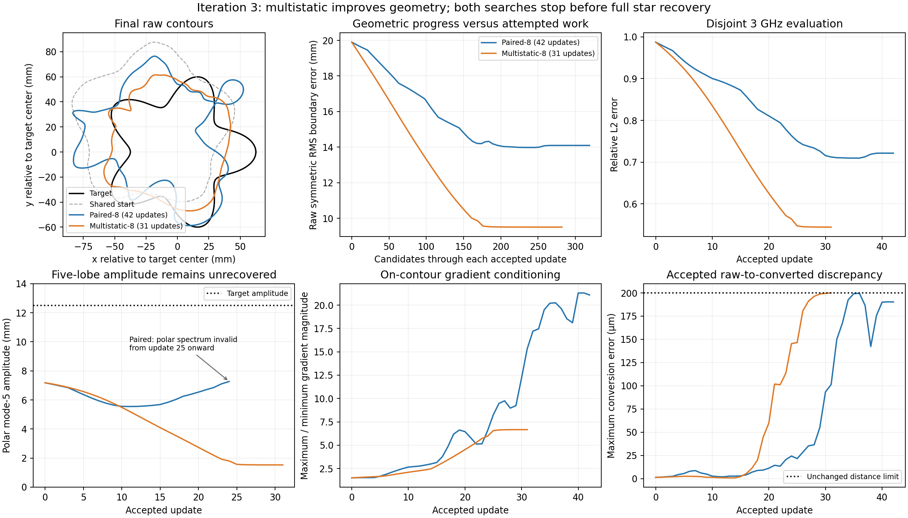

# Iteration 3 — results, problems and possible fixes

> **Later annotation, 2026-09-11 — this cycle is paused.** By user direction,
> diagnosing the implicit MLP is not the current priority; the explicit
> Cartesian Fourier implementation comes first. See the
> [pause notice on `03_plan.md`](03_plan.md). The record below is unchanged and
> keeps its full standing as evidence.
>
> Two statements in the header below were accurate on 2026-09-08 and are now
> superseded by later documents in this folder: four numbered proposal documents
> and an agreed `03_plan.md` do exist. Nothing was executed under that plan.

Recorded 2026-09-08 by Codex after execution of the iteration-2 diagnostic plan,
its repairs, the short acquisition comparison, and the longer star inverses.
**Results stage: no iteration-3 proposal or agreed plan is recorded.** Numbered
guides and reviews belong in `02_proposals/` when received; agreed decisions
then belong in `03_plan.md`. Prior cycle:
[iteration 2](../iteration_02/01_results.md), whose user-approved controlling
document is [the final plan](../iteration_02/02_proposals/04_final_plan.md).

## Outcome and completion

**Both requested long inverse jobs are done. Neither establishes full star
recovery.** The command finished with exit 0 and `status: complete`, all numerical
qualification gates passed, both inverse results are saved, and all scheduled
evaluation and geometry reporting finished without posthoc errors. Both saved
results have `converged: false` and stop at `no_decreasing_neural_step`.

Paired-8 accepts 42 updates; multistatic-8 accepts 31. Neither reaches the
60-update, 1,440-candidate or 3,600-second per-arm cap. Job completion therefore
does not mean completion of 60 updates or successful reconstruction. The full
command took approximately **64.03 minutes**, from 18:43:00 to 19:47:02 British
Summer Time on September 8, including qualification and postprocessing.

Multistatic's early advantage persists: it gives better aggregate geometry and
shared 3 GHz evaluation at matched attempted work. However, its five-lobe
amplitude collapses and its search reaches the conversion-distance limit.
Paired produces a strongly distorted contour, deteriorated field conditioning,
and nearby candidates whose independent raw-contour audit detects two components.
The terminal constraints explain why the searches stop; they do not fully
explain why the earlier updates produced the wrong shapes.

This report uses saved records and lightweight postprocessing. No new inverse,
BEM solve, extraction, gradient evaluation, or production-code repair was run
to prepare it. Circle and ellipse were not part of this long comparison.

## What iteration 2 established before the long run

| Work completed | Result carried forward |
|---|---|
| Exact intersection-predicate vectorization | Saved geometry outcomes matched the scalar predicate; repeated polygon checks became cheaper |
| Raw and Method-B motion measurement repair | Solving smooth normal intersections removed polygon-chord measurement bias; corrected frozen IFT/Method-B errors scale quadratically |
| Independent conversion audit resolution | The late-star refinement check was sample-sensitive; matched arms now use 1,024 base audit samples without changing either physical fidelity limit |
| Frozen field-only repair | The tested repair weakly improved old state 32 and worsened old state 47 gradient spread; it did not justify changing inverse Eikonal sampling |
| Ellipse startup qualification | Actual initialization is now saved and diagnosed; denser projection helps refinement, but roughly 0.509 mm conversion distance still fails the 0.2 mm limit |
| Five-update paired/multistatic comparison | Multistatic improved signed motion, phase-aware lobe error and aggregate geometry; actual Adam was useful in all ten tested early states |
| Longer experiment selection | Acquisition alone was selected; Adam, original training frequencies, regularizer, geometry ownership and acceptance limits were preserved |

The measurement repairs are not evidence that the inverse itself recovered.
The short comparison and its conditional longer-run decision are documented in
[the acquisition review](../iteration_02/05_acquisition_review.md); prior fixes
and their numerical evidence are in
[the diagnostic repair record](../iteration_02/04_diagnostic_fixes.md).

## Experiment and comparison limits

An 8,577-weight, width-64 SIREN configured with `hidden_layers=2` owns the
geometry: one input sine layer, two additional width-64 sine layers, and a
scalar linear output. Kress
discrete-adjoint sensitivities propagate through the branch-local Method-B
reverse to neural weights. Every actual trial rebuilds and checks its contour;
rejected searches restore accepted weights and optimizer state.

| Setting | Shared value / isolated difference |
|---|---|
| Initial network | Exact saved wrong-start star state 0; identical fresh Adam state in both arms |
| Acquisition | E0: 8 paired entries; E1: full 8-source × 8-receiver matrix, 64 entries |
| Training frequencies | 0.5 and 1.5 GHz, two unit frequency weights |
| Evaluation | Fixed disjoint multistatic-8 acquisition at 3 GHz, computed after both trajectories are saved |
| Observation oracle | Independently validated Nyström observations; unchanged target, materials and measurement ring |
| Geometry | Grid 513²; 256 projected samples; bandwidth 96; 194 Kress nodes; dense arclength resolution 2,048 |
| Fidelity audit | Independent base grid 513² and 1,024 base samples; distance ≤0.2 mm; refinement change ≤0.01 mm |
| Optimizer | Adam, learning rate 0.001; gradient clip norm 10; adjoint steepest-descent fallback |
| Regularizer | Eikonal weight 0.01; 512 fixed uniform-box points, same sample hash throughout both arms |
| Search | At most 14 halvings per direction; 2 mm boundary-motion limit; data and regularized Armijo tests |
| Per-arm work cap | 60 accepted updates, 1,440 attempted candidates, or 3,600 inverse seconds |

Both long runs reproduce their short runs' first five accepted weight tensors,
parameter vectors and raw/converted geometries exactly. Their complete 33/35
candidate prefixes also match. The longer comparison did not substitute a new
pretraining result or a different early trajectory.

The data objective is `0.5 * sum_f ||prediction_f - observed_f||² /
||observed_f||²`, with fixed observed-column scales and no extra division by
entry count. Its absolute values concern different acquisitions; compare each
arm's reduction internally and use shared geometry/evaluation for cross-arm
claims. The 3 GHz evaluation and exact target were never used for step
acceptance, optimizer selection or stopping.

Qualification includes independent observation ordering, paired-selection
equivalence, neural directional derivatives, rollback and node refinement.
Starting-curve forward refinement errors are 2.70e-8 / 7.63e-9 for E0/E1;
gradient refinement errors are 1.64e-7 / 8.73e-8. These validate the tested
starting integration, not every later geometric branch or a continuum
topology certificate. Source hashes, configs and shared-initialization hashes
are preserved in the run's `qualification.json`.

## Measured results

The initial mean / maximum sampled Method-B node-to-target distances are
16.888 / 42.745 mm; initial raw symmetric RMS distance is 19.900 mm; shared
3 GHz relative error is 0.987326.

| Long-run outcome | E0 paired-8 | E1 multistatic-8 |
|---|---:|---:|
| Accepted updates | 42 | 31 |
| Attempted candidates, excluding initialization | 349 | 312 |
| Distinct rejected candidates | 307 | 281 |
| Inverse wall time, excluding postprocessing | 1,371.21 s / 22.85 min | 1,421.62 s / 23.69 min |
| Train data objective, initial → final | 1.533445 → 0.325002 | 0.525327 → 0.075804 |
| Disjoint 3 GHz relative L2 | 0.721501 | 0.544476 |
| Mean sampled Method-B node-to-target distance | 12.558 mm | 6.880 mm |
| Maximum sampled Method-B node-to-target distance | 36.811 mm | 22.195 mm |
| Raw symmetric RMS distance | 14.097 mm | 9.506 mm |
| Converted symmetric RMS distance | 14.104 mm | 9.507 mm |
| Raw symmetric mean distance | 11.020 mm | 7.691 mm |
| Raw sampled symmetric Hausdorff estimate | 37.103 mm | 23.109 mm |
| Polygon area centroid error | 16.815 mm | 8.900 mm |
| Stop reason | `no_decreasing_neural_step` | `no_decreasing_neural_step` |

The maximum node-to-target distance is one-sided and sampled. The new symmetric
metrics use arc-weighted point-to-closed-segment distances between the saved
contours and a 4,096-point exact-target polygon in both directions. Symmetric
RMS averages the two directed mean squares before taking the square root.
The Hausdorff entry is a sampled-polyline estimate, not a certified smooth-curve
supremum. These definitions must not be interchanged with historical metrics.

At the strict common cap of **312 candidates**, E0 has reached accepted state
41 and E1 state 31: raw symmetric RMS is 14.097 versus 9.506 mm. Multistatic is
better at all 64 compared post-initial accepted-event budgets up to that cap.
Equal candidate counts are the declared work proxy; candidates can stop before
BEM and do not have identical runtime. Recorded inverse times are engineering
measurements from this run, not controlled hardware benchmarks.



## Multistatic: improved bulk geometry, collapsed lobes

E1's centroid error falls from 28.306 to 8.900 mm and mean polar radius from
60.002 to 50.145 mm against a 50 mm target. This is substantial placement and
size improvement, but the five lobes are not recovered.

| E1 polar shape measurement | Initial | Final | Target |
|---|---:|---:|---:|
| Mode-5 radial amplitude | 7.181 mm | 1.530 mm | 12.500 mm |
| Mode-5 rotation | 14.164° | 8.990° | 0° |
| Phase-aware mode-5 coefficient error | 12.200 mm | 11.468 mm | 0 mm |
| Unwanted modes 2–10 excluding 5, RMS | 0.172 mm | 3.766 mm | 0 mm |

Final mode-5 amplitude is only 12.2% of the target amplitude. Mode 4 reaches
4.184 mm, larger than mode 5. Phase-aware mode-5 error reaches a retrospective
minimum of 11.198 mm at state 19, then worsens while aggregate geometry,
training objective and shared evaluation continue improving. Thus the useful
early acquisition effect does not establish lobe recovery.

All 31 accepted E1 transitions have positive finite signed nearest-target
normal-motion scores. These measure a local squared-distance correction, not
recovery of the polar mode-5 amplitude. This is a concrete case where improving
the aggregate geometric score is insufficient for the desired shape.

Polar spectra use each contour's polygon area centroid. The FFT samples start
at −π; the physical coefficients include the corresponding `(-1)^m` phase
correction. Polar modes and normal modes parameterized by arclength are
different measurements.

## Paired: distorted shape and loss of a valid polar description

E0's phase-aware mode-5 error worsens from 12.200 to 18.739 mm by state 24.
From state 25 onward, the contour is not polar single-valued about its polygon
area centroid. Final polar amplitude, phase and mode-5 error are therefore
**unavailable, not zero**. This invalidates the radial description; it does not
by itself mean that the accepted boundary has invalid topology.

Of 42 accepted transitions, 32 have positive and 10 negative signed
nearest-target normal-motion scores. Negative transitions occur into states
27–30 and 36–41. Falling training objective therefore continues to admit
geometrically adverse motion.

Retrospectively, E0's minimum mean / maximum sampled node-to-target distances
occur at state 26, 11.878 / 36.028 mm, before worsening to 12.558 / 36.811 mm.
Its best raw symmetric RMS is 13.980 mm at state 36; best shared evaluation is
0.709667 at state 35. These are descriptive diagnostics, not truth-based
checkpoint selection or a proposal to use evaluation for stopping.

## Why the searches stop

Both final searches exhaust 15 Adam and 15 fallback candidates. Neither meets
a data-tolerance or stationarity stopping criterion. Final data-gradient norms
remain 10.459 / 8.554; this finite search does not establish a stationary point.

**E0: nearby candidate topology detection.** Of 30 terminal candidates, 22 fail
topology, five fail conversion distance (four also fail refinement), and three
fail motion and both Armijo tests. The smallest tested Adam and fallback
candidates both fail before BEM with the recorded message:
`Conversion audit could not resolve the raw zero set: Expected exactly 1 closed
zero-set component(s); detected 2.` The final accepted state itself passes the
sampled one-component and conversion checks. These records do not distinguish
a true small-component bifurcation from resolution-sensitive detection.

**E1: conversion distance, not refinement change.** Twenty-seven of 30 terminal
candidates fail conversion distance; one also fails refinement. Three larger
Adam candidates fail motion, two also failing both objective tests. The smallest
tested Adam candidate has distance **201.1934 µm**, and the smallest fallback
**200.1447 µm**, against **200 µm**. Their refinement changes, 2.3366 / 2.3349 µm,
pass the unchanged 10 µm limit. This differs from the older iteration-2 opening
run's terminal refinement-change failure.

E1's final accepted distance is 199.9554 µm, leaving only 0.0446 µm headroom.
Its movements into states 26–31 shrink from 206.27 to 51.81, 25.88, 12.91,
3.833 and 1.917 µm. The last five are below the reporting-only 100 µm
meaningful-motion floor. E0's last two accepted motions are 5.315 and 6.019 µm;
three accepted E0 motions in total fall below that floor. Neither microscopic
progress nor a larger backtracking budget would establish recovery.

One larger terminal E1 Adam candidate halves its data objective from 0.075804
to 0.037098 and passes conversion, but moves 16.672 mm against the 2 mm motion
limit. Its target-shape effect was not established. This is not evidence for
relaxing the trust region or any fidelity limit.

## Field deterioration and rejection accounting

| Accepted-field measurement | Shared initial | E0 final | E1 final |
|---|---:|---:|---:|
| Minimum contour gradient magnitude | 0.81989 | 0.17645 | 0.49002 |
| Maximum contour gradient magnitude | 1.23021 | 3.72102 | 3.26719 |
| Gradient spread, maximum / minimum | 1.50045 | 21.08771 | 6.66746 |
| Gradient RMS | 1.01351 | 1.79477 | 1.51957 |
| Contour Eikonal mean square | 0.00529 | 0.96071 | 0.47668 |
| Fixed box Eikonal loss | 0.03803 | 0.11118 | 0.11528 |
| Conversion distance, µm | 1.4096 | 190.2728 | 199.9554 |
| Refinement change, µm | 0.1846 | 6.2584 | 2.3345 |

Contour Eikonal values are reconstructed from the saved arc-weighted spectra;
all recorded gradient magnitudes are unclipped and nonzero. The fixed box loss
does not describe contour conditioning adequately on its own. This observed
drift motivates a causal frozen-state test; it does not prove that field repair
alone will restore lobes or feasible steps. The previously tested field repair
did not establish that benefit.

| Rejection reason over the whole run | E0 | E1 |
|---|---:|---:|
| Extraction / topology | 117 | 35 |
| Conversion distance | 54 | 134 |
| Conversion refinement change | 20 | 23 |
| Boundary motion | 134 | 109 |
| Data Armijo | 32 | 19 |
| Regularized Armijo | 32 | 19 |
| Nonfinite / solver failure | 0 | 0 |
| Distinct rejected candidates | 307 | 281 |

Reason counts overlap. Tests downstream of failed geometry were not evaluated;
they did not pass. At each terminal search only three candidates reach data
evaluation. Small Armijo counts therefore do not show that most proposed
directions have useful finite objective or geometric behavior.

## Actual optimizer evidence: the early conclusion changes for paired

All 75 actual optimizer records were saved, including the two terminal rejected
proposals. Bound projection leaves every raw Adam proposal unchanged; saved
moments, clipping, accepted steps and rollback remain consistent. No optimizer
integrity bug was found. Adam proposals were descending for both local data
and total gradients; none was skipped as non-descent.

The early five-state finding that Adam improves geometric direction does not
extend to every later paired state. At common predicted 20 µm RMS motion:

| E0 frozen state | Predicted total-gradient score | Predicted saved-Adam score | Finite raw probe |
|---|---:|---:|---|
| 10 | 11.45 | 3.46 | Confirms total gradient is better |
| 20 | 10.44 | 6.14 | Confirms total gradient is better |
| 30 | 8.42 | 2.48 | Confirms total gradient is better |
| 40 | +2.55 | −2.95 | Unavailable: all four probes fail topology |

Scores are in `1e-8 m²`, through normal mode 20, and compare local nearest-target
correction at the same predicted motion. They are not finite total-error
reductions. A fallback at optimizer state 41 resets E0 Adam; at state 42 its
predicted score is positive again, but both terminal directions still fail the
independent topology audit. Momentum distortion is a supported intermediate E0
effect, not a complete explanation of its terminal stop.

E1's recorded Adam geometry remains comparable to or better than total-gradient
descent at the admissible selected probes. Fallback resets at optimizer states
29 and 30 do not remove the conversion-distance barrier. A global Adam
replacement is therefore not justified by both arms.

Finite proposal geometry was preselected at E0 states 0/10/20/30/40/42 and E1
0/10/20/30/31; all optimizer records and accepted trajectories remain saved.
Only 16/24 E0 and 12/20 E1 common-20-µm probes have admissible finite motion
scores. All four directions fail topology at E0 states 40/42 and distance at
E1 states 30/31. Predicted late velocities must not be reported as verified
admissible finite motion. Accepted-transition measurements themselves are
complete.

## Open questions and ranked candidate fixes

These are candidates for the iteration-3 consultation, not an adopted plan or
instructions to start another inverse.

| Priority | Question / candidate | Evidence | Cheapest discriminating check |
|---|---|---|---|
| 1 | Separate terminal topology detection and conversion distortion | E0 tiny proposals reveal two audited components; E1 tiny proposals exceed distance while refinement passes | Freeze actual terminal weights and saved proposals; vary production extraction/conversion and independent audit resolution separately, retaining the limits and measuring any proposed finite motion |
| 2 | Test whether field conditioning causes the late feasible-step failure | Contour Eikonal and gradient spread deteriorate substantially; previous repair was insufficient | A resolved field-only repair with a strong fixed-zero-set anchor; measure contour drift, gradients, topology and conversion before any inverse ablation |
| 3 | Isolate intermediate paired Adam distortion | Total-gradient finite geometry beats saved Adam at E0 states 10/20/30; E1 does not show the same defect | A bounded matched optimizer comparison at a saved, qualified intermediate state; preserve data, regularizer, geometry and actual optimizer state |
| 4 | Explain residual lobe collapse under multistatic | E1 improves bulk geometry while mode-5 amplitude falls to 1.530 mm | Compare numerator, inverse-gradient factor and raw/Method-B motion against useful normalized curve-space SD/GN/TSVD directions at early and pre-stall E1 states |
| 5 | Decide whether frequency or a neural metric adds a simpler repair | Original-band multistatic helps but neither recovers lobes nor avoids later geometry constraints | Establish whether the remaining limitation is acquisition/metric conditioning after controlling geometry and field ambiguity; only then select the conditional matched high-band or frozen neural GN test |

A terminal constraint is not automatically the cause of the wrong shape. A
field-only repair is not already validated by the observed correlation. A poor
Euclidean gradient does not rule out a useful GN/TSVD direction. Conversely,
neither a higher band nor a production neural GN optimizer is established as
the next solution by these results alone.

Do not automatically rerun unchanged long inverses, enlarge the network,
relax fidelity or motion limits, remove Eikonal regularization, repeatedly deepen
backtracking, or switch to explicit curve-owned updates. Ellipse remains a
separate initialization qualification problem; no new ellipse accuracy result
is present here. Any next expensive run needs a reviewed principal factor and
evidence that its change improves admissible neural geometric motion.

## Evidence index and recorded command

The long command below **has already run**; it is recorded for provenance,
not as a request to rerun:

```text
OMP_NUM_THREADS=1 OPENBLAS_NUM_THREADS=1 MKL_NUM_THREADS=1 /home/drdeng/miniconda3/envs/EMNerf/bin/python /home/drdeng/Neural_SDF_BEM_AD/run_implicit_mlp_iteration2_matched.py --action all --experiment long --comparison acquisition --evidence /home/drdeng/Neural_SDF_BEM_AD/results/validation/implicit_mlp_adjoint/iteration-02-acquisition-review/decisions.json
```

Raw run directory:
`results/validation/implicit_mlp_adjoint/iteration-02-final/long-acquisition-20260908T174300326691Z/`.
It contains `qualification.json`, `run.log`, shared initialization, observations,
combined and per-arm metrics, trials, accepted checkpoints, optimizer snapshots,
both `inverse_result.pt` files, and raw/converted geometry and proposal reports.
There are 43/32 accepted-state checkpoints (including initialization) and 43/32
optimizer records. The source hash manifest records the executed implementation;
a Git commit alone does not reproduce the dirty working tree.

The measurements above are self-contained. Supporting reports and reproducible
saved-data scripts remain with their artifacts under `results/`:

- [Completion checks and artifact index](../../../../results/validation/implicit_mlp_adjoint/iteration-03-20260908/README.md)
- [Geometric trajectory and matched-work findings](../../../../results/validation/implicit_mlp_adjoint/iteration-03-20260908/motion-review/findings.md)
- [Exact terminal candidates and field conditioning](../../../../results/validation/implicit_mlp_adjoint/iteration-03-20260908/terminal-review/terminal_review.md)
- [Actual optimizer records and finite-probe limits](../../../../results/validation/implicit_mlp_adjoint/iteration-03-20260908/optimizer-review/optimizer_review.md)
- [Prior short comparison and promotion evidence](../../../../results/validation/implicit_mlp_adjoint/iteration-02-acquisition-review/README.md)

Checkpoints, dense arrays and some result bundles may be local-only or ignored
binaries. Preserve these files for any frozen-state replay; do not replace a
missing historical checkpoint with a fresh fit while claiming reproduction.
The next cycle begins with this record; its proposals and plan remain to be
written.
