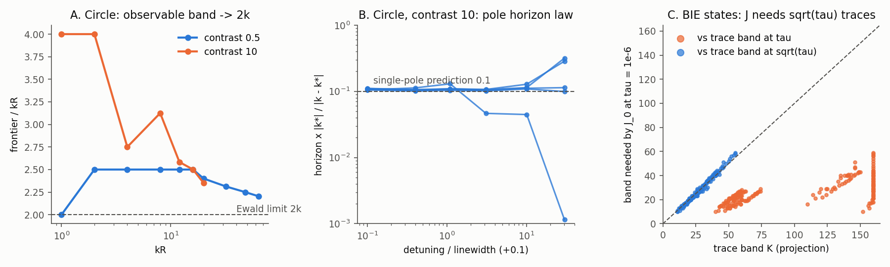

# Iteration 02 — MA-001: what the wavefield-pair identity explains

2026-09-28. Owner: Claude (Opus 5.5). Independent reviewer: unassigned.
[Plan](../iteration_01/03_plan.md), [review of the vision](../iteration_01/02_proposals/02_independent_review.md),
[evidence](../../../../results/validation/modal_atlas/MA-001/README.md).



## Bottom line

The vision's §6 bridge, `J_p = Δ L Σ_n U_n V_{−p−n}`, is exact on the circle
and on qualified noncircular BIE states. It explains two findings from
iteration 04 that had no explanation: the `~2.5k` frontier and the contrast-10
breakdown. It also gives a concrete rule for the trace band `K_u` that
sensitivities need. Two of the vision's expectations do **not** hold on the
contrast-0.5 benchmark. First, cancellation between pair terms does not
explain dim atlas cells there: brightness follows the available field
magnitude almost exactly. Second, trapped resonances do not exist at that
contrast, so they cannot explain the kite/C finite-validity failures.

## Part A — exact circle (Mie)

**A1. Identity.** The modal Hadamard sum matches an exact Mie dilation
difference to `7.7e-9` at step `1e-6`, which is the finite-difference floor.

**A2. Frontier = combined field support, tending to the Ewald `2k` limit.**
The frontier is the highest `p` whose RMS-0.01 cosine perturbation moves the
monostatic datum by 1%. It tracks `2 K_U` (trace support at 10% of peak) to
within 4 orders (≤ 4%) at every `kR ≥ 8`. `frontier/kR` is **not** constant:

| kR | 8 | 16 | 20 | 32 | 48 | 64 |
|---|---:|---:|---:|---:|---:|---:|
| contrast 0.33 | 2.50 | 2.38 | 2.40 | 2.25 | 2.23 | 2.20 |
| contrast 0.5 | 2.50 | 2.50 | 2.40 | 2.31 | 2.25 | 2.20 |

The excess over `2kR` grows like `(kR)^{1/3}`, the Bessel transition width.
Iteration 04's `2.53k` was a linear fit over `k ≤ 20`, inside this transition.
The limit is set by the exterior band because external illumination reaches
boundary orders only up to about `k_e R`. This is the diffraction-tomography
`2k` limit in boundary form, a classical result rather than a new one.

**A3. Trapped resonances: sensitivity up, validity down, by one mechanism.**
At contrast 10, orders `k_e R < |n| < k_i R` are trapped (whispering-gallery
modes). Near their poles `k*`, relative sensitivity `‖J‖/‖d‖` rises from
about 10 to 10³–10⁴. The 10% dilation linearization radius obeys the
single-pole law of vision §7.2, **including its constant**:

| Pole order | Q | horizon · \|k*\| / \|k − k*\| at detuning 0 / 1 / 3 / 10 linewidths |
|---:|---:|---|
| 5 | 923 | 0.111 / 0.109 / 0.107 / 0.128 |
| 6 | 3,912 | 0.110 / 0.109 / 0.106 / 0.114 |
| 8 | 77,598 | 0.107 / 0.106 / 0.104 / 0.111 |
| 10 | 34,742 | 0.105 / 0.104 / 0.101 / 0.109 |
| 4 | 54 | 0.105 / 0.130 / 0.046 / 0.045 (a neighbouring pole takes over) |

The constant `0.1` is exactly the 10% criterion: the pole term
`1/(k − k*(ε))` linearizes to relative error `ε|k*|/|k − k*|`. Over 200
random `kR ∈ [1, 8]`, the horizon distribution separates cleanly by contrast:

| Contrast | horizon·k, 10/50/90 percentiles | fraction < 0.01 |
|---:|---|---:|
| 0.33 | 0.090 / 0.099 / 0.132 | 0.00 |
| 0.5 | 0.070 / 0.103 / 0.183 | 0.00 |
| 3 | 0.014 / 0.045 / 0.081 | 0.08 |
| 10 | 0.003 / 0.011 / 0.018 | 0.46 |

Contrasts 0.33 and 0.5 reproduce iteration 04's `≈ 0.1/k` law. Contrast 10
is 10× shorter and resonance-dominated. This is a strong candidate mechanism
for iteration 04's contrast-10 breakdown. That breakdown was not re-run here,
so the link is not yet demonstrated.

## Part B — qualified BIE states at contrast 0.5

The states are the five noncircular truths and six endpoints (three kite, one
C, two star), at all 19 catalog frequencies, with the SC-039 solver and the
24-position paired acquisition.
[Tables](../../../../results/validation/modal_atlas/MA-001/noncircular_tables.md).

**B1. Qualification.** Modal pair sum versus nodal quadrature: `≤ 7e-11` on
the five truths and `≤ 3.1e-8` on five of the six endpoints. Nodal quadrature versus production
`shape_jacobian`: `≤ 6.1e-16` everywhere. The projected-truncation bound
holds on ten of eleven states. The exception is **`F_released_m/kite`, which
is not qualified at 512/1024 nodes**: grid discrepancy `7.5e-4`, trace
spectra unresolved at `|n| = 160`. It is SC-038's sharp-tip endpoint, which
SC-039 already flagged, and it is excluded from B2–B4.

**B2. Frontier.** In 188 of 190 state-frequency rows,
`K_U+K_V(10%) ≤ frontier(1%) ≤ K_U+K_V(1%)`. Two trace spectra that cost
nothing extra therefore bracket the atlas's observable band. Off the circle
the frontier is wider than `2 kL/2π`: 18–34 against 9.5–17 at 2.5 GHz. This
is iteration 04's order mixing, now carried by the traces' spectra. The
released update bands (`M = 19` for the C and kite endpoints) lie inside the
1% frontier at the top frequency. Nothing suggests those releases asked for
unobserved harmonics.

**B3. Trace band for sensitivities.** Over 190 rows, the projected band
giving column `p` to `1e-6` of the strongest column is

```
K_J(1e-6, p) ≈ K_trace(1e-3) + 0.61 p
```

The intercept residual has median −0.8 and a 10–90% range of −2.0 to +1.5
orders. The slope's 10–90% range is 0.56–0.71. The traces themselves need 30
to 134 more orders for `1e-6`. The product-of-tails bound therefore describes
what actually happens: sensitivities need the traces only to `√τ`, and the
band grows at about `p/2`. At low frequency, geometry sets the band, not the
wavelength. At 0.25 GHz (`kL/2π ≈ 0.5–0.9`), `J_0` needs `K = 11` (peanut),
16 (kite) and 24 (star). Endpoint artifacts show up directly. The
`A_hybrid/kite` endpoint needs 55 orders for 1e-3 traces at 2.5 GHz, against
42 for the kite truth; the unqualified sharp-tip endpoint needs 119.

**B4. Cancellation does not explain atlas brightness here.** Write
`log‖J_p‖ = log A_p − log κ_p`, where `A_p` is the norm of summed pair
magnitudes. Over `p ≤ frontier(1e-3)`, `corr(log‖J_p‖, log A_p) = 0.988–0.996`
on every state. `var log κ` is 0.01–0.03, against a brightness variance of
0.85–1.10 (decades²). Median `κ` is 1.9–2.7 and the maximum is 14.5. At
contrast 0.5, a dim cell is dim because the two trace spectra have little
product weight at that `p`, not because large opposing terms cancel. The same
`κ ≈ 2` means trace errors reach `J` with little amplification (vision §8).

## What this changes

- **For the vision.** §6 stands and is quantified. The §8 bandwidth remark
  becomes `K_u ≈ K_trace(√τ) + p/2`. The §7.2 resonance mechanism is
  confirmed exactly, but only for `k_i > k_e`. Its suggested application to
  the kite/C paths should be dropped for this benchmark. "Explain dim cells
  by cancellation" is not supported at contrast 0.5 and remains open for
  high contrast.
- **For continuation.** Two prospective quantities come from traces the
  inverse already computes. They are the per-frequency observable band
  (bracketed by `K_U+K_V`) and, when `k_i > k_e`, the distance to the nearest
  trapped pole. Neither is tested as a controller here. SC-043's lesson
  applies: a controller must beat fixed and stagnation controls at charged
  cost.

## Not established

- The `2k` frontier and the pole law are exact on circles only. Noncircular
  trapped resonances (contrast > 1) were not computed.
- The BIE part uses one contrast (0.5), paired data and eleven states. The
  frontier thresholds are relative to the strongest column, not to a noise
  model.
- B3 is about projection of exact traces. A Galerkin solve at cutoff `K_u`
  adds Schur feedback from the omitted modes (vision §8), which is not
  measured here.
- No continuation, default or controller changes.

## Candidate next steps (none dispatched)

1. **Galerkin cutoff versus projection.** Solve the existing Laurent modal
   system (`experiments/modal_muller_research`) at cutoff `K_u` and compare
   `J_p` with B3's projection rule. This separates representation from Schur
   feedback, the remaining gap in the fourth-control question.
2. **Noncircular resonances.** Repeat A3 on the star and kite at contrast
   ≥ 3 with the BIE solver (complex-frequency pole search on `det A`). Test
   whether the horizon law survives mode mixing.
3. **Prospective band test.** Use `K_U+K_V` from current traces as the band
   release signal, in a matched SC-043-style comparison. Write the gates
   before running it.
