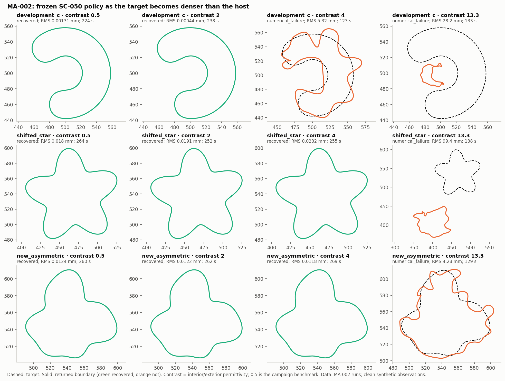

# Iteration 03 — MA-002: a denser-than-host target breaks the frozen pipeline, for identifiable reasons

2026-09-29. Owner: Claude (Opus 5.5). Independent reviewer: unassigned.
[Plan](../iteration_02/03_plan.md) (frozen before any outcome),
[evidence](../../../../results/validation/modal_atlas/MA-002/README.md).

## Bottom line

The SC-050 pipeline, unchanged except for the interior permittivity, recovers
all three scenes at contrast 0.5 (reproducing SC-050 exactly) and at contrast 2.
It fails one of three at contrast 4 and all three at contrast 13.3 (water in
sand). The diagnosis finds two failure mechanisms, and the modal atlas
explains both:

1. **Band over-release.** The frozen schedule inherits the manuscript's band
   rule `M = ⌊3 max(k, k_i)⌋`, so a denser target gets more update harmonics
   at the same frequency. The observable frontier (MA-001's column-norm
   frontier, bracketed by the trace supports `K_U + K_V`) does not grow with
   contrast; it is set by the exterior wavenumber. At contrast 4 and 13.3 the
   early stages release up to 2–3× more harmonics than the data resolve. The
   single-frequency fits then build wiggly boundaries, which fail the
   512/1024 numerical gate at every contrast.
2. **Localization search.** At contrast 13.3 the circle-fit landscape is
   resonant. SC-050's 9×9×3 grid misses the correct circle for the star, which
   a dense exact-Mie search finds. For the C, no circle fits well: the global
   circle optimum is itself 45 mm off.

The vision's resonance mechanism (§7.2) is real on this noncircular state,
but it is not the cause of the failures. At contrast 4 and 13.3 the
linearization horizon of the low harmonics shrinks 4–17×. For the directions
that shift the nearest pole at first order, the single-pole law predicts that
shrinkage within about 2×; SC-016's smooth law does not. This explains the
low LM acceptance rates, not the failures.

## Measurements

### 1. Frozen-policy recoveries

| Contrast | development C | shifted star | new asymmetric | LM trials accepted |
|---:|---|---|---|---|
| 0.5 | 0.00131 mm | 0.0180 mm | 0.0124 mm | 30/35, 31/36, 40/42 |
| 2 | 0.00044 mm | 0.0191 mm | 0.0122 mm | 36/36, 31/31, 41/46 |
| 4 | **fail**, 5.32 mm (stage 2) | 0.0232 mm | 0.0118 mm | 21/115, 31/31, 44/52 |
| 13.3 | **fail**, 28.2 mm (stage 1) | **fail**, 99.4 mm (stage 3) | **fail**, 4.28 mm (stage 2) | 57/434, 66/396, 27/189 |

Every failure is `NUMERICAL_FAILURE`: a candidate leaves the frozen
512/1024 field-agreement regime. All inputs qualify (1,024/2,048 ≤ 4.4e-14),
and the solver matches exact Mie series to ≤ 4.2e-14 at every contrast.
Contrast 0.5 reproduces SC-050's RMS errors to all printed digits.

### 2. Where each failure starts (evaluation only)

Boundary RMS against truth along the accepted states:

| Attempt | Localized circle | After warm-up | After stage 1 | Released M in stage 1 |
|---|---|---:|---:|---:|
| c4 C | correct (2.7 mm off) | 13.96 mm | 5.32 mm, wiggly | 7 (3 at contrast 0.5) |
| c13.3 C | wrong (r = 25 mm, 19 mm off) | 29.03 mm | 28.20 mm | 14 |
| c13.3 star | wrong (r = 25 mm, 78 mm off) | 101.7 mm | 99.4 mm | 14 |
| c13.3 asymmetric | correct (2.9 mm off) | 6.78 mm | 4.28 mm, wiggly | 14 |

### 3. The released band against the observable frontier

The stage-1 start state of each attempt, at each stage's highest frequency.
The frontier is the highest harmonic whose paired-Jacobian column is at least
1% of the strongest ([`diagnosis_frontier.json`](../../../../results/validation/modal_atlas/MA-002/diagnosis_frontier.json)):

| Contrast | Released M, stages 1/2/3 | 1% frontier (range over scenes) | `⌊3k_e⌋` |
|---:|---|---|---|
| 0.5 | 3 / 5 / 7 | 5 / 6–7 / 8–9 | 3 / 5 / 7 |
| 2 | 5 / 8 / 10 | 5–6 / 7 / 8–9 | 3 / 5 / 7 |
| 4 | 7 / 11 / 15 | 5–6 / 7 / 8–9 | 3 / 5 / 7 |
| 13.3 | 14 / 21 / 28 | 6–12 / 8–15 / 10–20 | 3 / 5 / 7 |

One factor at a time: the same contrast-4 C state has frontier 5 / 6–7 / 8 at
contrasts 0.5, 2 and 4, and 5 / 7 / 10 at 13.3. The frontier is insensitive to
contrast; the released band is not. This is MA-001's result (the frontier
tends to the exterior `2k` limit) and iteration 04's (the exterior wavenumber
sets detectability), now tied to an actual failure.

### 4. Localization landscape

SC-050's objective evaluated with exact Mie data on a dense grid
([`diagnosis_localization.json`](../../../../results/validation/modal_atlas/MA-002/diagnosis_localization.json);
Mie matches SC-050's recorded BIE losses to ≤ 4.6e-15):

| Attempt | SC-050 search: loss, centre error | Dense Mie optimum: loss, centre error | Truth-equivalent circle loss |
|---|---|---|---:|
| c2 C | 0.413, 36.9 mm (still recovered) | 0.297, 9.9 mm | 0.496 |
| c13.3 C | 0.624, 19.4 mm | 0.467, **44.8 mm**, r = 15 mm | 0.847 |
| c13.3 star | 1.564, 78.0 mm | 0.563, **1.4 mm**, r = 52 mm | 0.644 |
| c13.3 asymmetric | 0.038, 2.9 mm | 0.039, 1.4 mm | 0.048 |

All other attempts agree within 2 mm. At 13.3 the star's failure is a search
failure; the C's is a representation failure of the circle model.

### 5. Finite validity and the nearest pole

State: the contrast-4 C warm-up endpoint. Frequency: 0.5 GHz (`k = 1.283`).
Cosine harmonics `p = 0…8`, SC-016's 10% criterion. Every ladder has fitted
error order 0.95–1.00, so these are genuine second-order remainders
([`diagnosis_horizon.json`](../../../../results/validation/modal_atlas/MA-002/diagnosis_horizon.json)).

| Contrast | Nearest pole (Q) | Horizon p = 0 / 2 / 4 | Smooth law p = 0 / 2 / 4 | Pole law p = 0 / 2 / 4 |
|---:|---|---|---|---|
| 0.5 | none near | 0.060 / 0.083 / 0.0093 | 0.088 / 0.088 / 0.013 | n/a |
| 4 | 1.374 − 0.295i (2.3) | 0.020 / 0.020 / 0.0058 | 0.088 / 0.088 / 0.0084 | **0.018** / **0.033** / 31 |
| 13.3 | 1.2414 − 0.0237i (26) | 0.0052 / 0.0051 / 0.0036 | 0.088 / 0.088 / 0.073 | **0.0032** / 2.4 / **0.0070** |

- SC-016's one-probe-per-frequency law, fitted at contrast 0.33 on the glider,
  transfers to this GPR state at contrast 0.5: median error 0.13 dex, all nine
  harmonics within 2×.
- At contrast 4 and 13.3 the pole's first-order shift is large only along
  `p = 0` and `p = 2m` (m = 1 and m = 2 here), the circle's splitting rule on
  a near-circular state. Along exactly those directions the single-pole law
  `0.1 |k − k*| / |∂k*|` is within 2×, while the smooth law is 4–20× too
  long. Taking the smaller of the two laws gives median error 0.08 dex (88%
  within 2×) at contrast 4 and 0.29 dex (56%) at 13.3, against 0.13 and 0.32
  for the smooth law alone.
- Not explained: `p = 2` at 13.3 (measured 0.0051; its first-order pole shift
  is nearly zero, so the shortening must come from second-order coupling
  through the resonance), and contrast 2, where horizons are about 3.5×
  shorter than the smooth law and Newton finds no pole near the real axis.

### 6. The numerical stops are geometric

The contrast-4 C stage-1 endpoint at 0.75 GHz, one factor at a time
([`diagnosis_resolution.json`](../../../../results/validation/modal_atlas/MA-002/diagnosis_resolution.json)):
512/1024 discrepancy 1.15e-6 (contrast 0.5), 1.07e-6 (2), 3.05e-6 (4),
7.73e-6 (13.3; pole Q 15 at 4.6%). The 1e-7 gate fails at every contrast, so
the wiggly geometry causes the stop. Resonance amplifies the discrepancy by up
to 7×, but does not cause it.

## Interpretation

- **Measurement.** The frozen pipeline fails at contrast 4 and 13.3. The
  released band exceeds the observable frontier there. The frontier does not
  move with contrast. Wiggly states fail the numerical gate at every contrast.
- **Interpretation.** The band rule's `k_i` term was never tested in this
  repository with `k_i > k_e` on the GPR benchmark (SC-013's contrast-10
  glider used far-field plane waves and a fine `Δk` ladder). The modal
  frontier says the extra harmonics are not observed at those frequencies.
  Fitting them to one or two frequencies manufactures structure.
- **Hypothesis.** Setting the band from the exterior wavenumber (equivalently
  from the observable frontier, which tracks it) removes mechanism 1. A dense
  exact-Mie localization removes the star's search failure. Neither repairs
  the 13.3 C, whose circle model is inadequate.

## Not established

- Three scenes, one attempt each, clean data, known permittivity.
- The horizon and pole measurements use one state and one frequency.
  "Nearest pole" is the pole that Newton reaches from just below `k`. Poles
  deep in the complex plane (contrast 2) were not located.
- The band finding concerns this acquisition (24 paired near-field positions)
  and schedule. It does not say the manuscript's rule is wrong for its
  far-field setting.

## Decision

Mechanisms 1 and 2 are distinct and each has a one-change repair motivated by
the diagnosis. [MA-003](03_plan.md) tests them separately and together
against the frozen policy, then on untouched scenes.

## Amendment, 2026-09-29 (after MA-003)

MA-003's repairs (exterior band, dense Mie localization) did not recover
the failures, so this page's "resonance … does not cause the failures" was
too strong. See the [MA-003 results](../iteration_04/01_results.md#amendment-to-ma-002).
The measurements above are unchanged.

## Amendment, 2026-09-29 (after MA-004)

"The frontier is insensitive to contrast" holds at the prefix frequencies
measured here (0.5–1.0 GHz). At the top catalog frequencies the 1% frontier
grows with contrast: 34 at contrast 0.5, 55 at 4 and 84 at 13.3, at 2.5 GHz
on the star truth. See the [MA-004 results](../iteration_05/01_results.md#3-the-133-star-is-limited-by-the-final-band).
