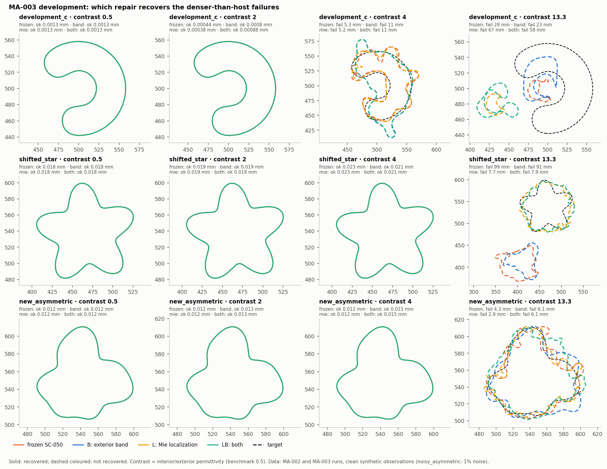

# Iteration 04 — MA-003: the diagnosed repairs are necessary but not sufficient

2026-09-29. Owner: Claude (Opus 5.5). Independent reviewer: unassigned.
[Plan](../iteration_03/03_plan.md) (frozen before running),
[evidence](../../../../results/validation/modal_atlas/MA-003/README.md).

## Bottom line

**Gate G1 fails, so the transfer stage was not run.** The exterior band (B),
the dense exact-Mie localization (L), and both together (LB) recover none of
the four MA-002 failures. They also lose none of the eight earlier recoveries.
Three of the plan's five predictions are falsified:

- B does **not** recover contrast-4 C or contrast-13.3 asymmetric.
- LB recovers none of the three failures it was predicted to recover.

The two confirmed: L alone recovers no failure, and the contrast-13.3 C fails
in every arm. Also confirmed: no arm regresses at contrast 0.5 or 2.

MA-002's diagnosis was therefore incomplete. The band and localization
problems are real: L moves the 13.3 star from 99 mm to 7.7 mm, and B removes
the stage-1 wiggles. But underneath them is a third mechanism, which the plan
missed. At contrast 4 and above, the first shape stages sit in a wrong basin.
Two evaluation-only probes, run after the gate, tie that basin to the
resonance mechanism. Moving the wavenumber off the real axis (a damped,
Laplace–Fourier transform of the time-domain data) restores the linearization
horizons. At 13.3 it also moves the circle-localization optimum onto the right
object. [MA-004](03_plan.md) tests that remedy.

## Measurements

### 1. Development attempts (frozen = MA-002)

| Attempt | frozen | B | L | LB |
|---|---|---|---|---|
| c4 C | fail 5.32 mm | fail 11.01 mm | fail 5.18 mm | fail 11.01 mm |
| c13.3 C | fail 28.2 mm | fail 22.9 mm | fail 67.2 mm | fail 58.0 mm |
| c13.3 star | fail 99.4 mm | fail 91.0 mm | fail **7.68 mm** | fail 7.90 mm |
| c13.3 asymmetric | fail 4.28 mm | fail 6.07 mm | fail 2.90 mm | fail 6.14 mm |
| the 8 earlier recoveries | 8/8 | 8/8 | 8/8 | 8/8 |

Every failure is still a `NUMERICAL_FAILURE`. The replay check reproduced
MA-002's contrast-4 C accepted states bit for bit before any MA-003 attempt
counted. B at contrast ≤ 1 is identical to frozen by construction and was not
rerun. The Mie localization took about 56 s (one thread) and 6 BIE units, against
about 100 s and 1,600 units for SC-050's search, and found the same circle
wherever SC-050's search was right.

### 2. The contrast-4 C stall is a wrong basin

Under B, the contrast-4 C stays 11–12 mm from the truth through every prefix
stage. Its stage losses are 0.040, 0.19, 0.17 and 0.21, against about 1e-5 at
contrast 0.5. At each stage's own end state and data
([`basin_check_band_c4_development_c.json`](../../../../results/validation/modal_atlas/MA-003/basin_check_band_c4_development_c.json)):

| Stage | M / K | Stage loss where it stopped | Truth truncated to K |
|---|---|---:|---:|
| 1 | 3 / 8 | 4.0e-2 | 9.7e-6 |
| 2 | 5 / 12 | 1.9e-1 | 5.0e-30 |
| 3 | 7 / 16 | 1.7e-1 | 4.4e-30 |
| 4 | 9 / 20 | 2.1e-1 | 4.8e-30 |

Each stage's representation contains a point with loss orders of magnitude
lower, and all LM trials in stages 1–2 were accepted. The path descended into
a different basin; it did not run out of freedom. Localization was correct
(2.7 mm), so the basin is a property of the 0.5–1.25 GHz objective at this
contrast from a circle start.

### 3. Damping restores the horizons (evaluation only, after the gate)

The same contrast-4 C start state at 0.5 GHz, with the wavenumber moved to
`k + iβ`. Per-harmonic 10% horizons, remainder order 0.89–1.02 in every row
([`probe_damped_horizon.json`](../../../../results/validation/modal_atlas/MA-003/probe_damped_horizon.json)):

| Contrast, β | p = 0 | p = 1 | p = 2 | p = 3 | p = 4 |
|---|---:|---:|---:|---:|---:|
| 0.5, 0 | 0.060 | 0.081 | 0.083 | 0.033 | 0.0093 |
| 4, 0 | 0.020 | 0.023 | 0.020 | 0.017 | 0.0058 |
| 4, 0.25 | 0.056 | 0.028 | 0.051 | 0.025 | 0.0091 |
| 4, 0.5 | 0.165 | 0.050 | 0.054 | 0.021 | 0.0077 |
| 13.3, 0 | 0.0052 | 0.0057 | 0.0051 | 0.0029 | 0.0036 |
| 13.3, 0.25 | 0.223 | 0.056 | 0.086 | 0.0135 | 0.0071 |
| 13.3, 0.5 | 0.061 | 0.054 | 0.045 | 0.018 | 0.0063 |

A shift of β = 0.25 (γ = β/k ≈ 0.2) brings the contrast-4 and 13.3 horizons
of the low harmonics back to the contrast-0.5 values, and above them for
some. This is the single-pole law's prediction: `|k + iβ − k*| ≥ β + |Im k*|`,
because every pole lies below the real axis. The effect is largest where the
undamped horizon was most resonance-limited (13.3, p = 0: 43×).

### 4. Damping repairs the 13.3 circle localization (evaluation only)

SC-050's objective on MA-002's dense grid at contrast 13.3, with the data at
`k(1 + iγ)` ([`probe_damped_localization.json`](../../../../results/validation/modal_atlas/MA-003/probe_damped_localization.json)):

| Scene | γ = 0 | γ = 0.25 | γ = 0.5 |
|---|---|---|---|
| C | r 15 mm, 44.8 mm off, loss 0.467 | r 53 mm, **2.3 mm** off, loss 0.045 | r 53 mm, 2.3 mm off, loss 0.028 |
| star | r 52 mm, 1.4 mm off, loss 0.563 | r 52 mm, 4.2 mm off, loss 0.018 | r 51 mm, 4.2 mm off, loss 0.009 |
| asymmetric | r 47 mm, 1.4 mm off, loss 0.039 | r 48 mm, 1.4 mm off, loss 0.017 | r 50 mm, 3.2 mm off, loss 0.013 |

The C's circle "representation failure" in MA-002 was resonance: the
undamped data make a small wrong circle fit better than the right one.
Damping removes that, and the circle fit improves 10–30×.

## Interpretation

- **Measurement.** B and L fix the symptoms they target (wiggles, and the
  star's localization), but not the outcome. The contrast-4 C stalls in a
  wrong basin. Damping lengthens horizons by the factor the pole law implies,
  and it fixes the 13.3 C's localization.
- **Interpretation.** The vision's §7.2 mechanism (strong sensitivity and
  short validity from one pole) is the common cause. It shortens the horizons
  and multiplies the local minima at real frequencies near the object's
  resonances. MA-002 called it "not the cause" because the terminal event was
  a geometric resolution stop. That event was downstream.
- **Hypothesis for MA-004.** A continuation that starts at a damped frequency
  `k(1 + iγ)` (localization and the prefix), then removes the damping before
  the full-band releases, recovers denser-than-host targets. It is the
  Laplace–Fourier idea from seismic FWI, here motivated and sized by the
  pole law: Shin & Cha, [*Waveform inversion in the Laplace domain*](https://doi.org/10.1111/j.1365-246X.2008.03768.x),
  GJI 173(3), 922–931 (2008); Shin & Cha, [*Waveform inversion in the
  Laplace–Fourier domain*](https://academic.oup.com/gji/article/177/3/1067/625063),
  GJI 177(3), 1067–1079 (2009). Their setting is seismic velocity
  inversion, not penetrable boundary continuation.

## Amendment to MA-002

MA-002's [results](../iteration_03/01_results.md) said resonance "does not
cause the failures". That was too strong. The measured terminal events are
geometric, but MA-003 shows the failures persist once those are removed.
The damping probes above implicate resonance as the underlying mechanism.
MA-002's measurements stand; this corrects the interpretation.

## Not established

- The damping probes are evaluation-only, at one state and one frequency
  (horizon), and one contrast (localization). They show the landscape
  changes; they do not show that an inverse will recover.
- Damped data require time-domain traces, which real GPR records. The
  synthetic observations here are generated directly at complex frequencies.
  That is equivalent for noise-free data but not for noise.
