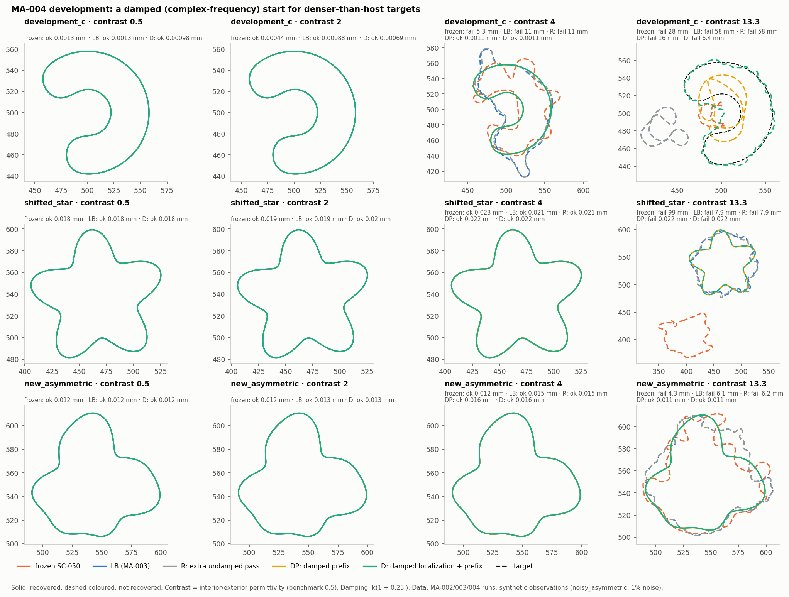

# Iteration 05 — MA-004: damping repairs the resonant prefix; the final band is the next limit

2026-09-29. Owner: Claude (Opus 5.5). Independent reviewer: unassigned.
[Plan](../iteration_04/03_plan.md) (frozen before running),
[evidence](../../../../results/validation/modal_atlas/MA-004/README.md).

## Bottom line

**Gate G1 fails, so transfer was withheld.** D (damped localization and
prefix, `k(1 + 0.25i)`) repairs 2 of the 4 MA-002 failures. The gate needed
3. D keeps all 8 earlier recoveries. This is the first arm in three
iterations to repair any failure:

- **contrast-4 C:** 0.0011 mm (frozen 5.3 mm, MA-003's LB 11 mm);
- **contrast-13.3 asymmetric:** 0.011 mm (frozen 4.3 mm, LB 6.1 mm).

The other two failures are not equally close. The **13.3 star** ends
0.022 mm from the truth, as accurate as the same scene at every lower
contrast. It fails only the residual criterion (0.69% against 0.3%). A
post-gate diagnosis traces this to the schedule's final band, not the damped
start. The **13.3 C** fails at 6.4 mm, in a wrong basin that damping does not
remove.

The controls isolate the cause. R (an extra undamped pass, no damping)
repairs nothing. DP (damped prefix, real-data localization) matches D's
verdicts everywhere. The damped prefix does the work; damped localization
matters only for the 13.3 C, which both fail.

## Measurements

### 1. Development attempts

Boundary RMS error; "res" marks a miss on the residual criterion alone.

| Attempt | frozen (MA-002) | LB (MA-003) | R | DP | D |
|---|---|---|---|---|---|
| c4 C | fail 5.32 mm | fail 11.0 mm | fail 10.7 mm | **ok 0.0011 mm** | **ok 0.0011 mm** |
| c13.3 C | fail 28.2 mm | fail 58.0 mm | fail 58.0 mm | fail 15.7 mm | fail 6.40 mm |
| c13.3 star | fail 99.4 mm | fail 7.90 mm | fail 7.86 mm | fail 0.0217 mm (res) | fail 0.0223 mm (res) |
| c13.3 asymmetric | fail 4.28 mm | fail 6.14 mm | fail 6.15 mm | **ok 0.0114 mm** | **ok 0.0114 mm** |
| 8 earlier recoveries | 8/8 | 8/8 | 2/2 run | 2/2 run | **8/8** |

R and DP ran only at contrasts 4 and 13.3 (plan). Every D attempt passed its
initial and final audits. Replay reproduced MA-002 (`frozen`) and MA-003
(`LB`) on the contrast-4 C state for state before any attempt counted. D's
accuracy at contrasts 0.5 and 2 matches the frozen policy's to within 0.001 mm.

Predictions, as written:

- D recovers the contrast-4 C, the 13.3 star and the 13.3 asymmetric: two
  of three (the star misses on residual).
- The 13.3 C is uncertain: it fails.
- DP recovers the same three but not the 13.3 C: the same two of three, and
  not the 13.3 C.
- R recovers none: confirmed.
- D loses no recovery at contrast 0.5 or 2: confirmed.

### 2. Where the damped start helps

Boundary RMS against the truth after localization and after the damped
stage 4
([`diagnosis_trajectory.json`](../../../../results/validation/modal_atlas/MA-004/diagnosis_trajectory.json);
a circle cannot match these shapes, so a correct localization reads
6.7–14.7 mm):

| Attempt | Localization: D (damped) / DP, R (real) | End of stage 4: D / DP / R |
|---|---|---|
| c4 C | 14.5 / 13.3 mm | **0.25 / 0.29** / 11.9 mm |
| c13.3 star | 7.9 / 8.0 mm | **1.17 / 1.21** / 8.24 mm |
| c13.3 asymmetric | 6.9 / 6.8 mm | **0.72 / 0.72** / 7.42 mm |
| c13.3 C | **13.6** / 39.4 mm | 7.06 / stopped in stage 1 / stopped in stage 1 |

With the same circle start, the damped prefix reaches the truth's
neighbourhood and the undamped prefix does not. This is MA-003's wrong-basin
mechanism, removed as the horizon probes predicted. Damped localization
fixes the 13.3 C's circle, as MA-003's probe predicted. The damped prefix
still stalls there at 7 mm with a stage loss of 2.6e-3, against about 1e-5
elsewhere.

### 3. The 13.3 star is limited by the final band

The 13.3 star's trajectory repeats the star's at every contrast: 0.94 mm
after the undamped pass, then 0.60, 0.20, 0.21, 0.062, 0.042 and 0.022 mm
through the releases and fixed stages. Each fixed stage ends at its band's
stationary point (every LM trial accepted; the step falls below tolerance).
The loss drops 4–7× per 6 harmonics: 5.0e-3, 2.3e-4, 5.5e-5 and 7.6e-6 at
M = 19, 25, 31 and 37. The schedule stops at M = 37.

On the real contrast-13.3 star data
([`diagnosis_crossfit.json`](../../../../results/validation/modal_atlas/MA-004/diagnosis_crossfit.json)):

| Curve | Error | Max relative residual (13.3 data) |
|---|---:|---:|
| truth | 0 | 0 |
| D endpoint, contrast 0.5 (passed at 0.5) | 0.0182 mm | 0.0086 |
| D endpoint, contrast 2 (passed at 2) | 0.0198 mm | 0.0119 |
| D endpoint, contrast 4 (passed at 4) | 0.0221 mm | 0.0165 |
| D endpoint, contrast 13.3 | 0.0223 mm | 0.0069 |

A 0.02 mm error is invisible at contrast 0.5 (residual about 1e-5) but costs
about 1% at 13.3. The 1% observable frontier at the star truth and the top
four frequencies
([`diagnosis_frontier_star.json`](../../../../results/validation/modal_atlas/MA-004/diagnosis_frontier_star.json)):

| Contrast | 5.46 | 5.78 | 6.10 | 6.42 (`k_e`, 2.5 GHz) |
|---:|---:|---:|---:|---:|
| 0.5 | 33 | 33 | 33 | 34 |
| 4 | 47 | 49 | 50 | 55 |
| 13.3 | 69 | 72 | 82 | 84 |

The final band M = 37 sits just above the contrast-0.5 frontier and far below
the contrast-13.3 one.

## Interpretation

- **Measurement.** Damping the prefix recovers two resonant failures, keeps
  every earlier recovery, and brings the 13.3 star to the same accuracy as
  at contrast 0.5. The undamped control does neither.
- **Interpretation.** Resonance shortens the linearization horizons of the
  low harmonics at the prefix frequencies (MA-002 §5). Moving the evaluation
  point off the real axis restores them, and the prefix then converges from
  the same circle. This is the Laplace–Fourier idea (Shin & Cha, GJI 2008,
  2009), explained and sized here by the single-pole law.
- **A band finding in two parts.** At the prefix frequencies the useful band
  follows the exterior wavenumber (MA-002/003). At the top frequencies the
  observable frontier grows with contrast (34 → 84), so a denser target
  demands, and the data support, a wider final band than SC-050's M = 37.
  MA-002's statement that the frontier is insensitive to contrast holds only
  for the low prefix frequencies. The Borges rule's `k_i` term matters at the
  top frequencies, not the bottom.
- **Hypothesis (MA-005).** Extending the final band to the measured frontier
  recovers the 13.3 star. It will not recover the 13.3 C, whose damped
  prefix stalls.

## Not established

- Three scenes per contrast, one attempt each, clean data, known
  permittivity, γ = 0.25 only.
- The frontier and crossfit measurements use one scene.
- The 13.3 C mechanism is not diagnosed beyond "the damped prefix stalls at
  7 mm".

## Operations note

The first development launch (6 workers) exhausted host memory within 20 s.
The OS killed the session, the user's desktop applications and every
worker, before any worker finished its initial audit. The run was repeated
from scratch with 3 workers and 4 frequency threads under a memory guard
(peak 24 GB). Neither setting changes results.

## Decision

Transfer is withheld for MA-004. [MA-005](03_plan.md) adds a truth-free
frontier tail to D, keeps MA-004's gate, and then runs MA-004's transfer
design.
