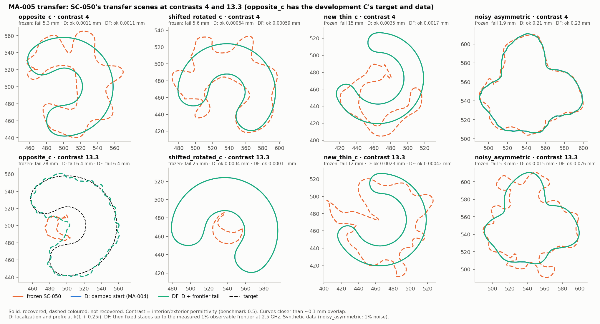

# Iteration 06 — MA-005: a damped start and a frontier-limited final band recover denser-than-host targets

2026-09-29. Owner: Claude (Opus 5.5). Independent reviewer: unassigned.
[Plan](../iteration_05/03_plan.md) (frozen before running),
[evidence](../../../../results/validation/modal_atlas/MA-005/README.md).

## Bottom line

**Both pre-registered gates pass.** DF combines two changes: a damped start
at `k(1 + 0.25i)` for localization and the prefix (MA-004's D), then fixed
stages up to the measured observable frontier.

- **Transfer (G2):** DF recovers 7 of 8 attempts on SC-050's transfer scenes
  at contrasts 4 and 13.3, where the frozen SC-050 policy recovers 0 of 8.
  One scene, `opposite_c`, turned out to repeat the development C's data.
  Without it the count is 6 of 6 against 0 of 6.
- **Development (G1):** DF recovers 11 of 12, against the frozen policy's 8.
- **Accuracy:** on clean transfer data, recovered endpoints are
  0.0001–0.0017 mm from the truth.
- **Benchmark:** at contrast 0.5 the measured frontier never exceeds the old
  final band, so DF is D there. D itself matches SC-050's accuracy to within
  0.001 mm.

Each change answers a diagnosed mechanism:

- **Resonance.** Near the target's resonances the linearization horizons
  shrink, so the first shape stages converge to a wrong basin. Damping moves
  every wavenumber away from the scattering poles, as the single-pole law
  predicts (MA-003, MA-004).
- **The final band.** At the top frequencies the observable frontier grows
  with contrast, from 34 harmonics at contrast 0.5 to 84 at 13.3. SC-050's
  final band stops at 37 (MA-004's diagnosis). The frontier is measured at
  the current iterate, so the rule needs no truth.

One scene remains unsolved: the original C at contrast 13.3 (6.4 mm). Its
damped prefix already stalls. The C rotated or thinned at the same contrast
is recovered to 0.0005 mm or better.

## Measurements

### 1. Transfer (the claim)

Boundary RMS error. Frozen and D ran from scratch under MA-005 (MA-004's
driver); DF continues each D.

| Scene | Contrast | frozen SC-050 | D | DF |
|---|---:|---|---|---|
| opposite_c (= development C data) | 4 | fail 5.32 mm | ok 0.00113 mm | **ok 0.00107 mm** |
| shifted_rotated_c | 4 | fail 5.59 mm | ok 0.00064 mm | **ok 0.00059 mm** |
| new_thin_c | 4 | fail 15.4 mm | ok 0.0035 mm | **ok 0.0017 mm** |
| noisy_asymmetric (1% noise) | 4 | fail 1.88 mm | ok 0.206 mm | **ok 0.228 mm** |
| opposite_c (= development C data) | 13.3 | fail 28.2 mm | fail 6.40 mm | fail 6.40 mm |
| shifted_rotated_c | 13.3 | fail 25.1 mm | ok 0.00040 mm | **ok 0.00011 mm** |
| new_thin_c | 13.3 | fail 11.6 mm | ok 0.0023 mm | **ok 0.00042 mm** |
| noisy_asymmetric (1% noise) | 13.3 | fail 5.30 mm | ok 0.015 mm | **ok 0.076 mm** |
| **recovered** | | **0/8** | 7/8 | **7/8** |

- **Gate G2:** DF ≥ 4 of 8 and ≥ frozen + 2: **pass**. Every recovered
  endpoint passed its independent final audit (part of the recovery
  definition), and every frozen failure is a `NUMERICAL_FAILURE`.
- **Measured frontier F and tail bands:**
  - contrast 4: F = 42–55, 1–3 added stages;
  - contrast 13.3: F = 56–68, 4–6 added stages;
  - development C at 13.3: F = 95, a wrong shape; its first tail stage stops
    numerically, and DF inherits D's endpoint.
- **Work:** DF used 1,785–3,771 fit+localization units and 296–626 s per
  recovered transfer attempt, within the 13,412-unit and 1,800 s caps. SC-050
  at contrast 0.5 used 2,706–3,185 units and 224–280 s. Damped solves run on
  the CPU reference path, so seconds overstate the cost against CUDA.
- **Not planned.** D alone recovers 7 of 8 too. The plan reports D alongside
  and does not claim it, because MA-004's own gate failed.

### 2. Development

| Attempt | frozen (MA-002) | D (MA-004) | DF | F | Tail |
|---|---|---|---|---:|---|
| c0.5 C / star / asymmetric | ok (3) | ok (3) | ok, = D | 30 / 34 / 26 | none |
| c2 C / asymmetric | ok | ok | ok, = D | 35 / 35 | none |
| c2 star | ok 0.019 mm | ok 0.020 mm | ok **0.0036 mm** | 50 | 43, 49, 55 |
| c4 C | fail 5.32 mm | ok 0.0011 mm | ok 0.0011 mm | 43 | 43 |
| c4 star | ok 0.023 mm | ok 0.022 mm | ok **0.0037 mm** | 55 | 43, 49, 55 |
| c4 asymmetric | ok 0.012 mm | ok 0.016 mm | ok **0.0044 mm** | 44 | 43, 49 |
| c13.3 C | fail 28.2 mm | fail 6.40 mm | fail 6.40 mm | 95 | stopped at 43 |
| c13.3 star | fail 99.4 mm | fail 0.022 mm (residual 0.69%) | ok **0.0013 mm** | 84 | 43 … 85 |
| c13.3 asymmetric | fail 4.28 mm | ok 0.011 mm | ok **0.0020 mm** | 56 | 43 … 61 |

- **Gate G1:** 3 of 4 failures repaired, 8 of 8 kept: **pass**.
- **Predictions:** DF recovers the 13.3 star; the 13.3 C still fails; all
  10 of D's recoveries are kept; DF = D at contrast 0.5. All four confirmed.
- **Replay:** D, rerun from scratch, reproduced MA-004's contrast-4 C in all
  75 accepted states before any DF result counted.

### 3. Noise

With 1% noise the tail does not help accuracy. At contrast 4 the error goes
from 0.206 to 0.228 mm, and at 13.3 from 0.015 to 0.076 mm; both endpoints
still recover. D already ends at the noise floor: loss 4.7e-5, against
½·(1%)² = 5e-5. The added stages lower it by only 0.5–3%, which is fitting
noise. The frontier rule measures the Jacobian's column norms and ignores
the noise level.

## Interpretation

- **Measurement.** The frozen SC-050 policy recovers none of the eight
  denser-than-host transfer attempts. The damped start with a
  frontier-limited final band recovers seven. The miss repeats a known
  development failure.
- **Interpretation.** Three measured facts explain the failures, and each
  is modal:
  - the observable frontier at the prefix frequencies follows the exterior
    wavenumber (MA-002);
  - resonances near the real axis shorten the linearization horizons, which
    damping restores by the amount the single-pole law predicts (MA-003,
    MA-004);
  - the observable frontier at the top frequencies grows with the interior
    wavenumber (MA-004).

  The working schedule uses each fact where it holds: the exterior band and
  damping early, and the measured frontier late. This answers the atlas's
  research question, for this acquisition, in the affirmative: the modal
  structure supports band decisions.
- **Relation to known methods.** Damping time-domain data before
  transforming is the Laplace–Fourier method of seismic waveform inversion:
  Shin & Cha, [*Waveform inversion in the Laplace domain*](https://doi.org/10.1111/j.1365-246X.2008.03768.x),
  GJI 173(3), 922–931 (2008); Shin & Cha, [*Waveform inversion in the
  Laplace–Fourier domain*](https://academic.oup.com/gji/article/177/3/1067/625063),
  GJI 177(3), 1067–1079 (2009). What this work adds is the pole-law
  explanation and sizing in penetrable-boundary shape continuation, and the
  measured-frontier band rule. A systematic search for prior use of complex
  frequencies in inverse obstacle or GPR shape reconstruction has not been
  done.

## Not established

- Synthetic data from the same Kress solver (at 1,024/2,048 nodes against
  the fit's 512/1,024), known permittivity, one acquisition, 24 paired
  near-field positions.
- **Transfer size.** Six genuinely new attempts, one each, over three
  shape families. `opposite_c` should have been excluded from the transfer
  set at planning time; SC-050 designed it to test the start curve, which
  localization discards.
- **Damped noise.** The noisy scene's damped data use an independent 1% draw.
  Damping real noisy traces correlates the noise and reweights it toward
  early time; this was not modelled.
- **Parameters.** γ = 0.25, the 1% frontier threshold and the step of 6 were
  fixed a priori and not varied.
- **Noise.** The frontier ignores it, and the tail loses accuracy under noise
  (§3).
- **The 13.3 C.** Its failure is not diagnosed beyond "the damped prefix
  stalls at 7 mm". The rotated and thinned C's at the same contrast recover,
  so the stall depends on pose or shape, not on the C family alone.
- No independent review yet.

## Proposed next steps (not run)

1. **Independent review** of MA-002 through MA-005: code, gates and the
   `opposite_c` disclosure.
2. **A noise-aware frontier.** Count only harmonics whose column norm
   exceeds the noise level. One change; test on the noisy scene at several
   noise draws.
3. **Realistic damped noise.** Generate time-domain traces with noise, then
   damp and transform them, instead of drawing independent noise per
   complex frequency.
4. **The 13.3 C.** A damping ladder (γ = 0.5 → 0.25 → 0), diagnosed first
   with an evaluation-only basin check of the damped prefix.
5. **Unknown permittivity.** Joint contrast estimation. This is the largest
   gap to field data.
