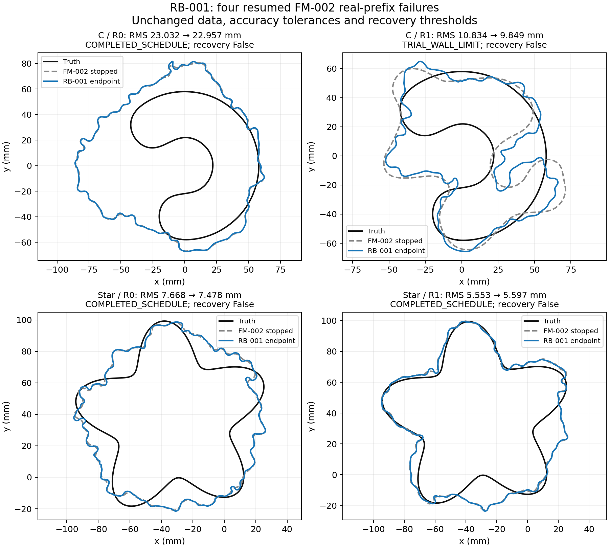

# RB-001 — accuracy-controlled continuation

2026-10-03. **COMPLETE.** Execution authorized by the user's request to
continue the relaxed-BIE track. The user explicitly selected the existing
`feature/shape-frequency-continuation` branch. No branch or worktree was
created. Owner: Codex. Independent reviewer: unassigned.

Contract: [RB-001](../iteration_01/03_plan.md). Evidence:
[`results/validation/relaxed_bie/RB-001/`](../../../../results/validation/relaxed_bie/RB-001/).

## Stage A

All four archived hard-stop stages reproduced under the archived and current
optimizer, including accepted-step counts, trial decisions, stop location,
normalized losses, fields and coefficients. Artifact/source-archive hashes
passed. Rejected-candidate coefficients were reconstructed and saved.

| Case / arm | Original accepted steps | Maximum N512/1024 candidate discrepancy | Maximum N1024/2048 candidate discrepancy | First qualified half step |
|---|---:|---:|---:|---:|
| C / R0 | 3 | 4.00004e-7 | 3.98901e-14 | 1/8 |
| C / R1 | 14 | 1.74857e-7 | 4.20199e-14 | 1/2 |
| Star / R0 | 0 | 2.72633e-6 | 1.07401e-13 | 1/2 |
| Star / R1 | 1 | 7.14928e-7 | 3.34785e-14 | 1/2 |

Each refinement and each reported half step passed the unchanged base and
candidate accuracy limits and cross-resolution loss-decrease rule. Thus both
mechanisms independently remove every immediate stop. Agreement of the finer
fields is not an independent proof of continuum accuracy, and this finding
does not establish recovery.

Stage A dispatched 3,230 frequency evaluations/derivative batches in 220.8
seconds, below its 4,000-unit/1,800-second limits. N1024 fields from each replay
were reused for the fixed-candidate N1024/2048 comparison. Finer work used one
frequency worker; original-resolution work used four. Full fields, solver
residuals, threshold distances, loss margins, rejected half steps and source
seals are retained in the bundle.

## Qualification and continuation

Full regression qualification passed: **506 tests**, with 15 warnings.
All four stops reproduced again after implementation, including
zero coefficient differences, identical trial/acceptance records and identical
work counts after reconstructing the last accepted optimizer state. The suite
and these replays took 252.7 seconds. Focused checks passed for exact
pause/resume, resolution promotion, rejection/backtracking, explicit finer-base
failure, implementation-error propagation and threaded dispatch accounting.
The production default still hard-stops at the original numerical gate.

All four gated trajectories continued sequentially. Each resume retained its
original iteration, next damping, current linearization, refined cache,
remaining stage quota, historical work/time and resolved policy queue. No
prefix or localization was rerun. C/R1's later frontier was measured afresh;
frontiers measured before the other checkpoints remained historical state.

## Returned endpoints

**No additional recovery: 0/4 under the full contract and 0/4 under the
unchanged paired contract.** Every endpoint passed its N1024/2048 numerical
audit; every original N512/1024 endpoint audit failed. Qualification at the
finer pair is explicitly used for scoring, with unchanged field, Jacobian and
finite-difference limits. Shape and residual errors still fail recovery.

| Case / arm | RMS before → after (mm) | Hausdorff upper after (mm) | Maximum relative data residual | Stop |
|---|---:|---:|---:|---|
| C / R0 | 23.0320 → 22.9569 | 60.2572 | 1.05351 | Remaining schedule completed; stage quotas |
| C / R1 | 10.8337 → 9.8494 | 30.1284 | 1.04447 | Original fitting wall cap at M79 |
| Star / R0 | 7.6679 → 7.4780 | 16.5974 | 0.968108 | Remaining schedule completed; stage quotas |
| Star / R1 | 5.5527 → 5.5974 | 19.8011 | 0.952945 | Remaining schedule completed; stage quotas |

The continued endpoints add 6, 55, 15 and 12 accepted steps respectively.
C/R0 and C/R1 still encounter 13 and 43 accuracy-rejected trials at the upper
pair. Geometry refusals and nondecreasing proposals also consume stage work.
Thus neither completing the scheduled bands nor exhausting a quota establishes
stationarity. Star/R1's RMS error slightly worsens despite accepted loss
reductions; truth was never used to choose an iterate.

## Cost and controls

| Case / arm | Historical fit units at resume | New fit units | Total fit units | Historical + new fit seconds | Fresh total seconds, including audits/scoring |
|---|---:|---:|---:|---:|---:|
| C / R0 | 6,342 | 1,824 | 8,166 | 660.93 | 373.09 |
| C / R1 | 2,641 | 5,822 | 8,463 | 1,800.08 | 1,196.34 |
| Star / R0 | 6,291 | 2,052 | 8,343 | 717.77 | 408.15 |
| Star / R1 | 6,832 | 1,900 | 8,732 | 1,160.83 | 373.71 |

All stage and global work caps were preserved. C/R1 stopped on the original
1,800-second fitting ceiling; the last in-flight operation left a 0.08-second
overrun under the before-dispatch wall check. Its remaining M85/M91 stages
were skipped. C/R0's interrupted M49 stage had insufficient remaining quota
for refinement; the policy advanced normally, with promotion occurring at M55.
The other three trajectories promoted within their interrupted stage.

Stage A took 220.78 seconds, implementation qualification 252.65 seconds, and
continued fitting/audits/scoring 2,353.79 seconds: **2,827.22 seconds (47.12
minutes)** across the recorded numerical phases, below the 10,800-second
ceiling. Development checks are separately retained; final verification also
records a conservative elapsed bound including engineering time. Each endpoint
received 228 new audit units across both resolution pairs. New fit and audit
charges match the actual backend evaluation/derivative dispatch counts for
every trajectory, including the frontier's internal derivative.

Execution used the existing RTX 5090 kernels in double/complex-double
precision, four frequency workers at N512/1024 and one at N1024/2048. There
were no backend fallbacks. Hardware, GPU process inventories, backend timings,
solver residuals and memory peaks are in the run receipts. Matrix/LU transfer
and factorization times were not separately instrumented. These single runs
are diagnostics, not a matched runtime or GPU-speedup benchmark.

## Decision

The first hypothesis is supported for all four cases: a qualified decreasing
step exists beyond each original stop. The recovery hypothesis is not
supported within this allocation: none of the four continued endpoints meets
the existing shape/residual contract. The original fixed-resolution stops did
hide available steps, but removing those stops with this response did not
produce a recovery advantage for relaxation.

Keep the ordinary damped production default and leave the response opt-in.
This is negative evidence for these selected real-prefix tails, settings and
budgets, not a universal rejection of relaxed BIE or evidence of convergence
to stationary wrong shapes. In particular, C/R1 is time-limited and the
remaining runs are quota-limited. The historical damped-arm successes remain
context, not new matched controls.

A possible next discriminating experiment is a predeclared smaller-step-first
response, since Stage A qualified such steps for every case at the original
pair. That alternative was **not run or approved** here. A broader campaign,
new penalty/curvature method, extra budget or GPU implementation also requires
its own scoped proposal.

## Evidence and implementation

- [Bundle, comparison and reproduction commands](../../../../results/validation/relaxed_bie/RB-001/README.md).
- [Qualification](../../../../results/validation/relaxed_bie/RB-001/qualification/result.json)
  and [506-test log](../../../../results/validation/relaxed_bie/RB-001/qualification/tests.log).
- [Machine-readable comparison](../../../../results/validation/relaxed_bie/RB-001/comparison.json)
  and [artifact verification](../../../../results/validation/relaxed_bie/RB-001/final_verification.json).
- Numerical changes live in `solvers/bem_inverse/continuation/lm_backend.py`
  and `runner.py`; archive selection, truth scoring and reporting live in
  `experiments/relaxed_bie/`. No numerical-package imports from experiments
  or saved results were added. The default hard-stop path reproduced all four
  original stops exactly after implementation.

The advance plan and phase source archives retain their sealed execution-time
bytes. This closeout and the track handoff carry the current completion state.
All FM-001/FM-002 originals remain unchanged. No independent review is claimed.
