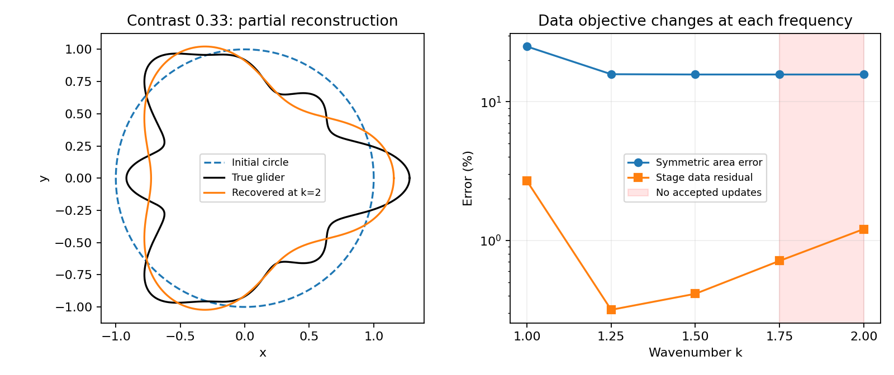

# Iteration 01 — baseline and the paper-profile stall

Opened 2026-09-22 from existing SC-001–SC-012 evidence. This is the first cycle
of the new documentation track, not a retrospective claim that those runs
followed an iteration-01 plan. [Track handoff](../README.md).

## What is established

The isolated inverse uses Cartesian Fourier geometry in an arclength gauge,
Fourier scalar normal updates and nodal Müller/Kress. Its cached single-update
API is separate from a callable continuation strategy, so frequency, update
band, curvature band, curve storage and quadrature can be changed without
rewriting the optimizer. The existing test qualification has **72 passing
tests**; this documentation change adds no numerical work.

| Evidence | Finding | Limit |
|---|---|---|
| [SC-009 ellipse](../../../../results/validation/shape_continuation/SC-009-conservative-scoring/summary.json) | Recovery passes the declared geometry/prediction checks | Small synthetic baseline |
| [SC-008 glider](../../../../results/validation/shape_continuation/SC-008-glider-extension/README.md) | Contrast 1.44 reaches k=12 with qualified fields/Jacobians and held-out error 9.98e-6 | 2022 cumulative inverse forwards; different contrast and settings from the paper cases |
| [SC-010 controller](../../../../results/validation/shape_continuation/SC-010-step-controller/README.md) | Fixed-run trajectories preserved; cached steps and adaptive handoffs qualified | Illustrative adaptive ellipse, not a robustness comparison |
| [SC-011 preparation](../../../../results/validation/shape_continuation/SC-011-paper-preparation/README.md) | Actual paper contrasts, explicit profiles, polygon area metric; one-update checks pass | Full reconstruction not attempted; high-frequency dense costs remain substantial |
| [SC-012 user run](../../../../results/validation/shape_continuation/SC-012-paper-glider-k2/README.md) | All five frequencies and resolution checks complete, but the last two frequencies accept no updates | Partial recovery at contrast .33 through k=2 |

Full published-result replication and a measured benefit from adaptive shape
or frequency continuation remain unestablished. The
[paper audit](../../../../experiments/shape_continuation/PAPER.md) records the
remaining implementation differences and unresolved author settings.

## Current failure to explain

SC-012 ran on source `b158cc6`, with the profile's fixed `1:0.25:2` grid,
contrast .33, curvature-tail limit .1 and no added step halvings. It took
**16.42 seconds, 231 forwards and 71 Jacobians**, within its shared 300-forward /
120-second budget. It accepted 59 updates, 50 of them at k=1.

The final data residual is **1.21%**, versus the `1e-5` target. Relative polygon
symmetric-area error is **15.7%**. Stops are iteration limit at k=1, small step
at k=1.25 and 1.5, then no acceptable step at k=1.75 and 2. The label
`ladder_completed` indicates frequency traversal and qualification, not recovery.

The saved trial logs show why the finite search stops: weakly filtered GN
proposals exceed the curvature limit; admissible strongly filtered proposals
fail to decrease the residual. At k=2 the raw SD proposal also fails the
curvature gate. Once filtering leaves only constant Cartesian displacement,
levels 4–10 repeat the same candidate geometry and residual.

## Interpretation and next decision

The N/2N field and full-Jacobian checks pass at every stage. That makes forward
quadrature underresolution an unlikely explanation of this particular stop.
It does not prove stationarity, a local minimum, or absence of feasible descent.
Low-frequency shape-band limits also constrain what can be recovered here.

The cheapest discriminating next check is a **single-update comparison from a
saved stalled checkpoint**: retain observations, geometry, frequency, bands,
resolution, curvature threshold and tolerances, and vary only step halving.
This tests whether the filter-only candidate search is missing usable steps
before changing the continuation strategy. It has not been run. A lower data
residual alone would not establish better recovery or justify a large campaign.

The present decision is to retain the qualified inverse/controller and this
failure as the baseline for that comparison. No numerical default changes,
new proposals, approved experiment plan, or expensive runs are introduced by
opening the folder. Subsequent proposals should state the comparison and its
small budget explicitly, then leave their resulting measurements in the next
iteration with links to the evidence bundle.
