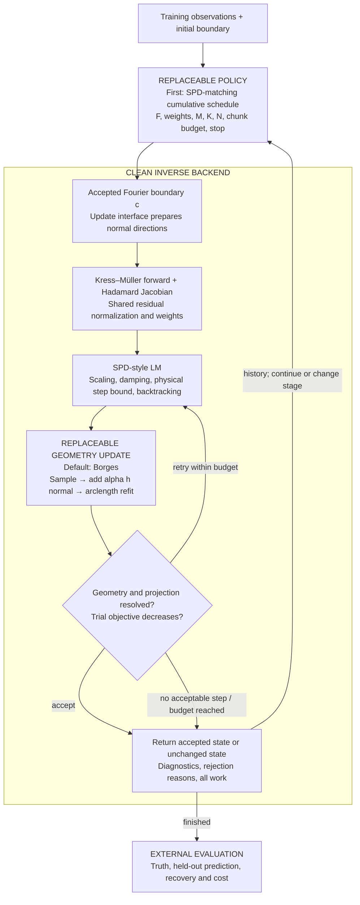

# Draft clean hybrid: Borges update, SPD-style optimization, replaceable policies

2026-09-23. Drafted with the user after the
[cleanup purpose note](01_clean_adaptive_pipeline_purpose.md). This records the
proposed architecture, not a completed implementation or a qualified combined
solver. Existing components have their own evidence; the hybrid still needs
matched qualification.

**Implemented 2026-09-23:** `updates.py` and `lm_backend.py` in the
continuation package. The first test,
[SC-020](../../../../../results/validation/shape_continuation/SC-020-spd-matched-hybrid/README.md),
passes under the SPD-matching policy; see
[iteration 07](../../iteration_07/01_results.md). The text below is the
design as drafted.

**Decision, clarified 2026-09-23:** use Borges' sampled normal displacement and
arclength refit on every trial, with SPD-style LM safeguards and an initially
SPD-matching continuation policy. Put the geometry update behind a small,
replaceable interface so other updates can be tested independently. The
mode-convolution / occasional-regauge idea is an **unimplemented, unverified
alternative**, not the selected hybrid update. The purpose is a clean backend
for adaptive-continuation research, not exact replay of either complete solver.

## Block diagram

The backend attempts one accepted update at a time; a policy chunk may contain
several such calls. A rejected trial never replaces the accepted state. Truth
and evaluation observations enter only the external evaluator.

| Module | Owns | Never sees |
|---|---|---|
| Policy | F and frequency weights, M, K, N, chunk budget, stage transitions and stop | Truth, held-out data |
| Backend / LM | Objective normalization, damping and local step control, acceptance, optimizer state and work accounting | Truth, held-out data |
| Geometry | c, evaluation, geometric validation and refit helpers | Data |
| Update strategy | Update coordinates, physical directions and metric, trial geometry, projection and gauge handling | Data, policy history |
| Physics | Forward fields and derivatives in the supplied directions; resolution diagnostics | Truth, held-out data |
| Evaluation | Boundary error, area error, held-out prediction and cost from saved outputs | Control over optimization |

For the current equal-permeability transmission model, physics uses the
Hadamard form `(kᵢ² − k²)∫ h·u·v ds` of the boundary-to-data derivative.
Forward/Jacobian refinement checks and directional finite differences through
the actual update are complementary: an N/2N forward check alone does not
establish consistency between a Jacobian and a projected geometry update.

## Selected geometry update: Borges

The step unknowns are the real Fourier coefficients `a` of physical normal
distance `h(s)` in the current arclength coordinate. For an LM trial:

1. Sample the current boundary and outward **unit** normal on a resolved
   geometry grid, separate from physics quadrature N.
2. Form `z_trial = z + alpha h(s) normal` at those samples.
3. Represent the displaced samples at sufficient temporary resolution, then
   refit in arclength into the requested Cartesian storage band K.
4. Report the trial boundary, physical displacement, projection error and
   geometric diagnostics. The backend checks the trial objective and accepts
   or retries it using its LM/backtracking rules.

This is the existing geometric operation in
[`geometry.displaced`](../../../../../experiments/shape_continuation/geometry.py).
The hybrid combines it with SPD-style optimization; it does not inherit the
entire Borges optimizer, Gaussian-filter search or curvature threshold by
implication. Any filtering or curvature constraint must be an explicit,
recorded setting shared by the compared policies. Storage projection accuracy
and curvature admissibility are different checks.

Arclength refitting is part of every trial, including rejected trials, and
its cost is counted. Existing evidence includes the glider recovery in
[SC-013](../../../../../results/validation/shape_continuation/SC-013-paper-glider-recovery/README.md)
and projection-related rejections in
[SC-019](../../../../../results/validation/shape_continuation/SC-019-step-halving/README.md).
These establish experience with this update, not universal robustness or
qualification of the proposed LM hybrid.

## A small, replaceable update interface

Select an `update_strategy` when constructing a run, independently of its
`continuation_policy`. Keep that strategy fixed throughout a policy comparison.
The interface describes both the infinitesimal directions used by the
Jacobian and the finite operation that constructs a trial; replacing only
the final coefficient assignment could leave these inconsistent.

The following is a proposed contract, not an API already implemented:

| Operation | Input | Output / responsibility |
|---|---|---|
| `prepare` | Accepted curve, update band M, storage band K and numerical tolerances | Local update space, coordinate/scaling metadata and normal-velocity columns evaluated on requested grids |
| `measure` | Local space, coefficients a and trial scale alpha | Physical normal-displacement metric for step bounds and stopping; coefficient norms need not mean the same thing across strategies |
| `trial` | The same local space, a and alpha | New Fourier boundary or structured failure; projection error, speed ratio, validity, refit count and geometry work |

The Borges strategy supplies arclength harmonics of h to `prepare` and the
sample–move–refit operation to `trial`. A future strategy may use different
coordinates and gauge handling while exposing their physical meaning through
the same contract. It reuses geometry helpers; no general plugin framework
or duplicate physics implementation is needed.

The backend owns LM, residual evaluation, acceptance and committing state.
Update strategies do not choose frequencies, inspect residuals or accept their
own trials. Failures distinguish self-intersection, poor parameter spacing and
unresolved projection; lack of objective decrease is a backend outcome. Failed
work remains in the report.

Verify that each strategy's supplied normal velocities match the first-order
shape change of its actual trial operation within declared numerical
tolerances. Truncating a coefficient update can change those velocities.
Rebuild local directions after geometry or basis changes; make cache validity
and LM-state carry/reset rules explicit when the objective, coordinates or
resolution change.

## First comparison and later policy experiments

The first policy matches the selected SPD reference's cumulative frequency
sets and order, weights/normalization, stage work limits and stopping rules.
Record the concrete SPD runtime/configuration. Use its existing single-object
cases with identical observations and initial boundaries, verified numerical
resolution and a declared mapping of shape freedom. Equal numeric mode counts
in different coordinates do not establish equivalent update spaces.

Current SPD's Cartesian runtime already uses guarded reciprocal/Hadamard
shape derivatives. The comparison concerns the update space, finite geometry
update and declared optimizer differences, not the introduction of an analytic
derivative. The older finite-difference reference used in SC-018 is not
interchangeable with this modern SPD baseline.

Once the hybrid is qualified, freeze the backend and Borges update to compare
fixed and adaptive continuation policies. To study an alternative geometry
update, hold the policy fixed and change the update strategy separately.

## After SPD comparison passes: atlas, predictive checks, then strategies

The research sequence should be **qualified hybrid → qualified local atlas →
measured predictive value → simple adaptive policies → independent evaluation**.
Passing the SPD comparison establishes a usable numerical foundation on the
tested single-object cases, not an adaptive-method result. Before running that
comparison, define passing through recovery coverage, geometric and held-out
accuracy, numerical resolution and accounted cost. Identical trajectories or
a speedup over SPD are not prerequisites, but a material cost increase needs
to be understood and reported.

**1. Freeze the reference and collect representative trajectories.** Keep the
Borges update, LM safeguards, objective conventions and numerical checks fixed.
Retain the SPD-matching fixed policy as the main control. Save early, middle,
late and stalled states from varied development cases, including failures.
This supplies actual optimization states on which an atlas must be useful;
circle or near-truth measurements alone are insufficient. A cheap controller
using only residual progress, accepted/rejected steps and work is a second
control for judging whether atlas probes earn their cost.

**2. Reuse and requalify the atlas on the hybrid.** We already have
[`atlas.py`](../../../../../experiments/shape_continuation/atlas.py),
[`horizon.py`](../../../../../experiments/shape_continuation/horizon.py) and the
[SC-015–SC-017 findings](../../iteration_04/01_results.md). The next task is to
connect them to the update interface and cumulative objective, not restart
the atlas from scratch. At the current accepted boundary, retain separately:

| Atlas layer | What it can inform |
|---|---|
| Sensitivity at a declared physical displacement scale | Which directions produce a measurable data change |
| Signed residual projections | Which directions can reduce the current training mismatch locally |
| Full Gauss–Newton blocks and their spectra | Coupled or nearly indistinguishable directions, and information added by another frequency |
| Predicted versus measured finite-step response | Whether that local model remains useful at a step the optimizer could take |
| Probe and optimization work | Whether acting on the diagnostic can repay its cost |

Declare the physical shape metric, coordinate scaling, frequency weights and
data normalization or noise whitening. If the atlas uses an orthonormal basis
while LM uses raw Fourier coefficients, expose the conversion. Candidate
frequencies come from available training data; evaluation observations remain
outside the atlas. Keep storage K and quadrature N as accuracy requirements,
distinct from the research choice of update freedom M.

**3. Establish what the atlas predicts before using it to control a run.**
On saved development states, record atlas recommendations without changing
the baseline trajectory, then use bounded trial steps or short continuations
to measure their consequences. Ask whether a diagnostic predicts useful
decrease, failure of the local model, benefit from adding a frequency or
benefit from releasing more update directions. Compare against the cheap
progress-based control and include probe costs. A colorful sensitivity map or
well-conditioned Jacobian alone does not answer these questions.

The earlier band-policy failures make coordinate handling a specific concern:
an arclength harmonic with the same index at two different boundaries need
not represent the same physical deformation. Check any cross-iterate transport
before reusing atlas entries or interpreting their change as new information.
Until that transport is qualified, recompute at the current boundary and
restrict claims to its current update space. Likewise, remeasure local-model
validity with the actual Borges update and LM proposals; the earlier empirical
`0.12/k` horizon is not a universal step bound. If a diagnostic does not predict
useful decisions, revise or drop that diagnostic before a larger policy study.

**4. Design the smallest policies supported by those measurements.** Begin
with the available actions “spend another chunk here,” “add the next training
frequency” and “enlarge the update band.” Plausible hypotheses are:

- Frequency adaptation: add a frequency when it contributes useful directions
  and its local model predicts a workable step; use measured trial agreement
  to control how far continuation advances.
- Band adaptation: release additional directions when they are sufficiently
  observable and useful to the residual at a trustworthy displacement scale;
  column magnitude alone is insufficient.
- Joint adaptation: choose between more work, more data and more shape freedom
  by predicted benefit per measured cost, only after the separate decisions
  have demonstrated value.

These are hypotheses to test, not preselected winning rules. Compare the fixed
policy, cheap progress-based policy, atlas frequency-only policy with the band
rule fixed, and atlas band-only policy with the frequency schedule fixed.
Then test the combined policy. For cumulative objectives, assess the actual
weighted frequency set; independent single-frequency scores do not by
themselves determine the best combined step. Keep the backend and update
strategy common across all arms.

**5. Turn development findings into publishable evidence.** Count all probes,
rejected trials and numerical qualification in the common budgets. Compare
recovery success, geometry, held-out prediction and work to reach specified
accuracy; retain accuracy-versus-work histories and all failures. After tuning
on development cases, freeze the policy and evaluate on untouched single-object
shapes, starts, noise realizations and acquisition conditions within a declared
scope. Separate ablations should show what signed information, coupling and
local-model checks contribute. The desired claim is a reproducible explanation
of when a diagnostic improves continuation and when its cost or limitations
erase the benefit. An atlas by itself is a characterization, not that claim.

This section records the intended research direction. It does not report a
passed SPD comparison, a qualified hybrid atlas or newly executed experiments.

## Terms

| Term | Symbol | Meaning | Current code |
|---|---|---|---|
| boundary coefficients | `c` | Cartesian Fourier modes of `z(t)`, `\|n\| ≤ K`. The only representation of the boundary | `FourierCurve.coefficients` |
| parameter | `t` | The curve's own parameter; the gauge decides what it means | — |
| storage band | `K` | Number of boundary modes kept | `Stage.curve_modes` |
| update band | `M` | Number of modes of the step function | `Stage.update_modes` |
| nodes | `N` | Quadrature points for the physics only; never used to represent the boundary | `Stage.nodes` |
| frequency set | `F` | Frequencies fitted together in one objective: one (Borges-style) or cumulative (SPD-style) | One `Observation` per decision; cumulative sets not yet supported |
| update coefficients | `a` | Coefficients of physical distance h for the selected Borges strategy; alternatives must declare their coordinates | GN/SD proposal vectors in `optimise_step` |
| normal distance | `h` | How far each point moves along the outward normal | `geometry.normal_basis` |
| step | — | One LM proposal, before checks | — |
| accepted update | — | A step that passed every check | — |
| gauge | — | The rule fixing what `t` means (arclength here; polar angle in SPD) | — |
| regauge | — | Re-expressing the same curve in its gauge; for arclength, a refit | `geometry._refit_samples` |
| speed ratio | — | `max\|z′\| / min\|z′\|`: how unevenly `t` is spaced | — |
| projection error | — | Error of representing the trial in storage band K; distinct from a curvature-tail constraint | `geometry._refit_samples` |
| decision | — | The policy's output for one chunk | `continuation.Decision` |

## Where each part comes from

| Part | Source |
|---|---|
| Normal-only update: any simple closed curve, no star-shape requirement | Borges ([current package](../../../../../experiments/shape_continuation/geometry.py)) |
| Hadamard derivative on normal modes | [Current continuation implementation](../../../../../experiments/shape_continuation/forward.py); modern SPD also has reciprocal shape derivatives |
| LM with scaling, damping escalation, step bound and admissibility checks | SPD baseline (`solvers/sdf_inverse/radial_topology.py:1313-1379`) |
| Cumulative frequency sets as one policy option | SPD baseline / TOP-025 schedule |
| Replaceable update interface | Proposed separation of directions, physical metric and finite trial construction |
| Mode-only update, speed-triggered regauge | Deferred alternative; unimplemented and unverified |

The two existing update paths, for reference:

| | Borges (current package) | SPD baseline core |
|---|---|---|
| Step unknowns | Normal distance `h(s)`, harmonics in current arclength | Translation plus radial profile `δρ(θ)` in the gauge-fixed subspace |
| Transversal field | Normal `ν`: valid for any simple curve | Radial ray `e(θ)`: valid only while star-shaped about the centre |
| Update | Sample, add `h·ν`, fit a temporary band | Exact coefficient addition |
| Gauge | Arclength refit every trial; rejects if tail > 1e-7 relative | Polar angle; a linear subspace, so addition stays gauged exactly |
| Main cost | Arclength is a poor band for some targets | Star-shaped family only |

## Deferred alternative: mode-based normal update

This records a possible future update strategy, not the selected baseline or
an available code option. The following construction remains unqualified:

- Update direction is the speed-weighted normal `−i·z′(t)`, which is a finite
  polynomial. A step moves each point by `g(t)·(−i·z′(t))`, i.e. a normal
  distance `h = g·|z′|`. Its modes are a convolution,
  `δcₙ = Σₘ gₘ·(n−m)·c₍ₙ₋ₘ₎`, of band `K+M`; cut at `K` with a tail check.
- Optional tangential correction `σ(t)·z′(t)` to control point spacing. Its
  precise discretization and behavior between regauges require verification.
- Regauge (the arclength refit) only when the speed ratio passes a threshold.

The convolution identity holds before truncation. It does not establish that
the resulting finite update, LM metric or recovery behavior is equivalent to
Borges. Even with a regauge every step, matching the two algorithms requires
more than changing a threshold: the basis, scaling, projection and step
construction must agree.

Tangential velocity control has literature support for continuous interface
evolution, for example
[Fast–Shelley, §3.3.2](https://math.nyu.edu/~shelley/papers/FS2004.pdf), following
Hou–Lowengrub–Shelley. This supports the spacing-control idea, not our proposed
combination of LM, truncation and occasional regauging. Tangential velocities
are invisible to the first-order shape derivative; a finite additive
tangential step need not preserve the shape or data exactly. Normal-only
unknowns remove freely optimized tangential directions but do not prevent
parameter spacing from changing as the boundary moves.

**Unverified exploratory numbers retained from the 2026-09-23 discussion.**
These were reported as one-off calculations without saved evidence bundles.
They are not qualification of the candidate or support for adopting it; any
future investigation must reproduce and check them.

| Check | Result |
|---|---|
| Speed ratio − 1 after one step on the glider, normal only | `2.5e-2` at ε = 1e-3, `2.9e-1` at ε = 1e-2 (first order) |
| Same, with the gauge slide | `7.8e-4` at ε = 1e-3, `7.5e-2` at ε = 1e-2 (second order) |
| Polar gauge under addition of two gauged curves | Violation `8e-16` (exact) |
| Glider held in arclength to 1e-7 | Needs band 320 (240 fails at 1.22e-7); polar angle needs band 9 |

**Risks that could make the candidate no better.**

1. Drift rate: if real trajectories trip the regauge almost every step, the
   cost returns to the baseline's.
2. The regauge is still the arclength refit, with the same band problem; the
   candidate only calls it less often.
3. The accumulated tail over a real trajectory is unmeasured.
4. Cusps and self-intersections are a geometric limit of normal moves and are
   unchanged.
5. Between regauges the harmonics of `g` live in `t`, not arclength, so their
   meaning drifts slightly.

**Possible future qualification, separate from this baseline.**

1. *Geometry only, zero physics solves.* Drive circle → glider and circle →
   star with realistic normal-step sequences through both updates. Measure the
   shape difference between them, tail sizes, speed-ratio growth and the
   number of regauges.
2. *Matched inversion.* Only if stage 1 shows fewer refits or rejections at
   equal geometric accuracy: same policy, data, starts and budget, changing
   the update strategy with its basis and physical metric explicitly recorded.

**Decision rule.** A candidate must demonstrate comparable recovery reliability
and accuracy with a measured cost benefit. Geometry-only speedups or fewer
refits are insufficient. Borges remains the selected update unless evidence
supports a separate decision to replace it.

## Open settings

- Exact SPD reference configuration, mapping of shape freedom and explicit
  differences introduced by physical normal-distance step bounds.
- LM settings, physical metric (maximum or RMS normal distance), and rules
  for carrying or resetting damping across stages.
- Geometry/refit resolution and tolerances; any separately declared curvature
  constraint. A policy's requested K and N must meet numerical accuracy checks.
- Future policies may choose single or cumulative frequency sets; the first
  comparison uses the SPD-matching cumulative schedule.

The default geometry update and its every-trial arclength refit are settled
for this proposal. Alternative gauge mechanisms are deferred experiments.
