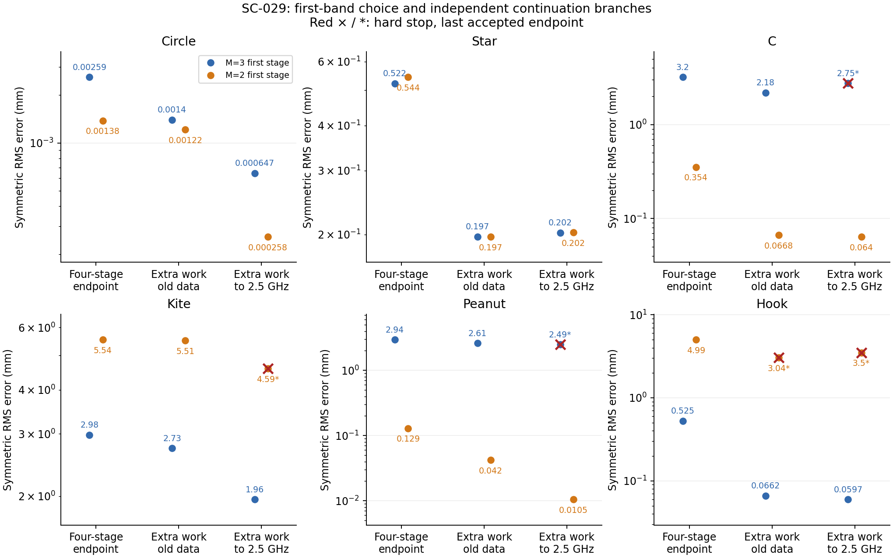

# Iteration 12 — atlas strategies tested (SC-029)

2026-09-24. Owner: Codex. Independent reviewer: unassigned.
**Execution: COMPLETE.** All 36 planned endpoints are recorded: 31
completed schedules, three numerical-accuracy stops and two time-limit
stops. Neither strategy passes the frozen robustness criteria. The result
supports case-specific benefits and a more precise next question; it does
not support replacing the default ladder.

## Reading order and experiment structure

1. [Independent atlas interpretation](../iteration_10/01_results.md):
   what the 1,286-curve dataset measures and where it is incomplete.
2. [Strategy proposal](../iteration_10/02_proposals/01_atlas_strategies.md):
   initial-band protection and added frequencies, with alternatives deferred.
3. [Original SC-028 plan](../iteration_10/03_plan.md) and
   [failed preflight](../iteration_11/01_results.md): P=48 fails refinement
   on rough curves; the original failure is retained.
4. [SC-029 plan](../iteration_11/03_plan.md): qualify the actual M<=19
   inverse space at the unchanged tolerance before any recovery outcome.
5. [Complete results bundle](../../../../results/validation/shape_continuation/SC-029-atlas-strategies/README.md):
   all errors, Hausdorff distances, costs, plots, failures, raw histories,
   provenance and reproduction commands.

The comparison crosses six development cases with two four-stage prefixes
(original M=3 first, or M=2 first) and three endpoints. The suffixes either
repeat the original four frequencies or add five frequencies through
2.5 GHz. They start from identical saved states and use the same enlarged
bands and work ceilings. This controls for additional optimization and
band opening when measuring the effect of new data. Actual work is allowed
to differ. Truth is used only for post-run evaluation.

All six original prefixes reproduce SC-025 bitwise with identical work.
The numerical solver, step control, resolution, refit tolerance, acceptance
gates and production defaults are unchanged. No branch or worktree was
created; work remains on `feature/shape-frequency-continuation`.

## Results and decisions

| Proposed contrast | Six-case geometric mean RMS ratio | Worst ratio | Decision |
|---|---:|---:|---|
| M=2 first stage / original first stage | 0.668 | 9.505 | Reject as a universal replacement |
| Higher frequencies / extra work on old data, original prefix | 0.963 | 1.260 | Not qualified; C time stop and peanut numerical stop |
| Higher frequencies / extra work on old data, M=2 prefix | 0.786 | 1.151 | Not qualified; added kite numerical stop; both hook paths incomplete |
| M=2 + higher frequencies / original endpoint | 0.256 | 6.655 | Not qualified; combines band, data and work effects |

Ratios use the prospective 0.01-mm RMS floor. Qualification requires mean
<=0.8, worst <=1.5 and no additional hard stop; the frequency strategy must
pass for both prefixes. Every case remains in the comparison, including
last accepted endpoints of stopped paths. These are development decisions,
not estimates of asymptotic accuracy or held-out generalization.

**Initial-band choice has opposite effects on different shapes.** M=2
reduces C RMS from 3.202 to 0.354 mm and peanut from 2.944 to 0.129 mm,
but worsens kite from 2.983 to 5.537 mm and hook from 0.525 to 4.994 mm.
All twelve prefixes completed. Peanut remains much smoother with the
smaller first band; hook becomes much rougher. Lower harmonic count alone
does not control finite-step regularity.

**The old-data control changes the interpretation of the atlas.** With
the original prefix, extra work on the same four frequencies improves all
six cases and finishes all six schedules. Its descriptive geometric mean
ratio is 0.545, at 6,419 rather than 2,011 total path work units (3.19x).
The control changes iterations, bands and stage restarts together; their
individual contributions remain unresolved. These measured improvements
show that the original 1.25-GHz endpoints were not solely frequency limited.
This contrast was not a preregistered strategy-adoption gate.

**Higher frequencies sometimes improve accuracy, sometimes save work.**
With M=2 on peanut, extension reaches 0.0105 mm instead of the old-data
control's 0.0420 mm, at 525 vs 342 units. With M=2 on C, error is similar
(0.0640 vs 0.0668 mm) at 582 vs 1,351 units. With the original hook prefix,
it gives 0.0597 vs 0.0662 mm at 525 vs 1,303 units. Star error is slightly
worse with added frequencies (about 0.202 vs 0.197 mm), despite fewer
units. The original kite's RMS improves to 1.958 mm but its 9.57-mm
Hausdorff error shows that the local protrusion persists.

## What failed and what was verified

SC-028's full P=48 preflight failed on C, kite and peanut. The separately
declared active-space diagnostic passes every M<=19 column at N=512/1024
on the twelve reference cells, worst error 5.37e-7 against 1e-6. SC-029
narrows that qualification claim; it does not erase the full-atlas failure.

Later numerical guards stopped original-prefix peanut extension at stage
9, M=2 kite extension at stage 5, and M=2 hook old-data continuation at
stage 7. These rejected trials exceeded the existing field-discrepancy
tolerance; earlier accepted curves remain valid under that gate. The
old-data hook failure makes clear that numerical obstruction is not
exclusive to higher frequencies. The C original-prefix extension and hook
M=2 extension reached the 3,600-second path limit. Their returns overshot
by 0.314 and 3.600 seconds because the ledger checks between operations.
No tolerance or budget was increased. Completed schedules also include
normal iteration-cap and no-decreasing-step returns, not just convergence.

**Validation passed:** 33 targeted tests before dispatch; all six baseline
replays exact; all 1,330 accepted steps pass cross-resolution checks
(maximum field discrepancy 8.41e-8); all 36 endpoints pass source/input/
evidence hashes, parent-start checks, work accounting and within-stage
loss monotonicity. The campaign used 21,272 unique inverse work units,
684 separate endpoint-evaluation solves and 96 earlier qualification/
diagnostic units. At most twelve single-thread processes shared a machine
whose load was not controlled. Work-unit differences are not wall-time
speedup measurements.

## Atlas conclusions after intervention

The audit preserves the dataset while correcting three interpretations:
column sensitivity does not establish joint harmonic identifiability;
967/1,286 normal-ray projections have coverage below 99%; and the noise
threshold assumes sigma=0.001 per real normalized component, rather than
measuring channel-relative noise. Repeated paths yield 24 distinct
pathological roughening transitions, all in stage 1, rather than 39
independent events.

The [filtered sensitivity reanalysis](../../../../results/validation/shape_continuation/SC-026-independent-audit/README.md)
uses the actual four/nine training-frequency sets and high-coverage,
low-misalignment states. For the 57 near-converged states, the median
projected-error share above the strict 0.1-mm-move threshold rises from
1.02% to 91.18% with added frequencies. This remains a local, truth-assisted
hypothesis under assumed noise. The measured continuation outcomes show
why it is not a controller or an optimizer-recovery certificate.

## Next questions, not executed here

Keep the original ladder as the comparison baseline. The strongest next
steps suggested by these results are:

| Priority | Question | Discriminating control |
|---|---|---|
| 1 | Can additional work remove stalls without changing the data? | Separate extra iterations at M=9 from band opening and stage restarts, at a fixed work budget |
| 2 | Can finite-step regularity avoid the bad initial trajectories and numerical obstructions? | A separately qualified physical/regularity step rule; preserve field accuracy and compare with both existing prefixes |
| 3 | Can data-only diagnostics select when a smaller prefix or added frequency helps? | Freeze a decision rule without truth, then test genuinely new shapes, starts, contrasts and noise |

SC-027's Sobolev metric remains a separate unexecuted proposal. No new
campaign, noise robustness, fresh-case claim or default promotion is
implied by this closeout. The user's requested atlas analysis, strategy
proposal, bounded testing and documented comparison are complete, with
commit/push checkpoints at each milestone.
