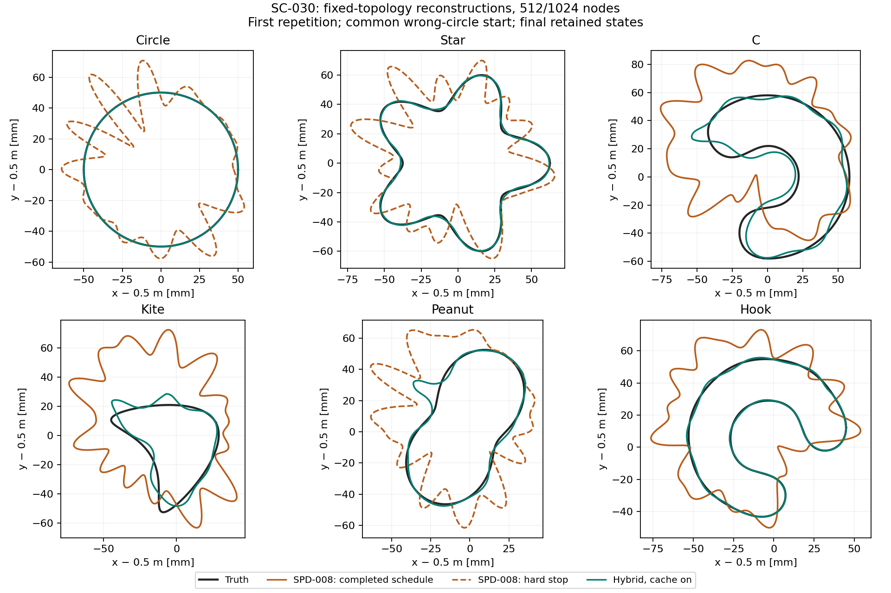
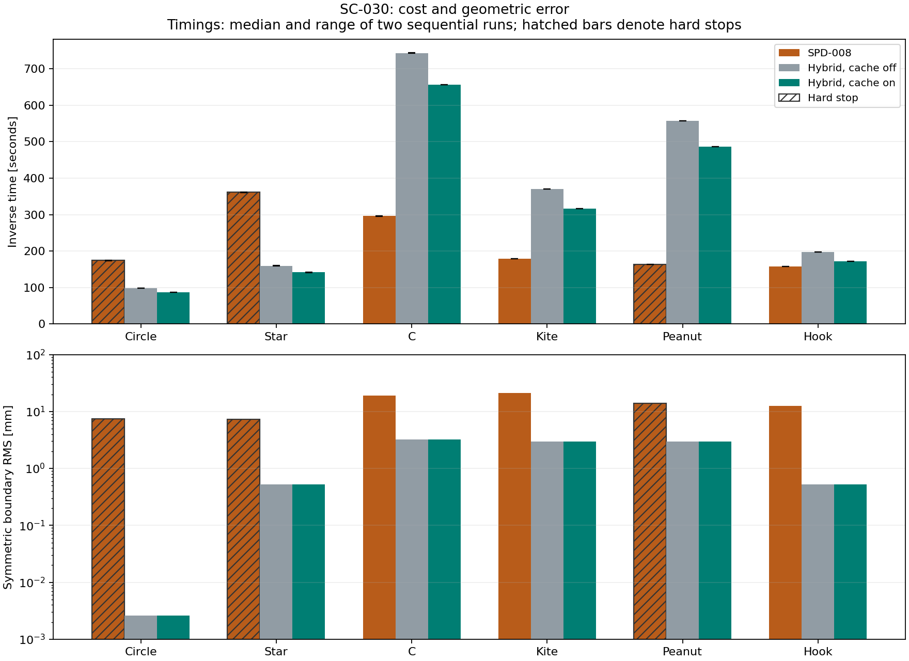

# SC-030 — SPD-008 versus the clean hybrid

**2026-09-24 interpretation amendment:** the user-requested
[legacy baseline audit](../iteration_15/02_proposals/01_legacy_baseline_audit.md)
confirms six successful topology-free legacy recoveries and identifies material
optimizer/step-control differences from this direct K17 continuation arm.
SC-030 does not establish superiority over that successful legacy algorithm.
The measurements and exact cache-equivalence findings below are unchanged.

**Complete:** all 36 fresh-process runs are retained. SPD-008 is now the
comparison reference, and exact fit-local geometry reuse is qualified for the
clean hybrid. The cache reduces total hybrid inversion time by 12.62%,
with identical scientific trajectories and work in all twelve paired runs.
The clean fixed ladder has lower final boundary RMS error on all six common
starts. This is a fixed-topology continuation result, not a comparison of the
complete topology pipelines.

## What was compared

The [frozen contract](../iteration_12/03_plan.md) specified SPD-008, the clean
hybrid with caching off, and the same hybrid with caching on, each run twice
in fresh sequential processes. Both inverses used the same wrong circle,
noiseless observations, cumulative 0.5/0.75/1.0/1.25-GHz schedule, 512/1024
production/refined nodes, 22 iterations per stage, and work/time limits.
Truth was used only for scoring the final retained state.

SPD uses its original K17 polar-angle representation, all 33 reduced directions
at every stage, native derivative/feasibility guards, and an 8-mm radial floor.
Its execution selects the compiled profile, real-Bessel kernels and certified
exact geometry reuse; the [historical SPD-008 qualification](../../speedup/iteration_08/01_results.md)
covers four topology cases, not these six starts. The hybrid keeps K192
arclength storage, the M=3/5/7/9
normal-update ladder, coefficient clipping and the V2 1e-5 refit guard.
The hybrid retains its existing kernel implementation. Only exact validation
reuse was transferred; no optimizer, band, frequency or numerical gate changed.

These are declared algorithm differences. In particular, SPD is not an
unrestricted Cartesian shape space, and this experiment cannot identify
harmonic restriction alone as the cause of a recovery difference. The
[implementation review](../../../../results/validation/shape_continuation/SC-030-spd008-comparison/implementation_review.md) records the original
fitters, wrapper exclusions, coordinate conventions and scoring placement.

## Six-case results

| Case | SPD RMS, mm | Cached hybrid RMS, mm | SPD inverse, s | Cached hybrid inverse, s | SPD outcome |
|---|---:|---:|---:|---:|---|
| Circle | 7.4930 | 0.0026 | 174.1 | 86.7 | Numerical stop, stage 1 |
| Star | 7.3421 | 0.5222 | 361.1 | 141.5 | Derivative stop, stage 2 |
| C | 18.9643 | 3.2020 | 295.8 | 656.3 | Schedule completed; stagnation |
| Kite | 21.3187 | 2.9826 | 179.1 | 316.3 | Schedule completed; stagnation |
| Peanut | 13.8090 | 2.9443 | 162.9 | 486.2 | Derivative stop, stage 2 |
| Hook | 12.6427 | 0.5254 | 157.1 | 171.5 | Schedule completed; stagnation |

Times are inversion-only medians of two runs. The [complete table](../../../../results/validation/shape_continuation/SC-030-spd008-comparison/comparison_table.md)
gives both timing ranges, both hybrid arms, work and conservative Hausdorff
bounds. Cache off/on and both repetitions reproduce the same scientific
trajectories; the cached and uncached hybrid arms have identical errors.

SPD stops during stage 1 on numerical resolution for the circle, and during
stage 2 on unresolved derivative columns for star and peanut. Its C, kite and
hook schedules complete with large errors; kite and hook accept no further
updates after stage 1. Short elapsed times to these outcomes are not recovery
speed wins. The circle's retained endpoint also fails the final resolution audit over
all four training frequencies; accepted-step checks were on each stage's active
frequency prefix. The other five SPD endpoints pass that audit.

Every hybrid schedule completes and every endpoint passes the training-frequency
resolution audit. Its C, kite and peanut errors remain approximately 3 mm, with
visible remaining shape defects. Schedule completion is not a recovery
certificate. This comparison sets no new binary success threshold after seeing
the outcomes.

## Cost of exact reuse

| Case | Cache off, s (range) | Cache on, s (range) | Time reduction |
|---|---:|---:|---:|
| Circle | 98.23 (98.10–98.36) | 86.73 (86.72–86.74) | 11.71% |
| Star | 159.50 (159.09–159.92) | 141.51 (141.25–141.77) | 11.28% |
| C | 743.79 (743.37–744.21) | 656.29 (656.17–656.41) | 11.76% |
| Kite | 370.38 (370.25–370.52) | 316.31 (316.27–316.36) | 14.60% |
| Peanut | 557.47 (557.39–557.55) | 486.23 (486.08–486.38) | 12.78% |
| Hook | 197.47 (197.36–197.59) | 171.47 (171.44–171.50) | 13.17% |

Across the twelve paired hybrid comparisons, inversion time falls from 4253.7 to 3717.1 seconds
(12.62% less time). This is an execution improvement: all twelve cached/off
pairs match exactly in accepted states, trials, stops and work. All 24 hybrid
endpoints and work counts also match the historical SC-029 fixed-ladder baseline.
The newly memoized hybrid spatial predicate records no hits in these runs;
the measured saving comes primarily from reuse in the shared Kress adapter's
intersection checks. The cache's 16-MiB bound is respected throughout.

The [work categories](../../../../results/validation/shape_continuation/SC-030-spd008-comparison/work_categories.csv) distinguish full frequency
systems, derivative probes and reciprocal batches. A unit is a budget measure,
not a uniform wall-time cost. [Stage records](../../../../results/validation/shape_continuation/SC-030-spd008-comparison/stage_results.csv) preserve
acceptance counts and stop reasons; [cache counters](../../../../results/validation/shape_continuation/SC-030-spd008-comparison/cache_results.csv)
show requests, hits, memory and validation time.

## Validation and limits

Pre-dispatch qualification passed 76 tests and a real cached/off first-stage
trajectory comparison. The cross-implementation SPD/package forward bridge agreed to
at most 1.89e-14 relative error at all four training frequencies and both
resolutions. Saved actual iteration-zero boundaries agree within 1.58e-16 m
after native initialization and hybrid refitting. Their saved initial
objectives also agree to roundoff.

The [final artifact verification](../../../../results/validation/shape_continuation/SC-030-spd008-comparison/verification.json) confirms unchanged
frozen sources, inputs and plan; unchanged original SPD-008 sources (240 files);
all 36 worker/configuration records; all 1,128 accepted-step resolution checks; 18
exact repetition pairs; 12 exact cache pairs; and 24 SC-029 endpoint/work replays.
The [supplemental input audit](../../../../results/validation/shape_continuation/SC-030-spd008-comparison/inherited_configuration_audit.json)
records nine inherited SPD dependencies omitted from the initial manifest,
checked during the campaign against the committed implementation revision.
There are no worker crashes or post-scoring failures. 12,534 inverse work
units and 972 post-run field solves were used, plus the separately recorded
52-unit qualification. Campaign wall time was 3.69 hours, within the declared
12-hour cap; no per-run work/time cap was exhausted.

Timing used an Intel Core Ultra 9 285K, one BLAS thread and sequential fresh
processes with rotated/reversed arm order. The shared host was unpinned; two
samples provide a range, not a confidence interval. Inverse, setup, evaluation
and worker timing are retained separately.

All six cases are development cases. The starting circle is deliberately far
from the target; this does not replace the historical near-truth handoff or
full SPD topology results. Scoring is outside both inverses, but the common
field evaluator shares the hybrid's forward implementation. Nineteen-frequency
endpoint residuals are diagnostics at 1024 nodes; only the four training
frequencies receive a separate endpoint refinement check. Geometric RMS uses
arclength weights in both directions and does not depend on those field scores.

## Decision

Use SPD-008 as the reference for subsequent SPD comparisons. Use the qualified
exact cache context for new clean-hybrid fixed-ladder runs while retaining
cache-off as a reproducibility control; global defaults remain unchanged.
Keep the M=3/5/7/9 ladder as the current clean-hybrid baseline. This execution
change provides no evidence for promoting the later atlas strategies, and
SC-029's strategy conclusions remain unchanged. No tuning, restart or successor
experiment was run after these outcomes.

Evidence and reproduction: [SC-030 bundle](../../../../results/validation/shape_continuation/SC-030-spd008-comparison/README.md).
Owner/reviewer: Codex (owner review). Independent reviewer: unassigned.
