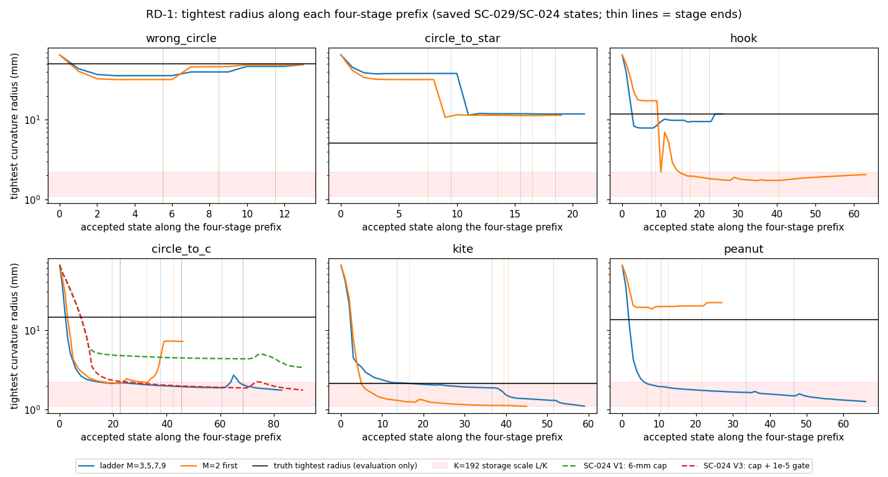

# Review of the research brief — state, baseline lock and one next contract (SC-031)

2026-09-24. Author: Claude (Opus 5.5). Independent reviewer: unassigned.
Reviews [01, the atlas-to-inverse research brief](01_atlas_to_inverse_research_brief.md)
against the live repository, as its §11 asks.

**SC-031 approval status: `PROPOSED — NOT APPROVED FOR EXECUTION`.
Execution status: `NOT STARTED`.** No numerical code or configuration was
changed. The only computation is RD-1, a declared review diagnostic. It
re-reads saved SC-029/SC-024 states, recomputes their geometry and reads the
hash-verified SC-026 Jacobians, with zero forward solves and about 10 s of
CPU. It is not an experiment result.

## 1. State reconciliation

| Item | Brief (snapshot `c23bb59`) | Current evidence (`6af6b9c`) |
|---|---|---|
| SC-030 | First pass recorded, repeat pending | **COMPLETE** at `0de6858`: 36 runs, all repeats and cache on/off pairs identical, 12.62% aggregate hybrid time reduction (11.28–14.60% by case), hybrid lower RMS than SPD-008 on all six starts ([iteration 13](../01_results.md)). No authorized work is outstanding. |
| Checkout | `feature/shape-frequency-continuation` | Same branch, equal to `origin`, clean; no inverse jobs running. No branch or worktree created. |
| Brief placement | `iteration_13/02_proposals/01_…` | Moved there unchanged (slot was empty). |
| SC-026 arrays | Local only, unverified | Present; all 12 `cells/` and `evaluation/` NPZ files match `summary.json` `files_sha256` (checked 2026-09-24). |
| SC-027 | Unexecuted | Unexecuted; reviewed in §4. |

Checks the brief proposes that **already exist** and should not be repeated:

- **Extra iterations at unchanged M (WP2):** SC-024's declared V2x4 amendment
  ran C with 4× the iteration cap: RMS 3.61 vs 3.20 mm, Hausdorff 11.71 vs
  11.79 mm. Iterations do not remove C's defect
  ([SC-024](../../../../../results/validation/shape_continuation/SC-024-backend-ablations/README.md)).
- **Displacement cap (WP3):** SC-024 V1/V3 capped the normal move at 6 mm; C
  still sharpened to 3.4/1.8 mm.
- **Roughening predicts failure:** SC-025's rank correlation of tightest
  radius with final error is −0.88 over 18 runs ([iteration 09](../../iteration_09/01_results.md)).
- **Borges eq. 13 curvature-tail admissibility filter** exists in the
  pre-hybrid `inverse.py`. It was not carried into the clean hybrid, and
  iteration 06 found that its 1% form excludes the exact star.

## 2. WP0 baseline lock (no new runs)

| Element | Locked value |
|---|---|
| Code / evidence | `0de6858`; hybrid sources unchanged since `bc443cc`. Reference endpoints: SC-029 `baseline/none` prefixes, reproduced bitwise by SC-030. |
| Physics | 2-D TMz transmission, homogeneous full space, lossless, equal permeability; plastic in sand, χ = ε_i/ε_e = 0.5; single component, fixed topology. |
| Acquisition / data | SPD ring scan, 24 complex paired point-source responses per frequency, noiseless synthetic. Training 0.5, 0.75, 1.0, 1.25 GHz cumulative, uniform weights. 19-frequency 0.25–2.5 GHz catalog for evaluation only. |
| Update | Borges normal Fourier displacement h in current normalized arclength, M = 3/5/7/9; arclength refit to K = 192 on every trial, tolerance 1e-5 (V2). |
| Backend | SPD-style LM: Marquardt D = max(diag G, 1), λ₀ = 1e-3, ×10 on failure, ×0.3 on success, 5 damping trials × 8 halvings; coefficient clip 12/18/6 mm (order 0/1/≥2); tolerances: gradient 1e-7, loss 1e-14, relative step 1e-7. |
| Numerical gates | N = 512/1024; per-accepted-step cross-resolution field check (1e-5 first frequency, 1e-7 others; factor 5); final training-frequency resolution audit. |
| Budgets | 22 iterations per stage; stage quotas 1000/1250/1750/4000 units; 8,012-unit prefix cap. Exact validation cache is qualified (trajectory-identical). |
| Noise convention | None in the data. The residual is scaled per frequency by the observed norms; this scaling is not noise whitening. |
| Timing protocol | SC-030: one BLAS thread, sequential fresh processes, rotated arm order, unpinned host. |
| Known failures | C, kite and peanut end at 2.9–3.2 mm RMS with 9.6–17.0 mm Hausdorff defects; §3 gives the mechanism. Figure 1 provenance is still open. |

## 3. RD-1 — what the saved histories show

Script, tables and data: [`rd1_saved_history_audit/`](rd1_saved_history_audit/audit.py)
(`audit.txt`, `summary.json`). Geometry only; truth appears only as the
evaluation reference line in the figure.

1. **"Extra work on old data helps" combines two regimes.** SC-029's
   old-data suffix improves star RMS 2.6× and hook 7.9×. Neither path has a
   refused trial. Each prefix ended at in-band stationarity: the last LM
   iteration recorded no trial, because every proposal at every damping fell
   below the 1e-7 (≈0.1 µm) relative-step tolerance. The machine label for
   this stop is `no_decreasing_step`.
   On C, kite and peanut, 91–94% of suffix trials are refused
   (refit/self-intersection). Hausdorff falls only 2.5–6.5%. The final
   gradient ∞-norm is 6–11, against 4e-6–3e-5 on clean paths. The 0.545
   geometric-mean ratio therefore comes mainly from star and hook. On the
   hard cases the extra work only continues a slow, refusal-limited descent.
2. **The hard cases are decided in the first 2–5 accepted steps.** Six of
   the twelve prefixes fall below a 5 mm tightest radius, all in stage 1
   except the M = 2 hook (stage 2). Five of those six end at 2.9–5.5 mm RMS.
   The sixth, C with M = 2, escapes in stage 3 (radius 2.2 → 7.3 mm) and
   ends at 0.35 mm. None of the six non-collapsing prefixes ends above
   0.54 mm. The collapsing steps move the boundary 4.5–22.7 mm. Each one reduces the
   stage loss by 1.6–13× at λ ≤ 1e-3 relative to diag G, mostly 9e-5 to
   3e-4, so it is a clipped Gauss–Newton step. The final radii are 1.1–2.1 mm,
   which is the K = 192 storage wavelength L/K (1.1–2.2 mm). The truth radii
   are 11.7–14.6 mm for C, hook and peanut, while the kite's truth radius
   (2.14 mm) is itself at that scale.
3. **The curvature a step creates can be computed exactly before any
   solve.** For the unrefit displaced curve, the tightest radius matches the
   accepted post-refit radius to a median of 0.2% (maximum 3.4%, 1,586 steps).
   The linearized δκ = −(h_ss + κ²h) is accurate when the inward move is
   small relative to the local radius. For the cusp index max(−κh) < 0.2,
   its median error is ≤ 2%. For index ≥ 0.4 it underestimates the collapse
   (median 35%, up to 2.2×). Every step that at least halved the radius on a
   failing path had index ≥ 0.39. The legitimate sharpening on star and
   ladder-hook had ≤ 0.26. These are 14 events on development data: a
   hypothesis, not a threshold.
4. **Smaller steps do not prevent the collapse.** Under SC-024 V1's 6 mm
   cap, no stage-1 C step shrank the radius by more than 30% or had a cusp
   index above 0.29. The radius still fell steadily from 65 to 4.8 mm
   within stage 1; with the 1e-5 gate (V3) it reached 2.3 mm, and no step
   shrank it by more than 39%. The Gauss–Newton path sharpens the curve
   by itself; no single overshooting step is required.
5. **SC-027 as written would be close to inert at the collapse.** It
   replaces D in (G + λD) with a weight in [1, 4] but keeps the decaying λ
   schedule. The collapsing steps already run at λ ≤ 1e-3 (mostly ≤ 3e-4)
   relative to Marquardt's D = diag G. On the 581 SC-026 C states at
   0.5 GHz, diag G over the M = 3 coordinates is 3.2e2–7.3e3 per m² (median
   2.7e3). Replacing D by an O(1) weight at the same λ would cut the
   regularization by three to four orders of magnitude. A metric changes
   the path only where λD is not negligible against G.

**Interpretation (hypothesis).** In the M = 3 current-arclength normal space,
the stage-1 Gauss–Newton descent has a sharpening feedback: inward motion
where κ is large raises κ through the κ²h term. On C, kite, peanut and the
M = 2 hook this feedback drives the curve to representation-scale corners,
which the refit gate then freezes. The linearized sensitivity says the
step changes the data usefully, but the finite geometry it produces cannot
be exploited later. This is the brief's distinction in §2.2.

## 4. Resolution of the brief's recommendations

| Recommendation | Decision |
|---|---|
| Placement and lifecycle | **Accept**; done. |
| WP0 baseline lock | **Accept**; §2 closes it without new runs. |
| WP1 atlas qualification | **Defer** to the first contract that uses an atlas quantity in a decision (WP4), scoped to its frozen states. SC-031 uses none. The brief's five checks become that contract's requirements. SC-031's own metrics are arclength-origin covariant by construction and are unit-tested for it. |
| WP2 insufficient optimization vs update space | **Resolved through RD-1** for the question that matters. On the failing cases, iterations, wider bands and new frequencies leave the defect (SC-024 V2x4; SC-029 Hausdorff within 7%). On clean cases the prefix stop is in-band stationarity, so band opening is the operative change. That is an inference; the separate share of the damping reset is **not measured**. **Defer** the 2×2 rollouts: no outcome would change the next contract. Later policy comparisons must offer the fixed ladder SC-029's old-data band extension (`repeat`) as a declared option, so that no arm gains a band advantage. |
| WP3 finite-step regularity | **Accept as SC-031**, amending SC-027 below. |
| SC-027 | **Amend, then supersede by SC-031 if approved:** (a) let the metric act through Hanke's regularizing LM parameter choice [R3] instead of the decaying λ schedule; (b) use the geometry-dependent curvature-change metric R_Γ from the brief's δκ formula, which penalizes the κ²h feedback; a fixed Fourier weight does not; (c) set a physical smoothing length ℓ = 1/(2.5 k_e) from iteration 04's measured detectability frontier, falling with frequency and independent of M; (d) add the L² mass-metric control; (e) remove the A2 arms and fresh cases, which become a conditional successor. |
| Retry after a cross-resolution failure | **Defer**: a separate backend change, never bundled. |
| WP4 / WP5, noise, contrast, aperture | **Defer**; SC-031 decides the shared backend they need. |

## 5. SC-031 — does a curvature-aware regularizing LM avoid the stage-1 collapse without losing legitimate detail?

- **Approval status:** PROPOSED — NOT APPROVED FOR EXECUTION
- **Execution status:** NOT STARTED
- **Question:** Is the stage-1 collapse a property of the Gauss–Newton path
  that a curvature-aware metric can steer around, or an attractor of the
  stage objective that no step metric avoids?
- **Falsifiable hypothesis H:** with Hanke's rule (q = 0.7) and the
  curvature-change metric (R2), the tightest radius at the end of stage 1
  stays ≥ 7 mm on C and peanut. R0 ends there at 2.14 and 1.94 mm, and
  displacement-capped V1 ended C's stage 1 at 4.8 mm. The same rule with the
  L² mass metric (R1) ends below 5 mm on both. H is falsified as a
  path-metric mechanism if R2 also ends below 5 mm on both (an attractor
  of the stage objective). It is attributed to the parameter choice rather
  than the metric if R1 also ends at ≥ 7 mm on both. Radii between 5 and
  7 mm are reported as inconclusive for that case.
- **Baseline:** §2 lock. R0 = the six SC-029 `baseline/none` prefixes
  (bitwise-equal SC-030 hybrid runs); R0 is not rerun except for the replay check.
- **Intervention (arms; six development cases, identical start, four-stage prefix):**
  - **R0**, the current rule: Marquardt D, λ schedule (existing results).
  - **R1**, mass metric: each iteration chooses λ_k by
    ‖r + J d(λ)‖ = q‖r‖ with d(λ) = −(G + λW_Γ)⁻¹g, where W_Γ is the
    arclength mass of h (W on a circle).
  - **R2**, curvature metric: the same rule with
    R_Γ = W_Γ + ℓ⁴ K_Γᵀ Ω K_Γ / L, where K_Γ h = −(h_ss + κ²h) on the
    current curve, Ω holds the arclength weights and
    ℓ = 1/(2.5 k_e,max) = 15.6/10.4/7.8/6.2 mm by stage.
  - If Gauss–Newton cannot reach q‖r‖, use λ = 1e-12·tr G/n (effectively
    Gauss–Newton). Failed trials escalate λ ×10 and halve exactly as now.
    λ is recomputed each iteration, with no ×0.3 carry-over. q, ℓ and
    the fallback are fixed here and are not tuned after results.
- **Controls:** everything else in §2, including clipping, the refit
  gate, acceptance and cross-resolution gates, iterations, quotas, caps,
  cache and stop rules. The optimizer never sees truth.
- **Scope and shared interfaces:** opt-in `BackendConfig` fields
  (`damping_rule`, `hanke_ratio`, `metric`, `detectability_factor`) whose
  defaults reproduce V2 bitwise; `BorgesUpdate.metric(space, kind, length_m)`;
  opt-in trial logging of pred = −gᵀd − ½dᵀGd; one small driver reusing
  `atlas_strategy_tests` (`schedules`, `optimize_segment`, `score`). No
  change to forward, refit, acceptance or production defaults.
- **Pre-dispatch qualification:** (i) with defaults, the SC-029 wrong-circle
  and C prefixes replay exactly (states, trials, stops, work); (ii) R_Γ on a
  circle equals (1 + ℓ⁴(m²−1)²/R⁴)·W; (iii) K_Γ matches the exact displaced
  curvature to 2% on RD-1 steps with cusp index < 0.1; (iv) an
  arclength-origin shift gives R′ = TᵀRT to 1e-12; (v) the Hanke solve
  reaches q to 1e-8 when attainable and falls back otherwise; (vi) targeted
  package tests pass.
- **Stages and gate:** **A**, stage 1 only for R1 and R2 on all six cases
  (≤ 1,500 units), checkpointed. Stage B is released only if R2 ends
  stage 1 at ≥ 7 mm on at least one of C and peanut and adds no hard stop.
  Otherwise stop, report the stage-A result against H and run nothing
  further. **B**, stages 2–4 for R1 and
  R2, resumed from the stage-A checkpoints as SC-029 suffixes were.
- **Metrics:** endpoint symmetric RMS and conservative Hausdorff, work
  units and inverse seconds. Per stage: the tightest-radius trajectory,
  refusal categories, accepted-step cusp index, λ, the stop anatomy, and
  ρ = actual/pred where pred is positive and resolved. At endpoints, the
  19-frequency catalog residual (evaluation only).
- **Decision criteria** (six cases, 0.01 mm RMS floor, as SC-029):
  - Qualify R2 for fresh-case testing (a separate ID) if GM(R2/R0) ≤ 0.8,
    worst ≤ 1.5 and no added hard stop.
  - Attribute the gain to the curvature metric if GM(R2/R1) ≤ 0.8, and to
    the parameter choice if R1 also passes and GM(R2/R1) > 0.8.
  - Legitimate-detail controls are star (truth radius 5.1 mm) and kite
    (2.1 mm). A regression over 1.5× on either blocks adoption.
- **Budget and stopping:** ≤ 25,000 inverse units; ≤ 3 h campaign wall
  with ≤ 6 single-thread workers; per prefix 8,012 units and 2,700 s;
  ≤ 228 endpoint evaluation solves; ≤ 300 qualification units. Hard stops
  are retained as outcomes.
- **Artifacts:** a fresh `results/validation/shape_continuation/SC-031-regularizing-metric/`
  holding the manifest (source, input and plan hashes), configurations,
  histories, trials, checkpoints, the qualification record, scores, a
  report script and figures (allow-listed in `.gitignore`).
- **Owner:** unassigned (Claude available). **Reviewer:** unassigned.

**What each outcome changes:**

| Outcome | Consequence |
|---|---|
| R2 passes, GM(R2/R1) ≤ 0.8 | Fresh-case qualification of R2 as the shared backend for all later policy arms. ℓ becomes the first mechanism-backed "finite-update validity" quantity for WP4. |
| R1 and R2 both pass | The regularizing parameter choice [R3] is the repair; the curvature metric adds nothing here. Simpler backend. |
| R2 avoids the collapse, but RMS does not improve | Collapse is not the binding limit; the next lever is data/band decisions (WP4). |
| R2 collapses (gate fails) | The sharp state is an attractor of the stage-1 objective. Step metrics are rejected for this mechanism; next is a truth-free prediction of the first band/frequency choice (SC-029: M = 2 helps C/peanut and hurts kite/hook) or an explicit prior. |

## 6. Dependencies and deferrals

SC-031 depends only on §2. WP1 must precede WP4. WP4 follows SC-031,
because an atlas arm must share the adopted backend. WP5 follows a passed
WP4 gate. The WP2 rollouts, noise, contrast and aperture extensions and the
cross-resolution retry stay deferred, as listed in §4.

## References

- [R3] M. Hanke, *A regularizing Levenberg–Marquardt scheme, with
  applications to inverse groundwater filtration problems*, Inverse
  Problems 13 (1997) 79–95, [doi:10.1088/0266-5611/13/1/007](https://iopscience.iop.org/article/10.1088/0266-5611/13/1/007).
  λ_k solves ‖y − F(x_k) − F′(x_k)h_k‖ = q‖y − F(x_k)‖ with 0 < q < 1;
  its convergence theory assumes a tangential cone condition that is not
  verified here.
- [R5] Sundaramoorthi, Yezzi & Mennucci, *Sobolev Active Contours*, IJCV 73
  (2007): a metric on motion, not a shape prior.
- Related: Filippozzi et al., *On the regularization property of
  Levenberg–Marquardt method with singular scaling* ([arXiv:2506.00190](https://arxiv.org/abs/2506.00190)),
  LM with a scaling operator under the discrepancy principle.
