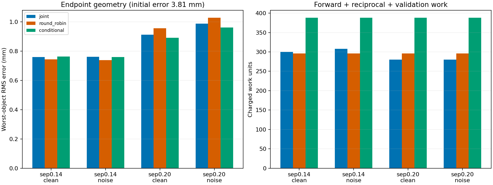

# SC-047: coupled recovery works; conditional selection and topology actions do not qualify

2026-09-27. Owner assessment by Codex, without an independent reviewer.
[Frozen contract](../iteration_26/03_plan.md),
[reproducible evidence and methods](../../../../results/validation/shape_continuation/SC-047-coupled-continuation/README.md).

After the requested one-hour wait, `git pull --ff-only` at 02:22:38 UTC
retrieved Claude's complete review and multi-object/topology roadmap at
`34355f99`. SC-047 executes that roadmap's coupled-physics, conditional-atlas
and topology-diagnostic prerequisites. No topology controller is promoted.

## Coupled numerical qualification

The opt-in adapter composes general Cartesian Fourier curves, including the
inherited non-star-shaped C, with the existing coupled Müller/Kress solver and
unchanged shared LM backend. Frozen objects remain in all scattering solves.
The derivative differentiates the complete injected SC-035 finite update.

All declared gates pass: independent two-cylinder relative field error
7.10e-15, finest complete-trial directional derivative error below 3.40e-8,
permutation discrepancy below 5.35e-15, and exact single-component prediction
equivalence. Qualification used 352 frequency forward solves, 16 reciprocal
Jacobian batches, eight independent series solves and 617.69 seconds. The
250-test continuation/Kress regression passes in 36.60 seconds; existing
Matplotlib deprecations and the atlas-video multiply warning remain visible.

## Prospective object-selection comparison

All 12 returned endpoints pass 256/512-node field refinement. The two target
outlines, two separations and clean/1% noise cases are four development
scenarios. Initial components are translated, rotated and scaled copies of
the true outlines. This establishes local fixed-count refinement, not shape
discovery from circles or an unknown-count reconstruction. SC-048 separately
adds intrinsic shape perturbations.

Worst-object boundary RMS is initially 3.80760 mm. Costs below include
fitting, reciprocal batches, policy diagnostics and endpoint qualification.

| Separation / data | Joint RMS (mm) | Round-robin RMS (mm) | Conditional RMS (mm) | Work: joint / round-robin / conditional |
|---|---:|---:|---:|---|
| 0.14 m / clean | 0.758816 | 0.743804 | 0.762673 | 300 / 296 / 388 |
| 0.14 m / 1% noise | 0.761214 | 0.737884 | 0.759437 | 308 / 296 / 388 |
| 0.20 m / clean | 0.912598 | 0.955243 | 0.891282 | 280 / 296 / 388 |
| 0.20 m / 1% noise | 0.988079 | 1.027235 | 0.960716 | 280 / 296 / 388 |

The simple controls produce substantial improvement, with small changes on
the one paired noise draw. Conditional selection passes **zero of four**
frozen superiority gates. Its modest gains at the wider separation cost
more than both controls. All four conditional paths retain `TRIAL_SOLVE_CAP`;
the other eight complete their dispatch schedules. A qualified endpoint does
not erase a budget stop. Total path work is 3,904 units and 2,967.07 seconds.
Data generation and the standalone atlas are separately charged in their
own ledgers. Common-work scores use the last cost-eligible accepted state,
not a truth-selected iterate, and receive no extra endpoint audit.

The conditional atlas is mathematically useful for describing confounding:
the C retains 93.8%/86.4% of total squared sensitivity at M3/M5 for the close
pair, and 88.0%/82.9% for the wider pair. These relative-scale spectra are
not noise-whitened information or resolution limits. Separation alone does
not explain their ordering. The standalone atlas costs 72 units and 23.43 s.

## Topology: correct infinitesimal physics, insufficient action criterion

The current-scene primal/reciprocal insertion response passes area-scaling
and objective-sign checks at two exterior points over all four frequencies.
The smallest disk probes give relative response errors 7.19e-6 and 7.20e-6.
These tiny probes qualify the derivative; separate 3 mm disks test finite
births. Topology and bounded shape-refinement work total 452 forward solves,
14,016 RHS columns and 596.39 s; separate refinement ledgers retain reciprocal
work and original stops.

Positive numbers below mean that a **finite 3 mm birth reduces refined loss**.

| Scene | Before shape refinement | After bounded shape refinement |
|---|---:|---:|
| Correct count, wrong boundaries | 0.00243386 | 0.0000847891 |
| Missing C component | 0.00460774 | 0.00472600 |
| Extra component | 0.00217943 | 0.00171887 |
| Correct geometry, 1% noise | -0.000189512 | -0.000170336 |

The wrong-boundary control gives a false birth even after its allotted
shape-only refinement. Those fits are budget-limited, not certified stationary
solutions. The missing-object minimum is at the scan edge, (-175, -112.5) mm,
well away from the missing C on the right: its positive finite decrease is
**not successful localization**. The maps contain substantial oscillatory
structure. In the noisy correct scene, a negative infinitesimal value does
not predict descent for the tested finite radius.

Whole-component deletion correctly favors removing the deliberately extra
object: refined loss falls by 0.0657365 before shape refinement and 0.0361692
after it. Removing either true component increases loss. This is a useful
counterfactual control, not a qualified automatic deletion policy.

The roadmap's no-false-birth gate therefore fails. Births and deletions stay
disabled. A future action policy needs finite-candidate comparisons against
additional shape refinement, localization controls, multiple noise draws and
a declared discrepancy/complexity rule. Changing map thresholds after seeing
these cases would not establish that policy.

## Next bounded question

A post-outcome, geometry-only span probe finds that the M5 C update misses
23.5% of horizontal-translation velocity and 24.9% of rotation velocity in
physical boundary RMS; M9 reduces those residuals substantially. This suggests
testing exact global motions as a compact enrichment, without proving they
cause the fitting error. [SC-048's frozen plan](03_plan.md) compares that
enrichment with both M5 and M9, using intrinsically perturbed starting shapes.
It stops if the primary gate fails. No conditional-selector threshold or
topology rule is retuned, and production defaults remain unchanged.
