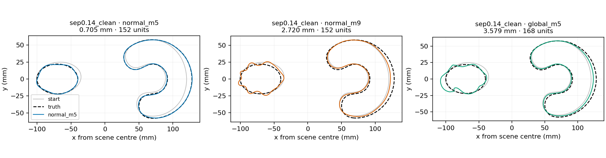

# SC-048: compact M5 wins the local screen; global enrichment is rejected

2026-09-27. Owner: Codex; no independent reviewer.
[Frozen contract](../iteration_27/03_plan.md),
[evidence and reproduction](../../../../results/validation/shape_continuation/SC-048-global-motion-directions/README.md).

**Stop at the failed primary gate.** Adding exact global motions does not
improve the tested coupled reconstruction. The unchanged compact M5 update
is substantially better than both the enriched space and M9 under this
six-dispatch schedule. All three endpoints pass the declared field-refinement
audit and complete their schedules; this negative is not a numerical timeout.
The three conditional transfer scenarios are withheld, with no retuning.

## Qualification and comparison

The starting ellipse/C pair includes fixed intrinsic morphological errors
beyond SC-047's similarity-only starts. Its worst RMS error is 3.90469 mm.
The count, contrast, family and approximate location remain known; this is
one clean local development case, not a broad recovery claim.

Before fitting, zero-update identity, unchanged original columns, positive
physical metrics and complete-trial finite differences all pass. The largest
directional relative error is 2.07e-7 over each object and both together,
four frequencies and two perturbation sizes. This uses 52 forward solves,
four reciprocal batches and 107.29 seconds. No finite trial or optimizer rule
is repaired after seeing the outcomes.

| Update | Ellipse RMS (mm) | C RMS (mm) | Worst RMS (mm) | Units | Max coordinates | Refined loss |
|---|---:|---:|---:|---:|---:|---:|
| Normal M5 | 0.704718 | 0.418516 | 0.704718 | 152 | 22 | 0.000187127 |
| Normal M9 | 2.424685 | 2.719688 | 2.719688 | 152 | 38 | 0.0315935 |
| M5 + exact global motions | 3.578836 | 2.188362 | 3.578836 | 168 | 30 | 0.0275189 |

The enriched arm is 5.08 times worse than M5 in worst-object RMS. It also
loses against M9 in worst-object RMS and work, despite fewer coordinates.
Its slightly smaller residual than M9 does not imply more accurate geometry.
The frozen primary gate fails on multiple conditions.

M5 reduces worst RMS by 82.0% and accepts all six full proposed steps.
M9 also accepts all six full steps, but each uses the physical displacement
cap and its early model decrease is much smaller. The enriched arm has four
nondecreasing trial evaluations, requiring halving or quartering on three
dispatches. Complete first-order correctness and better representation of
global motions do not ensure useful finite optimization steps.

The enriched dimension grows from 25 to 30 as the changing geometry admits
additional independent global directions under the unchanged 5% rule. This
comparison changes the update space and its finite path; it does not isolate
a pure coordinate reparameterization. It cannot establish whether a different
damping rule, finite path or longer schedule would reverse the outcome.

## Accounting and decision

Three fitting paths cost 472 units and 386.66 seconds. Qualification adds
56 forward/reciprocal units and data generation adds four, totaling 532
frequency batches. Report/scoring work is separate. Source hashes, actual
returned states, costs and the unchanged gate pass 124 closeout checks.
The preceding 250-test core regression remains applicable: no numerical
core source changed after it. Figures were visually inspected.

Keep the compact M5 update as the practical reference for this local pair.
Reject this enrichment and the SC-047 conditional selector as demonstrated
improvements. Production defaults remain unchanged. SC-047's false-birth
and localization failures also continue to withhold topology actions.

The next useful research question is finite progress per charged cost using
already-paid trial information, with a separate untouched development/test
split and strong simple controls. SC-048 does not authorize tuning on its
failed cases as evidence of transfer. Unknown-count recovery still requires
the roadmap's finite candidate versus shape-refinement comparison and an
explicit discrepancy/complexity rule. The autonomous run ends at these
evidence gates; no further strategy or topology promotion is justified.
