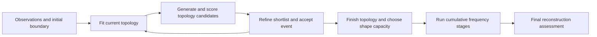
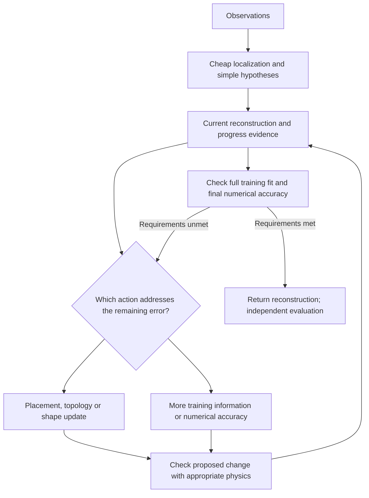

# An outsider's view: change the work the inverse asks for

2026-09-16. User clarification: “think as an outsider: where in pipeline can
be changed? this is about the big picture”. This broadens the requested design
discussion beyond accelerating the existing sequence of computations.
Author: Codex `/root`; independent reviewer: unassigned. Design brief only;
no new numerical experiment or speedup measurement.

**The largest architectural opportunity is to reduce the number and difficulty
of reconstruction problems solved along the way.** A faster Jacobian makes
each local fit cheaper. Better initialization, smaller early models, fewer
unproductive candidates and better stopping can remove whole fits.

The objective should be **time to a reconstruction meeting the agreed quality
requirements, across both easy and difficult cases**. Intermediate states,
iteration counts and frequency schedules may change. Final physics, numerical
accuracy and recovery requirements remain the comparison standard. Failures
and expensive unsuccessful attempts count toward the cost.

## What the measured architecture commits us to

For the TOP-025/SPD-002 path, the main structure is:

The [controller](../../../../../solvers/sdf_inverse/topology_controller.py)
performs fixed-topology refinement before its topology pass, evaluates raw
candidates with the production objective, and refines a limited shortlist.
It already has options for bandwidth promotion and candidate allocation;
adaptive behavior is not wholly absent. The
[full-case worker](../../../../../experiments/top025/run.py) then hands the
returned topology to a separate continuation phase. The
[schedule](../../../../../run_top017.py) visits prescribed cumulative frequency
sets and fits each stage, with numerical/endpoint checks along the way.
This description concerns that measured path, not every experimental driver.

An outsider should question the boundaries between these phases. A poor fit
can mean wrong location, wrong component count, insufficient shape freedom,
uninformative frequencies, inaccurate physics, or a poor optimization step.
Running the same local fitter longer is only one response.

## Where the pipeline can change

| Point | Architectural change | What expensive work it could remove | Main question to test |
|---|---|---|---|
| Initialization | Obtain a coarse spatial image or a few location/count hypotheses from the observations before detailed boundary fitting | Long migration from a distant start and repeated attempts to repair a poor initial topology | Does the initializer retain weak or shadowed objects? |
| Geometry model | Fit position, scale and simple shape first; activate finer shape modes only when supported by residual information | Large Jacobians and ill-conditioned updates while coarse geometry remains wrong | When does a restricted model prevent a necessary deformation? |
| Topology/shape controller | Interleave short shape fits, topology proposals and model enrichment using measured progress | Fully optimizing an implausible topology and repeatedly enumerating unhelpful events | Can the controller distinguish a topology problem from missing shape detail? |
| Physics accuracy | Use inexpensive physics to propose/screen, then accurate BEM to confirm decisions | Accurate forward solves for candidates that can be rejected cheaply | Does the inexpensive model rank the important candidates correctly? |
| Data and frequency schedule | Add or revisit training information when it resolves a current ambiguity | Mandatory stages, redundant frequency work and overfitting a narrow band | Does adaptation preserve broad-band recovery? |
| Optimizer | Choose between explicit Jacobians, matrix-free Gauss–Newton and adjoint-gradient steps according to model size and progress | Full-Jacobian construction or long rejected-step ladders | Do cheaper steps reduce total time, including extra iterations? |
| Stopping and checks | Test whether the task is already satisfied before launching another optimization stage | Terminal fits/Jacobians performed only to complete a workflow | Can runtime checks predict completion without using truth geometry? |
| Repeated deployments | Reuse previous reconstructions or learn a proposal map, followed by physics correction | Most of the global search on related future observations | How many future inversions amortize preparation and training? |

### 1. Discover location and coarse structure before fine boundaries

Start with a cheap data-driven localization pass: background-field imaging,
topological sensitivity, a coarse material image, or a small set of simple
object hypotheses. The existing TD machinery is one possible component.
Use this output to initialize boundary components and retain a few competing
hypotheses if the data are ambiguous. Object count and locations must be
inferred from training observations, never supplied from truth.

Then separate coarse placement/size updates from fine boundary updates. An
ellipse or low-band curve is an early search model, not an assertion that the
true object is an ellipse. Release additional modes as needed, separately for
each component. Residual sensitivity and identifiable directions are better
signals than object count alone for deciding how many coefficients to fit.

The Fourier chart's current polar gauge also restricts representable shapes;
see the [pipeline's representation limits](../../../../pipelines/explicit_cartesian_fourier.md).
If the required geometry cannot be represented, more iterations or GPU speed
will not resolve that restriction. A representation change belongs in the
architecture discussion, with its own conditioning and recovery comparison.

### 2. Replace rigid phases with one adaptive controller

Give a run one persistent reconstruction state, with current geometry,
uncertainty/ambiguities, active training information, numerical accuracy,
reusable physics and recent progress. At a decision point, choose a bounded
next action:

- move/resize existing objects;
- refine a supported shape direction;
- propose a birth, death, split or merge;
- activate more shape modes;
- add a useful training frequency or source/receiver pair;
- improve the forward discretization;
- stop if the requested fit and numerical checks are satisfied.

Use short probes, predicted versus achieved decrease, geometry refusals and
residual structure to choose among these actions. Such a controller needs
fall-back exploration: a residual pattern is evidence, not a reliable oracle
for its cause. Do not irreversibly freeze topology just because the lowest
frequency has been fitted.

The intended design is:

The full training/numerical check may run periodically rather than at every
decision. Independent evaluation data and truth geometry remain outside this
controller. If evaluation results are used to redesign a method, that set is
development data and cannot also be claimed as untouched final validation.

### 3. Make accurate physics the judge of promising work

The current candidate funnel already uses TD to construct candidates and a
shortlist for refinement. The remaining question is whether every raw candidate
needs the production BEM objective before that shortlist is chosen.

Consider a hierarchy: geometry checks and a cheap local score, then coarse
physics or a simplified scattering model, then accurate coupled BEM for
survivors. Refine the cheap model when it disagrees with accurate checks. Keep
diverse alternatives so that screening does not systematically discard the
correct family. A Born/background approximation is a localization or proposal
tool here; strong multiple scattering can make it unsuitable for ranking.

Also decouple shape complexity from numerical resolution. `K_gamma` describes
the shape family; `K_u`, if a reduced trace representation is introduced,
describes the field unknowns; `N` resolves quadrature. They answer different
accuracy questions. Increase each when its error matters, instead of making
all early candidates pay final-resolution costs. Even simple shapes can need
accurate quadrature at high frequencies or close separation.

This is an application proposal of multifidelity model management: cheap models
can reduce outer-loop cost while a high-fidelity model remains involved in
accuracy control. It is not a demonstrated result for this BEM inverse.
[Peherstorfer, Willcox and Gunzburger](https://arxiv.org/abs/1806.10761).

### 4. Let information needs drive continuation

Low-to-high frequency continuation has a physical purpose: recover large-scale
structure before small features. Preserve that useful principle while testing
whether the exact ladder, cumulative reuse and stopping at each rung should
be mandatory. Coupling frequency with recoverable shape bandwidth is a known
inverse-scattering strategy, although the acoustic impedance problem in this
reference differs from this dielectric problem.
[Borges and Rachh](https://arxiv.org/abs/2104.13489).

For this pipeline, consider a full-training readiness check at the handoff,
then run only the continuation work it reveals as necessary. During fitting,
use a small informative training subset and periodic full-training checks;
revisit frequencies if errors reappear. Reserve independent evaluation data
for assessment. Changing a frequency changes a whole physical system; reducing
source pairs alone does not remove its matrix assembly or factorization,
because sources already share a multiple-RHS solve.

Source encoding is not a free shortcut for the present paired acquisition.
Simultaneous-source methods need care when sources do not share complete
receiver coverage; the current paired data cannot be treated as an observed
full source-by-receiver matrix.
[Simultaneous-shot inversion with missing data](https://slim.gatech.edu/node/6631).

### 5. Ask whether a full Jacobian is the right optimization interface

If many shape parameters are active, consider matrix-free Gauss–Newton using
`Jv` and `J^T w`, with inexact inner solves while far from the solution.
Alternatively, use cheaper adjoint-gradient or limited-memory steps early and
an accurate Gauss–Newton model near convergence. A scalar adjoint gradient
does not reproduce the existing LM model; these are algorithm comparisons.
With only a few dozen active directions, a cached explicit Jacobian can still
be the best choice. Benchmark time to the quality target, not time per step.

The repository already warns against selecting an optimizer from one good
step: [TOP-023](../../../topology/iteration_16/01_results.md) found a better
damped step, but [TOP-024](../../../topology/iteration_17/01_results.md) found
that neither complete continuation arm recovered. Better local decrease did
not establish a better complete inverse.

### 6. Stop when the requested reconstruction is adequate

The saved SPD-002 death and split cases accepted **zero continuation steps**
at every frequency stage, yet each built 340 continuation derivative
assemblies. See the [artifact audit](01_further_full_inverse_speedups.md).
That suggests a larger question than caching 204 repeated assemblies:
**could a readiness check avoid the continuation optimizer altogether on an
already adequate handoff?**

Make readiness depend on accessible full-training residuals, required numerical
accuracy and geometry validity. It cannot use truth-boundary error. Validate
its decisions afterward against the same synthetic recovery gates across
difficult cases as well as these two easy ones. A small data residual does
not prove a unique or geometrically correct reconstruction.

Declare whether the task requires an adequate reconstruction or a measured
stationarity certificate. If it requires stationarity, its derivative work
cannot simply disappear. A shortcut here changes the existing stage-exposure
and terminal-gradient contract; it must be compared as a pipeline redesign,
not described as exact implementation parity. Refined numerical checks and
independent final assessment remain required.

## Where GPU and learning fit in this picture

CPU/GPU execution is a layer underneath the chosen algorithm. Batch the
frequencies, hypotheses or derivative contractions that remain necessary.
Retain exact reusable state across decisions. Port the operations that dominate
the redesigned workload; the old assembly profile may no longer dominate.
The [earlier kernel/CUDA brief](01_further_full_inverse_speedups.md) remains
useful for this layer, but it does not settle the architecture.

If many related inversions will be performed, a learned or library-based
initializer can amortize global-search effort, with final physics correction.
Count data generation, training, failures and distribution shift. For `M`
future problems compare `T_prepare + M*T_online` against the complete baseline
cost, including failed searches. For one reconstruction a large training
project may cost more than it saves. A general learned forward replacement
is a larger, less immediately justified commitment than a proposal initializer.

## Recommended order of investigation

1. **Define the completion target and test a final-fidelity readiness check.**
   This is the most directly evidenced way to remove a whole existing phase.
   Keep the old continuation as fallback. Compare false early stops and time
   to the same recovery gates, including cases whose handoff is insufficient.
2. **Unify coarse geometry, topology and shape-detail decisions.** Start with
   short fits and informative training subsets, and make promotion or topology
   revision an explicit response to poor progress. Assess the initializer and
   controller separately before combining them.
3. **Introduce a validated cheap-to-expensive physics funnel.** Measure how
   much accurate BEM work is avoided and how often screening loses a useful
   candidate. Preserve final accuracy requirements.
4. **Choose derivative/solver and CPU/GPU implementation for the resulting
   workload.** Keep exact caching as a compatible implementation improvement.

For architecture comparisons, report success rate over the same scene set,
time to first qualified reconstruction, quality-versus-time curves, tails and
failure costs. Fix observation access, hardware and final quality requirements;
allow schedules, intermediate resolution and iteration counts to change as
declared interventions. Do not impose identical trajectories on a redesigned
algorithm. Use separate ablations to attribute each improvement.

This is a revised design priority, not approval to implement the entire table.
SPD-003 remains an unexecuted exact-reuse proposal; it is no longer presumed
to be the next experiment merely because it was written first. Keep the
architectural discussion here, with topology/representation/Boundary–BIE
cross-references for changes to those shared mechanisms.
