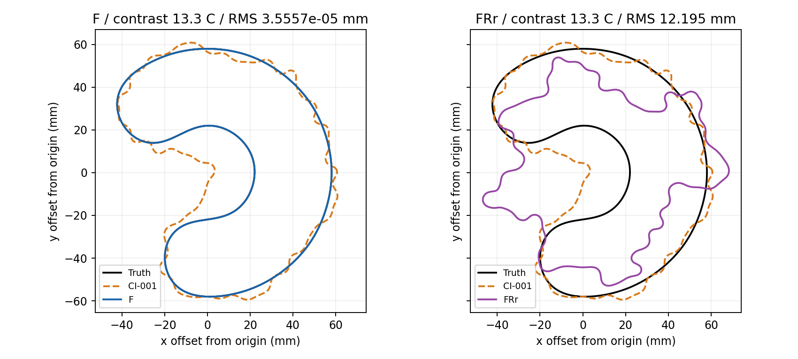
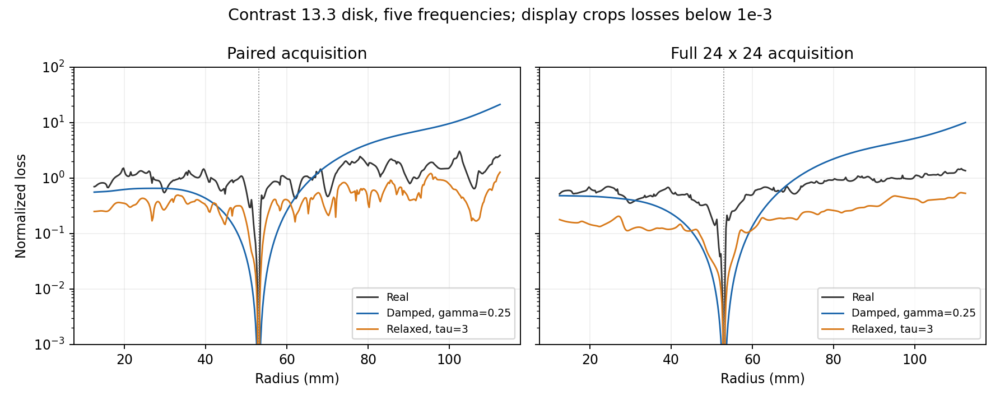

# FM-001: full-matrix acquisition and relaxed receiver residuals

**Acquisition finding:** F recovers the contrast-13.3 C from both starts with the unchanged damped CI-001 policy. This establishes that full acquisition is sufficient for that case under this policy; it does not establish universal landscape smoothing.

**Retention scope:** the executed G2 and two-loss stop rule use each arm’s full-matrix observations and recorded noise. The unchanged paired-data contract is a stricter, separate check. Do not describe an arm as preserving the original paired contract if that check loses cases.

- **F:** 36/36 full-matrix recoveries; 32/36 unchanged-paired recoveries. G2(full)=True; G2(unchanged paired)=False. Historical paired-residual retention passes: 15/36. Coverage: 36/36.
  Previously recovered cases lost under the unchanged paired contract: `fresh__asymmetric_lobes__noise_seed_0`, `fresh__deep_c__noise_seed_0`, `fresh__deep_c__noise_seed_1`, `far__noisy_asymmetric`.
- **FRr:** 0/4 full-matrix recoveries; 0/4 unchanged-paired recoveries. G2(full)=False; G2(unchanged paired)=False. Historical paired-residual retention passes: 0/4. Coverage: 4/17.
  Previously recovered cases lost under the unchanged paired contract: `modal__c13.3__shifted_star`, `modal__c13.3__new_asymmetric`.

In F, the four legacy-paired recovery losses are noisy cases that reached the full-data discrepancy stop; their geometry errors remain below 0.281 mm RMS. The extra receivers and full-data normalization/discrepancy rule change which residuals control stopping. The original diagonal also retains its original noise variance, whereas the new off-diagonal noise uses the full-matrix scale. No weights, tolerances or budgets were tuned to remove these regressions.

The executed stop rule did not stop F on these legacy-paired losses because its full-data recovery predicate remained true. Under an unchanged-paired interpretation, F would have stopped at its second such loss; the counterfactual stop case is recorded in `recovery_contracts.json`. Thus an unqualified claim that the original no-loss contract was preserved is not supported.

FRr changes both the prefix from damped to real data and the residual weighting. Its outcome applies to that combined schedule and frozen-weight linearization; this experiment does not isolate which change causes its failures.

All four FRr runs stopped when a trial candidate left the frozen numerical-resolution regime: at M43 for both C starts and the star, and M37 for the asymmetric case. Their saved endpoints passed the final numerical audit but failed recovery. The arm then stopped on its second previously recovered case lost; the remaining 13 cases were not run.

Baseline `b23dbf3e`; existing `feature/shape-frequency-continuation` branch. Execution used the frozen numerical parameters and budgets. The acquisition scope of recovery and stopping is disclosed above.

FRr uses real-frequency data in its relaxed prefix, but still localizes on the damped paired diagonal. Each relaxed evaluation charges an additional adjoint batch against the unchanged work budget. Final audits use the ordinary real-data objective.

CI-001 has 28/36 combined historical retention passes and 28/36 residual-only passes; its recovery count is 34/36. For comparability the tables also test the new endpoint on the unchanged paired diagonal against that historical contract. Full-matrix recovery uses the same geometric, numerical and residual thresholds on the new acquisition, with its recorded realized noise.

phase0 paired replay gate: **True**.

phase1 paired replay gate: **True**.

Phase-1 validation: 128 regression tests passed. Closed-form relative error 6.42e-16; large-tau relative error 4.43e-10; full-matrix Jacobian FD relative error 2.61e-10.

An additional 11 shared CUDA compatibility tests passed after the campaigns, for 139 distinct pytest cases in total. Both injected CPU-fallback checks (forward and adjoint) also passed. See `validation_additional.json`.

Implementation corrections (failures and prior source seals retained):

- Catalog loader now accepts the separate archived clean-reference file for noisy fresh cases. The failed launch and original source seal are retained. No mathematical gate, policy, threshold, noise draw or completed catalog changed.

## Arm F

Completed 36/36; recovered 36; historical paired retention passes 15; paired residual-only retention passes 15. Status: complete. G1=True; G2(full)=True.

| Case | Outcome | Full recovery | Paired recovery | RMS mm | Hausdorff upper mm | Max full residual | Paired historical pass | Seconds |
|---|---|---:|---:|---:|---:|---:|---:|---:|
| modal__c13.3__development_c | COMPLETED_SCHEDULE | True | True | 3.5557e-05 | 0.027318 | 2.7844e-06 | True | 116.97 |
| modal__c13.3__opposite_c | COMPLETED_SCHEDULE | True | True | 3.5557e-05 | 0.027318 | 2.7844e-06 | True | 114.22 |
| modal__c13.3__shifted_star | COMPLETED_SCHEDULE | True | True | 0.0017023 | 0.034105 | 4.3962e-07 | True | 288.2 |
| modal__c13.3__new_asymmetric | COMPLETED_SCHEDULE | True | True | 0.0032037 | 0.041017 | 2.0029e-06 | False | 173.12 |
| modal__c13.3__shifted_rotated_c | COMPLETED_SCHEDULE | True | True | 0.0001063 | 0.027644 | 1.2344e-07 | True | 127.84 |
| modal__c13.3__new_thin_c | COMPLETED_SCHEDULE | True | True | 0.00020839 | 0.029836 | 3.4559e-07 | True | 175.39 |
| modal__c13.3__noisy_asymmetric | NOISE_DISCREPANCY_REACHED | True | True | 0.020457 | 0.13736 | 0.011163 | False | 100.93 |
| modal__c2__development_c | COMPLETED_SCHEDULE | True | True | 0.0010566 | 0.030206 | 1.8948e-07 | False | 66.297 |
| modal__c2__shifted_star | COMPLETED_SCHEDULE | True | True | 0.0076764 | 0.04902 | 5.9088e-07 | False | 121.53 |
| modal__c2__new_asymmetric | COMPLETED_SCHEDULE | True | True | 0.013443 | 0.078792 | 1.9856e-06 | False | 95.975 |
| modal__c4__development_c | COMPLETED_SCHEDULE | True | True | 0.00042193 | 0.028278 | 2.4216e-07 | True | 78.607 |
| modal__c4__shifted_star | COMPLETED_SCHEDULE | True | True | 0.0034854 | 0.039991 | 5.3315e-07 | True | 143.25 |
| modal__c4__new_asymmetric | COMPLETED_SCHEDULE | True | True | 0.007586 | 0.052876 | 2.7059e-06 | False | 113.54 |
| modal__c4__opposite_c | COMPLETED_SCHEDULE | True | True | 0.00042193 | 0.028278 | 2.4216e-07 | True | 78.679 |
| modal__c4__shifted_rotated_c | COMPLETED_SCHEDULE | True | True | 0.00044744 | 0.028446 | 2.5421e-07 | True | 83.033 |
| modal__c4__new_thin_c | COMPLETED_SCHEDULE | True | True | 0.0012977 | 0.033096 | 4.1868e-07 | True | 115.75 |
| modal__c4__noisy_asymmetric | NOISE_DISCREPANCY_REACHED | True | True | 0.082409 | 0.3966 | 0.01201 | False | 55.816 |
| core__wrong_circle | COMPLETED_SCHEDULE | True | True | 7.5797e-06 | 0.019182 | 1.3526e-14 | True | 22.992 |
| core__circle_to_star | COMPLETED_SCHEDULE | True | True | 0.01776 | 0.079269 | 1.3715e-06 | False | 77.134 |
| core__circle_to_c | COMPLETED_SCHEDULE | True | True | 0.003717 | 0.033836 | 1.4924e-06 | False | 58.106 |
| core__kite | COMPLETED_SCHEDULE | True | True | 0.011135 | 0.074367 | 4.9674e-07 | True | 232.8 |
| core__peanut | COMPLETED_SCHEDULE | True | True | 0.0041123 | 0.033547 | 2.4053e-07 | False | 62.254 |
| core__hook | COMPLETED_SCHEDULE | True | True | 0.0022732 | 0.033281 | 7.0747e-07 | False | 64.772 |
| fresh__asymmetric_lobes__clean | COMPLETED_SCHEDULE | True | True | 0.020047 | 0.096048 | 4.5419e-06 | False | 64.298 |
| fresh__asymmetric_lobes__noise_seed_0 | NOISE_DISCREPANCY_REACHED | True | False | 0.1758 | 0.62759 | 0.010158 | False | 27.153 |
| fresh__asymmetric_lobes__noise_seed_1 | NOISE_DISCREPANCY_REACHED | True | True | 0.17526 | 0.62678 | 0.01013 | False | 25.12 |
| fresh__deep_c__clean | COMPLETED_SCHEDULE | True | True | 0.0044141 | 0.041106 | 2.3989e-07 | True | 88.603 |
| fresh__deep_c__noise_seed_0 | NOISE_DISCREPANCY_REACHED | True | False | 0.20639 | 0.48542 | 0.013809 | False | 36.014 |
| fresh__deep_c__noise_seed_1 | NOISE_DISCREPANCY_REACHED | True | False | 0.2075 | 0.47891 | 0.01363 | False | 32.548 |
| far__development_c | COMPLETED_SCHEDULE | True | True | 0.003717 | 0.033836 | 1.4924e-06 | False | 58.262 |
| far__opposite_c | COMPLETED_SCHEDULE | True | True | 0.003717 | 0.033836 | 1.4924e-06 | False | 58.188 |
| far__shifted_rotated_c | COMPLETED_SCHEDULE | True | True | 0.0043239 | 0.035051 | 1.6402e-06 | False | 58.126 |
| far__shifted_star | COMPLETED_SCHEDULE | True | True | 0.01724 | 0.079368 | 1.2626e-06 | False | 90.819 |
| far__new_asymmetric | COMPLETED_SCHEDULE | True | True | 0.011823 | 0.081839 | 5.1732e-07 | True | 98.551 |
| far__new_thin_c | COMPLETED_SCHEDULE | True | True | 0.0032507 | 0.037276 | 2.0235e-07 | True | 90.263 |
| far__noisy_asymmetric | NOISE_DISCREPANCY_REACHED | True | False | 0.28018 | 1.2303 | 0.010544 | False | 28.038 |

## Arm FRr

Completed 4/17; recovered 0; historical paired retention passes 0; paired residual-only retention passes 0. Status: second previously recovered case lost. G1=False; G2(full)=False.

| Case | Outcome | Full recovery | Paired recovery | RMS mm | Hausdorff upper mm | Max full residual | Paired historical pass | Seconds |
|---|---|---:|---:|---:|---:|---:|---:|---:|
| modal__c13.3__development_c | NUMERICAL_FAILURE | False | False | 12.195 | 33.022 | 1.02 | False | 304.31 |
| modal__c13.3__opposite_c | NUMERICAL_FAILURE | False | False | 12.195 | 33.022 | 1.02 | False | 299.89 |
| modal__c13.3__shifted_star | NUMERICAL_FAILURE | False | False | 7.7659 | 17.386 | 0.96783 | False | 309.26 |
| modal__c13.3__new_asymmetric | NUMERICAL_FAILURE | False | False | 3.2543 | 13.212 | 0.66405 | False | 274.16 |
| modal__c13.3__shifted_rotated_c | Not run | — | — | — | — | — | — | — |
| modal__c13.3__new_thin_c | Not run | — | — | — | — | — | — | — |
| modal__c13.3__noisy_asymmetric | Not run | — | — | — | — | — | — | — |
| modal__c2__development_c | Not run | — | — | — | — | — | — | — |
| modal__c2__shifted_star | Not run | — | — | — | — | — | — | — |
| modal__c2__new_asymmetric | Not run | — | — | — | — | — | — | — |
| modal__c4__development_c | Not run | — | — | — | — | — | — | — |
| modal__c4__shifted_star | Not run | — | — | — | — | — | — | — |
| modal__c4__new_asymmetric | Not run | — | — | — | — | — | — | — |
| modal__c4__opposite_c | Not run | — | — | — | — | — | — | — |
| modal__c4__shifted_rotated_c | Not run | — | — | — | — | — | — | — |
| modal__c4__new_thin_c | Not run | — | — | — | — | — | — | — |
| modal__c4__noisy_asymmetric | Not run | — | — | — | — | — | — | — |

## Attribution and stage distances

Stage distances below use phase-aligned arclength correspondence RMS. The arm tables and endpoint figure use the frozen symmetric boundary-distance RMS recovery metric. These measure different quantities and should not be compared numerically as the same error.

F recovers both C starts: acquisition is sufficient under the tested fixed policy.

- F, modal__c13.3__development_c: first non-decreasing stage stage_4_undamped; warmup_025_damped: 27.641 mm, stage_1_damped: 23.106 mm, stage_2_damped: 3.494 mm, stage_3_damped: 0.663 mm, stage_4_damped: 0.228 mm, stage_4_undamped: 0.270 mm, release_M11: 0.231 mm, release_M15: 0.036 mm, release_M19: 0.012 mm, fixed_M25: 0.004 mm, fixed_M31: 0.000 mm, fixed_M37: 0.000 mm, fixed_M43: 0.000 mm, fixed_M49: 0.000 mm, fixed_M55: 0.000 mm, fixed_M61: 0.000 mm, fixed_M67: 0.000 mm.
- F, modal__c13.3__opposite_c: first non-decreasing stage stage_4_undamped; warmup_025_damped: 27.641 mm, stage_1_damped: 23.106 mm, stage_2_damped: 3.494 mm, stage_3_damped: 0.663 mm, stage_4_damped: 0.228 mm, stage_4_undamped: 0.270 mm, release_M11: 0.231 mm, release_M15: 0.036 mm, release_M19: 0.012 mm, fixed_M25: 0.004 mm, fixed_M31: 0.000 mm, fixed_M37: 0.000 mm, fixed_M43: 0.000 mm, fixed_M49: 0.000 mm, fixed_M55: 0.000 mm, fixed_M61: 0.000 mm, fixed_M67: 0.000 mm.
- FRr, modal__c13.3__development_c: first non-decreasing stage stage_1_real_relaxed; warmup_025_real_relaxed: 28.474 mm, stage_1_real_relaxed: 33.082 mm, stage_2_real_relaxed: 30.686 mm, stage_3_real_relaxed: 30.336 mm, stage_4_real_relaxed: 29.740 mm, stage_4_undamped: 28.369 mm, release_M11: 28.056 mm, release_M15: 27.862 mm, release_M19: 28.013 mm, fixed_M25: 27.907 mm, fixed_M31: 27.701 mm, fixed_M37: 27.673 mm, fixed_M43: 27.702 mm.
- FRr, modal__c13.3__opposite_c: first non-decreasing stage stage_1_real_relaxed; warmup_025_real_relaxed: 28.474 mm, stage_1_real_relaxed: 33.082 mm, stage_2_real_relaxed: 30.686 mm, stage_3_real_relaxed: 30.336 mm, stage_4_real_relaxed: 29.740 mm, stage_4_undamped: 28.369 mm, release_M11: 28.056 mm, release_M15: 27.862 mm, release_M19: 28.013 mm, fixed_M25: 27.907 mm, fixed_M31: 27.701 mm, fixed_M37: 27.673 mm, fixed_M43: 27.702 mm.

## Evaluation-only paths

Each entry is max(path loss)/starting loss on 81 phase-aligned coefficient samples. A ratio above 1 is a barrier on that path only. The stage-4 damped and real endpoints are both included to remove ambiguity about the switch.

| Case | Stage | Paired real | Full real | Paired damped .25 | Paired damped .5 | Paired damped 1 | Paired relaxed 3 | Full relaxed 3 |
|---|---|---:|---:|---:|---:|---:|---:|---:|
| modal__c13.3__development_c | stage_1_damped | 2.694 | 1.000 | 1.979 | 2.160 | 2.184 | 2.474 | 1.000 |
| modal__c13.3__development_c | stage_4_damped | 1.593 | 1.085 | 1.335 | 17.029 | 42.582 | 1.163 | 1.000 |
| modal__c13.3__development_c | stage_4_undamped | 2.134 | 1.000 | 1.000 | 1.000 | 1.000 | 1.685 | 1.000 |
| modal__c13.3__new_thin_c | stage_1_damped | 2.343 | 2.104 | 2.161 | 3.708 | 4.901 | 1.270 | 1.036 |
| modal__c13.3__new_thin_c | stage_4_damped | 1.000 | 1.000 | 1.000 | 1.000 | 1.000 | 1.000 | 1.000 |
| modal__c13.3__new_thin_c | stage_4_undamped | 1.000 | 1.000 | 1.000 | 1.000 | 1.000 | 1.000 | 1.000 |
| modal__c13.3__shifted_star | stage_1_damped | 20.569 | 19.911 | 1.000 | 1.000 | 1.000 | 1.207 | 1.494 |
| modal__c13.3__shifted_star | stage_4_damped | 1.000 | 1.000 | 1.000 | 1.000 | 1.000 | 1.000 | 1.000 |
| modal__c13.3__shifted_star | stage_4_undamped | 1.000 | 1.000 | 1.000 | 1.000 | 1.000 | 1.000 | 1.000 |
| modal__c4__development_c | stage_1_damped | 1.000 | 1.000 | 1.000 | 1.000 | 1.000 | 1.000 | 1.000 |
| modal__c4__development_c | stage_4_damped | 1.000 | 1.000 | 1.000 | 1.000 | 1.000 | 1.000 | 1.000 |
| modal__c4__development_c | stage_4_undamped | 1.000 | 1.000 | 1.000 | 1.000 | 1.000 | 1.000 | 1.000 |

## Disk scan

Radius 12.5–112.5 mm at 0.25 mm spacing; truth 53 mm; five frequencies 0.25–1.25 GHz. Basin widths are between adjacent sampled maxima and are censored where they reach the scan boundary.

| Objective | Local minima | Basin width / 50 mm | Boundary censored |
|---|---:|---:|---:|
| paired_real | 37 | 0.050 | False |
| full_real | 48 | 0.030 | False |
| paired_relaxed_0.1 | 34 | 0.185 | False |
| full_relaxed_0.1 | 22 | 0.205 | False |
| paired_relaxed_1.0 | 35 | 0.185 | False |
| full_relaxed_1.0 | 21 | 0.215 | False |
| paired_relaxed_3.0 | 35 | 0.175 | False |
| full_relaxed_3.0 | 18 | 0.225 | False |
| paired_relaxed_10.0 | 36 | 0.170 | False |
| full_relaxed_10.0 | 17 | 0.340 | False |
| paired_relaxed_30.0 | 34 | 0.165 | False |
| full_relaxed_30.0 | 17 | 0.405 | False |
| paired_relaxed_100.0 | 35 | 0.115 | False |
| full_relaxed_100.0 | 22 | 0.410 | False |
| paired_damped_0.25 | 1 | 1.695 | True |
| full_damped_0.25 | 1 | 1.995 | True |

## Limits and evidence

These are synthetic-data experiments with fixed 24-by-24 acquisition, a fixed optimizer and discrete path samples. Shape-dependent positive weights can in principle change extrema even for paired data; failure in a scan is empirical, not a theorem that reweighting can never remove a barrier.

Noise preserves every archived observed diagonal and draws independent off-diagonal entries at the full-matrix 1% scale. The effective sigma preserves the expected total noise energy of this mixed catalog. Clean diagonals and 1024/2048 catalog agreement are checked before fitting.

All failures, tests, source seals, catalogs, stage receipts and plots are in `results/validation/cleaned_interfaces/FM-001/`. Runtime comparisons with historical runs are diagnostic; no matched-host speed claim is made.
