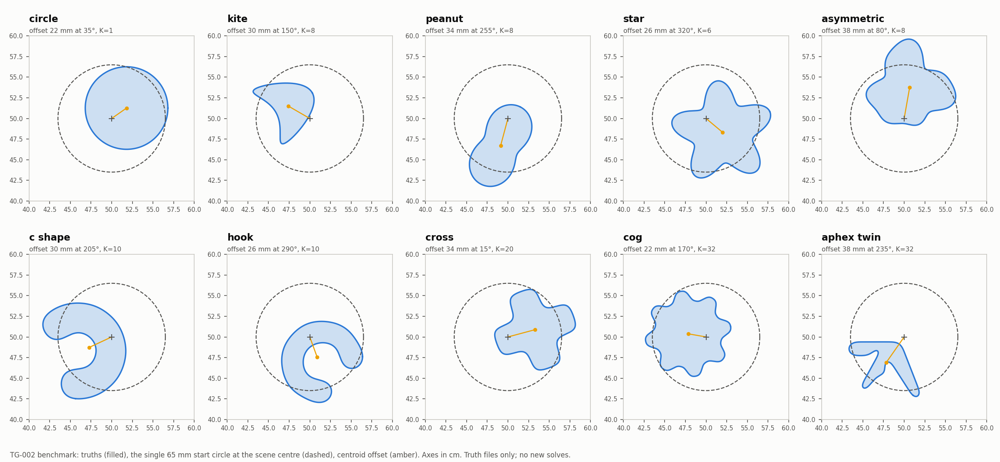

# The benchmark (TG-002): run new experiments on these scenes

**This is the only scene set for new inverse experiments.** Everything else that defines
scenes (the CI-001 36-case set, SC-0xx, MA-00x, TG-001 and others) is legacy. It is kept in
place only to reproduce recorded evidence; see [LEGACY.md](LEGACY.md). Do not add far-start
cases or a grid-search initializer to new experiments. The user retired both on 2026-10-04.



## What it is

- **Ten single-object scenes × contrasts 0.5, 4, 13.3 = 30 cases.** Case IDs are
  `<scene>__c<contrast>`, for example `aphex_twin__c13.3`.
- **One start for every case:** a 65 mm circle at the scene centre (0.5, 0.5) m.
- **Placement:** target centroids sit 22–38 mm off centre, each in its own direction and
  rotation. They are visibly off-centre, but inside the range where recorded runs recovered
  without a grid search. The values are frozen; a test pins them.
- **Data:** the frozen CI-001 acquisition (24 source/receiver pairs on a 0.30 m ring) and
  the 19-frequency catalog (0.25–2.5 GHz). Real and damped (k(1 + 0.25i)) catalogs, noiseless,
  computed with CPU reference `nodal_kress` and qualified by N1024/N2048 doubling at 1e-8.
- **Recovery:** the unchanged CI-001 gates. The final audit passes, RMS ≤ 1 mm, the Hausdorff
  upper bound ≤ 2 mm, and the per-frequency residual ≤ max(0.003, 3 × noise).

| Scene | Tests | Shape source |
|---|---|---|
| `circle` | Control; exact Mie check available | SC-022 `wrong_circle` |
| `kite` | Standard literature benchmark | SC-025 |
| `peanut` | Gentle concavity, neck | SC-025 |
| `star` | Star-shaped, five lobes | SC-022 `circle_to_star` |
| `asymmetric` | Smooth, no symmetry | SC-050 `new_asymmetric` |
| `c_shape` | Deep concavity; unsolved at contrast 13.3 from CI-001 starts | SC-022 `circle_to_c` |
| `hook` | Strongly non-star curl | SC-025 |
| `cross` | Four re-entrant corners | TG-001 |
| `cog` | High angular harmonics (8 teeth) | TG-001 |
| `aphex_twin` | Thin strokes, deep notch: the hardest scene | TG-001, public-domain logo SVG |

Shapes keep their historical definitions; only the placement is new.

## Default method for new experiments

- **Physics:** `modal_muller`, the node-free Fourier–Galerkin service.
- **Geometry update:** `certified_spectral` (NU-006).
- **Localization:** `none`. `keep_start` keeps the centred start, and the 0.25 GHz damped
  warm-up moves it.
- **Policy:** otherwise the default `CumulativePolicy`.

These are the CLI defaults. `--localization grid` and `--solver nodal_kress` exist only as
controls. `--pipeline nodal_baseline|nodal_fixed|modal_fixed` selects a named recipe from
`bem_inverse.pipelines` instead of `--solver`/`--geometry-update`; `modal_fixed` is the default
method above.

## Commands (repository root, EMNerf environment)

```bash
export PYTHONPATH=solvers:.
python -m experiments.benchmark verify       # check the sealed inputs
python -m experiments.benchmark inventory    # list the 30 case IDs
python -m experiments.benchmark plan --cases aphex_twin__c13.3
python -m experiments.benchmark run --cases all --run-dir results/validation/cleaned_interfaces/<ID>/<arm> --workers 2
python -m experiments.benchmark run --pipeline nodal_fixed --cases all --run-dir <fresh dir> --workers 2
```

- Use one fresh `--run-dir` per setting; mixed settings are refused.
- Use at most 3 workers, because each fit can peak near 8 GB.
- `prepare` and `generate` have already run and the inputs are sealed. Do not rerun them.

| File | Role |
|---|---|
| `scenes.py` | Scene shapes, frozen placements, the start, case IDs |
| `campaign.py` | Input generation and seal, CI-001-shaped rows, `keep_start`, the fit runner, `summarize`, gallery |
| `pc002.py`, `pc002_validation.py` | Approved fair nodal+spline run and read-only receipt validation ([results](../../docs/iterations/cleaned_interfaces/iteration_28/05_results.md)); `python -m experiments.benchmark.pc002 report` regenerates the table/gallery |
| `gc001.py`, `gc001_aliasing.py`, `gc001_report.py`, focused tests | Completed geometry-only spline/spectral replay and attribution on saved TG-002 states ([results](../../docs/iterations/cleaned_interfaces/iteration_30/01_results.md)); no fitting or physics calls; `python -m experiments.benchmark.gc001_report` validates/regenerates the table |
| `dp001.py`, `dp001_report.py`, focused tests | Frozen E versus damping feedback and exact reuse; 26/30 retained and median paired successful-output speedup 1.134x ([results](../../docs/iterations/CI-SPD/DP-001_results.md)); report regeneration performs no fitting |
| `cs001.py`, `cs001_report.py` | Completed eight-pair four-phase continuation screen: revised 4/8 versus control 5/8, 1.499x median speedup on retained successes, one regression ([results](../../docs/iterations/CI-SPD/CS-001_results.md)); report regeneration performs no fitting |
| `gs001.py`, `gs001_adapter.py`, `gs001_report.py` | Single-frequency known-material GauGal probe on C-shape 13.3: TV repair permits 0.461% native data residual at 0.5 GHz, but the contour remains near the start circle (28.1 mm sampled RMS); [results](../../docs/iterations/CI-SPD/GS-001_results.md), retained native-TV failure and read-only report |
| `pc001.py` | Three-arm pipeline comparison N0/N1/M1 and its side-by-side report ([plan](../../docs/iterations/cleaned_interfaces/iteration_27/03_plan.md)) |
| `nl001.py` | First pre-registered experiment: grid search on or off ([plan](../../docs/iterations/cleaned_interfaces/iteration_26/03_plan.md)) |
| `test_benchmark.py` | Frozen placements, valid truths, no truth access during fitting |

For a new experiment, write a pre-registered plan in `docs/iterations/cleaned_interfaces/`
or the relevant iteration track and a small driver like `nl001.py`.
User approval of the requested experiment work authorizes its run; record the
tracking ID without requesting a separate ID confirmation.
