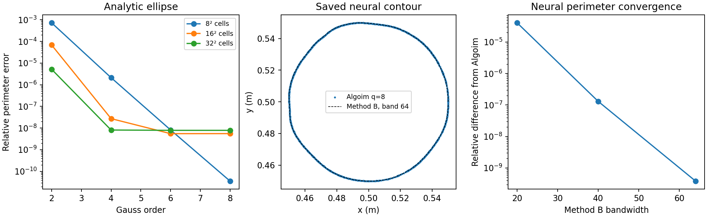

# Algoim and Method B on a saved neural contour

The optional Algoim experiment successfully integrates the zero contour of an
actual saved **8,577-parameter SIREN**, without fitting a polynomial surrogate.
Both smooth-boundary quadrature accuracy and three network-parameter derivatives
were checked. Production Method B and BEM quadratures are unchanged.



## Reproducible implementation

The C++17 driver evaluates the original SIREN's affine/sine layers, coordinate
normalization and output scaling using the interval type required by Algoim.
Its spatial gradient is propagated through those same layers. Nine necessary
upstream files (about 310 KB, including the license) are downloaded into `/tmp`,
verified against SHA256 values and compiled. The pin is official Algoim commit
`da1d81499608e1d499695d255f0233140b8c81e8`; no upstream library is vendored here.

This uses the general smooth-level-set algorithm documented by
[Algoim](https://algoim.github.io/) and Saye,
[High-Order Quadrature Methods for Implicitly Defined Surfaces and Volumes in Hyperrectangles (2015)](https://doi.org/10.1137/140966290).
The library returns positive quadrature weights after choosing local height
directions and root solves. A small command-line wrapper is sufficient for this
CPU comparison; it is not a new production geometry backend.

The saved checkpoint is
`results/inverse/implicit_mlp/2026-09-08/circle/kress_model.pt`, accepted iteration
60. Its SHA256 is recorded in `metrics.json`. The necessary constructor,
geometry configuration and 8,577 weights are preserved as plain JSON in
`input/siren_circle.json`; the driver uses that snapshot, so a fresh checkout
does not depend on the historical ignored `.pt` file or pickle deserialization.
This is its actual learned contour, which is not exactly circular. The
historical checkpoint was read with `weights_only=True` and remains unchanged.

## Accuracy and timings

At Gauss order 8 with a 32×32 cell decomposition, Algoim gives perimeter
**0.3146231974134166 m**, using **936 nodes**. Its largest neural zero-set residual
is **1.23e-16 m**. The integral of its unit normal closes to **7.5e-15 m**; the
smallest field-gradient norm is **0.922**, away from a singular level set.
The perimeter changes by **8.7e-13 relative** between order 6 and order 8.

Method B was run on the same checkpoint with 256 projected samples and solver
nodes, 2048 arc-length samples and the existing verified reverse pullback:

| Method B bandwidth | Perimeter difference from refined Algoim | Geometry construction time |
| --- | --- | --- |
| 20 | 4.07e-5 relative | about 1.6 s |
| 40 | 1.30e-7 relative | about 1.6 s |
| 64 | 3.83e-10 relative | about 1.6 s |

Algoim surface construction took about **0.4 s** per neural rule, excluding
compilation. These are single CPU timings on one checkpoint, not a general
speed claim. The final Method B pullback agrees with Algoim's perimeter
derivatives to roughly 1e-9 relative.

The analytic 50×35 mm ellipse control uses its exact elliptic-integral
perimeter. Order-8 errors are below 8e-9 across the initial grid sweep. Exact
cell-vertex tangencies produce a finite-precision plateau as the grid refines;
changing the box half-width from 80 to 83 mm removes those coincidences and
recovers nearly machine-precision errors. Both sweeps are retained in the
metrics. Method B's analytic ellipse error is 8.53e-13 relative.

## What the derivative check establishes

For a smooth level set φ(x,p)=0 with nonzero spatial gradient, differentiate the
zero-set equation in parameter p:

`Vn = −φ_p / |∇φ|`.

For outward normal n and curvature κ=div(n), the first variation of perimeter is

`dL/dp = ∫Γ κ Vn ds = −∫Γ κ φ_p / |∇φ| ds`.

The driver evaluates the integral with Algoim weights. PyTorch computes φ_p,
the spatial gradient and Hessian at the returned nodes. In 2D we use

`κ = (φ_xx φ_y² − 2 φ_xy φ_x φ_y + φ_yy φ_x²) / |∇φ|³`.

For the final-layer output bias and weight indices 22 and 29, the resulting
perimeter derivatives agree with central differences of **newly constructed**
Algoim rules to **3.5e-10 relative**, at both 1e-5 and 3e-6 parameter steps.
That checks the continuum shape derivative at this smooth contour. It does
**not** establish automatic differentiation of the finite adaptive quadrature
algorithm, or differentiability across a topology change or an adaptive branch
change. A singular BEM-kernel integration rule and full BEM-objective weight
gradient would need separate implementation and verification.

## Run and tests

```bash
/home/drdeng/miniconda3/envs/EMNerf/bin/python experiments/algoim/run_comparison.py
OPENBLAS_NUM_THREADS=1 OMP_NUM_THREADS=1 \
  /home/drdeng/miniconda3/envs/EMNerf/bin/python -m pytest \
  experiments/algoim/test_algoim.py experiments/fresnel/test_fresnel2001.py -q
```

The first command fetches the hash-pinned optional dependency if absent and
requires `g++`. The two Algoim pytests skip when that optional source cache has
not been fetched. They check analytic ellipse perimeter/positive weights/zero
residual and an implicit perimeter derivative against recomputed quadrature.
Together with Fresnel's tests, **18 passed**. The full comparison also asserts
the neural zero residual and the three parameter finite-difference checks.
