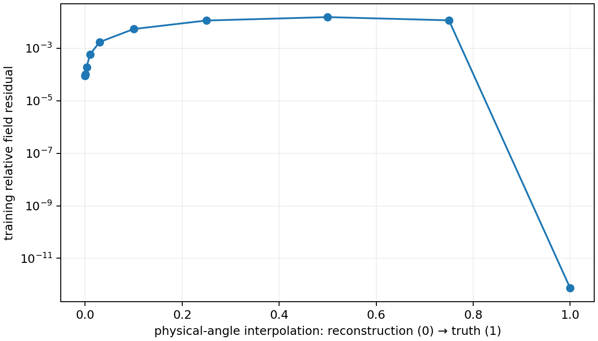

# Shape–frequency sensitivity atlas, 2 October 2026

The requested 108 shape/material/frequency combinations are complete on CPU:
circle radius 30 mm; ellipse semiaxes 40 and 25 mm; five-lobed star mean radius
30 mm and relative amplitude 0.2; interior εr = 2, 4, 9 in air; 12 equally spaced
frequencies from 0.5 to 8 GHz. Each has 81 real normal coordinates (constant,
cosine/sine modes through 40), normalized in arclength. Each bundle contains
the complex Jacobian, singular values, and all real right singular vectors.

The acquisition reuses the existing observability driver's 12-position ring
and physical transmitter–receiver offset. We report its paired data and an
explicit **additional** full 12×12 acquisition on the same positions. The
latter is not claimed to be the production paired observation contract.

## Numerical result

[Atlas](shape-frequency-qualified-20261002/sensitivity_atlas.png) ·
[Right singular vectors](shape-frequency-qualified-20261002/right_singular_vectors.png) ·
[Cutoff table](shape-frequency-qualified-20261002/cutoffs.csv) ·
[Full metrics](shape-frequency-qualified-20261002/spectra.json)

Number of real singular directions above 0.001 σ₁ in full multistatic data:

| Shape | εr | 0.5 GHz | 8 GHz |
|---|---:|---:|---:|
| circle | 2 | 7 | 32 |
| circle | 4 | 7 | 34 |
| circle | 9 | 7 | 34 |
| ellipse | 2 | 7 | 36 |
| ellipse | 4 | 7 | 41 |
| ellipse | 9 | 7 | 54 |
| star | 2 | 8 | 61 |
| star | 4 | 8 | 65 |
| star | 9 | 8 | 81 |

Paired data have only 24 real values, hence at least **57 structural null
directions** in this basis at every individual frequency. Their high-frequency
rank ceiling must not be mistaken for an intrinsic material resolution limit.
The 8-GHz, εr=9 star reaches the requested basis limit. A separate
[bandwidth audit](star-bandwidth-audit-20261002/spectra.json) extends to M=80
(161 real coordinates): rank remains 81, and σ₈₂/σ₁=0.000912. The leading
81 singular values change by at most 0.00160 σ₁; finite basis truncation is a
separate source of error from the nodal refinement check.

The cutoff increases with frequency, with substantial geometry/contrast
interaction. Pooled affine fits across contrasts give RMSEs in mode count of
1.46 / 3.76 for exterior/interior kR on circles, 4.41 / 2.62 on ellipses,
and 5.76 / 6.12 on stars. Here R=L/(2π). These descriptive fits do **not**
establish a universal kR or interior-kR rule, nor a joint geometry/update
policy's optimality. See [fits](shape-frequency-qualified-20261002/scaling_fits.json).

## Validation and interpretation

- 256→512-node refinement gives a Jacobian Frobenius difference of at most
  1.13e-12 σ₁. The reused Frobenius/Weyl audit resolves all 216 threshold
  counts between these two discretizations. This is not a continuum bound.
- Circle fields agree with the independent Bessel/Hankel Mie series to
  8.21e-14 relative L2 across all 36 circle cases.
- Five seeded random columns per shape at the highest frequency/contrast are
  compared with the existing **analytic discrete Kress operator derivative**
  and central finite differences at 1 µm and 0.3 µm. The maximum relative FD
  error among measurable columns is 8.61e-5; the maximum absolute FD error
  divided by the whole Jacobian norm is 7.62e-7. Full
  [raw checks](shape-frequency-qualified-20261002/derivative_validation.json)
  retain the enormous relative errors of near-zero columns. Those columns
  cannot support relative-accuracy claims; their absolute errors are far below
  the 0.001 spectral threshold.
- The first [precheck](shape-frequency-20261002/derivative_validation.json)
  stopped because a relative-only gate divided roundoff by derivatives of
  order 1e-13. The qualified rerun retains that evidence and explicitly uses
  whole-Jacobian absolute error for unresolved columns. It did not discard
  inconvenient columns or alter the 0.001 spectral threshold.
- The contraction is the existing Kress reciprocal shape identity generalized
  to all source/receiver pairs. Geometry coefficients are real, so the SVD
  acts on `[Re J; Im J]`. A complex SVD would answer a different question.
  Individual right singular vectors within repeated or nearly repeated
  singular-value clusters are not unique; their joint subspaces are the
  appropriate invariant quantities to interpret in the harmonic heat maps.
- 0.001 σ₁ is a declared relative diagnostic, not a measured noise floor.
  No statistical recoverability or inverse uniqueness is certified here.

The ranked document misstates one literature detail.
[Kow, Salo and Zou](https://arxiv.org/html/2404.18482), Theorems 1.1 and 1.3,
give stable-region sizes κ^(d−1) for a Herglotz density and κ^d for a
linearized **volume potential**, respectively. Neither theorem is a dielectric
shape-Jacobian theorem. A roughly linear boundary-mode cutoff is a hypothesis
examined here, not a direct application of their results.

## TOP-009: the proposed near-null explanation is not supported

The exact saved two-component final state and original acquisition/materials
are loaded from the archived evidence. Its training frequency is **0.5 GHz**;
1.5 and 2.5 GHz remain held-out diagnostics. No truth-selected rotation is used.

[Normal-intersection projection](top009-20261002/projection.json) ·
[Smooth polar correspondence](top009-polar-20261002/projection.json) ·
[Projection figure](top009-polar-20261002/top009_projection.png) ·
[Finite-path audit](top009-path-20261002/path.json)

At the reconstructed geometry, only **24.9% of M40 error energy** lies below
0.001 σ₁ using a smooth physical-polar-angle correspondence (49.9% of the
norm). Nearest normal intersections give 27.1% energy, but their correspondence
folds and is unsuitable as a smooth normal graph. At M9 the smooth projection
has 19.8% near-null energy. At 1.5/2.5 GHz the M9 Jacobian has no below-threshold
direction. Stacking the three frequencies leaves 0.42% M40 near-null energy
for the smooth correspondence; this uses held-out data only as a diagnostic.

More decisively, the M40 local linearization has a relative remainder of
**670** compared with the actual reconstruction-to-truth training field
change. This quantity initially combines finite-deformation and projection
effects. An independent [full-path tangent audit](top009-path-20261002/tangent_review.json)
finds that the M40 tangent differs from the untruncated normal-path tangent
by only **0.0254%**, while the untruncated finite-path remainder is **670.260**.
Centered differences along the path agree with that full tangent to
1.47e-7 and 1.32e-8 at steps 0.001 and 0.0003. Thus normal-basis truncation
does not explain the large remainder in this case.
This large finite deformation cannot be explained by a local SVD alone.
A smooth physical-angle path from reconstruction to truth raises the
training residual from **8.82e-5 to 1.52e-2** at its midpoint before returning
to the truth. That is a 173× residual barrier along this particular path,
with 256/512-node agreement better than 8e-13.



This demonstrates nonlinear separation along one natural path. It does not
prove the reconstruction is a stationary point, that every path has a barrier,
or that the inverse is nonunique. In particular, the prior TOP-010 finding of
premature optimizer stopping remains valid. The atlas rejects a simple
near-null explanation and gives concrete evidence for investigating nonlinear
paths/acquisition rather than claiming a resolution-limit theorem.

## Reproduce

Run from the repository root with the EMNerf Python environment:

```bash
export OPENBLAS_NUM_THREADS=1 OMP_NUM_THREADS=1 MKL_NUM_THREADS=1
PY=/home/drdeng/miniconda3/envs/EMNerf/bin/python
$PY -m experiments.atlas.run_jacobian_spectrum --output NEW_ATLAS
$PY -m experiments.atlas.report NEW_ATLAS
$PY -m experiments.atlas.run_jacobian_spectrum --output NEW_BAND_AUDIT --shapes star --epsr 9 --frequencies 8 --maximum-mode 80
$PY -m experiments.atlas.top009_projection --output NEW_NORMAL_PROJECTION
$PY -m experiments.atlas.top009_projection --correspondence polar --output NEW_POLAR_PROJECTION
$PY -m experiments.atlas.top009_path --output NEW_PATH
$PY -m experiments.atlas.review_top009_tangent --output NEW_TANGENT_REVIEW.json
$PY -m pytest -q experiments/atlas/test_jacobian_spectrum.py
```

The sweep took 195.5 s on this host with single-thread BLAS; concurrent
independent experiments were running, so this is not a matched runtime claim.
Output paths must be new. Source/input hashes are in the manifests. TE/lossy
extensions are reported separately in [polarization](../polarization/README.md).
