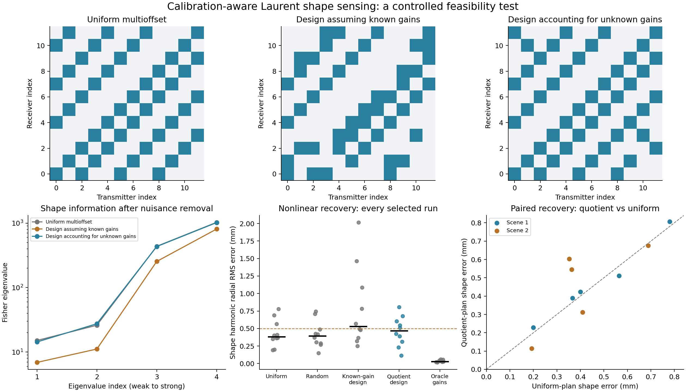

# Calibration-quotient Laurent GPR: feasibility result

2026-09-16. An isolated scientific experiment; no production defaults changed.

## Decision

The information-geometry diagnostic works, but this test does **not establish a meaningful
advantage over a well-spread uniform multioffset acquisition**. The calibration-aware plan
stays close to that uniform plan. Designing as though antenna gains were known can make the
actual self-calibrating problem worse. This supports nuisance-aware information analysis,
not a claim that special measurement loops create additional information or newly recoverable modes.

## Matched nonlinear results

Two fixed noncircular shapes, 5 independent gain/noise seeds per shape,
1% additive complex noise, and 2 initializations per inversion.
Both starts use the same bounds and objective; the lower training cost selects the reported result.
Every non-oracle arm jointly estimates exactly the same shape, material, and calibration variables.

| Acquisition / calibration | Median shape RMS (mm) | <0.5 mm | Median held-out trace error |
|---|---:|---:|---:|
| Uniform multioffset | 0.383 | 7/10 | 0.86% |
| Random multioffset | 0.393 | 8/10 | 0.80% |
| Design assuming known gains | 0.530 | 5/10 | 0.92% |
| Design accounting for unknown gains | 0.467 | 5/10 | 0.84% |
| True gains supplied | 0.027 | 10/10 | 0.20% |

Shape RMS is the angular RMS of the error in radial harmonics 2 and 3, in physical mm;
it excludes center and mean radius. Full-boundary, center, radius, and material errors are
also retained in `recoveries.json`. The 0.5 mm threshold was declared in `design.json`
before recovery. It is an experiment-specific tolerance, not a universal resolution limit.
Held-out trace error uses unmeasured entries of the same multistatic matrix and the inferred gains.

- Versus Uniform multioffset: mean paired shape-error change +0.029 mm; conditional 95% bootstrap interval [-0.031, +0.096] mm; lower error in 4/10 pairs.
- Versus Random multioffset: mean paired shape-error change +0.044 mm; conditional 95% bootstrap interval [-0.135, +0.199] mm; lower error in 3/10 pairs.
- Versus Design assuming known gains: mean paired shape-error change -0.322 mm; conditional 95% bootstrap interval [-0.722, +0.029] mm; lower error in 6/10 pairs.

The intervals resample seeds within each fixed scene. They do not establish performance
over a population of buried shapes. Ten paired cases are a screening experiment.



## What was tested

The model is 2-D scalar, lossless, equal permeability, with one smooth dielectric inclusion
in a homogeneous background (relative permittivity 6). Twelve transmitter and twelve
receiver positions form two nearby surface-style lines. There is **no air/soil interface,
antenna radiation pattern, additive clutter, conductivity, or unknown topology**.
The reference object has radius 30 mm and center depth 160 mm. Frequencies are 0.5 and
1.25 GHz. Unknown physical coordinates are center x/y, mean radius, cosine/sine coefficients
of radial harmonics 2 and 3, and uniform real interior permittivity.

The measured scattered matrix is `Y_rs = exp(g_r + h_s) F_rs + noise`, with independent
complex log gains at each frequency. Reference transmitter log gain is zero to remove
parameter redundancy. This fixes no physical calibration information. True log-amplitude
standard deviation is 0.15, and phase standard deviation is 0.25 rad. Inversion bounds
of ±3 on gain coordinates are deliberately broad; bound hits are recorded.
Noise variance is fixed per frequency from the full clean uncalibrated candidate matrix,
before selecting measurements. All plans share that variance and the same complete noise
realization. Overlapping measurements are therefore exactly paired.

Each plan has 48 edges per frequency, four uses of every transmitter and receiver, one
connected component, and **25 independent complex graph cycles**. All plans also have
the same offset-bin histogram: 12/10/15/11 edges in bins separated by 0.06/0.14/0.26 m.
Offsets are matched by bins, not exactly edge-by-edge. The uniform comparator is an
index-based, well-spread multioffset pattern (including long offsets), not a common-offset line.
The random comparator uses a different frozen degree/offset-preserving random graph for
each seed index, reused across the two scenes.

## Information geometry

At each frequency, form the noise-whitened gain tangent N from the predicted data and
the transmitter/receiver incidence matrix. Project the physical Jacobian with
`J_q = (I - N N^dagger) J`. The complex projection removes both gain-amplitude and
gain-phase directions. Stack real/imaginary parts across frequencies, then project out
the four real nuisance coordinates: center x/y, mean radius, and material.
The remaining four-column matrix gives the efficient local shape Fisher information.
Tests compare this sequential construction against projecting out every nuisance
column of the full real joint Jacobian at once.

Both optimized plans maximize mean log determinant over three fixed prior geometries.
One assumes calibration known during design; the other profiles calibration during design.
Both use the same three starting graphs, swap constraints, proposal budget, and random seed.
The inverse itself treats gains as unknown in BOTH arms. Design uses no observation,
truth geometry, or held-out outcome. It is a local search, not a certified global optimum.
Information profiling and D-optimal design are standard constructions; this study makes
no novelty claim for them.

All tested finite-object plans retain four locally independent shape directions.
This is an issue of information strength and nonlinear estimation, not a demonstrated
rank transition. Tests separately verify that a tree has no gain-invariant data and
that monopole-only cross ratios are identically one. Those algebraic facts are not
used as artificially weak recovery baselines.

## Numerical qualification

All six targeted tests passed, including joint derivatives (shape, material and gains),
gauge invariance, closure cancellation, graph constraints, and independent forward checks.
Shape derivatives are reciprocal analytic derivatives; the single material derivative
uses a centered difference of freshly compiled matrices. Initial and truth states pass
full 192/256-node boundary refinement and native/nodal compiler checks.
Every reported recovered state was freshly checked against an independent full 256-node
boundary solve: worst relative field discrepancy **3.31e-13**.

Recoveries use the faster nodal compiler on the identical Laurent shape family.
The node-free Laurent compiler is independently qualified against the full boundary
solver; this experiment makes no intrinsic Laurent speed claim. All complete optimizer
trials use freshly evaluated nonlinear scattering, not a frozen tangent approximation.

## Interpretation and next decision

The original strong claim—special loop selection unlocks a deformation that generic
multioffset acquisition cannot recover—is not verified by this experiment. A well-spread
uniform design is already competitive under these fair controls. The useful finding is
that assuming known calibration during acquisition design can select weaker measurements
for the actual unknown-calibration inverse.

The pragmatic next experiment, if continuing, is to use this diagnostic to test a
different physical information source, such as a neighbouring scatterer: does it increase
target-shape information after profiling the neighbour's own uncertain parameters?
Do not add closure-ratio optimization merely to seek a better-looking result: the full
joint likelihood already uses that information and handles additive noise directly.

## Reproduce

From the repository root:

```bash
export OMP_NUM_THREADS=1 OPENBLAS_NUM_THREADS=1 MKL_NUM_THREADS=1
export PYTHONPATH=solvers:.
/home/drdeng/miniconda3/envs/EMNerf/bin/python -m pytest -q experiments/laurent_calibration/test_calibration.py
/home/drdeng/miniconda3/envs/EMNerf/bin/python -m experiments.laurent_calibration.run --stage all --seeds 5 --noise .01 --starts 2
MPLCONFIGDIR=/tmp/laurent-calibration-mpl /home/drdeng/miniconda3/envs/EMNerf/bin/python -m experiments.laurent_calibration.analyze
```

`design.json` preserves every selected edge, all prior states, search counts, and nominal
information matrices. `recoveries.json` preserves both starts, fitted nuisance parameters,
truths, seeds, and per-case metrics. `manifest.json` records source hashes and environment;
existing uncommitted experimental dependencies are used. `summary.csv` is the compact table.

Relevant established baselines:
[source-independent GPR FWI](https://www.sciencedirect.com/science/article/pii/S0926985122003627),
[source variable projection](https://doi.org/10.1111/1365-2478.12008), and
[interferometric closure invariants](https://arxiv.org/abs/2108.11399).
The first two published algorithms were not reproduced in this bounded screening test;
the matched joint gain/shape/material inverse is the strong internal baseline.
