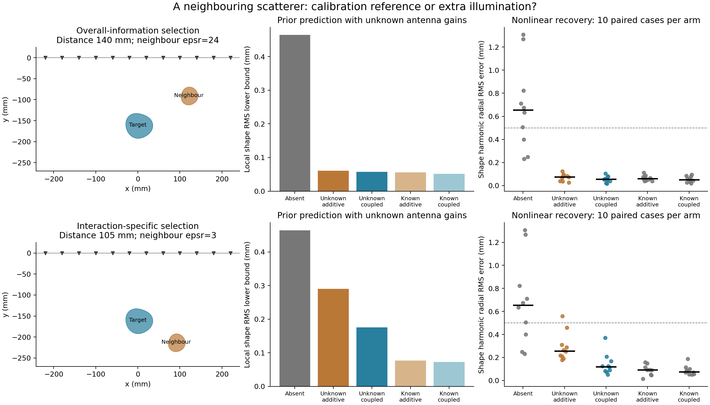

# Neighbour-assisted Laurent shape recovery: two mechanisms

2026-09-16. Follow-up to the negative calibration-loop acquisition test.

## Finding

The controlled feasibility test is positive. With neighbour geometry/material and antenna
gains all estimated, the interaction-specific configuration reduces median target-harmonic
error from **0.654 mm without a neighbour**, to **0.257 mm with additive
echoes**, to **0.118 mm with full multiple scattering**. Full interactions improve
on additive echoes in 9/10 paired cases.

The useful research hypothesis is **scattering-assisted separation of shape and calibration**.
The known-gain local control below does not predict an interaction benefit for this
configuration. Thus these results support an effect on joint identifiability, while leaving
the stronger claim of improved shape sensing with perfect calibration unsupported.
This is evidence from two selected synthetic configurations, not field GPR validation.

## What the experiment separates

A neighbour can help in two different ways: its directly observed echo can constrain
unknown transmitter/receiver gains, and its interaction with the target can change
illumination. Both are tested with a fully unknown neighbour as well as a known-neighbour
upper reference. The additive control retains both direct echoes but switches off
inter-object scattering. It has its own correctly matched synthetic observations and
inverse; it does not fit coupled data with an inaccurate additive model.

The primary prior-selected configuration predicts a large overall gain, but nearly all
of it is also present in the additive world. The second, separately prior-selected
configuration predicts an interaction-specific improvement and only about 6% more total
received field RMS than the isolated target. These two candidates were selected before
any nonlinear recovery outcomes were available.

## Measured nonlinear results

Each configuration has two fixed noncircular target/neighbour pairs, five independent
gain/noise seeds, five arms, and two initializations per fit. The same absolute noise,
antenna gains, source power, frequencies, and measurement mask are used across all arms.
The noise level is 1% relative to the nominal isolated target; it is NOT rescaled upward
when the neighbour makes the scene brighter.

### Overall-information selection

| Physical world / available knowledge | Median shape error (mm) | Ensemble RMS error (mm) | Below 0.5 mm |
|---|---:|---:|---:|
| No neighbour | 0.654 | 0.767 | 3/10 |
| Unknown neighbour, additive | 0.076 | 0.076 | 10/10 |
| Unknown neighbour, coupled | 0.057 | 0.061 | 10/10 |
| Known neighbour, additive | 0.062 | 0.068 | 10/10 |
| Known neighbour, coupled | 0.052 | 0.060 | 10/10 |
### Interaction-specific selection

| Physical world / available knowledge | Median shape error (mm) | Ensemble RMS error (mm) | Below 0.5 mm |
|---|---:|---:|---:|
| No neighbour | 0.654 | 0.767 | 3/10 |
| Unknown neighbour, additive | 0.257 | 0.315 | 9/10 |
| Unknown neighbour, coupled | 0.118 | 0.166 | 10/10 |
| Known neighbour, additive | 0.091 | 0.099 | 10/10 |
| Known neighbour, coupled | 0.075 | 0.096 | 10/10 |

The error is angular RMS in target radial harmonics 2 and 3, excluding center and mean
radius. Center, radius, material, full corresponding-boundary, and held-out trace errors
are retained in the raw records. The 0.5 mm threshold is an experiment-specific tolerance.
Known-neighbour arms know its complete truth geometry/material. All other arms estimate
all eight physical coordinates of every included object, plus unknown gains. All fits
use the same nonlinear least-squares implementation and choose the lower training loss
of two starts, without using truth in selection.



## Paired comparisons

**Overall-information selection:**

- Unknown neighbour, coupled minus No neighbour: paired mean -0.625 mm, conditional 95% bootstrap interval [-0.838, -0.415] mm; lower error in 10/10 cases.
- Unknown neighbour, coupled minus Unknown neighbour, additive: paired mean -0.015 mm, conditional 95% bootstrap interval [-0.032, -0.000] mm; lower error in 7/10 cases.
- Unknown neighbour, additive minus No neighbour: paired mean -0.609 mm, conditional 95% bootstrap interval [-0.831, -0.390] mm; lower error in 10/10 cases.
**Interaction-specific selection:**

- Unknown neighbour, coupled minus No neighbour: paired mean -0.540 mm, conditional 95% bootstrap interval [-0.772, -0.308] mm; lower error in 10/10 cases.
- Unknown neighbour, coupled minus Unknown neighbour, additive: paired mean -0.152 mm, conditional 95% bootstrap interval [-0.248, -0.069] mm; lower error in 9/10 cases.
- Unknown neighbour, additive minus No neighbour: paired mean -0.388 mm, conditional 95% bootstrap interval [-0.637, -0.131] mm; lower error in 9/10 cases.

Bootstrap intervals resample gain/noise seeds within each of the two fixed shape pairs.
They do not describe generalization to arbitrary shapes, materials, or neighbour locations.
The absent arm is identical across the two configuration studies; those repeated controls
are not additional independent evidence.

## Prior-only selection and physical controls

The scan has 63 locations/material combinations: center separation 105 or 140 mm,
angles on a 30-degree grid (excluding positions too close to the acquisition line),
and neighbour relative permittivity 3, 12, or 24. The target reference radius is 30 mm,
and the neighbour's is 20 mm. Three fixed target/neighbour prior pairs are used.
The selected configuration does not use recovery truth or observed noise.

- Overall-information selection: separation 140 mm, angle +30 degrees, neighbour
  permittivity 24. Worst-prior target RMS precision gain over absence is
  7.86x after profiling all neighbour and calibration uncertainty.
  Nominal coupled/additive bounds are
  0.057/
  0.060 mm.
  Total field RMS is about 4.66x the isolated target's.
- Interaction-specific selection: separation 105 mm, angle -30 degrees, neighbour
  permittivity 3. It maximizes the worst-prior improvement over the additive control,
  among candidates that also improve over absence. The predicted worst-prior
  coupled-versus-additive precision factor is
  1.65x. Nominal coupled/additive bounds are
  0.176/
  0.290 mm.

The second criterion was introduced after inspecting the first **prior-only** scan,
to distinguish mechanisms, and before either configuration's nonlinear recoveries.
The sweep is a selected-case feasibility study, not an unbiased performance benchmark.
Every candidate and prior result is retained in `screen.json`.

All arms use the previous study's competitive uniform multioffset plan: 48 measurements
per frequency, 12 transmitters and 12 receivers, four measurements per endpoint. The
frequencies are 0.5 and 1.25 GHz. There are no extra antennas or measurements for neighbour
cases. Unknown physical coordinates per object are x/y position, mean radius, four shape
harmonics, and uniform real permittivity. Antenna gains have independent complex log
coordinates at each frequency with one transmitter reference fixing parameter redundancy.

## Information-geometry interpretation

Shape information is computed by noise-whitening and projecting out complex gain tangents,
then the real target position/radius/material tangents and, when unknown, all neighbour
tangents. This is the efficient Fisher information, not raw Jacobian norm. The nonlinear
inverse simultaneously fits exactly those nuisance coordinates.

There is a useful mathematical check on the mechanism: with gains known and fixed
additive noise, a known additive neighbour does not change the target Jacobian or its
information at all. An unknown additive neighbour only adds nuisance directions, so
cannot increase that information. A numerical test checks both statements. Improvement
from additive echoes with unknown gains is therefore a calibration-ambiguity effect,
not extra illumination. `audit.json` also reports known-gain Fisher controls.

Multiple-scattering enhancement itself is established physics. This test explores its
survival under simultaneous shape/material/calibration uncertainty; it makes no novelty
claim for the underlying T-matrix method or Fisher-information projection. Relevant
foundations include scattering-matrix Fisher information in
[Maximum information states for coherent scattering measurements](https://www.nature.com/articles/s41567-020-01137-4)
and the experimentally studied transport of information in complex microwave environments in
[Continuity equation for the flow of Fisher information in wave scattering](https://www.nature.com/articles/s41567-024-02519-8).
Neither paper establishes the particular uncertain-neighbour shape-recovery claim tested here.

For the interaction-specific configuration, the nominal shape RMS lower bounds are:

| Antenna calibration | No neighbour | Unknown additive neighbour | Unknown coupled neighbour |
|---|---:|---:|---:|
| Unknown gains | 0.4646 mm | 0.2903 mm | 0.1758 mm |
| Known gains | 0.0382 mm | 0.0428 mm | 0.0439 mm |

With known gains, the coupled unknown neighbour is slightly worse than the additive one
and the isolated target. This is a local Fisher prediction, not an additional nonlinear
recovery study. Our interpretation is that interactions change which shape perturbations
can be mimicked by nuisance parameters. A targeted next check is to vary calibration
uncertainty continuously, before introducing a layered conductive GPR background.

## Validation and limits

Six new mathematical/numerical tests passed: mixed-material full-boundary/native agreement,
all 16 coupled derivatives, additive equivalence, monotonicity under nuisance uncertainty,
joint gain derivatives, and the known-gain additive-information inequality. Selected
initial/truth scenes pass boundary-node refinement and both native/nodal compiler checks.
Each selected recovered state was freshly checked against a full 192-node-per-object
boundary solve. Worst relative forward discrepancy across both studies: **2.15e-14**.
All 200/200 optimization trials converged; the largest difference in final
training cost between the two starts was
6.87e-09. This checks local repeatability,
not global uniqueness. One isolated-target selected fit reached a physical parameter bound;
no neighbour-arm fit or gain coordinate reached a bound.

The independent reference reuses exterior-only cross blocks from the existing full BIE
and replaces each diagonal self block with its own interior-material Muller block. It
uses no cylindrical translation or source/receiver truncation. Inverses use the faster
nodal compiler on the same Laurent chart; native compilation is separately qualified.
No intrinsic Laurent speed advantage is claimed. Runtime numbers are diagnostic only;
the two configuration studies ran concurrently with one BLAS thread each.

The model is one target plus an optional neighbour in a 2-D homogeneous, lossless medium
with relative permittivity 6. It has surface-style acquisition but no air/soil boundary,
real antenna pattern, clutter, conductivity, unknown object count, or field validation.
Initial positions are locally constrained, component identity is known, and all bounding
circles remain disjoint. The neighbour is selected as a synthetic physical scenario;
this is not a claim that surveyors can place or move arbitrary buried objects.

## Reproduce

```bash
export OMP_NUM_THREADS=1 OPENBLAS_NUM_THREADS=1 MKL_NUM_THREADS=1
export PYTHONPATH=solvers:.
/home/drdeng/miniconda3/envs/EMNerf/bin/python -m pytest -q experiments/laurent_neighbour/test_neighbour.py
/home/drdeng/miniconda3/envs/EMNerf/bin/python -m experiments.laurent_neighbour.run --stage screen
/home/drdeng/miniconda3/envs/EMNerf/bin/python -m experiments.laurent_neighbour.run_coupling_control --select-only
/home/drdeng/miniconda3/envs/EMNerf/bin/python -m experiments.laurent_neighbour.run --stage recover
/home/drdeng/miniconda3/envs/EMNerf/bin/python -m experiments.laurent_neighbour.run --output results/experiments/laurent_neighbour_20260916/coupling_control --stage recover
MPLCONFIGDIR=/tmp/laurent-neighbour-mpl /home/drdeng/miniconda3/envs/EMNerf/bin/python -m experiments.laurent_neighbour.analyze
```

Raw selection, qualification, two-start inverse records, summaries, paired statistics,
and source/environment manifests are saved beside this report and in `coupling_control/`.
No production defaults or prior experiment outputs were changed.
