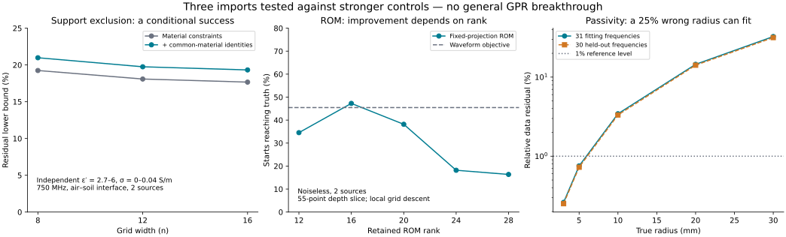
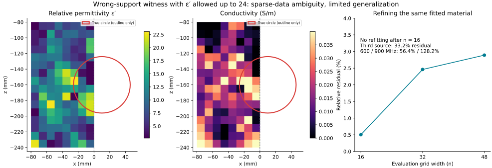

# Outsider research assessment — 16 September 2026

**Outcome: one useful conditional method, two routes to demote, no breakthrough requiring a user decision.** I stopped after the main claims in these three directions met concrete limitations. This is a stopping point for these investigations, not a claim that all possible GPR ideas are exhausted. Laurent was parked rather than developed further.

The most interesting surviving idea is to ask **what locations the data can rule out**, using global residual lower bounds imported from photonic design. It works in a deliberately limited GPR-like experiment. However, its strength depends materially on the permitted dielectric range. That dependence survived efforts to disprove it and matters more than the initially impressive gain from cross-illumination constraints.

| Route | Strongest retained evidence | Wall reached | Assessment |
|---|---|---|---|
| Photonic-design duality → support exclusion | 19.32% residual lower bound for every admissible discretized object confined to the left half of a conductive layered scene | Strong material prior; strongest control already gives 17.67%; no continuum error certificate | Keep the experiment, withhold a general claim |
| Data-derived wave-operator ROM → alternative FWI objective | Exact data/interior projection checks; some ranks enlarge a depth basin modestly | Rank/noise sensitivity, inconsistent gains, close EM prior art | Demote as a novel GPR direction |
| Passive material spectra → resolve shape/dispersion ambiguity | Exact full-wave pair: 25% radius error with 0.755% fitted and 0.726% held-out residual | Passive size/contrast tradeoff for small targets | Useful counterexample, not a recovery method |

All percentages below use the norm of the **scattered complex data**, unless a basin fraction is explicitly named. They are neither percentages of the direct wave nor statistical confidence levels.

## 1. A conditional global exclusion calculation

The proposed output is a statement such as: “No allowed material distribution confined to this region can reproduce these observations within the error budget.” This avoids interpreting a local optimizer's failure as evidence of nonexistence. Lagrange-dual performance bounds are established in [photonic design](https://web.stanford.edu/~boyd/papers/comp_imposs_res.html); local wave constraints were developed by [Kuang and Miller](https://arxiv.org/abs/2008.13325). Constraints coupling responses from the same structure are also established, including [Shim et al.](https://arxiv.org/abs/2112.10816). The mathematical ingredients are imported, not claimed as new.

The final test uses 2D scalar TM scattering at 750 MHz with all multiple scattering retained. Air lies above conductive soil with relative permittivity 6 and conductivity 0.02 S/m. Two point transmitters at x = ±200 mm sit 30 mm above the interface; 20 receivers span x = ±220 mm at height 35 mm. The true circle has radius 36 mm, centre (10, −160) mm, permittivity 3 and conductivity 0.01 S/m. The candidate domain is x ∈ [−80, 80] mm, z ∈ [−240, −80] mm.

For the exclusion test, **all contrast must lie at x < 0**. Each candidate cell may independently have permittivity anywhere in [2.7, 6] and conductivity anywhere in [0, 0.04] S/m. There is no circle parameterization, fixed object count, or uniform-material assumption in this bound. Background material is allowed inside the candidate region.

| Grid across the complete domain | Stronger material-constraint baseline | With additional common-material identities |
|---|---:|---:|
| 8 | 19.244% | 20.979% |
| 12 | 18.088% | 19.751% |
| 16 | 17.666% | **19.323%** |

These are lower bounds, not residuals from unsuccessful fits. At n = 16 the extra identities improve the bound by **1.657 percentage points**. Earlier binary-material controls gave a much larger apparent improvement; that is not the fair final comparison. Both final variants already impose material constraints on coherent combinations of the two source fields. Only the extra bilinear common-material identities distinguish them.

Actual physical fits confined to the left region reached about 46.4% residual under the same material box. A full-domain physical fit reached 0.022% on the n = 8 model. The first verifies that the reported lower bound is below feasible costs; the second checks that the method is not indiscriminately rejecting the observations. The gap between 19.3% and 46.4% is large: there is no claim to have found the global optimum of the inverse problem.

### What survived independent checks

The synthetic layered truth used a separate, much finer fractional-cell representation of a circle. Its 40→56 grid change was 0.0554%; doubling the Sommerfeld quadrature order changed the data by about 3 × 10⁻¹⁴. The layered Green function also passes homogeneous-limit, reciprocity, quadrature-refinement and differential-equation checks. Earlier homogeneous experiments used an independent boundary-element circle solution. Every saved successful final complex-material dual was freshly reconstructed and checked for positive definiteness and multiplier feasibility.

These checks reduce ordinary implementation concerns. They **do not** provide a uniform forward-error bound over every admissible candidate shape. The n = 16 representation of the true layered circle itself differs from the fine reference by 1.439%. Subtracting that truth-only discrepancy from 19.323% would not establish a continuum certificate. The eigenvalue and linear-solve safeguards are floating-point checks, not interval arithmetic.

### The material-prior stress test

Widening the admissible permittivity creates actual wrong-support alternatives. With the upper limit raised to 12, a physical n = 16 fit reached 2.583% residual; with it raised to 24, a fit reached **0.504%**. Conductivity remained independently bounded by 0–0.04 S/m. These searches reached their evaluation limits, but the returned material fields are feasible and their directly evaluated residuals are valid upper witnesses.

The 0.504% figure is too flattering without refinement. Subdividing the same fitted cells, without changing their material or refitting, gives 2.461% at n = 32 and **2.891% at n = 48**. Refinement is not yet a formal continuum proof. The field is a heterogeneous distribution throughout the left region; it is not an alternative single circle or a sparse buried object.

| Additional observations, frozen alternative evaluated at n = 48 | Relative residual |
|---|---:|
| Midpoints between the original receivers | 2.908% |
| A third transmitter at x = 0 | 33.208% |
| Original acquisition at 600 MHz | 56.371% |
| Original acquisition at 900 MHz | 128.156% |

Thus the example exposes sparse single-frequency ambiguity and sensitivity to material assumptions. It does not establish ambiguity for a broadband survey. The extra-measurement failures also do not prove that a different broadly admissible object could not fit all those measurements jointly.

Other explicit failures: the exclusion of a small central region vanished after adding conductive layered physics; several earlier 1.25 GHz bounds were zero; broad contrast ranges sometimes defeated the positive-definite starting-point search. A zero bound is inconclusive. Failure to initialize is a solver limitation, not a theorem about recoverability.

### What the mathematics actually guarantees

Let E = e + GP, P = χE, and d(P) = AP for the discrete model restricted to candidate region S. Define

\[
r_S(y)=\inf_{\text{admissible material in }S}\|AP-y\|_F.
\]

For binary material χ ∈ {0, χ₀}, necessary cell constraints are \(\overline{P_s}(\chi_0^{-1}P_t-(GP)_t-e_t)=0\), including cross-source pairs. For unknown common complex material, \(P_sE_t-P_tE_s=0\) remains necessary. Disk and half-plane inequalities impose the allowed complex-permittivity rectangle, including coherent source combinations. The implementation groups some local constraints spatially; relaxing them preserves the lower-bound direction.

A quadratic Lagrangian has form

\[
L(p)=p^*Qp-2\Re(b^*p)+c.
\]

With nonnegative multipliers for constraints written ≤ 0 and Q positive definite, weak duality gives

\[
r_S(y)^2\ge c-b^*Q^{-1}b.
\]

This is global over the stated finite admissible set and needs no local linearization of scattering. Maximizing the dual improves the bound but is unnecessary for its validity. If a bound on r_S(y) is b and the data perturbation is at most δ in the same absolute norm, the distance-to-set triangle inequality gives r_S(y + η) ≥ max(0, b − δ). To extend that statement to continuum physics additionally requires a uniform approximation error over admissible candidates, which this work does not have.

The possible GPR contribution is a computable finite-data exclusion test under explicit material assumptions. A targeted search did not establish priority. Furthermore, [Griesmaier, Harrach and Xiang's February 2026 paper](https://ianm.math.kit.edu/downloads/rg-ip/griesmaier/MonotonicityRegulariyationHelmholtz.pdf) already provides monotonicity-based support reconstruction with convergence theory and a convex semidefinite formulation. Its assumptions include a homogeneous exterior, positive real contrast, and full-aperture far-field operator information for the theory. It is distinct from this sparse lossy near-field test, but it rules out selling “provable convex support recovery” as a new general concept.

## 2. ROM: correct construction, insufficient advantage

I tested the observed-data spectral projection and frozen trial basis from Appendix E of [Waveform inversion via reduced order modeling](https://josselin-garnier.org/wp-content/uploads/2022/10/geophysics22.pdf). The initial moving-basis screen is retained as an exploratory control and is excluded from the conclusion about the published construction.

The finite scalar wave test uses a band-limited source, 16 snapshots and a 55-point inclusion-depth scan. Data-derived mass and stiffness matrices agree with independent interior snapshots to roughly 10⁻¹⁴; the frozen reduced operator agrees with an independently projected interior operator. The metric is the fraction of grid starting points reaching the true depth by successive lower-valued neighbours, not a full FWI convergence rate.

| Test | Waveform objective basin | ROM basin |
|---|---:|---:|
| Noiseless, two sources | 45.45% | 16.36–47.27%, depending on rank |
| 0.1% scattered-data noise, mean of 10 seeds | 45.45% | 18.18% |
| 1% noise, mean of 10 seeds | 45.45% | 14.55% |
| 5% noise, mean of 10 seeds | 45.45% | 36.55% |
| Finer grid, four sources | 69.09% | 65.45–74.55%, depending on rank |

Noise is band-limited and symmetric; rank is chosen using its known synthetic perturbation norm, not the answer. That is a favourable calibration assumption. All noisy scans still put the global grid minimum at the truth. The observed problem is the objective landscape, not a demonstration of nonidentifiability. A low-rank four-source construction encountered Krylov breakdown and was recorded rather than silently replaced.

These small experiments do not disprove ROM inversion generally. They fail to justify a substantial implementation effort here. The novelty case is also weak: there is already [lossy layered electromagnetic ROM inversion](https://arxiv.org/abs/2012.00861) and [two-dimensional anisotropic electromagnetic ROM inversion](https://arxiv.org/abs/2403.03844).

## 3. Passivity does not remove the small-target size tradeoff

Passive spectral approximation has rigorous foundations, including density results for suitable Herglotz-function representations by [Ivanenko et al.](https://epubs.siam.org/doi/10.1137/17M1161026). Those are representation and approximation theorems, not shape-identifiability theorems.

A direct counterexample uses a passive Debye circle in a homogeneous εᵣ = 6 background. For an enlarged radius R′, set t = (R/R′)² and

\[
\epsilon'(\omega)=6+t[\epsilon(\omega)-6].
\]

Here the prime labels the alternative material, not a derivative. For R′ > R, this is a convex combination of passive media and preserves the leading scalar-TM area-times-contrast response. Its Debye strength and conductivity remain positive. I then fitted the four passive parameters at fixed R′ = 1.25R using the full Mie solution, not the small-target approximation.

The fit uses 8 transmitters, 16 receivers and 31 frequencies from 0.3 to 1.5 GHz; another 30 midpoint frequencies are held out.

| True → alternative radius | Fitted residual | Held-out residual |
|---|---:|---:|
| 3 → 3.75 mm | 0.261% | 0.251% |
| 5 → 6.25 mm | **0.755%** | **0.726%** |
| 10 → 12.5 mm | 3.441% | 3.321% |
| 20 → 25 mm | 14.502% | 14.136% |
| 30 → 37.5 mm | 32.556% | 31.583% |

Twelve selected truth/alternative responses were independently checked against 192-node Müller BEM, with maximum relative disagreement 4.46 × 10⁻¹⁴. This uses the low-level complex-wave API with an explicit passive phasor convention; the production material wrapper remains unchanged. The experiment does not include an air–soil interface.

The conclusion is limited but robust: passivity alone need not make small-target radius stable under a bounded data-error model. A residual below 1% over thousands of samples is **not** automatically indistinguishable under independent 1% per-sample noise; coherent residuals may be detectable statistically. The tradeoff also weakens substantially for the larger targets tested. No novelty is claimed for size/contrast ambiguity itself.

## Stopping decision and evidence

The exclusion calculation is the only route I would preserve as a possible future research thread. Its next substantive hurdle is a certificate that remains useful with broader material uncertainty and a justified modelling-error budget. The current evidence does not warrant asking for a new dataset, changing the production solver, or starting another implementation cycle. ROM and passivity have not supplied an alternative breakthrough. Continuing parameter sweeps here would risk returning to the rabbit hole the user asked to avoid.

All work is isolated in three experimental packages. Reproduction instructions: [support certificates](../../../experiments/support_certificates/README.md), [operator ROM](../../../experiments/operator_rom/README.md), [passive shape ambiguity](../../../experiments/passive_shape/README.md). Main numerical evidence: [certificate bounds](../support_certificates_20260916/complex_material.json), [physical checks](../support_certificates_20260916/primal_checks.json), [broader material fits](../support_certificates_20260916/broad_material.json), [witness refinement](../support_certificates_20260916/broad_qualification.json), [ROM controls](../operator_rom_20260916/qualification.json), [passive alternatives](../passive_shape_20260916/screen.json), [BEM checks](../passive_shape_20260916/qualification.json). The final source and result hashes are in [validation.json](validation.json).

No production code, branch, or worktree was changed. No commit or push was requested or performed.
