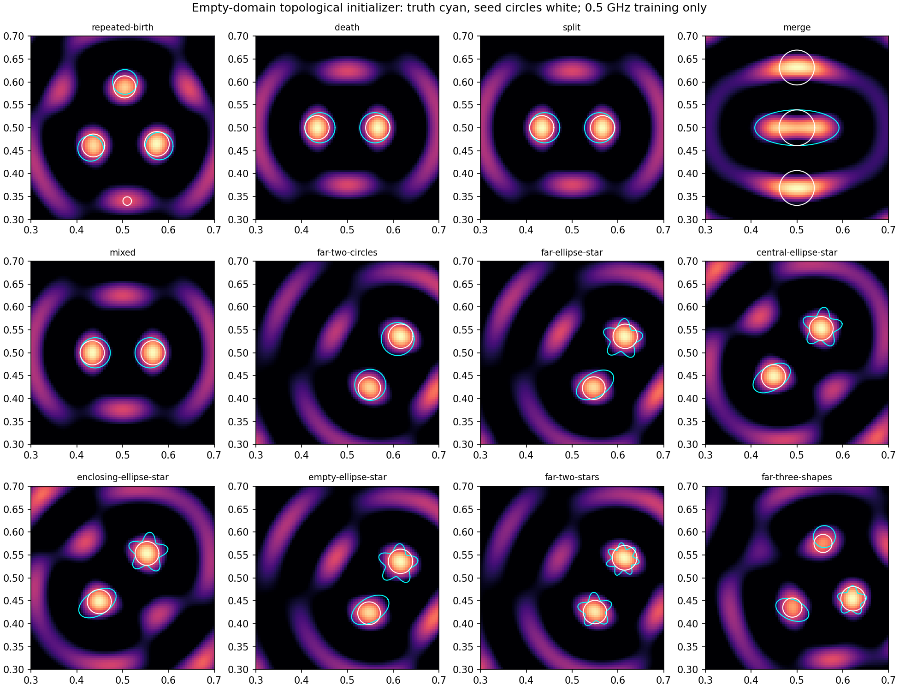

# Sampling and frequency paths — October 2, 2026

The topological initializer and the frequency-path experiments retain all twelve scene configurations. They are separate comparisons with different training-data contracts. The [implementation README](../../experiments/exploratory_continuation/README.md) records primary literature, derivations, commands and limitations.

## Initializer comparison

The image uses only the archived 0.5 GHz paired training measurements. It improves starting IoU in 10/12 scenes and identifies the correct component count in 10/12, requiring zero BIE solves. The two count failures are merge (three seeds for one ellipse) and repeated-birth (four seeds for three circles). Truth is used only for evaluation. LSM is explicitly unsupported for the frozen paired acquisition; missing cross-source/receiver measurements are never fabricated.

The original-budget comparison uses the same existing H feasibility policy for both arms: ten cycles, 22 fixed iterations, three candidate refinement iterations and 48 candidates per type. The per-job 600-second cap is inherited from the original benchmark. All 24 jobs have returned or reached that cap.

| Initializer | All-gate passes /12 | Known inverse BIE solves | Audit BIE solves | Summed job seconds | Complete work counts? |
|---|---:|---:|---:|---:|---|
| Original starts | 5 | 4069 | 33 | 2371.5 | False |
| Topological starts | 5 | 2269 | 33 | 1412.0 | False |

A timeout is a failed benchmark run and remains in the denominator. Its last checkpoint retains partial work; reported inverse counts are lower bounds whenever a job did not return its final ledger. Parallel shared CPU load makes timing descriptive.

| Scene | Original start | Topological start |
|---|---|---|
| repeated-birth | PASS | PASS |
| death | PASS | PASS |
| split | PASS | PASS |
| merge | FAIL: recovered | FAIL: TIMEOUT |
| mixed | PASS | PASS |
| far-two-circles | PASS | PASS |
| far-ellipse-star | FAIL: topology_stationary | FAIL: topology_stationary |
| central-ellipse-star | FAIL: topology_stationary | FAIL: topology_stationary |
| enclosing-ellipse-star | FAIL: maximum_events | FAIL: topology_stationary |
| empty-ellipse-star | FAIL: topology_stationary | FAIL: topology_stationary |
| far-two-stars | FAIL: topology_stationary | FAIL: topology_stationary |
| far-three-shapes | FAIL: TIMEOUT | FAIL: topology_stationary |

The initial two-cycle A-policy pilot had five topological-arm exceptions after newly born components approached the 10 mm cross-quadrature gap. All seed geometries had passed their initial refined audits. The existing H refined-feasibility guard removes those exceptions: the matched two-cycle H pilot completed 24/24 jobs, with 2/12 passes from original starts and 5/12 from topological starts. All earlier attempts remain under `controller/` and `controller_guarded/`; `controller_full/` owns the original-budget comparison.

## Frequency-path comparison

The frozen suite has only one training frequency, so a nontrivial frequency walk requires additional observations. This declared extension uses 0.25, 0.375, 0.5, 0.75 and 1 GHz training, preserving 1.5/2.5 GHz holdout data. All 12 synthetic training sets qualified at N128/256 and against the original 0.5 GHz samples. All arms use the same data-only topological seeds, fixed component count, K24, N64/128 and two LM updates per visit. `SC fixed M=5` is a small SC-backend control, not the full cleaned-interface/MA cumulative strategy.

| Policy | Passes /12 | Completed paths | Fit BIE solves | Reciprocal batches | Audit BIE solves | LM units |
|---|---:|---:|---:|---:|---:|---:|
| SC fixed M=5 | 0 | 11 | 268 | 138 | 96 | 406 |
| RLA c=0.5 | 0 | 12 | 341 | 171 | 96 | 512 |
| RLA c=1 | 3 | 12 | 340 | 171 | 96 | 511 |
| RLA c=1.5 | 4 | 12 | 337 | 169 | 96 | 506 |
| SCIF best of 8, 160-unit cap | 3 | 73 | 5565 | 2851 | 768 | 8416 |
| SCIF best of 8, 512-unit supplement | 3 | 89/96 | 6128 | 3122 | 768 | 9250 |

The supplement reran 16 work-capped paths and explicitly reused 80 deterministic endpoints under unchanged input/core-source hashes. Actual cost including the original capped attempts is 11778 LM units, 7815 fit BIE solves, 3963 reciprocal batches and 896 audit BIE solves. Best-of-eight selection uses only training residual and excludes incomplete or nonfinite endpoints; all eight trials are charged. It did not improve pass count over RLA c=1, and costs substantially more. This small bounded comparison establishes no general superiority claim.

The seven remaining primary SCIF failures occur on the fixed-count three-seed merge initialization. A separate resolution diagnostic preserves those failures and checks progressively finer physics; its results are in [resolution_diagnostic.json](resolution_diagnostic.json). The [frozen proposal audit](frozen_candidate_resolution.json) isolates the same geometrically admissible proposal: N256/512 disagrees by 1.8833e-5, while N512/1024 disagrees by 4.6697e-6, below the 1e-5 gate. Thus higher quadrature can resolve this numerical stop; it is not a geometry rejection. Changing quadrature does not change the incorrect component count: fixed-count disjoint normal updates cannot turn three components into one. The diagnostic does not claim a completed high-resolution inverse or recovery.

## Numerical controls and evidence

The separate 32-by-32 full-ring LSM disk control attains its 1% right-hand-side discrepancy at all 6561 image points; its peak is exactly at the disk center on the grid. Its N64/128 forward change is 2.04e-15. This is a synthetic full-matrix control, not a claim about noise selection or LSM on the frozen paired data.

Four focused sampling/path tests and six half-space tests pass. [path_completion_audit.json](path_completion_audit.json) preserves the correction of seven false completion flags, and [frequency_metadata_audit.json](frequency_metadata_audit.json) documents correcting descriptive frequency values from indices to Hz. Neither correction changes any forward solve. The one implementation-development failure is retained in `development_failures/`.

Machine-readable evidence: [summary.json](summary.json), [manifest.json](manifest.json), [selected_endpoints.json](selected_endpoints.json), [cap512_selected_endpoints.json](cap512_selected_endpoints.json), individual run records, logs, checkpoints, qualified observations and source/input hashes. Setup required 120 frequency solves for the extra training-data qualification; endpoint audits and initialization audits are separately recorded.

## Later maintained-policy follow-up

The actual maintained-policy follow-up was closed by the user after identifying an outdated source plan. Its completed and interrupted attempts are preserved in [the closure report](maintained_policy/README.md). The transferable cleaned-interface audit fix reduced isolated peak RSS by 74.4% with bitwise-equal numerical outputs; the full strategy comparison was not completed.
