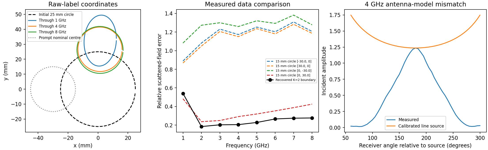
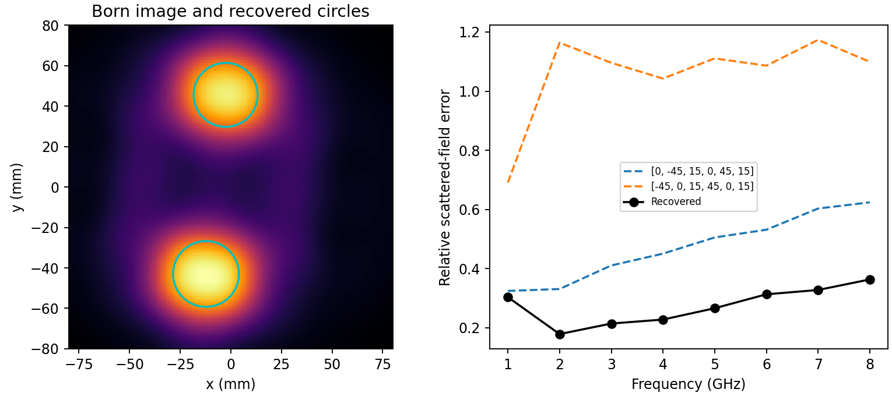

# Fresnel 2001 measured-data pilot

The single-cylinder CPU inversion ran through all eight frequencies with the
existing Kress solver and its analytic Cartesian Fourier derivatives. It recovers
a nearly circular target with radius **15.54 mm** and centroid
**(1.37, 26.20) mm** in the absolute-label coordinate frame. This is a qualified
measured-data result: source-model mismatch remains substantial, and the
prompt's nominal centre is inconsistent with this frame.



## What ran

- Input: mirrored `dielTM_dec8f.exp`, 14,112 complete records, 1–8 GHz.
- Initial boundary: 25 mm circle at the origin. Fixed relative permittivity 3.
- Cartesian Fourier modes through K=2, ten real coefficients, 64 Kress nodes.
- Cumulative equal-frequency-normalized least squares: 1, then 1–2, ... 1–8 GHz.
- A 0.1-weight second-harmonic penalty suppresses unsupported deformation;
  coefficient bounds and all optimizer termination statuses are in metrics.json.
- Source amplitude is estimated from the opposite receiver's incident field,
  independently per frequency and transmitter; geometry fitting never changes it.

| Stage through GHz | Centroid x,y (mm) | Equivalent radius (mm) | Newest-frequency relative error |
| --- | --- | --- | --- |
| 1 | 1.508, 32.438 | 13.531 | 0.423 |
| 2 | 1.359, 27.567 | 14.212 | 0.247 |
| 3 | 1.399, 27.043 | 14.380 | 0.210 |
| 4 | 1.371, 26.637 | 14.799 | 0.248 |
| 5 | 1.359, 26.424 | 14.999 | 0.251 |
| 6 | 1.358, 26.318 | 15.209 | 0.277 |
| 7 | 1.366, 26.265 | 15.321 | 0.283 |
| 8 | 1.368, 26.204 | 15.535 | 0.277 |

The final boundary gives relative errors 0.540, 0.184, 0.203, 0.205, 0.228,
0.266, 0.274 and 0.277 at 1–8 GHz. The difference between 64-node and 128-node
predictions is at most 1.2e-14: the remaining measured residual is not spatial
quadrature error at this geometry.

## Acquisition corrections and interpretation

The [2001 primary description, §§5–6](https://www.fresnel.fr/perso/belkebir/Articles/Ip01Introduction_Belkebir.pdf)
specifies 0.72 m source and 0.76 m receiver radii; columns four/five are **total**
field and the third column is physical GHz. Receiver labels identify absolute
5° positions, wrapping modulo 72. Each source sees 49 of those positions.
The importer conjugates the exp(+iωt) records once for the solver's exp(−iωt)
convention, then subtracts incident field.

The [Carpio–Pena–Rapún author text, §4.1, equation (13)](https://arxiv.org/html/2501.15327v1#S4.SS1)
provides the opposite-receiver Hankel calibration used here. It also compares
anisotropic, isotropic and plane-wave illumination models. Our implemented
formula is `strength = measured_incident / ((i/4) H0^(1)(k distance))` at the
opposite receiver. We compare measured scattered field in its original units,
so the same gain is not applied to the data a second time.

Across the full receiving aperture the incident-field relative errors are
0.92–2.41. The horn pattern therefore differs strongly from an isotropic line
source even though calibration matches the opposite receiver exactly. The
paper also discusses measured-position discrepancies for the twin-cylinder
experiment. These observations limit claims of millimetre-scale recovery.

The requested centre (−30,0) mm has nominal-circle misfit 0.89–1.31. Rotating
that nominal displacement to (0,+30) mm reduces it to 0.24–0.48. All four axis
orientations are reported, rather than silently choosing a nominal reference
that produces a favourable error. Relative to the prompt's exact coordinate
claim the recovered centre error is 40.87 mm and location IoU is zero. Relative
to an orientation-independent 30 mm displacement, its displacement magnitude
error is 3.76 mm. The recovered-centroid 15 mm-circle IoU is 0.933, a **shape-only**
diagnostic. Its 0.54 mm equivalent-radius error is conditional on fixed εr=3
and the calibrated line-source approximation, not an uncertainty interval.

The files came from a pinned public teaching mirror; byte equivalence to the
publisher originals was not verifiable because the official IOP endpoint
returned a CAPTCHA page. Full source URLs, scientific-use notice, hashes and
this limitation are preserved in [data provenance](../../data/fresnel/README.md).
The mirror's Python loader has incorrect column/frequency interpretations and
was not used.

## Validation and reproduction

`experiments/fresnel/test_fresnel2001.py`: **16 passed**. Coverage includes
shuffled original-format/headerless parsing, rejection of malformed/missing/
duplicate records, conjugation, absolute receiver wrapping, exact synthetic
complex-gain recovery, Kress against the independent cylindrical series at
1/4/8 GHz, and three analytic Cartesian columns against central differences.

```bash
OPENBLAS_NUM_THREADS=1 OMP_NUM_THREADS=1 \
  /home/drdeng/miniconda3/envs/EMNerf/bin/python -m pytest \
  experiments/fresnel/test_fresnel2001.py -q
/home/drdeng/miniconda3/envs/EMNerf/bin/python experiments/fresnel/run_fresnel2001.py
```

The stored single-target run took 86.6 seconds. `metrics.json` contains all
stages, geometry metrics, calibration diagnostics and resolution comparison;
`reconstruction.npz` contains the measured and predicted complex fields,
calibration gains and boundary trajectory. No measured field was synthesized
or altered to improve the fit.

## Two-cylinder extension

The complete `twodielTM_8f.exp` table also ran through 1→8 GHz continuation.
A normalized Born correlation image at 2/4/6 GHz provided two separated starting
centres. A full multiple-scattering Kress solve then optimized two circle centres
and radii, with εr fixed at 3. This uses known two-component circular topology;
it is not a topology-controller or unconstrained shape-recovery benchmark.

The final circles have centres **(−12.28, −43.01) mm** and
**(−2.57, 45.55) mm**, with radii **16.26 mm** and **15.81 mm**. Final relative
errors at 1–8 GHz are 0.303, 0.178, 0.214, 0.227, 0.266, 0.313, 0.328 and 0.363.
All stages converged without active parameter bounds. Doubling from 64 to 128
nodes per circle changes predicted fields by at most 1.1e-14. The observed
translation/orientation differences are consistent with the position caveat
reported for this dataset in the author text cited above; exact nominal-centre
errors should not be presented as calibrated physical accuracy.



Full metrics and the imaging indicator are in `twodiel/`. Reproduce with:

```bash
/home/drdeng/miniconda3/envs/EMNerf/bin/python experiments/fresnel/run_twodiel2001.py
```

The stored two-target CPU run took 97.9 seconds.
