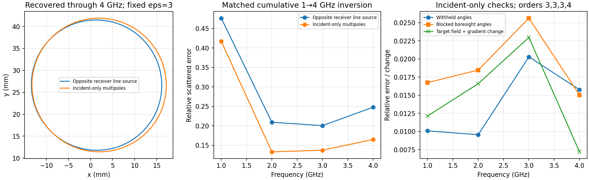

# Fresnel incident-field qualification and portable source adapter

**The measured-data source model has been qualified conditionally through
4 GHz. Physical antenna identification and the 5–8 GHz extension remain open.**
This record closes the bounded follow-up on the existing branch and preserves
components useful to the cleaned interface. The original single/twin Fresnel
results are unchanged.

## What changed

A source-centred outgoing Helmholtz expansion now supplies exact field,
gradient and Hessian values. Its coefficients and order are selected using
incident measurements and withheld receiver angles, then frozen during geometry
inversion. The [method/API note](../../../experiments/fresnel/SOURCE_MODEL.md)
contains derivations, source references, limitations and rerun commands.

The full-aperture M≤6 attempt improved angular fitting but failed continuation
checks. A local 120–240° receiver window then qualified orders 3,3,3,4 at
1,2,3,4 GHz, including blocked-angle tests and consistent transmitter/receiver
position perturbations. Both single- and twin-cylinder incident datasets were
checked. The geometry comparison below uses only the single-cylinder dataset.

| Frequency | Withheld incident error | Blocked incident error | Target field/gradient change after withholding central angles |
|---|---:|---:|---:|
| 1 GHz | 1.01% | 1.67% | 1.21% |
| 2 GHz | 0.96% | 1.85% | 1.66% |
| 3 GHz | 2.03% | 2.56% | 2.30% |
| 4 GHz | 1.58% | 1.50% | 0.72% |

The independent finite-aperture control recovered the target field and scaled
gradient within 0.14%, with and without 0.1% incident noise. Exact derivative,
Helmholtz, rotation, Fourier–Bessel circle and shape-JVP tests pass:
**23 Fresnel tests**, with 14 dependency deprecation warnings.

## Matched measured-data inversion

Both arms use the original 25 mm initial circle, K=2 Cartesian shape,
64 nodes, fixed εr=3, identical bounds/regularization, and cumulative frequencies.
All stages terminate normally with no active coefficient bounds. At the end of
1→4 GHz continuation:

| Quantity | Opposite-receiver line calibration | Qualified incident multipoles |
|---|---:|---:|
| 1 GHz scattered residual | 47.66% | 41.73% |
| 2 GHz scattered residual | 20.91% | 13.30% |
| 3 GHz scattered residual | 20.04% | 13.72% |
| 4 GHz scattered residual | 24.77% | 16.49% |
| Equivalent radius | 14.808 mm | 15.223 mm |
| Centre, raw-label coordinates | (1.371, 26.637) mm | (1.949, 26.664) mm |
| Maximum N64→N128 prediction change | 4.86×10⁻¹⁵ | 1.34×10⁻¹² |

These centres retain the earlier coordinate-frame ambiguity; the original
prompt's (−30,0) mm centre is not silently replaced. The new radius is close to
the published 15 mm value, while that location comparison still fails. These
results support a better conditional forward model, not proof of a unique
physical antenna or exact experimental geometry.

The isolated 1 GHz and 1→3 GHz comparisons are retained separately. The fourth
stage reuses the checked 1–3 GHz prefix and charges only newly executed work.
[Work accounting](work_summary.json) records 2,704 derived dense factorizations
across the latest recorded geometry comparisons and position controls. Tests
and initial linear-algebra probes are excluded from that scoped count. CPU wall
times are descriptive because other work shared the machine.

## What remains unqualified

- At 5–8 GHz, the fixed local M≤6 ceiling retains blocked-target changes of at
  least 7.7%, 10.6%, 72.6% and 43.5%; none passes the 5% continuation criterion.
- Higher source coefficients are poorly determined even when local fields are
  stable. A finite-sample nullspace witness demonstrates 10% target change
  with less than 9×10⁻¹⁰ relative change in the 49 incident samples; it uses a
  large unbounded source coefficient norm.
- Transmitter radiation and receiver directional response have not been
  separated. The point-field measurement and 2D scalar assumptions remain.
- The new RHS/JVP adapter is for a single lossless TM interface. Coupled, lossy
  and TE integration needs its own cleaned-interface qualification.

The portable deliverables are `multipole_basis`, `fit_multipoles`,
`evaluate_fit`, and the reference RHS/JVP adapter. The useful next work is an
incident-field protocol in the cleaned interface with an explicit receiving
antenna convention and justified source-aperture prior. This record does not
start another inversion campaign on the current branch.

## Evidence

- [All initial calibration orders, gates and synthetic checks](qualification.json)
- [Fixed higher-order ceiling, including failures and rank loss](higher_order_audit.json)
- [Joint source/receiver position controls, 1–3 GHz](position_pair_qualification.json)
  and [4 GHz](position_pair_4ghz.json)
- [Matched 1 GHz](inverse_1ghz.json), [1→3 GHz](inverse_3ghz.json),
  and [1→4 GHz](inverse_4ghz.json) inversions
- [Finite-sample identification counterexample](nonidentifiability_witness.json)
- [Test log](tests.log) and [current source/artifact hashes](manifest.json)

`calibration.npz` preserves complex fields for every first-study order;
`inverse_*ghz.npz` preserves compared boundaries and predicted data. The original
measurement text files supply every required input on a fresh checkout.
