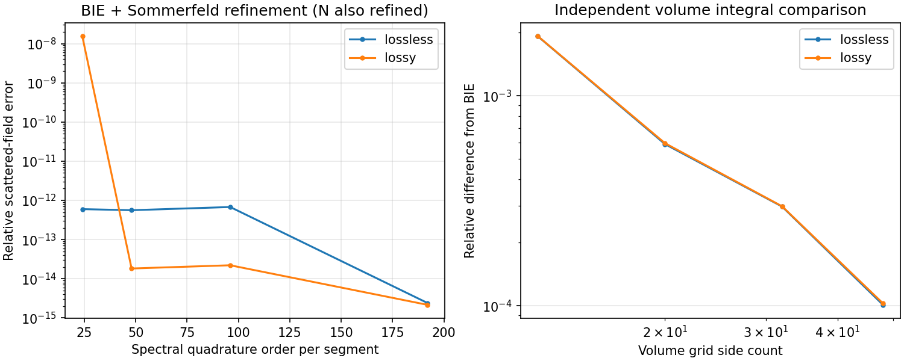

# Half-space forward qualification — October 2, 2026

The isolated **Sommerfeld + Müller/Kress** forward model is qualified for the
two buried-disk controls below. It is not a windowed Green function solver.
The [method and derivation](../../experiments/halfspace/README.md) describe the
equations, independent checks and limits.

| Control | Lossless | Passive lossy |
|---|---:|---:|
| BIE reference equation residual | 4.78e-16 | 4.47e-16 |
| Transmitted kernel vs independent adaptive integral | 7.42e-15 | 7.88e-15 |
| N64/order48 field error vs N192/order192 | 5.61e-13 | 1.82e-14 |
| Volume grid12 difference from BIE | 1.92e-3 | 1.93e-3 |
| Volume grid48 difference from BIE | 1.01e-4 | 1.03e-4 |

The no-object plane-wave Fresnel flux defect is 4.44e-16 over incidence angles
0–80 degrees. Spectral cutoffs 150,200,300 and 400 m^-1 agree with 600 m^-1 to
about 2e-14 or better for this geometry. Near roundoff, successive errors are
not monotone; the useful independent accuracy check is the separately
converging volume formulation. Its four grid sizes retain 132,344,856 and1884
unknowns and approach the BIE monotonically in both cases.

The historical layered volume-screen kernel differed from adaptive integration
by 3.93e-7 for the lossless control, while the new mapping resolves both branch
points to 7.42e-15. Its lossy case was already accurate. Historical code is
unchanged.

Artifacts: [qualification.json](qualification.json),
[manifest.json](manifest.json), and complex data in `lossless_data.npz` and
`lossy_data.npz`. Each case uses eight boundary factorizations and four volume
factorizations, each with two right-hand sides; counts and elapsed times are
saved per row. The adaptive-integral kernel checks require no BIE solves.
No inverse or production-default change is made.
