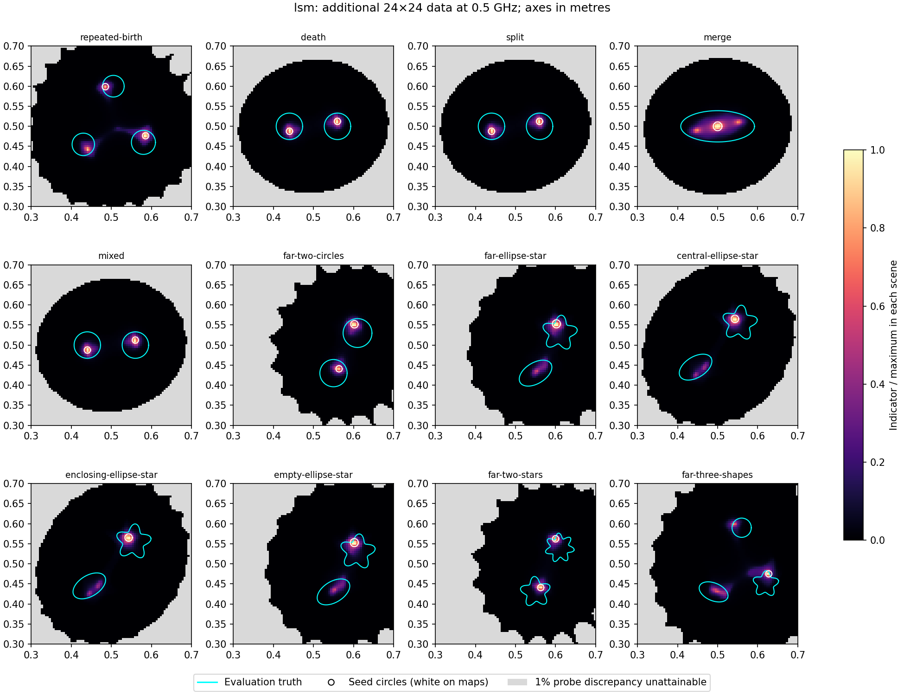
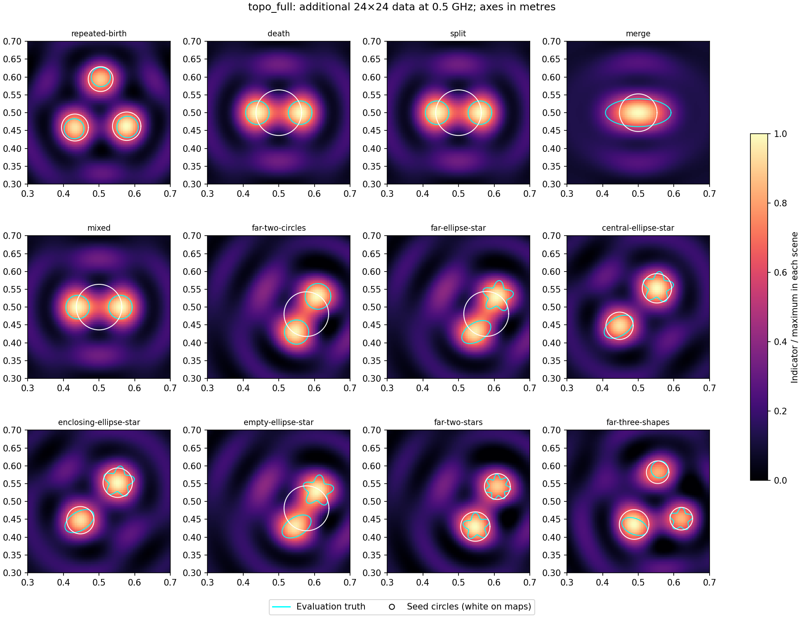

# Full-matrix LSM and topological initializers

This follow-up completes an eligible LSM input contract for all twelve frozen scenes. It adds 552 complex 0.5 GHz observations per scene on the original 24 transmitters and 24 receivers. These off-diagonal measurements are explicitly synthesized and qualified, never inferred from the original paired values. Both LSM and TD initializers receive these same additional samples; controller fitting still uses only the original 24 pairs. The original 1.5/2.5 GHz holdouts and geometry remain evaluation-only.

All twelve full matrices agree at 256/512 nodes within 2.46e-15 relative error. Their diagonals agree with the archived paired observations within 2.98e-15. The source-generation cost is 24 factorizations and 48 primal/reciprocal RHS batches.

## Initial images

Both initializers identify the target component count in 6/12 scenes with the fixed 60% threshold. For comparison, paired-data TD identified 10/12; more measurements do not guarantee that this particular threshold heuristic improves. LSM discrepancy sensitivity at 0.5%, 1%, 2% is retained per scene; geometry did not select these settings.





## Matched controller comparison

All 24 additional controller jobs have returned or reached the declared cap.

All use existing policy H, the original ten-cycle numerical budgets, and 600 seconds per job. There is no additional aggregate queue timeout. The original-start arm is reused from the earlier identical-data/configuration run, where 5/12 passed and one job timed out; it consumes no additional observations. This compares starting geometries under paired fitting, not a full-matrix inverse.

| Start | Passes /12 | Completed jobs /12 |
|---|---:|---:|
| Original frozen start (prior run) |5|11|
| lsm, extra initialization data | 5 | 12 |
| topo_full, extra initialization data | 5 | 12 |

All failures, checkpoints and separate inversion/audit work counters are in [controller_summary.json](controller_summary.json). Timeout work remains a lower bound. Shared CPU load prevents a controlled wall-time speed claim.

## Numerical qualification and derivation

For source-by-receiver data Y and common physical source strength a, the discretized near-field operator is `N = Y.T / a * (2πR / 24)`. Probe columns are `G_k(receiver,z)`. We use SVD/Tikhonov regularization and choose its parameter for a 1% probe residual. [Garnier, Haddar and Montanelli, §2 and §5](https://arxiv.org/html/2210.15560v2) describe this active near-field construction alongside their random-source extension. Their sound-soft theory is not asserted as a dielectric recovery guarantee here.

The numerical SVD drops singular values below 1e-12σ₁, well above the measured matrix refinement error. Writing `N=UΣV*`, source coordinates in the retained V basis preserve their norm; the reused discrepancy solver therefore acts on the rectangular `U_rΣ_r`. It explicitly includes the unresolved receiver-space residual. Unattainable probes are masked, not converted into bright objects. Resolved ranks are 17–21. Coarse/fine LSM images differ by at most 6.07e-12 on their common eligible probes, with zero eligibility-mask changes.

The empty-domain TD is derived from the small-disk response `δY_sr/δarea = (ki²−ke²) a G(source_s,z)G(receiver_r,z)`, contracted with the normalized negative measured residual. A focused test compares the full-matrix contraction with the existing paired implementation expanded to every source/receiver combination. [Carpio, Pena and Rapún](https://arxiv.org/html/2501.15327v1) provide the dielectric topological-sensitivity setting.

Earlier diagnostics remain in sibling directories. The first used slightly different rounded vacuum constants and differed from archived pairs by about 5e-10. The next used exactly matching constants but retained unresolved singular directions. This final version uses the exact constants and an explicit numerical SVD floor; the image eligibility now agrees under refinement.

## Reproduce

The main benchmark now accepts `--init {current,topo,lsm}` and `--initializer-data`. Without a full-matrix input, `--init lsm` rejects before creating an output bundle. `--init topo` alone uses the original paired data; adding the matrix directory uses the full-data TD. Prepared initial states, raw matrix hashes, physical constants and initializers are stored in each bundle.

```bash
export OPENBLAS_NUM_THREADS=1 OMP_NUM_THREADS=1 MKL_NUM_THREADS=1 PYTHONPATH=solvers:.
PY=/home/drdeng/miniconda3/envs/EMNerf/bin/python
$PY -m experiments.initialization_followup.run --output NEW_DATA
$PY run_topology_scene_benchmark.py --output NEW_DATA/lsm --reference-data results/validation/topology/TOP-006-20260911-scenes-v1 --arms H --init lsm --initializer-data NEW_DATA --prepare-only
$PY run_topology_scene_benchmark.py --output NEW_DATA/topo_full --reference-data results/validation/topology/TOP-006-20260911-scenes-v1 --arms H --init topo --initializer-data NEW_DATA --prepare-only
$PY -m experiments.initialization_followup.campaign --output NEW_DATA --workers 4
$PY -m experiments.initialization_followup.report NEW_DATA
$PY -m pytest -q experiments/initialization_followup/test_full_matrix.py pytest/sdf_inverse/test_topology_scene_benchmark.py
```
