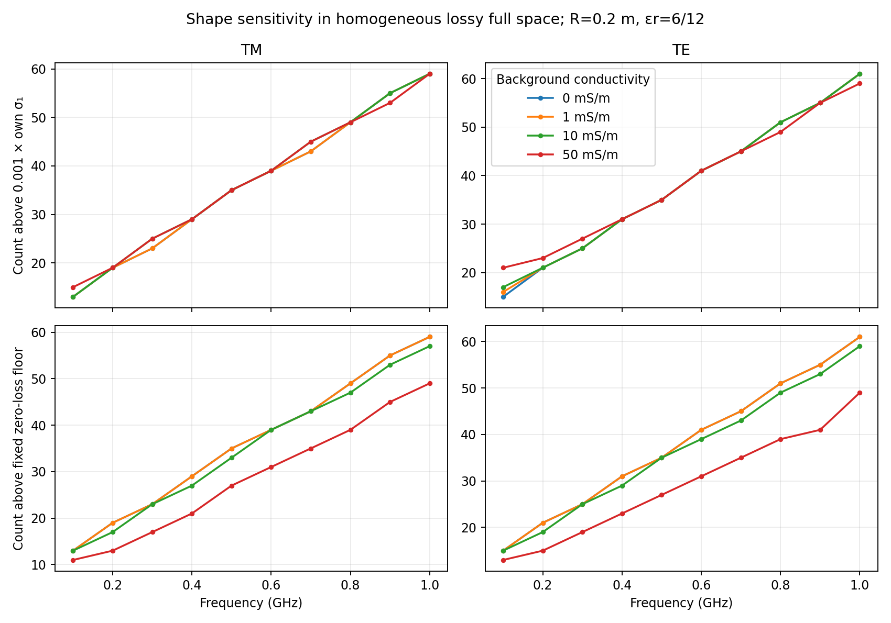

# TE transmission and passive-loss atlas

Computed on CPU on 2026-10-02. The opt-in implementation is
[`polarization.py`](../../solvers/gpr_bem_kress/polarization.py), with the
full conventions and shape-jump derivation in
[`te_shape_derivative.md`](../../docs/reference/te_shape_derivative.md).

## Forward and derivative validation

The independent circle series uses separation of variables. Five line sources
are at radius `3R`, and 32 receivers at `4R`. The TE target has
`epsilon_i/epsilon_o=4`; `kR` below means the exterior wavenumber times radius.
Relative L2 errors in the scattered field are:

| Nodes | kR=1 | kR=5 | kR=15 |
|---:|---:|---:|---:|
| 64 | 1.14e-15 | 4.32e-15 | 6.89e-2 |
| 96 | 1.26e-15 | 6.15e-15 | 7.18e-5 |
| 128 | 1.27e-15 | 4.96e-15 | 1.36e-14 |
| 192 | 1.27e-15 | 3.02e-15 | 1.42e-14 |
| 256 | 1.06e-15 | 2.81e-15 | 5.12e-14 |

The high-frequency failure at 64 nodes is retained as an underresolution
check. Twenty random harmonic directions, ten on each of a circle and ellipse,
validate the TE derivative as a second solve with the primal matrix. The worst
centered FD discrepancy is **1.71e-7** at step `5e-5`, using harmonics 0–8.
Three step sizes are saved for each direction. This is a continuum shape
derivative, rather than an exact derivative of every finite discretization.

Twenty-four passive-loss cases cover TM and TE, 0.1/0.5/1 GHz, exterior
`epsilon_r=6`, exterior conductivity 0/1/10/50 mS/m, and an interior with
`epsilon_r=12`, conductivity 5 mS/m. The maximum circle-series discrepancy is
**2.65e-14**; the maximum shape-derivative FD discrepancy is **3.46e-9**.
See [`validation.json`](validation.json) for every measured row, including
max-error/max-reference and linear residuals for the lossless TE convergence.

Seven new regression tests pass. They include passive Hankel attenuation,
zero-contrast scattering, the three requested TE `kR` values, lossy TM/TE,
and ten random ellipse directions.

## Lossy shape sensitivity



The 80 configurations use a circle of radius **0.2 m**, a background with
`epsilon_r=6`, a **lossless** target with `epsilon_r=12`, ten frequencies
from 100 MHz to 1 GHz, and background conductivities 0/1/10/50 mS/m.
There are 16 line sources at radius 0.6 m and 48 receivers at radius 0.8 m.
These are explicit full-aperture experiment settings. The Jacobian has 81
real normal-shape coefficients: the constant plus sine/cosine harmonics
1–40, normalized to unit RMS in the periodic angle. Coefficients have units
of metres. Real and imaginary data are stacked for the real-parameter SVD.

Two thresholds are recorded. The relative threshold is `0.001 sigma_1` of
each individual spectrum. The fixed threshold is `0.001 sigma_1` of the
zero-conductivity spectrum at the same frequency and polarization. The latter
holds an absolute data-error scale fixed as attenuation changes.

| At 1 GHz | Background conductivity | Relative count | Fixed-floor count | Largest singular value |
|---|---:|---:|---:|---:|
| TM | 0 mS/m | 59 | 59 | 28.20 |
| TM | 1 mS/m | 59 | 59 | 25.46 |
| TM | 10 mS/m | 59 | 57 | 10.60 |
| TM | 50 mS/m | 59 | 49 | 0.3525 |
| TE | 0 mS/m | 61 | 61 | 24.42 |
| TE | 1 mS/m | 61 | 61 | 22.28 |
| TE | 10 mS/m | 61 | 59 | 9.831 |
| TE | 50 mS/m | 59 | 49 | 0.3177 |

For this acquisition, loss removes modes above a fixed absolute error floor.
Renormalizing every spectrum largely hides that effect and can increase the
relative count at low frequencies. Therefore the data do **not** support a
universal statement that conductivity always decreases the normalized stable
region. The columns count singular directions, not the maximum harmonic
index; each nonzero harmonic has two real coefficients.

The 192-to-256-node comparison at 1 GHz for both polarizations and both
conductivity endpoints changes the full singular spectra by at most
`8.80e-15` relative L2, with identical relative counts. Those four checks are
in [`atlas_resolution.json`](atlas_resolution.json). They validate numerical
resolution at the largest tested frequency, not arbitrary geometries.

[`lossy_atlas.json`](lossy_atlas.json) records acquisition, thresholds, 80
summary rows and the 21.3-second CPU run time. [`lossy_atlas.npz`](lossy_atlas.npz)
contains the singular spectra, right singular vectors, and normal basis;
rows use the same ordering as the JSON. This is homogeneous lossy full space,
with no air–soil interface. The material choices and error floor are declared
experiment parameters, not measured soil or instrumentation properties.

## Reproduce and reuse

```sh
export OPENBLAS_NUM_THREADS=1 OMP_NUM_THREADS=1
/home/drdeng/miniconda3/envs/EMNerf/bin/python experiments/polarization/run_validation.py
/home/drdeng/miniconda3/envs/EMNerf/bin/python experiments/polarization/run_lossy_atlas.py
/home/drdeng/miniconda3/envs/EMNerf/bin/python -m pytest -q pytest/gpr_bem_kress/test_polarization.py
```

The atlas accepts `--nodes`, `--max-harmonic`, and `--output`; a run with
`--nodes 256 --output /tmp/lossy-atlas-256` independently reproduces the
higher-resolution spectra used for comparison.

For a TE atlas row, call `solve_polarized_transmission(...,
normal_ratio=epsilon_i/epsilon_o)` and then
`polarized_shape_derivative(base, normal_harmonics)`. For TM use
`normal_ratio=1`. The derivative has shape `(direction, source, receiver)`
and reuses the primal LU. Use `passive_permittivity` and `passive_wavenumber`
for conductivity: **positive** imaginary permittivity is required by this
repository's `exp(-i omega t)` and outgoing `H1` convention.
