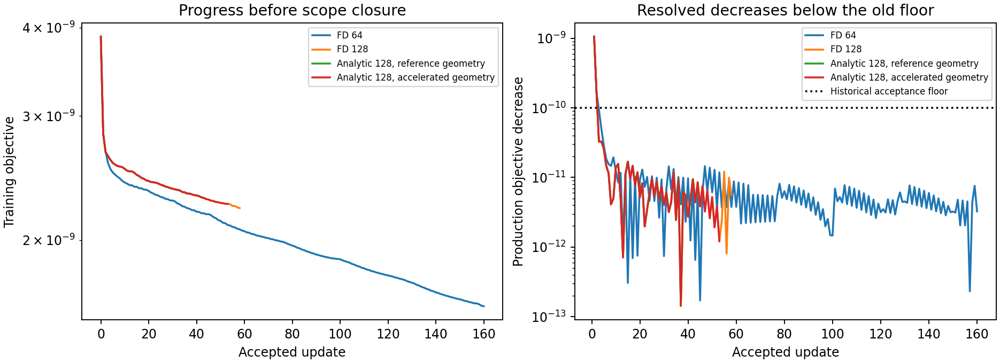

# TOP-010 stopping-floor continuation — closed on scope change

This experiment tests the archived TOP-010 extrapolation that removing stopping
rules would not recover the geometry. The old 1.7× loss reduction did not establish
that conclusion. Historical artifacts and production optimizer defaults are
preserved.

**Status: partial scientific answer; experiment closed at the user's request.**
The user asked to close the outdated-branch plan and retain what transfers to the
cleaned interface. All workers are stopped. None reached a measured stationary
point or numerical floor. The final analytic trajectory was still descending;
its last measured gradient infinity norm was `5.47e-4`. Closing this experiment
does not establish that further continuation fails.

## What was measured

The longest FD control accepted **161 updates**, reducing its 64-node training
objective from `3.86126e-9` to `1.60401e-9` (**2.407×**). Of those updates, 159
had gains below the old `1e-10` acceptance floor; the smallest accepted gain was
`1.71e-13`, agreed between production and refined evaluations under the stated
gate. This is sustained progress, not just the three plain restarts in TOP-010.

All training decisions were frozen before scoring truth and holdouts:

| Saved endpoint | Updates | Training relative error at 256 nodes | Boundary error | IoU | 1.5 / 2.5 GHz held-out relative error |
|---|---:|---:|---:|---:|---:|
| Original TOP-009 state | 0 | 8.816e-5 | 11.849 mm | .70880 | .5790 / 1.4154 |
| FD 64-node control | 161 | 5.625e-5 | 11.548 mm | .73858 | .4561 / 1.2934 |
| FD 128-node control | 58 | 6.663e-5 | 11.818 mm | .72692 | .5119 / 1.3656 |
| Analytic 128, reference geometry | 43 | 6.775e-5 | 11.887 mm | .72056 | .5265 / 1.3842 |
| Analytic 128, accelerated geometry | 54 | 6.705e-5 | 11.839 mm | .72542 | .5162 / 1.3708 |

These are unequal-length prefixes, not a ranking of optimizer quality. The
geometry and held-out gates still fail. The modest improvement in the longest
control further undermines the archived extrapolation that the small initial
loss reduction proved that removing stopping floors could not recover shape.
**Eventual recovery remains untested.** See [machine-readable summary](summary.json)
and the per-arm `postfit_scores.json` files.



## Transfer to the cleaned interface

1. **Keep stop reasons separate.** A loss-change/acceptance floor is not
   stationarity, and a scope closure is not a numerical failure. Record gradient,
   accepted gain, resolution discrepancy, and why execution stopped.
2. **Choose numerical checks from the actual residual scale.** Initially,
   64→128 nodes changed the normalized residual by `2.53e-6`, while 128→256
   changed it by `7.92e-10` and 256→512 by `3.25e-15`. A single absolute objective
   threshold conceals this distinction. The error identities below transfer;
   this experiment's heuristic constants are not proposed as production policy.
3. **Qualify an existing fast derivative before spending repeated FD solves.**
   At the common start, the existing analytic Jacobian differed from
   `h=6.25e-6` FD by `3.22e-7` relatively (worst column `3.21e-6`), and the first
   actual bounded LM proposal differed by `1.53e-5`. Both passed the same
   two-resolution acceptance test. Its error bound divided by the weakest
   singular value was .097: this is not an assurance of identical weak directions
   at vanishing damping. No new endpoint qualification was attempted after the
   scope change.
4. **Reuse exact geometry acceleration.** The existing certified validation and
   spatial intersection pruning preserved the Jacobian, first proposal, and
   stencil decisions bitwise, shortening the qualification probe from 5.58 s to
   .957 s. All 43 overlapping analytic updates retained bitwise-identical
   parameters and losses. Over the same prefix, FD versus analytic parameters
   differed by at most `2.22e-8 m`; relative objective differences stayed below
   `5.86e-5`. This is reusable implementation evidence, not a recommendation to
   revive the archived reconstruction plan.

No production optimizer or cleaned-interface policy was changed here.

## Protocol

- Start with the exact serialized TOP-009 K=9 endpoint, not a new initialization.
- Fit only the archived 24 paired complex observations at 0.5 GHz. The fitting
  function receives no scene, truth geometry, or held-out data.
- The FD controls use the existing `run_multiradial_fd_inverse` under
  `inverse_runtime('reference')`, explicitly selecting its feasible central
  finite-difference Jacobian. The separately labeled analytic controls use the
  same optimizer with its existing reciprocal derivative path. Keep its
  historical parameter trust bounds, 8 mm radius floor, gauge retraction, and
  geometry checks at both production and refined resolutions.
- Disable loss-change stopping and set objective, gradient, and relative-step
  targets to zero. These settings make no claim that zero can be reached.
- Expand the existing search to 12 damping trials and 14 backtracks, so the old
  short search is not mistaken for evidence of a numerical limit.
- Check every proposed decrease at twice the production node count. Accept only
  if both decreases exceed `5*abs(gain_low-gain_high) + 64*eps*max(norm(r),eps)`.
  This replaces the historical absolute `1e-10` acceptance floor with a measured
  resolution check and floating arithmetic allowance. The factor 5 is an
  explicitly conservative heuristic; it is not a rigorous discretization bound.
- Every accepted state and gradient is saved. A 50-iteration chunk automatically
  carries the accepted state and damping into the next chunk; it is not a stopping
  condition. The existing optimizer re-applies its gauge at each restart.
- The planned numerical-endpoint protocol was three FD scales and three node
  counts, with refinement if needed. No numerical endpoint was reached before
  scope closure; initial audits and analytic qualifications were completed.
- Compute truth geometry and 1.5/2.5 GHz held-out errors only in the separate
  `--score` entry point, after fitting decisions are frozen.

## Numerical rationale

For the normalized real residual vector, `L = ||r||²/2`. A residual perturbation
`e` changes the loss by `rᵀe + ||e||²/2`, bounded in magnitude by
`||r|| ||e|| + ||e||²/2`. The audits report this bound using measured differences
between node counts. It is an empirical error estimate, since agreement at two
resolutions alone is not a proof of exactness.

At fixed residual, replacing `J` by `J + E` changes the gradient by `Eᵀr`, whose
norm is bounded by `||E||₂ ||r||₂`. The audits report this bound and actual gradient
changes between FD scales. Centered FD has quadratic truncation error for a
smooth retraction; division by a smaller step also amplifies forward arithmetic
error. FD-scale comparison is therefore necessary before claiming stationarity.

These tests address the local optimizer and its discretized objective. A failure
to find another resolved local decrease would not prove that every possible
initialization or optimizer fails, or that a single-frequency inverse problem
has a unique shape.

## Artifacts and validation

`final.json` and `stage_0/closure.json` in each arm preserve the newest accepted
checkpoint and an explicit scope/control-prefix status. Older `terminal.json`
files are chunk records with `maximum_iterations`, not final convergence
certificates. A few final gradients were interrupted after acceptance; their
records state the last measured gradient iteration instead of inventing one.

The recorded fit work totals **at least 20,564 forward/analytic-base frequency
solves**. Detailed ledgers separately retain initial audits, qualifications,
kernel calibration, and post-fit scoring. SIGINT interrupted the early runner
versions outside a final ledger callback, so each arm explicitly bounds up to
430 additional unreported frequency solves; this is a conservative control
overhead bound, not an exact total. Raw logs and all attempts are preserved.

Focused validation: **8 tests passed** (`test_continuation.py` plus the existing
atlas tests). The acceptance tests exercise resolvable sub-floor gains,
resolution disagreement, floating-scale gains, and training-only data slicing.

## Reproduction of the archived experiment

These commands document the experiment. The user has closed the plan; no worker
or automatic restart remains active.

```sh
OPENBLAS_NUM_THREADS=1 OMP_NUM_THREADS=1 MKL_NUM_THREADS=1 \
  /home/drdeng/miniconda3/envs/EMNerf/bin/python \
  experiments/stopping_floor/continue_top010.py
```

The exact arguments for the other arms are in their `stage_0_manifest.json`.
`qualify_analytic.py` reproduces the common-state derivative/proposal comparison;
`summarize.py` redraws the figure and summary from already frozen artifacts without
fitting. The final scoring entry point is `continue_top010.py --score --output ...`.

Each `stage_*_manifest.json` records the exact input and numerical source hashes.
`stage_*/trajectory.jsonl` contains accepted states, work counts, gradients, and
damping; `acceptance.jsonl` records every supplemental acceptance check.
`closure.json` records why these prefixes were stopped.
