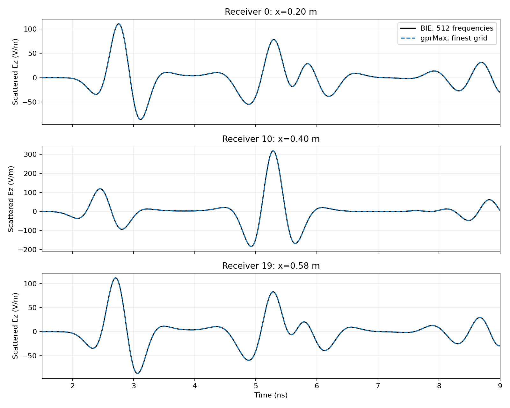
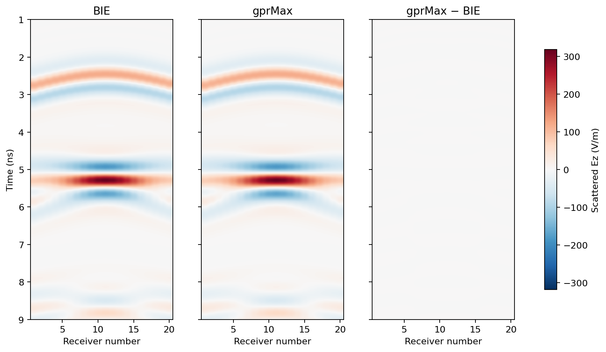

# Time-domain BIE versus gprMax, 20 receivers

Computed on CPU, 2026-10-02. A 512-frequency Kress response reproduces the
independent gprMax transient with **0.506% scattered-field relative L2 error**
at 1 mm spacing. The minimum zero-lag normalized correlation among all 20
receivers is **0.9999785**. No amplitude, phase, or time shift was fitted.





## Model and convergence

The 2-D TMz scene has free space outside a lossless `epsilon_r=4` cylinder,
radius 0.1 m, centered at `(0.4,0.4)` m. One z-directed electric current
source is at `(0.4,0.7)` m. Twenty receivers lie at y=0.64 m and
x=0.20, 0.22, ..., 0.58 m. The current is a 1 A, 1 GHz Ricker pulse.

The gprMax domain is `0.8 m × 0.8 m × one cell`, with zero PML cells on
the z faces. Physical PML thickness is 48 mm at every transverse face.
Background and target runs share the source, acquisition, grid and 12 ns
window. Their subtraction defines the scattered waveform.

| FDTD spacing | Scattered relative L2 | Background relative L2 | Worst zero-lag correlation | Maximum absolute peak-time error | Median peak-time error |
|---:|---:|---:|---:|---:|---:|
| 4 mm | 7.547% | 0.1487% | 0.9962202 | 15.59 ps | 10.40 ps |
| 2 mm | 1.528% | 0.04656% | 0.9998490 | 5.20 ps | 0 ps |
| 1 mm | 0.5062% | 0.03037% | 0.9999785 | 5.20 ps | 0 ps |

Metrics use absolute fields with both arms restricted to 0–3 GHz after the
same temporal observation window: unity through 10 ns, then a fixed cosine
taper to zero at the end of the 12 ns record. L2 is over
all recorded times and receivers; per-receiver results, including peak
amplitude ratios and best-lag correlations, are in [`metrics.json`](metrics.json).
The largest discrepancy is consistent with FDTD geometry/discretization
error: the circle is represented on a Cartesian grid, while the BIE circle
is exact. The table demonstrates convergence without assigning it a
particular asymptotic order. The source normalization is also checked by the
background trace. The original background-only check decreases by approximately
four on each grid halving, reaching 9.10e-5 relative error; the shared-window
comparison above also depends on finite-band processing order and is not a
pure measure of FDTD discretization error.

Review found that the first comparison cut the FDTD coda off at 12 ns before
filtering, whereas the BIE coda continued. That unmatched window produced
an artificial endpoint discrepancy: 68.8% of its finest-grid error energy
lay after 11 ns. Its original 0.9351% result is retained in
[`metrics_unmatched_window_initial.json`](metrics_unmatched_window_initial.json).
The qualified comparison applies the same temporal window to both arms.
Only stored responses were reprocessed; the FDTD and BIE physical solves
were unchanged.

The BIE's native spectrum stops at 3 GHz before temporal windowing, while
the raw FDTD record includes its native higher frequencies. Both windowed
signals subsequently receive the same 3 GHz filter. Thus omitted Ricker
spectral tails and window/filter ordering remain a finite-band qualification;
the result does not isolate a pure FDTD continuum error.

The synthesized time grid is 5.198 ps. Thus zero reported peak-time error
means the maxima fall in the same sample; it does not establish sub-picosecond
agreement. Peak time means the maximum absolute scattered amplitude, which
can be a later internal response rather than the first arrival.

The BIE uses 128 boundary nodes and 512 frequencies including 0 and 3 GHz.
At DC the radiating source multiplier vanishes, so the zero-frequency field
is set to zero and no singular zero-wavenumber Helmholtz solve is attempted.
Five frequencies, spanning 5.87 MHz to 3 GHz, agree with an independent
separable circle series to at most `3.10e-14` relative L2. The synthesis
uses a 170.33 ns Fourier period, much longer than the 12 ns comparison window.
The test is of this finite band and time window, not an assertion of exact
unlimited-bandwidth transients or a layered-ground model.

## Source normalization and Fourier sign

The calculations use the installed **gprMax 3.1.7**, commit
`d81791a6d26efd34622d2b2d3c8a1142114b8135`, from `/home/drdeng/gprMax`.
The source and timing were checked against that checkout rather than inferred
from a different version's documentation.

In its [Hertzian-dipole source update](https://github.com/gprMax/gprMax/blob/d81791a6d26efd34622d2b2d3c8a1142114b8135/gprMax/sources.py),
the current-density multiplier is `dl/(dx dy dz)` and the z-polarized
dipole length is `dl=dz`. The one-cell extrusion therefore represents
`J_z=I(t) delta(x-x_s) delta(y-y_s)` in 2-D. The
[Ricker implementation](https://github.com/gprMax/gprMax/blob/d81791a6d26efd34622d2b2d3c8a1142114b8135/gprMax/waveforms.py)
uses

\[
 I(t)=[1-2\pi^2 f_0^2(t-t_0)^2]
       e^{-\pi^2 f_0^2(t-t_0)^2},\quad t_0=\sqrt2/f_0.
\]

The source's exact single-precision samples are saved with each FDTD result.
This version evaluates current at `n dt` and applies it in the update from
`E_n` to `E_(n+1)`, while output fields are stored before that update. The
effective current sample times are therefore `(n+1/2)dt`. The DFT uses those
times directly; this is a source-discretization fact, not an optimized lag.

For the repository's `exp(-i omega t)` convention, Maxwell's equations give

\[
 (\Delta+k^2)E_z=-i\omega\mu_0 J_z,
 \qquad (\Delta+k^2)G_k=-\delta.
\]

Therefore the BIE's unit-Green-function response must be multiplied by
`i omega mu0 I_plus(omega)`, with
`I_plus=integral I(t) exp(+i omega t) dt`. The same strength multiplies the
analytic background Green function. Both background and scattered fields
are predicted in V/m. We do not use background-ratio calibration: its error
is reported as an independent check.

NumPy's inverse real FFT expects the opposite Fourier convention. The code
uses `irfft(conj(F_plus))/dt_output`, with zero padding above 3 GHz, including
the physical inverse-transform scale. Two regression tests independently
check a known delayed Gaussian's sign/scale and the analytic Ricker spectrum
with the half-step source timing.

## Artifacts and reproduction

- [`run_fdtd.py`](../../experiments/time_domain/run_fdtd.py) creates the
  isolated FDTD runs and records source samples and traces. The existing
  `solvers/gprmax_ref/cache/` entries and gprMax installation are untouched.
- [`compare_bie.py`](../../experiments/time_domain/compare_bie.py) assembles
  the 512-frequency BIE response, synthesizes traces, and writes the metrics
  and figures.
- `inputs/` preserves all six `.in` files; `dx*_{background,target}.log`
  records each FDTD run. `fdtd_dx*mm.npz` retains background, total,
  scattered and source-current time series; adjacent JSON gives provenance.
- [`bie_frequency_response.npz`](bie_frequency_response.npz) holds complex
  unit-source spectra. [`trace_comparison.npz`](trace_comparison.npz) holds
  the band-limited predictions and measurements at each grid spacing.

```sh
OPENBLAS_NUM_THREADS=1 OMP_NUM_THREADS=2 \
  /home/drdeng/miniconda3/envs/gprMax/bin/python experiments/time_domain/run_fdtd.py
OPENBLAS_NUM_THREADS=1 OMP_NUM_THREADS=1 \
  /home/drdeng/miniconda3/envs/EMNerf/bin/python experiments/time_domain/compare_bie.py
OPENBLAS_NUM_THREADS=1 \
  /home/drdeng/miniconda3/envs/EMNerf/bin/python -m pytest -q pytest/gprmax_ref/test_time_domain_synthesis.py
```

The six FDTD runs together took about 43.4 s with two CPU threads; the BIE
frequency sweep took 39.9 s with one BLAS thread. These are measured costs
for different numerical workloads, not an equal-accuracy speedup claim.
Existing FDTD output is reused only when its input-file hashes, time window,
gprMax version/revision and relevant physics-source hashes match. The hashes
were added in a documented post-run provenance audit of the existing records.
Use a new `--output` directory for another run configuration. To reprocess
stored BIE spectra without repeating the frequency sweep, add
`--reuse-bie-response` to `compare_bie.py`; its recorded discretization,
physical constants, acquisition and frequency grid must match.
