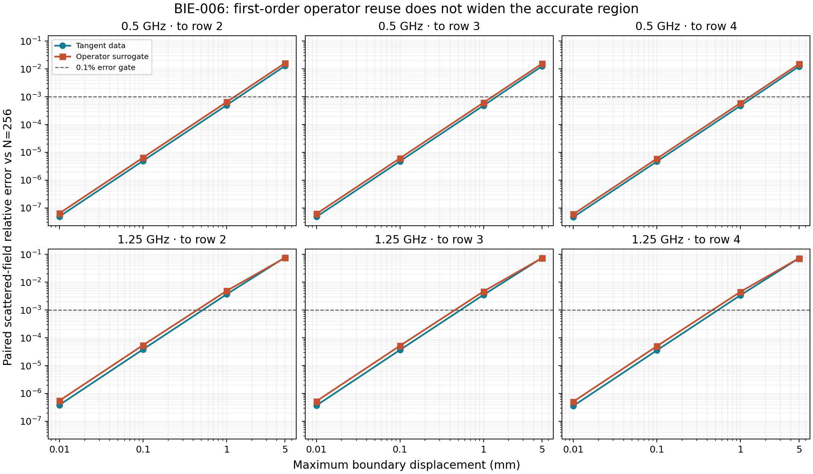
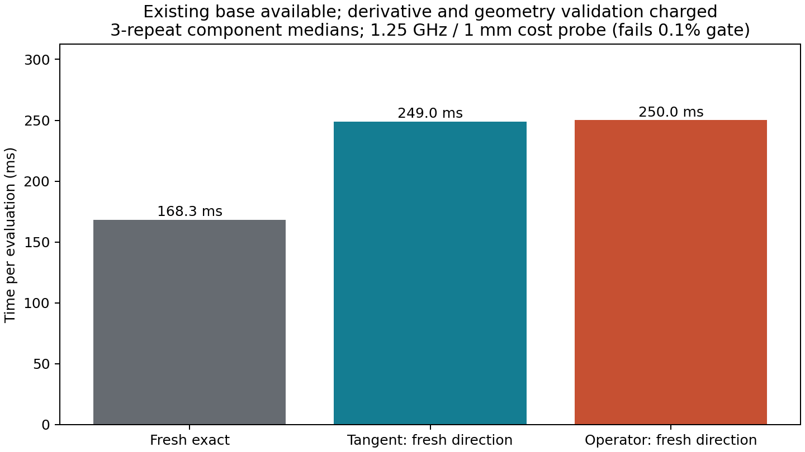

# BIE-006 — local operator reuse

**Decision: STOP_FIRST_ORDER_OPERATOR_REUSE.**

The first-order operator surrogate does not extend the useful accuracy region on this saved noncircular base.
It is less accurate than tangent data in 22/24 rows. Its two small improvements occur at 5 mm and both fail the primary 0.1% gate.

## Main measurements

| Frequency | Tangent maximum passing displacement | Operator maximum passing displacement |
|---|---:|---:|
| 0.5 GHz, all three directions | 1 mm | 1 mm |
| 1.25 GHz, all three directions | 0.1 mm | 0.1 mm |

These are sampled contiguous ranges at relative error <=1e-3; no interpolation or certification.
All 24 predictions are resolution-qualified. Worst N=128/256 discrepancy: **4.512e-14**; analytic tangent discrepancy **3.216e-14**.
Error slopes over the two smallest steps are 1.9951–2.0003, consistent with quadratic error in both models.
The surrogate solve residual stays below 1.357e-15, while its residual against the actual new system reaches 4.456e-02. Solving the approximate system accurately does not remove model error.

## Cost

Three sequential single-thread repeats with no detected sibling numerical workers. Fresh E median: **168.3 ms**. Analytic directional assembly alone: **130.2 ms**, including primal kernel recomputation.

| Existing base available | Tangent T | Operator O |
|---|---:|---:|
| Fresh direction, all setup charged | 249.0 ms | 250.0 ms |
| Ratio to fresh E | 1.480x | 1.486x |
| Cached direction online, geometry included | 118.2 ms | 119.8 ms |
| Online algebra only, geometry excluded | 0.012 ms | 1.880 ms |
| Audit-free break-even, base available | 3 predictions | 3 predictions |
| Break-even, one exact validation per four predictions | 17 | 21 |

Fresh-direction totals and amortization scenarios sum the medians of their measured components. The one-in-four break-even column uses average audit cost E/4; exact integer audit-block counts are also in `cost_scenarios.csv`.

The fixed timing point is at 1.25 GHz / 1 mm and fails the primary accuracy gate. These are cost measurements, not a matched-accuracy speedup claim. Geometry validation dominates cached online cost; each O prediction still factors a new matrix.

On the actually qualified prefixes (2 or 3 evaluations), the best O speedup over E after setup and one exact validation is **0.772x** (below 1 means slower). Full cold setup and all exact/refined audit costs are retained in `ray_costs.csv`.

## Scope and decision

The original saved displacements are 19.99–25.01 mm. None of the 6 later same-cycle saved states lies within the tested 5 mm region. The four-point rays are synthetic local scalings of real update directions; there is no demonstrated real reuse sequence long enough to amortize setup.
The three chronological directions are correlated; `summary.json` records their pairwise direction cosines. One base at two frequencies is a bounded negative result, not rejection of every possible operator surrogate.
**Stop this first-order reuse implementation.** No accuracy-range benefit or setup-inclusive saving beyond tangent data warrants controller integration. No higher-order model, preconditioner, inverse run or shared solver change was made.

## Validation and provenance

- Work: 60 exact assemblies, 15 analytic assemblies with the same number of primal recomputations, 87 LU factorizations, 102 batched solves, 27 updated O solves.
- Execution: 20.469 seconds; peak RSS 0.161 GiB. No failed physical operations.
- Four algebra/geometry tests passed before execution. Public production parity, all refinement gates, 48 saved prediction replays, budget recount and 27 source/input hashes pass.
- `frozen_plan.md` owns the executed contract; `inputs.json` fixes geometry/acquisition. `measured_sources/` retains exact measured code. `manifest.json`, `work_ledger.jsonl`, `predictions.npz` and JSON/CSV tables preserve raw evidence.
- Reporting is independently rerunnable: `PYTHONPATH=solvers:. python -m experiments.bie006_operator_reuse.summarize <bundle>`. No physical solve is performed by reporting.
