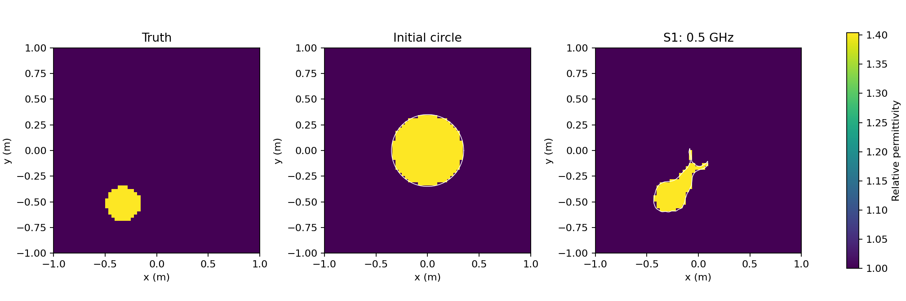

# GGB-002 — Case 8 with four frequencies

Approved synthetic extension of the original pixel target. Material is known. Start: centred radius-0.35 m circle. No localization or restart.

| Arm | Frequencies GHz | Fit s | SSIM | RRMSE | Contrast SNR dB | Joint discrepancy met | Field gates passed |
|---|---|---:|---:|---:|---:|---|---|
| S1 | 0.5 | 293.770 | 0.92027 | 0.05588 | -0.18 | False | True |

## Endpoint residuals

| Arm | Frequency GHz | Relative residual | Noise target | Field refinement error | Used in fit |
|---|---:|---:|---:|---:|---|
| S1 | 0.4 | 67.181% | 5.498% | 6.8e-06 | False |
| S1 | 0.5 | 67.609% | 5.498% | 8.01e-06 | True |
| S1 | 0.75 | 71.120% | 5.499% | 1.09e-05 | False |
| S1 | 1 | 71.282% | 5.492% | 1.4e-05 | False |
| S1 | 1.25 | 72.350% | 5.490% | 1.71e-05 | False |

## Optimizer evidence

- S1: 113 accepted steps; 906 proposals; refusals {'self_intersection': 787, 'irregular_parameterization': 1, 'unresolved_projection': 4}. S1_M3: NORMAL_OPTIMIZER_RETURN/no_decreasing_step, S1_M7: NUMERICAL_FAILURE/None.

The original archived 0.4 GHz BEM residual was 87.662% (GGB-001). The new matched control is S1 at 0.5 GHz. The entire standard damped/19-frequency continuation recipe was not used.

