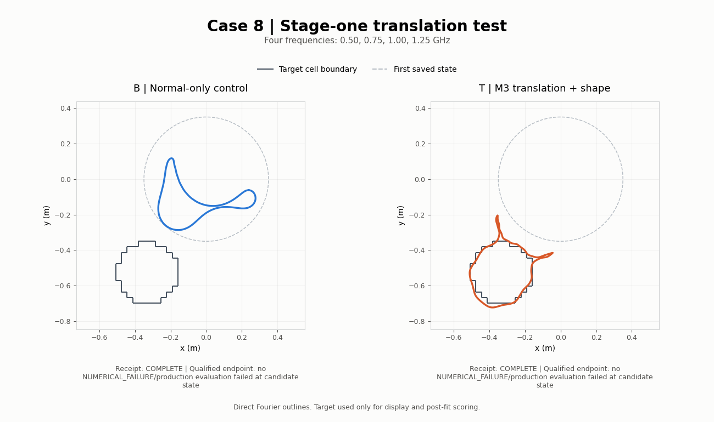

# GGB-003 — Exact translation during stage one

Case 8; unchanged GGB-002 four-frequency observations and centred start. T alternates exact translation and M3 shape updates; B uses the original shape update. M7/M11 retain ordinary shape updates.

`COMPLETE` means the driver finished its reporting/audit path. It does not imply convergence or recovery. A qualified endpoint below requires every fitted-frequency noise target, the joint discrepancy target, and field-refinement gates.

| Arm | Receipt | Fit s | Final optimizer outcome | Qualified endpoint | Centre error mm | Radius mm |
|---|---|---:|---|---|---:|---:|
| B | COMPLETE | 4.447 | NUMERICAL_FAILURE/production evaluation failed at candidate state | no | 458.58 | 148.76 |
| T | COMPLETE | 297.680 | NUMERICAL_FAILURE/production evaluation failed at candidate state | no | 1.40 | 180.61 |

Centre and radius diagnostics are recomputed from the displayed endpoint; truth is used only after fitting.

| Arm | Joint loss | Work units | Saved distinct states | SSIM | RRMSE | Contrast SNR dB |
|---|---:|---:|---:|---:|---:|---:|
| B | 0.616564 | 193 | 16 | 0.88896 | 0.06749 | -2.36 |
| T | 0.0112442 | 2625 | 118 | 0.98323 | 0.02096 | 8.89 |

| Arm | GHz | Fitted | Residual % | Noise target % | Field refinement |
|---|---:|---|---:|---:|---:|
| B | 0.40 | no | 112.009 | 5.498 | 1.99e-08 |
| B | 0.50 | yes | 111.127 | 5.498 | 2.38e-08 |
| B | 0.75 | yes | 110.948 | 5.499 | 3.14e-08 |
| B | 1.00 | yes | 110.826 | 5.492 | 4.17e-08 |
| B | 1.25 | yes | 111.283 | 5.490 | 5.44e-08 |
| T | 0.40 | no | 13.520 | 5.498 | 6.21e-06 |
| T | 0.50 | yes | 13.943 | 5.498 | 7.18e-06 |
| T | 0.75 | yes | 15.036 | 5.499 | 9.15e-06 |
| T | 1.00 | yes | 14.749 | 5.492 | 1.14e-05 |
| T | 1.25 | yes | 16.169 | 5.490 | 1.35e-05 |

[Vector boundary comparison](boundary_comparison.svg).
[Arm B trajectory](B/video/case8_stage1_translation_boundary.mp4).
[Arm T trajectory](T/video/case8_stage1_translation_boundary.mp4).

Video states are recorded curves, with no interpolation or material-image rasterization. Accepted callbacks take precedence when terminal linearization failed before history recording. Missing metrics remain unavailable. Single-run wall times do not establish a general speedup.
