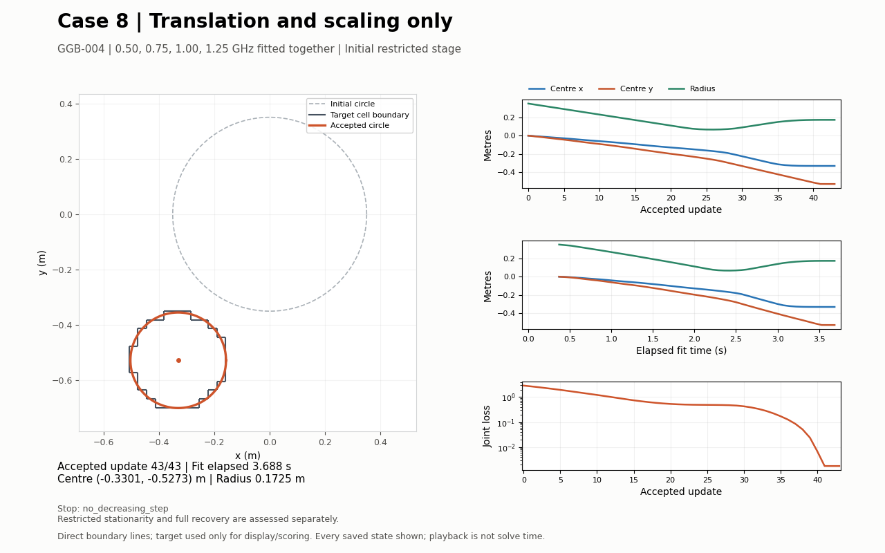

# GGB-004 — Translation and scaling before shape updates

Case 8; original centred 0.35 m circle and unchanged four-frequency GGB-002 data. Only the two centre coordinates and radius are fitted; no shape continuation is included.

Receipt **COMPLETE**; optimizer **NORMAL_OPTIMIZER_RETURN / no_decreasing_step**. Fit: **3.702 s**, 43 accepted updates.

Restricted stationarity describes the best circle found by this run. It does not establish full shape recovery. `no_decreasing_step` alone is a stall, not proof of convergence.

| Saved state | Centre x (m) | Centre y (m) | Radius (m) | Joint loss |
|---|---:|---:|---:|---:|
| Initial | 0 | 0 | 0.35 | 2.8731 |
| Final | -0.330108 | -0.527287 | 0.172546 | 0.00172962 |

Centre error: 0.20 mm; SSIM: 1.00000; RRMSE: 0.00000. Joint noise target met: no; all fitted-frequency noise targets met: no; field-refinement gates passed: yes.

Endpoint restricted-space diagnostics (saved by the experiment driver):

```json
{
  "rows": [
    {
      "cutoff": 64,
      "loss": 0.0017296154980663077,
      "gradient": [
        -9.784008645396993e-08,
        2.1777283869686565e-07,
        -4.2021510241013987e-07
      ],
      "gradient_inf": 4.2021510241013987e-07,
      "gn_step_m": [
        2.556706508625005e-09,
        -5.547335016194766e-09,
        2.3979609029076202e-09
      ],
      "gn_step_norm_m": 6.562003538936838e-09,
      "predicted_gain": 1.2329333329460654e-15,
      "acceptance_margin": 1.7306154980663076e-11,
      "gradient_tolerance_met": false,
      "model_gain_below_acceptance_margin": true
    },
    {
      "cutoff": 96,
      "loss": 0.0017296154980663116,
      "gradient": [
        -9.784008647435293e-08,
        2.1777283875573105e-07,
        -4.2021508673254935e-07
      ],
      "gradient_inf": 4.2021508673254935e-07,
      "gn_step_m": [
        2.5567065081281435e-09,
        -5.547335019411409e-09,
        2.397960812797719e-09
      ],
      "gn_step_norm_m": 6.562003508533539e-09,
      "predicted_gain": 1.2329332957304746e-15,
      "acceptance_margin": 1.7306154980663115e-11,
      "gradient_tolerance_met": false,
      "model_gain_below_acceptance_margin": true
    }
  ],
  "model_gain_below_margin_both": true,
  "gradient_tolerance_met_both": false,
  "predicted_gain_resolution_difference": 3.7215590787797764e-23
}
```



[Vector figure](convergence.svg). [Boundary video](W/video/case8_translation_scaling_boundary.mp4).

Plots and video use recorded accepted states without interpolation or material-image rasterization. Truth is used only for display and post-fit scoring. This postprocessor makes no physics or inverse calls.
