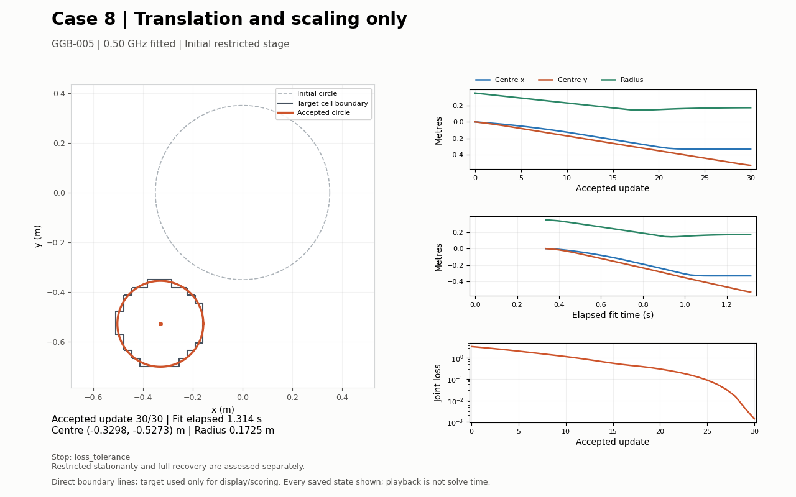

# GGB-005 — Translation and scaling before shape updates

Case 8; original centred 0.35 m circle and unchanged GGB-002 observations at 0.50 GHz. Only the two centre coordinates and radius are fitted; no shape continuation is included.

Receipt **COMPLETE**; optimizer **NORMAL_OPTIMIZER_RETURN / loss_tolerance**. Fit: **1.322 s**, 30 accepted updates.

Restricted stationarity describes the best circle found by this run. It does not establish full shape recovery. `no_decreasing_step` alone is a stall, not proof of convergence.

| Saved state | Centre x (m) | Centre y (m) | Radius (m) | Joint loss |
|---|---:|---:|---:|---:|
| Initial | 0 | 0 | 0.35 | 3.43591 |
| Final | -0.32983 | -0.527272 | 0.172512 | 0.00135433 |

Centre error: 0.10 mm; SSIM: 1.00000; RRMSE: 0.00000. Joint noise target met: yes; all fitted-frequency noise targets met: yes; field-refinement gates passed: yes.

Endpoint restricted-space diagnostics (saved by the experiment driver):

```json
{
  "rows": [
    {
      "cutoff": 64,
      "loss": 0.001354330965452369,
      "gradient": [
        0.00039079200361559333,
        -0.0017021908398262358,
        -0.017207369485335765
      ],
      "gradient_inf": 0.017207369485335765,
      "gn_step_m": [
        -1.4616971314988144e-05,
        7.070536238966605e-05,
        0.00011248144678835436
      ],
      "gn_step_norm_m": 0.00013365994161557374,
      "predicted_gain": 1.0307880154128034e-06,
      "acceptance_margin": 1.3553309654523691e-11,
      "gradient_tolerance_met": false,
      "model_gain_below_acceptance_margin": false
    },
    {
      "cutoff": 96,
      "loss": 0.0013543309654523701,
      "gradient": [
        0.00039079200361584877,
        -0.0017021908398262057,
        -0.017207369485334956
      ],
      "gradient_inf": 0.017207369485334956,
      "gn_step_m": [
        -1.4616971314998891e-05,
        7.070536238966443e-05,
        0.00011248144678834917
      ],
      "gn_step_norm_m": 0.0001336599416155697,
      "predicted_gain": 1.0307880154127142e-06,
      "acceptance_margin": 1.3553309654523701e-11,
      "gradient_tolerance_met": false,
      "model_gain_below_acceptance_margin": false
    }
  ],
  "model_gain_below_margin_both": false,
  "gradient_tolerance_met_both": false,
  "predicted_gain_resolution_difference": 8.915021769851511e-20
}
```



[Vector figure](convergence.svg). [Boundary video](W/video/case8_translation_scaling_boundary.mp4).

Plots and video use recorded accepted states without interpolation or material-image rasterization. Truth is used only for display and post-fit scoring. This postprocessor makes no physics or inverse calls.
