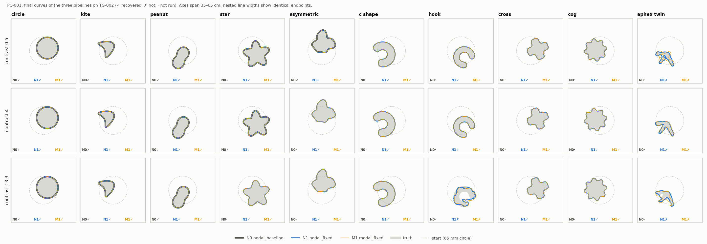

# PC-001 side-by-side comparison

Generated by `python -m experiments.benchmark.pc001 report`. Plan: `docs/iterations/cleaned_interfaces/iteration_27/03_plan.md`.

| Arm | Pipeline | Completed | Recovered | c0.5 | c4 | c13.3 | Median s | Promoted |
|---|---|---:|---:|---:|---:|---:|---:|---:|
| N0 | `nodal_baseline` | 12/30 | 12 | 5 | 4 | 3 | 120 | 0 |
| N1 | `nodal_fixed` | 30/30 | 26 | 9 | 9 | 8 | 157 | 4 |
| M1 | `modal_fixed` | 30/30 | 26 | 9 | 9 | 8 | 31 | 0 |

## Paired outcomes

| Pair | Compared | Both | Neither | Only first | Only second |
|---|---:|---:|---:|---|---|
| M1 vs N1 | 30 | 26 | 4 | — | — |
| N1 vs N0 | 12 | 12 | 0 | — | — |
| M1 vs N0 | 12 | 12 | 0 | — | — |

## Pre-registered readings

```json
{
  "R1_node_free_retains_best_nodal": {
    "by_contrast": {
      "c0.5": true,
      "c4": true,
      "c13.3": true
    },
    "holds": true
  },
  "R2_fixes_help_nodal": "pending",
  "R3_modal_resolution_limited": {
    "cases": [],
    "count": 0
  },
  "R4_modal_fastest": "pending"
}
```

## Per case

| Case | N0 | N1 | M1 | N0 outcome | N1 outcome | M1 outcome | N0 s | N1 s | M1 s |
|---|---|---|---|---|---|---|---|---|---|
| `circle__c0.5` | ✓ 0.00 mm | ✓ 0.00 mm | ✓ 0.00 mm | COMPLETED_SCHEDULE | COMPLETED_SCHEDULE | COMPLETED_SCHEDULE | 37 | 47 | 6 |
| `circle__c4` | ✓ 0.00 mm | ✓ 0.00 mm | ✓ 0.00 mm | COMPLETED_SCHEDULE | COMPLETED_SCHEDULE | COMPLETED_SCHEDULE | 38 | 49 | 6 |
| `circle__c13.3` | ✓ 0.00 mm | ✓ 0.00 mm | ✓ 0.00 mm | COMPLETED_SCHEDULE | COMPLETED_SCHEDULE | COMPLETED_SCHEDULE | 47 | 51 | 7 |
| `kite__c0.5` | ✓ 0.01 mm | ✓ 0.01 mm | ✓ 0.01 mm | COMPLETED_SCHEDULE | COMPLETED_SCHEDULE | COMPLETED_SCHEDULE | 307 | 308 | 91 |
| `kite__c4` | ✓ 0.01 mm | ✓ 0.01 mm | ✓ 0.01 mm | COMPLETED_SCHEDULE | COMPLETED_SCHEDULE | COMPLETED_SCHEDULE | 156 | 147 | 37 |
| `kite__c13.3` | ✓ 0.02 mm | ✓ 0.02 mm | ✓ 0.02 mm | COMPLETED_SCHEDULE | COMPLETED_SCHEDULE | COMPLETED_SCHEDULE | 232 | 227 | 56 |
| `peanut__c0.5` | ✓ 0.00 mm | ✓ 0.00 mm | ✓ 0.00 mm | COMPLETED_SCHEDULE | COMPLETED_SCHEDULE | COMPLETED_SCHEDULE | 114 | 111 | 20 |
| `peanut__c4` | ✓ 0.00 mm | ✓ 0.00 mm | ✓ 0.00 mm | COMPLETED_SCHEDULE | COMPLETED_SCHEDULE | COMPLETED_SCHEDULE | 105 | 99 | 19 |
| `peanut__c13.3` | ✓ 0.00 mm | ✓ 0.00 mm | ✓ 0.00 mm | COMPLETED_SCHEDULE | COMPLETED_SCHEDULE | COMPLETED_SCHEDULE | 118 | 116 | 21 |
| `star__c0.5` | ✓ 0.02 mm | ✓ 0.02 mm | ✓ 0.02 mm | COMPLETED_SCHEDULE | COMPLETED_SCHEDULE | COMPLETED_SCHEDULE | 121 | 112 | 21 |
| `star__c4` | ✓ 0.00 mm | ✓ 0.00 mm | ✓ 0.00 mm | COMPLETED_SCHEDULE | COMPLETED_SCHEDULE | COMPLETED_SCHEDULE | 185 | 161 | 33 |
| `star__c13.3` | not run | ✓ 0.00 mm | ✓ 0.00 mm | — | COMPLETED_SCHEDULE | COMPLETED_SCHEDULE | — | 282 | 60 |
| `asymmetric__c0.5` | ✓ 0.01 mm | ✓ 0.01 mm | ✓ 0.01 mm | COMPLETED_SCHEDULE | COMPLETED_SCHEDULE | COMPLETED_SCHEDULE | 126 | 123 | 26 |
| `asymmetric__c4` | not run | ✓ 0.00 mm | ✓ 0.00 mm | — | COMPLETED_SCHEDULE | COMPLETED_SCHEDULE | — | 158 | 34 |
| `asymmetric__c13.3` | not run | ✓ 0.00 mm | ✓ 0.00 mm | — | COMPLETED_SCHEDULE | COMPLETED_SCHEDULE | — | 206 | 45 |
| `c_shape__c0.5` | not run | ✓ 0.00 mm | ✓ 0.00 mm | — | COMPLETED_SCHEDULE | COMPLETED_SCHEDULE | — | 94 | 23 |
| `c_shape__c4` | not run | ✓ 0.00 mm | ✓ 0.00 mm | — | COMPLETED_SCHEDULE | COMPLETED_SCHEDULE | — | 139 | 35 |
| `c_shape__c13.3` | not run | ✓ 0.00 mm | ✓ 0.00 mm | — | COMPLETED_SCHEDULE | COMPLETED_SCHEDULE | — | 156 | 36 |
| `hook__c0.5` | not run | ✓ 0.00 mm | ✓ 0.00 mm | — | COMPLETED_SCHEDULE | COMPLETED_SCHEDULE | — | 93 | 26 |
| `hook__c4` | not run | ✓ 0.00 mm | ✓ 0.00 mm | — | COMPLETED_SCHEDULE | COMPLETED_SCHEDULE | — | 173 | 49 |
| `hook__c13.3` | not run | ✗ 7.65 mm | ✗ 8.66 mm | — | TRIAL_WALL_LIMIT ↑N1024 | NUMERICAL_FAILURE | — | 1863 | 36 |
| `cross__c0.5` | not run | ✓ 0.00 mm | ✓ 0.00 mm | — | COMPLETED_SCHEDULE | COMPLETED_SCHEDULE | — | 147 | 26 |
| `cross__c4` | not run | ✓ 0.00 mm | ✓ 0.00 mm | — | COMPLETED_SCHEDULE | COMPLETED_SCHEDULE | — | 150 | 26 |
| `cross__c13.3` | not run | ✓ 0.00 mm | ✓ 0.00 mm | — | COMPLETED_SCHEDULE | COMPLETED_SCHEDULE | — | 260 | 45 |
| `cog__c0.5` | not run | ✓ 0.05 mm | ✓ 0.05 mm | — | COMPLETED_SCHEDULE | COMPLETED_SCHEDULE | — | 162 | 28 |
| `cog__c4` | not run | ✓ 0.01 mm | ✓ 0.01 mm | — | COMPLETED_SCHEDULE | COMPLETED_SCHEDULE | — | 187 | 28 |
| `cog__c13.3` | not run | ✓ 0.00 mm | ✓ 0.00 mm | — | COMPLETED_SCHEDULE | COMPLETED_SCHEDULE | — | 361 | 73 |
| `aphex_twin__c0.5` | not run | ✗ 1.60 mm | ✗ 4.40 mm | — | ACCURACY_LIMITED_TRIALS ↑N1024 | NUMERICAL_FAILURE | — | 1279 | 30 |
| `aphex_twin__c4` | not run | ✗ 0.30 mm | ✗ 1.69 mm | — | TRIAL_WALL_LIMIT ↑N1024 | NUMERICAL_FAILURE | — | 1855 | 38 |
| `aphex_twin__c13.3` | not run | ✗ 3.83 mm | ✗ 4.15 mm | — | ACCURACY_LIMITED_TRIALS ↑N1024 | NUMERICAL_FAILURE | — | 814 | 48 |

✓/✗: recovered under the unchanged CI-001 gates; mm: final RMS. ↑N1024: the N1 resolution response promoted this run.


